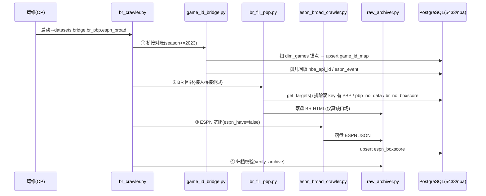
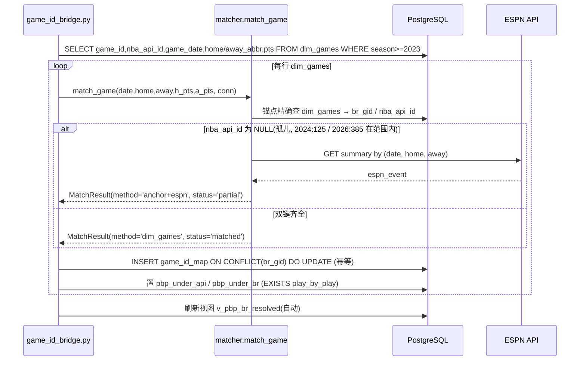
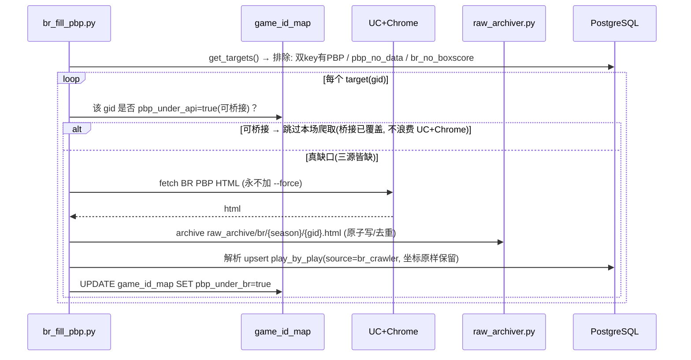
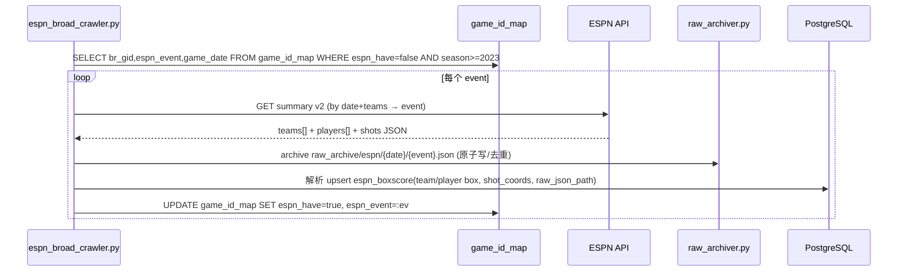
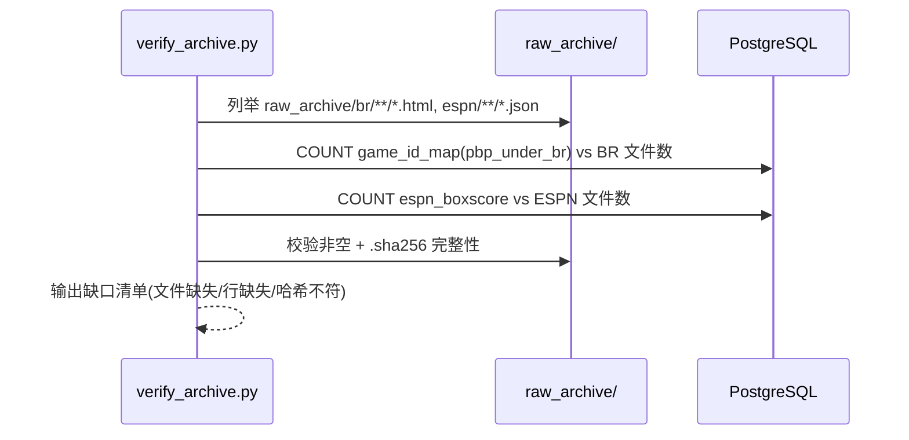
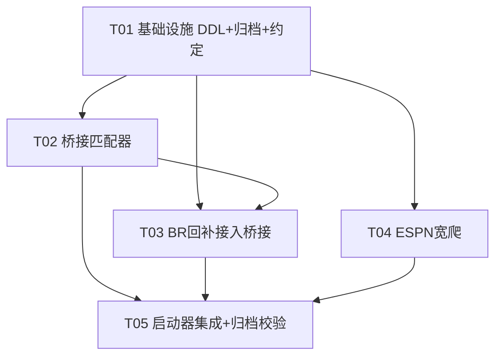

# ARCH — NBA 跨源桥接与双爬虫回补（系统架构设计 + 任务分解）

> 文档负责人：高见远（software-architect / 架构师）
> 版本：v1.0
> 团队：`software-nba-crawler-bridge`
> 上游依据：PRD `PRD_nba_crawler_bridge.md` + 主理人 2026-07-14 实测基线 + 主理人已拍板的开放问题决议（OQ a/b/c/d）

---

## 0. 决策摘要（主理人速览）

- **键空间方案选定：(i) `game_id_map` 映射表 + 只读视图 `v_pbp_br_resolved`**（无行复制、不污染 `play_by_play` 热表、下游零侵入）。放弃 (ii) 在热表加 `gameid_br` 列（维护双写风险）与 (iii) 镜像行（聚合双算、存储膨胀、幂等脆弱）。
- **任务总数：5 条**（首条为基础设施 DDL+归档+约定，其余按依赖扇出）。
- **需用户再决的点：无硬阻塞项**。1 个软建议待确认（下游战术引擎是否直接切换为查 `v_pbp_br_resolved`，见 §5）。

---

## 1. 实现方案 + 框架选型

### 1.1 技术栈（沿用，不引入新框架）

| 维度 | 选型 | 说明 |
|---|---|---|
| 语言 | Python 3 | 与既有脚本一致，复用而非重设计 |
| 数据库驱动 | `psycopg2`（已装） | 连接 PG 5433 / `nba` / `postgres` |
| BR PBP 抓取 | UC + Chrome（已装） | 仅 `br_fill_pbp.py` 使用；**永远不加 `--force`** |
| ESPN 抓取 | `requests`（已装，ESPN 已在用） | Site API v2 `summary` 端点 |
| 调度 | `run_*.sh`（nohup + PG 探活自拉起） | 改动接入新数据集，不自造调度器 |

### 1.2 架构模式

**ETL 桥接层（Reconcile → Archive → Backfill）**，三目标正交落地：

- **G1 跨源身份统一**：`game_id_bridge` 以 `dim_games` 锚点做对账，产出 `game_id_map`（权威键空间解析器）+ 下游视图。
- **G2 BR gid PBP 缺口回补**：`br_fill_pbp` 接入归档 + 桥接跳过逻辑，只爬「三源都缺」的小集合。
- **G3 ESPN 宽数据集 + 双源归档**：`espn_broad_crawler` 抓 summary→盒式/坐标，原始 JSON 落盘；BR HTML 由 `raw_archiver` 落盘。

### 1.3 关键难点与对策

| 难点 | 对策 |
|---|---|
| 键空间错位（4655 场 PBP 挂 `nba_api_id`、下游按 `game_id` 查不到） | `game_id_map` + `v_pbp_br_resolved` 视图（方案 i） |
| 坐标不得被覆盖（铁律） | `br_fill_pbp` 永不加 `--force`；桥接只做键解析、绝不改写 `(x,y)` 行 |
| 三源缩写差异 | `canon_abbr()` 归一化 + 安全网映射表（2023-26 实测三源一致） |
| 归档去重 / 可重入 | 原子写（temp→rename）+ 存在且非空则跳过 + 可选哈希校验 |

---

## 2. 文件列表及相对路径

> 路径均相对项目根 `/Users/deocheng/Downloads/nba_desktop_omega_mac_migrate_2026-07-13/`。
> 状态：**新建** / **修改**（在既有脚本上小步接入，不重写）。

| 状态 | 相对路径 | 职责 |
|---|---|---|
| 新建 | `db/game_id_map.sql` | `game_id_map` 表 DDL（键空间映射，权威源） |
| 新建 | `db/espn_boxscore.sql` | `espn_boxscore` 表 DDL（ESPN 宽数据盒式+坐标） |
| 新建 | `db/v_pbp_br_resolved.sql` | 只读视图，下游按 BR gid 查 PBP（零侵入） |
| 新建 | `common/bridge_constants.py` | 锚点字段名、队名归一化表、归档路径约定 |
| 新建 | `raw_archiver.py` | 落盘封装：原子写 + 去重 + 哈希，BR HTML / ESPN JSON 通用 |
| 新建 | `game_id_bridge.py` | 桥接对账编排：扫 `dim_games`→填 `game_id_map`→回填孤儿 `nba_api_id` |
| 新建 | `matcher.py` | `match_game()` 锚点匹配函数（纯函数，可单测） |
| 新建 | `espn_broad_crawler.py` | ESPN 宽爬：summary→解析盒式/坐标→落盘 JSON→写 `espn_boxscore` |
| 新建 | `br_archive_integration.py` | 薄适配层：把 `raw_archiver` 接入 `br_fill_pbp` 抓取回调 |
| 新建 | `verify_archive.py` | 归档校验：文件数 vs 表行数、非空、哈希完整性 |
| 新建 | `tests/test_matcher.py` | 匹配器单元测试（锚点命中 / 孤儿 / 无法匹配） |
| 修改 | `br_fill_pbp.py` | 接入 `raw_archiver` 落盘 HTML；依据 `game_id_map` 跳过可桥接场 |
| 修改 | `br_crawler.py` | 新增数据集钩子：`game_id_bridge` 对账、`espn_broad` 调用 |
| 修改 | `run_br_crawler.sh` | 接入桥接对账步骤 + 归档校验钩子 |
| 修改 | `run_espn_full.sh` | 指向 `espn_broad_crawler.py` 并接入归档 |
| 修改 | `external_crawler/crawler/espn_backfill_shot_coords.py` | 复用 `raw_archiver` 落盘原始 JSON（与宽爬共享归档逻辑） |

---

## 3. 数据结构和接口

### 3.1 `game_id_map` 表（方案 i 核心，权威键空间解析器）

```sql
-- db/game_id_map.sql
CREATE TABLE IF NOT EXISTS game_id_map (
    id              BIGSERIAL PRIMARY KEY,
    br_gid          VARCHAR(20)  NOT NULL,   -- BR game_id, e.g. '202401010BOS'
    nba_api_id      VARCHAR(20),             -- nba_api style, e.g. '0022300001'
    espn_event      VARCHAR(20),             -- ESPN Site API event id
    season          SMALLINT,
    game_date       DATE,
    home_abbr       VARCHAR(3),
    away_abbr       VARCHAR(3),
    home_pts        SMALLINT,
    away_pts        SMALLINT,
    pbp_under_api   BOOLEAN NOT NULL DEFAULT FALSE, -- PBP 存在于 nba_api_id 键下
    pbp_under_br    BOOLEAN NOT NULL DEFAULT FALSE, -- PBP 存在于 br_gid 键下
    espn_have       BOOLEAN NOT NULL DEFAULT FALSE, -- ESPN 盒式/坐标已入库
    matched_at      TIMESTAMP NOT NULL DEFAULT now(),
    match_method    VARCHAR(24),             -- 'dim_games' | 'anchor+espn' | 'espn_only'
    UNIQUE (br_gid)
);
CREATE INDEX IF NOT EXISTS idx_gim_api     ON game_id_map (nba_api_id);
CREATE INDEX IF NOT EXISTS idx_gim_espn    ON game_id_map (espn_event);
CREATE INDEX IF NOT EXISTS idx_gim_date    ON game_id_map (game_date);
```

**写入语义**：对账时 `INSERT ... ON CONFLICT (br_gid) DO UPDATE SET nba_api_id=EXCLUDED.nba_api_id, espn_event=EXCLUDED.espn_event, pbp_under_api=EXCLUDED.pbp_under_api, ...`。表内**不含任何 `(x,y)` 坐标**，故桥接写入不可能触碰坐标铁律。

**查询语义（下游）**：看 §3.3 视图。

**幂等性论证**：
1. 主键 `br_gid` 唯一 + `ON CONFLICT DO UPDATE` → 重复对账只更新、不增行。
2. 表仅存"键映射元数据"，无业务明细、无坐标 → 更新是幂等赋值（相同输入得相同输出）。
3. `pbp_under_*` / `espn_have` 为布尔标志，由对账时 `EXISTS` 探测得到，重复运行结果稳定。
4. 孤儿回填（`nba_api_id` 由锚点反查得到）同样走 `ON CONFLICT`，不会因重跑产生多行。

### 3.2 `espn_boxscore` 表（G3 宽数据集最小可用集，依 OQ-c）

```sql
-- db/espn_boxscore.sql
CREATE TABLE IF NOT EXISTS espn_boxscore (
    id              BIGSERIAL PRIMARY KEY,
    espn_event      VARCHAR(20)  NOT NULL,
    br_gid          VARCHAR(20),
    nba_api_id      VARCHAR(20),
    game_date       DATE,
    season          SMALLINT,
    season_type     VARCHAR(24),
    home_abbr       VARCHAR(3),
    away_abbr       VARCHAR(3),
    home_pts        SMALLINT,
    away_pts        SMALLINT,
    home_team_box   JSONB,        -- ESPN teams[] 中主队盒式
    away_team_box   JSONB,        -- ESPN teams[] 中客队盒式
    player_boxes    JSONB,        -- players[] 全量球员盒式数组
    shot_coords     JSONB,        -- [{player_id, player_name, team, period, clock, x, y, made}]
    raw_json_path   TEXT,         -- raw_archive/espn/{date}/{event}.json 指针
    archived_at     TIMESTAMP NOT NULL DEFAULT now(),
    UNIQUE (espn_event)
);
CREATE INDEX IF NOT EXISTS idx_eb_brgid ON espn_boxscore (br_gid);
CREATE INDEX IF NOT EXISTS idx_eb_date  ON espn_boxscore (game_date);
```

### 3.3 只读视图 `v_pbp_br_resolved`（下游零侵入关键）

```sql
-- db/v_pbp_br_resolved.sql
CREATE OR REPLACE VIEW v_pbp_br_resolved AS
SELECT
    pbp.*,
    COALESCE(m.br_gid, pbp.gameid)        AS gameid_resolved,  -- 下游统一按此列查 BR gid
    m.nba_api_id                          AS gameid_api,
    m.espn_event                          AS espn_event
FROM play_by_play pbp
LEFT JOIN game_id_map m
       ON pbp.gameid = m.nba_api_id;
```

> 下游战术引擎只需把 `FROM play_by_play WHERE gameid = :gid` 改为 `FROM v_pbp_br_resolved WHERE gameid_resolved = :gid`，**逻辑零改动**；其余 4655 场 PBP 经 `LEFT JOIN` 自动以 BR gid 暴露，无需复制行。

### 3.4 原始归档目录布局（依 OQ-a）

```
raw_archive/
├── br/
│   └── {season}/                 # e.g. 2024
│       └── {gid}.html            # e.g. 202401010BOS.html（UC+Chrome 抓取原始页）
└── espn/
    └── {date}/                   # ISO 日期 e.g. 2024-01-01
        └── {event}.json          # e.g. 401585401.json（Site API v2 summary 原始响应）
```

**落盘契约（由 `raw_archiver.py` 强制）**：
- 写入临时文件 `*.tmp` → `fsync` → 原子 `rename` 到目标名；
- 若目标已存在且字节数 > 0 → 跳过（除非显式 `--rearchive`）；
- 可选：写 `.sha256` 伴生文件供 `verify_archive.py` 校验。

### 3.5 匹配函数签名（纯函数，可单测）

```python
# matcher.py
from dataclasses import dataclass
from datetime import date
from typing import Optional

@dataclass
class MatchResult:
    br_gid: Optional[str]
    nba_api_id: Optional[str]
    espn_event: Optional[str]
    method: str            # 'dim_games' | 'anchor+espn' | 'espn_only' | 'unmatched'
    status: str            # 'matched' | 'partial' | 'unmatched'

def match_game(
    game_date: date,
    home_abbr: str,
    away_abbr: str,
    home_pts: int,
    away_pts: int,
    *,
    conn,                       # psycopg2 connection（只读查 dim_games / game_id_map）
    espn_session=None,          # requests.Session（查 ESPN summary 解析 espn_event）
    season: Optional[int] = None,
) -> MatchResult:
    """
    输入锚点 (game_date, home_abbr, away_abbr, home_pts, away_pts)
    经 canon_abbr 归一化后：
      1. 先查 dim_games（锚点精确匹配）→ 得到 br_gid / nba_api_id（method='dim_games'）
      2. 再查 ESPN summary（date+主客队）→ 得到 espn_event（method 增 'espn'）
      3. 孤儿(nba_api_id IS NULL) 仍可解析 br_gid↔espn_event（status='partial'）
    输出 MatchResult；任一 leg 缺失则 status='partial'，全缺则 'unmatched'。
    """
```

### 3.6 共享常量（`common/bridge_constants.py`）

```python
ANCHOR_COLS = ("game_date", "home_team_abbr", "away_team_abbr",
               "home_pts", "away_pts")          # 跨文件统一锚点字段名
ARCHIVE_ROOT = "raw_archive"
BR_ARCHIVE_TMPL = "raw_archive/br/{season}/{gid}.html"
ESPN_ARCHIVE_TMPL = "raw_archive/espn/{date}/{event}.json"
PG_DSN = "dbname=nba user=postgres host=localhost port=5433"

# 三源队名归一化（2023-26 实测三源一致；下表为安全网，命中即映射）
BR_TO_CANON    = {}   # e.g. {}  （空=无需映射）
NBAPI_TO_CANON = {}
ESPN_TO_CANON  = {}
_CANON = {  # 标准 3 字母规范缩写集合，用于兜底校验
    'BOS','BKN','NYK','PHI','TOR','CHI','CLE','DET','IND','MIL',
    'ATL','CHA','MIA','ORL','WAS','DEN','MIN','OKC','POR','UTA',
    'GSW','LAC','LAL','PHX','SAC','DAL','HOU','MEM','NOP','SAS',
}
def canon_abbr(src: str, abbr: str) -> str:
    a = (abbr or "").strip().upper()
    a = {'br': BR_TO_CANON, 'nba_api': NBAPI_TO_CANON,
         'espn': ESPN_TO_CANON}.get(src, {}).get(a, a)
    return _CANON.get(a, a)
```

---

## 4. 程序调用流程（Mermaid 时序图）

### ④ 总览编排（br_crawler 入口）



### ① 桥接对账（game_id_bridge）



### ② BR 回补（br_fill_pbp 接入桥接 + 归档）



### ③ ESPN 宽爬（espn_broad_crawler）



### ④ 归档校验（verify_archive）



---

## 5. 待明确事项（需用户/主理人再决）

| # | 事项 | 当前默认处理 | 需确认程度 |
|---|---|---|---|
| Q1 | 下游战术引擎是否**直接切换**为查 `v_pbp_br_resolved`（仅改 1 列名）？ | 默认提供视图 + 建议下游改用；不改下游也能用（需 JOIN） | **软建议**，不阻塞 |
| Q2 | 528 孤儿中 2024:125 / 2026:385 在 2023-26 范围内 → 这些场 `nba_api_id` 缺失但 `game_id` 存在，将走 BR 回补（有 br_gid 即可爬），是否确认将其纳入 G2 真缺口集？ | 默认纳入 BR 回补目标 | 软确认 |
| Q3 | ESPN `summary` 端点对 2023-26 全量覆盖假设（含 Play-In / NBA Cup） | 默认覆盖；爬取时记录 404/缺失 event 进"无法桥接清单" | 软确认 |
| Q4 | `espn_boxscore.player_boxes` 是否一次性纳入 **advanced** 子块？OQ-c 定"最小集=盒式"，advanced 留 P2 | 首批仅 teams/players 盒式 + shot_coords | 已按 OQ-c 处理，无需再决 |

> 以上均非硬阻塞；工程师可先按默认实现，Q1 视下游改造意愿择机切换。

---

## 6. 依赖包列表

```
- psycopg2      # 已有：PG 5433 连接
- requests      # 已有（ESPN 已在用）：Site API v2 抓取
# 新增重依赖：无。UC+Chrome 已装；不引入 ORM / 新爬虫框架。
```

---

## 7. 任务列表（有序、含依赖、按实现顺序）

> 硬性约束：≤5 任务、每任务 ≥3 文件、首任务为基础设施、尽量扇出而非长链。

| 任务ID | 任务名 | 涉及文件 | 依赖 | 优先级 |
|---|---|---|---|---|
| **T01** | 项目基础设施（DDL + 归档封装 + 共享约定） | `db/game_id_map.sql`、`db/espn_boxscore.sql`、`db/v_pbp_br_resolved.sql`、`raw_archiver.py`、`common/bridge_constants.py` | 无 | P0 |
| **T02** | 桥接匹配器（对账编排 + 锚点匹配函数 + 单测） | `game_id_bridge.py`、`matcher.py`、`tests/test_matcher.py` | T01 | P0 |
| **T03** | BR 回补接入桥接（落盘 + 跳过可桥接场） | `br_fill_pbp.py`(改)、`br_crawler.py`(改)、`br_archive_integration.py`(新) | T01, T02 | P0 |
| **T04** | ESPN 宽爬（解析盒式/坐标 + 落盘 + 启动器接入） | `espn_broad_crawler.py`(新)、`external_crawler/crawler/espn_backfill_shot_coords.py`(改)、`run_espn_full.sh`(改) | T01 | P1 |
| **T05** | 启动器集成 + 归档校验（收尾） | `run_br_crawler.sh`(改)、`verify_archive.py`(新)、`br_crawler.py`(补钩子) | T02, T03, T04 | P0 |

**说明**：
- T01 为所有任务地基（DDL、归档、常量）。
- T02（桥接）与 T04（ESPN）均只依赖 T01，可并行；T03 依赖 T02（需用 `game_id_map` 跳过）。
- T05 收口：接入启动器 + 校验，依赖前三。
- 真缺口回补量小（估算 5313 − 已覆盖 − 2(pbp_no_data) ≈ 数十场，含 528 孤儿中的在范围内部分），符合"只爬缺失"。

---

## 8. 共享知识（跨文件约定）

- **锚点字段名统一**：`game_date / home_team_abbr / away_team_abbr / home_pts / away_pts`（与 `dim_games` 列名一致，所有匹配/回填逻辑引用 `common/bridge_constants.ANCHOR_COLS`）。
- **队名三源归一化**：`canon_abbr(src, abbr)` 先按源查安全网表（2023-26 实测三源一致，表暂空），再归一到规范 3 字母集合；匹配与落盘前必须调用，避免 `BOS`/`BOS`/`BOS` 因大小写/空格失配。
- **归档命名与去重**：严格按 `raw_archive/br/{season}/{gid}.html` 与 `raw_archive/espn/{date}/{event}.json`；`raw_archiver` 原子写 + 存在非空则跳过；可选 `.sha256` 伴生。
- **坐标不被覆盖铁律**：`br_fill_pbp` 调用 UC+Chrome **永远不加 `--force`**；`game_id_map` 仅存键映射、不含 `(x,y)`；桥接/归档均不触碰 `play_by_play` 的 `x,y` 列。
- **日期与赛季**：日期统一 ISO-8601（`YYYY-MM-DD`）；`season` 取赛季起始年（如 2024 代表 2024-25），与 `dim_games.season` 口径一致。
- **幂等约定**：所有 upsert 走 `ON CONFLICT DO UPDATE`；归档走"存在则跳过"；重跑可安全重复。
- **ESPN 端点**：Site API v2 `summary`（`/nba/summary?event={id}`），由 `(game_date, 主客队)` 解析出 `event` 后再拉全量；原始 JSON 必落盘（呼应 P0-3）。

---

## 9. 任务依赖图（Mermaid）



---

## 附：关键方案论证（为何选 i 而非 ii/iii）

| 候选 | 描述 | 否决理由 |
|---|---|---|
| **(i) ✅ 选定** | `game_id_map` 表 + 视图 | 单一权威键解析器；热表零污染；下游经视图零侵入；幂等由 `ON CONFLICT(br_gid)` 保证；不含坐标故绝不触铁律 |
| (ii) 热表加 `gameid_br` 列 | 在 `play_by_play` 镜像 br_gid | 需在每次写入（nba_api/ESPN/br 三源）双写维护，易漂移；热表（高写入量事件表）加元数据列增加耦合 |
| (iii) 镜像行 | 同一事件复制行、gameid 换成 br_gid | 聚合双算（进球/失误被计两次）；存储膨胀（每场数百事件行 ×4655）；更新需双写两行，幂等脆弱；与"只爬缺失"精神相悖（属 DB 行变换但引入重复真相） |

**(i) 的下游可用性闭环**：`v_pbp_br_resolved` 用 `pbp.gameid = m.nba_api_id` 左连，使 4655 场 PBP 自动以 `gameid_resolved = br_gid` 暴露；下游战术引擎仅把查询列从 `gameid` 改为 `gameid_resolved` 即可，无需任何行复制或热表改写。
