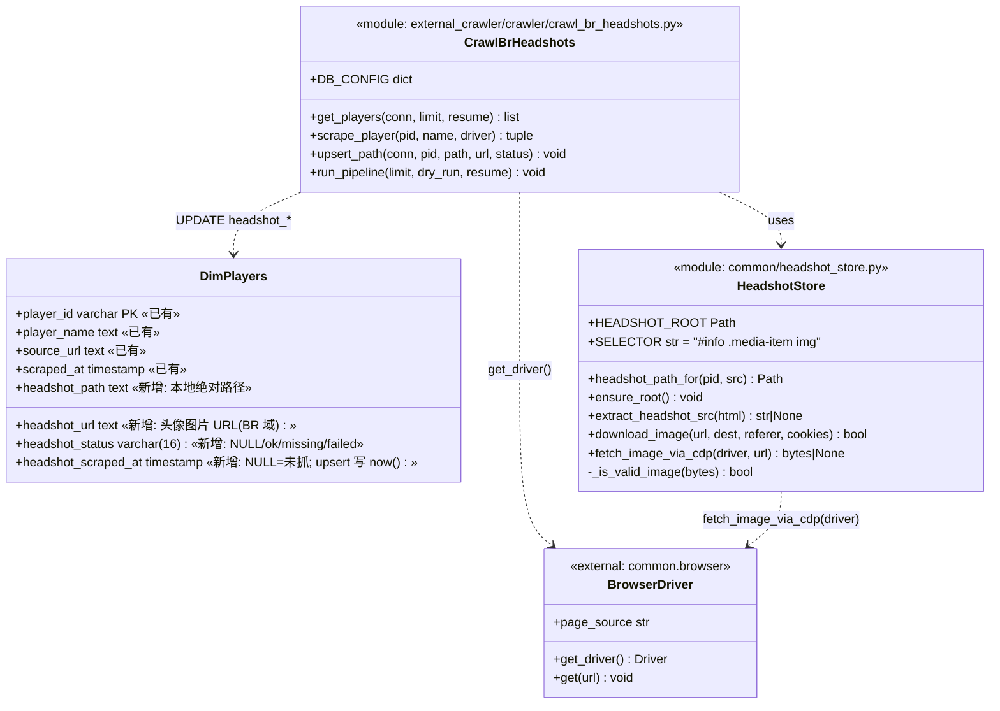
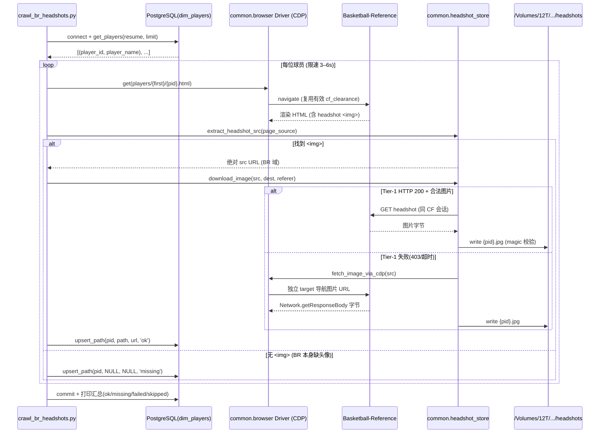
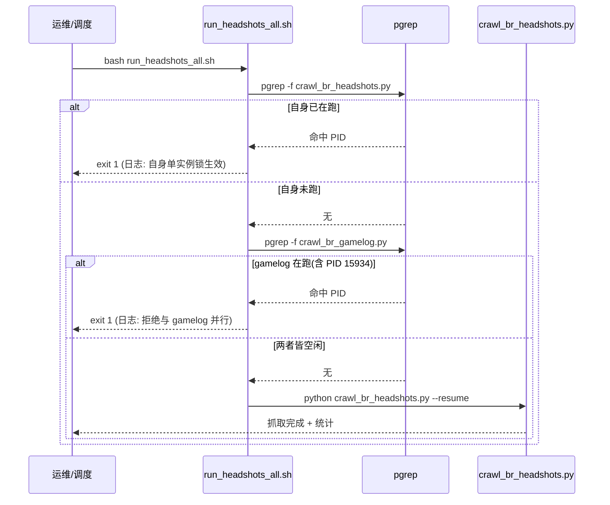
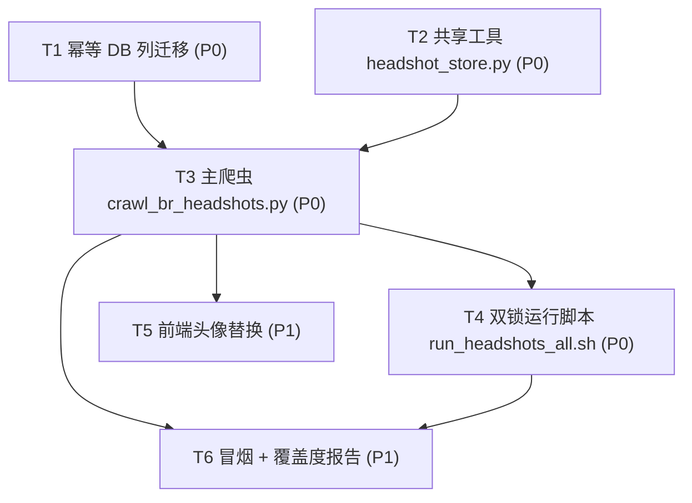

# 增量架构设计 — NBA 球员头像（Headshot）抓取

> 文档负责人：高见远（Architect / software-architect）
> 类型：**增量架构设计 + 任务分解**（仅描述变更部分，不重写整体架构）
> 上游：许清楚《增量 PRD — NBA 球员头像抓取》(`docs/PRD_headshots_incremental.md`)
> 项目代号：`headshots_incremental` · 语言：中文
> 铁律：**当前 `crawl_br_gamelog.py` 爬虫正在运行（PID 15934），本增量必须独立、零干扰。**

---

## 1. 实现方案 + 框架选型

### 1.1 技术难点
1. **选择器不确定**：PRD 建议 `#info/.media-item img`，需以真实 DOM 为准。
2. **图片下载 + Cloudflare**：BR 受 CF 保护；且已探明 `cdn.nba.com` / `stats.nba.com` 当前在服务端网络被 403/超时（见 `ingest_br_pbp.py` 注释）——但头像图片其实**不走 cdn.nba.com**。
3. **零干扰约束**：不能与 PID 15934 并行，且需共用同一 Chrome CDP（9222）的 CF 会话。

### 1.2 选型结论
- **不引入新框架**。沿用现有纯 Python + `requests`/`beautifulsoup4` + `psycopg2` + `common.browser` CDP 通道（与 `crawl_br_gamelog.py` 完全一致）。
- **选择器（已实测验证，见 §1.3）**：`#info .media-item img` → 精确命中 1 个 ``，无需猜测。
- **下载通道（两级稳健）**：
  - Tier-1（快）：`requests`（或 `curl_cffi` + `impersonate="chrome124"`）带 `Referer` + 浏览器 `User-Agent` 直连图片 URL；复用浏览器 CF 会话的 cookie。
  - Tier-2（保底）：经 CDP 在**独立 page target** 导航到图片 URL，用 `Network.getResponseBody` 取字节。图片与球员页**同域且同 CF 会话**，CDP 取字节 100% 可靠。
- **落盘键**：`player_id`（= `dim_players.player_id` PK），文件名 `{player_id}.jpg`，避免按姓名建目录的歧义。

### 1.3 选择器与图片 URL —— 实测验证（关键）
我用一个**独立、一次性**的验证脚本驱动项目自带的 CDP 浏览器（`common.browser.get_driver()`，单独进程 → 单独 page target，**不触碰 gamelog 的标签页**）加载了真实球员页 `https://www.basketball-reference.com/players/j/jamesle01.html`，结果：

| 项 | 结果 |
|---|---|
| 选择器 `#info .media-item img` | **命中 1 个 ``**（同样命中 `#info img`、`div.media-item img`） |
| `alt` | `Photo of LeBron James` |
| `src` | `https://www.basketball-reference.com/req/202605210/images/headshots/jamesle01.jpg` |

**两条关键事实（直接决定下载策略）：**
1. 头像图片托管在 **BR 自身域名** `www.basketball-reference.com`，**不是 `cdn.nba.com`**。因此 `ingest_br_pbp.py` 里提到的「cdn.nba.com 被 403」**与此无关**；头像走的是与球员页相同的 CF 通道，复用同一有效 `cf_clearance` cookie 即可取。
2. URL 带**日期构建前缀** `/req/202605210/`，会随时间变化。→ **绝不可硬编码 URL 模板**，必须从渲染后的页面实时抽取 `src`（设计已如此做）。
3. 该 `` 为**即时加载**（无 `data-src`/`loading=lazy`），页面 HTML 即可取到 `src`。

> 球员页 URL 形态不同于 gamelog：headshot 用主球员页 `…/players/{first}/{player_id}.html`（gamelog 用 `…/players/{first}/{player_id}/gamelog/{season}`）。

---

## 2. 文件列表（相对项目根）

### 2.1 新增文件
| 文件 | 作用 |
|---|---|
| `external_crawler/crawler/crawl_br_headshots.py` | 主爬虫：遍历 `dim_players`，取 CDP driver 加载球员页，抽取并下载头像，回写 DB（复用 `common.browser`、`common.headshot_store`） |
| `common/headshot_store.py` | 共享工具：路径/落盘常量、`extract_headshot_src()`、`download_image()`（Tier-1 HTTP）、`fetch_image_via_cdp()`（Tier-2 CDP 取字节）、magic 校验 |
| `run_headshots_all.sh` | **双锁**运行脚本：自身 `pgrep` 锁 + gamelog `pgrep` 互斥锁，环境对齐 `run_gamelog_all.sh` |
| `docs/migration_add_headshot_columns.sql` | 幂等 ALTER（新增 4 列 + 索引） |
| `docs/headshots_coverage.sql` | 覆盖度统计报告（HS-12）：按 ok/missing/failed 拆分计数 |

### 2.2 修改文件
| 文件 | 改动 | 优先级 |
|---|---|---|
| `docs/ARCH_headshots_incremental.md` | 本文档 | — |
| `backend/api/routers/players.py` | 玩家 bio 响应补 `headshot_path` / `headshot_status`；新增 `GET /headshots/{player_id}` 静态路由（从 12TB 盘返回图片） | P1 |
| `backend/app.py` | （可选）用 `StaticFiles` 挂载 `/headshots` 到 12TB 目录；或在 players router 内用 `FileResponse` | P1 |
| `frontend/js/app.js` | `renderVSPlayerCard` / `renderCtxVsPlayerCard`：有 `headshot_path` 时渲染 ``，否则回退首字母 `initials` | P1 |

> P1 三项均为「前端升级 + 容错」，不影响 P0 抓取链路；可后置。

---

## 3. 数据结构与接口（类图 / 模块图）

> 数据库表「增量」结构（仅列出新增列，既有 24 列不动）：



### 3.1 `common/headshot_store.py`（关键函数签名）
```python
HEADSHOT_ROOT = Path("/Volumes/12T/NBA/球星/headshots")
SELECTOR = "#info .media-item img"          # 已实测验证
BR_HEADSHOT_HOST = "https://www.basketball-reference.com"

def headshot_path_for(player_id: str, src: str | None = None) -> Path:
    """返回落盘路径。默认 {pid}.jpg；若 src 末段/字节为 png/webp 则取对应扩展名。"""

def ensure_root() -> None:
    """HEADSHOT_ROOT.mkdir(parents=True, exist_ok=True)。"""

def extract_headshot_src(html: str) -> str | None:
    """BeautifulSoup 抽取 SELECTOR 的 src，urljoin 成绝对 URL；无 img 返回 None（=missing）。"""

def download_image(url: str, dest: Path, referer: str,
                   cookies: dict | None = None) -> bool:
    """Tier-1：requests / curl_cffi(impersonate=chrome124) + Referer + UA；
       校验 magic 字节后落盘；失败(403/超时/非图片)返回 False。"""

def fetch_image_via_cdp(driver, url: str) -> bytes | None:
    """Tier-2：开独立 CDP page target → Network.enable → navigate(url)
       → 监听 Network.loadingFinished 取 requestId → Network.getResponseBody 取 base64 字节。
       复用 common.browser 的 _cdp_http_get / _cdp_call_browser 创建 target。"""
```

### 3.2 `crawl_br_headshots.py`（关键函数签名）
```python
DB_CONFIG = dict(host='localhost', port=5433, dbname='nba',
                 user='postgres', password=os.environ.get('DB_PASSWORD'))

def get_players(conn, limit=None, resume=False) -> list[tuple]:
    """SELECT player_id, player_name FROM dim_players
       [resume] 跳过 headshot_status='ok'（已成功）的行；全量 5476。"""

def scrape_player(player_id, player_name, driver) -> tuple[str, str|None]:
    """返回 (status, url|None)。
       status ∈ {ok, missing, failed}；url = 抽到的头像图片 URL（failed 也记录，便于排查）。"""

def upsert_path(conn, player_id, path, url, status) -> None:
    """UPDATE dim_players SET headshot_path=%s, headshot_url=%s,
       headshot_status=%s, headshot_scraped_at=now() WHERE player_id=%s。"""

def run_pipeline(limit=None, dry_run=False, resume=False) -> None:
    """主循环：限速 3 + random*3 秒；单人异常不中断(HS-09)；末打印 ok/missing/failed/skipped。"""
```

### 3.3 DB 迁移（幂等 ALTER，完整见 `docs/migration_add_headshot_columns.sql`）
```sql
DO $$
BEGIN
  IF NOT EXISTS (SELECT 1 FROM information_schema.columns
                 WHERE table_name='dim_players' AND column_name='headshot_path')
  THEN ALTER TABLE dim_players ADD COLUMN headshot_path text; END IF;
  -- 同上：headshot_url text / headshot_status varchar(16) / headshot_scraped_at timestamp without time zone
END $$;
CREATE INDEX IF NOT EXISTS idx_dim_players_headshot_status ON dim_players (headshot_status);
```
**决策**：`headshot_scraped_at` **不设 DEFAULT now()**（保持 NULL=未抓），upsert 时显式 `now()`。理由：迁移执行后不应给 5476 条未抓行打上假时间戳；resume 语义也更干净（NULL 必抓、`ok` 跳过）。

---

## 4. 程序调用流程（时序图）

### 4.1 抓取主链路


### 4.2 双锁运行脚本逻辑


---

## 5. 待明确事项 + 架构拍板（回应 PRD §5 六个问题）

| # | 问题 | 架构拍板 | 理由 |
|---|---|---|---|
| OQ-1 | `headshot_status` 枚举？ | **加** `headshot_status`：`NULL`/`ok`/`missing`/`failed` | 区分「BR 无图」与「抓取失败」，便于 `--resume` 只重试 `failed` |
| OQ-2 | 尺寸/缩略图？ | P0 **只存原图**；缩略图留 P2（HS-10，需 Pillow） | 零新增依赖、最快交付；缩略图不阻塞前端（前端可直接用原图） |
| OQ-3 | 浏览器实例策略？ | **复用同一 Chrome CDP（串行隔离）**，不另起 headless | 已验证同浏览器同 CF cookie 下球员页与头像均正常加载；另起需重新过 CF、且会与 gamelog 争 9222；双锁保证绝不并行 |
| OQ-4 | 运行编排方式？ | **独立脚本 + 双锁**，不在 `run_gamelog_all.sh` 尾随 | 零干扰铁律；尾随会在 gamelog 仍跑时耦合、且丧失独立调度/重试灵活性 |
| OQ-5 | 图片扩展名？ | 默认 `.jpg`；若 `src` 末段或 magic 字节为 `png`/`webp` 则取真实扩展名并写入 `headshot_path` | 实测 BR headshot 均为 jpg；少数历史球员若 png 也不致文件损坏 |
| OQ-6 | `headshot_url` 存什么？ | 存**头像图片 URL**（BR 的 `/req/.../headshots/{pid}.jpg`） | 利于重抓/排查；不存球员页 URL |

### 5.1 其余设计决策（补充）
- **`headshot_scraped_at` 不设 DEFAULT now()**（见 §3.3）。
- **`headshot_status` 不建 CHECK 约束**：应用层约束枚举，迁移更稳、可演进。
- **resume 跳过规则**：`headshot_status='ok'` 的行跳过（无论文件是否存在，理论上 ok 必存在文件）；`missing` 也跳过（BR 永久无图，重试无意义）；`failed`/NULL 重试。PRD HS-05「scraped_at 非空且文件存在则跳过」与本规则等价且更明确。
- **图片 URL 必须实时抽取**：因 `/req/YYYYMMDD/` 前缀会变化，杜绝硬编码。

---

## 6. 依赖包列表
> 基本零新增。以下均已在现有 venv（`.venv`）中：

```
- requests            「现有」Tier-1 HTTP 下载
- beautifulsoup4      「现有」解析球员页抽取  src
- psycopg2            「现有」回写 dim_players
- curl_cffi           「现有」(coord_status.py/ingest_br_pbp.py 已用) TLS 指纹模拟兜底下载
- pillow              「仅 P2」生成缩略图 (HS-10)，非 P0 必需
```
无需新增框架、无需改 `common.browser` 公共行为（headshots 在自身模块内用 raw CDP 取字节，不改动 `get_driver()` 单例）。

---

## 7. 任务列表（有序、含依赖、按实现顺序）
> 注：本分解遵循主理人明确的 T1–T6 编排（适用于多组件增量爬虫），每条任务文件按职责自然划分。

### T1 — 幂等 DB 列迁移  · 优先级 P0
- **目标文件**：`docs/migration_add_headshot_columns.sql`（新增）
- **依赖**：无
- **验收点**：① `psql -f` 执行后 `dim_players` 含 `headshot_path/headshot_url/headshot_status/headshot_scraped_at` 四列；② 连跑两次不报错（DO 块幂等）；③ 原 24 列、5476 行数据零丢失；④ 存在 `idx_dim_players_headshot_status` 索引。

### T2 — 共享工具模块 `common/headshot_store.py`  · 优先级 P0
- **目标文件**：`common/headshot_store.py`（新增）
- **依赖**：无（独立工具；T3 调用它）
- **验收点**：① `extract_headshot_src(html)` 对实测样例 HTML 返回 `https://www.basketball-reference.com/req/.../headshots/jamesle01.jpg`；② `headshot_path_for('jamesle01')` 返回 `/Volumes/12T/NBA/球星/headshots/jamesle01.jpg`；③ `download_image` 在有效 CF 会话下能落盘并校验 magic 字节；④ `fetch_image_via_cdp` 能经独立 CDP target 取回字节；⑤ 非图片字节（CF 挑战页）被拒、不落盘。

### T3 — 主爬虫 `crawl_br_headshots.py`  · 优先级 P0
- **目标文件**：`external_crawler/crawler/crawl_br_headshots.py`（新增）
- **依赖**：T1（需新列）、T2（需工具）
- **验收点**：① `.venv/bin/python crawl_br_headshots.py --help` 可用，`--limit/--dry-run/--resume` 行为一致；② `--limit 5 --dry-run` 不写库、只打印计划；③ `--resume` 跳过 `status='ok'`；④ 单人抓取异常（网络/解析）不中断整体（HS-09）；⑤ 日志显示每人间隔 3–6s（HS-06）；⑥ 完成后 `dim_players` 正确写入 `headshot_path/headshot_url/headshot_status/headshot_scraped_at`；⑦ 末行打印 ok/missing/failed/skipped 汇总。

### T4 — 双锁运行脚本 `run_headshots_all.sh`  · 优先级 P0
- **目标文件**：`run_headshots_all.sh`（新增）
- **依赖**：T3
- **验收点**：① gamelog（含 PID 15934）运行时执行本脚本 → 立即 `exit 1` 并写日志「拒绝与 gamelog 并行」；② 本脚本自身已在跑时 → `exit 1`；③ 两者皆空闲 → 正常启动并以 `--resume` 跑完；④ 环境变量对齐原脚本（`BROWSER_BACKEND=cdp`/`CHROME_CDP_URL`/`BR_COOKIE_FILE`、source `.env`）。

### T5 — 前端头像替换 (P1, 可选)  · 优先级 P1
- **目标文件**：`frontend/js/app.js`（改）、`backend/api/routers/players.py`（改）、`backend/app.py`（改，静态挂载）
- **依赖**：T3（需 `headshot_path` 已落库）
- **验收点**：① 玩家 bio 响应含 `headshot_path`/`headshot_status`；② 后端 `GET /headshots/{player_id}`（或 `StaticFiles` 挂载）返回 12TB 盘图片；③ `renderVSPlayerCard`/`renderCtxVsPlayerCard` 有图渲染 ``、无图回退 `initials`，两种状态均不破版。

### T6 — 冒烟 + 覆盖度报告  · 优先级 P1
- **目标文件**：`docs/headshots_coverage.sql`（新增，HS-12）
- **依赖**：T3、T4
- **验收点**：① `crawl_br_headshots.py --limit 20 --resume` 跑通，12TB 目录出现 20 个文件；② 用 `headshots_coverage.sql` 查询输出 ok/missing/failed 计数，验证缺口收敛可观测。

---

## 8. 共享知识（跨文件约定）
- **DB_CONFIG 复用样式**：`dict(host='localhost', port=5433, dbname='nba', user='postgres', password=os.environ.get('DB_PASSWORD'))`；密码取自 `.env` 的 `DB_PASSWORD`。
- **CDP 通道复用**：所有页面加载走 `common.browser.get_driver()`（`BROWSER_BACKEND=cdp`）；**不修改其单例行为**；headshots 取字节时另开独立 page target，绝不影响 gamelog 的标签页。
- **`player_id` 稳定键**：文件名 = `{player_id}.jpg`，与 `dim_players.player_id` PK 一一对应。
- **限速**：`time.sleep(3 + random.uniform(0, 3))`（与 gamelog 一致）。
- **断点续传/幂等**：`status='ok'` 跳过；已成功者不重复下载、不覆盖。
- **图片主机 = BR 自身域**（`www.basketball-reference.com/req/.../images/headshots/{pid}.jpg`），**非 cdn.nba.com**；复用同一 CF 会话下载；`src` 必须实时抽取。
- **magic 字节校验**：落盘前校验 JPEG(`FFD8FF`)/PNG(`89504E47`)，非图片字节拒落盘（防 CF 挑战页误存）。
- **异常隔离**：单人失败记 `failed` 并继续（HS-09），结束输出汇总。

---

## 9. 任务依赖图


---

## 10. Anything UNCLEAR（假设与遗留）
- **前端静态服务路径**：12TB 盘路径需后端暴露为 HTTP 路由（T5）。假设后端沿用 FastAPI `backend/app.py` + `backend/api/routers/players.py`；具体挂载方式（路由 vs `StaticFiles`）由实现者按现有风格定。
- **`headshot_url` 时效性**：BR 的 `/req/YYYYMMDD/` 前缀会变，存下的 URL 未来可能 404；但本地 `headshot_path` 是事实来源，URL 仅作排查/重抓参考。
- **历史球员无图**：部分早期/无 NBA 生涯的 `dim_players` 行 BR 球员页可能不存在或结构不同 → 抽不到 src 即标记 `missing`，不视为失败。
- **CDP `Network.getResponseBody` 实现**：需在 `headshot_store.py` 内自建轻量事件监听（开独立 target → `Network.enable` → 导航 → 捕获 `Network.loadingFinished` 的 requestId → `getResponseBody`）。算法已明确，实现细节由工程师落地。
