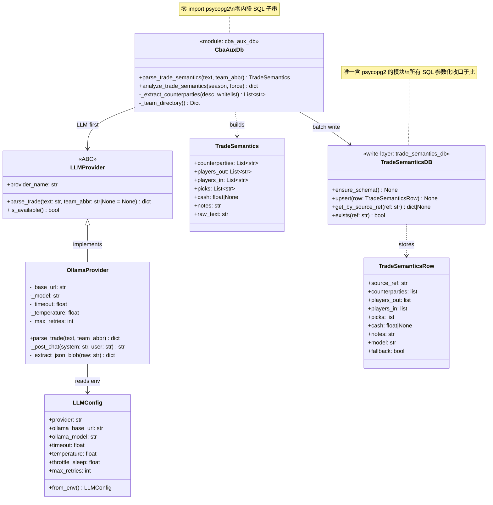
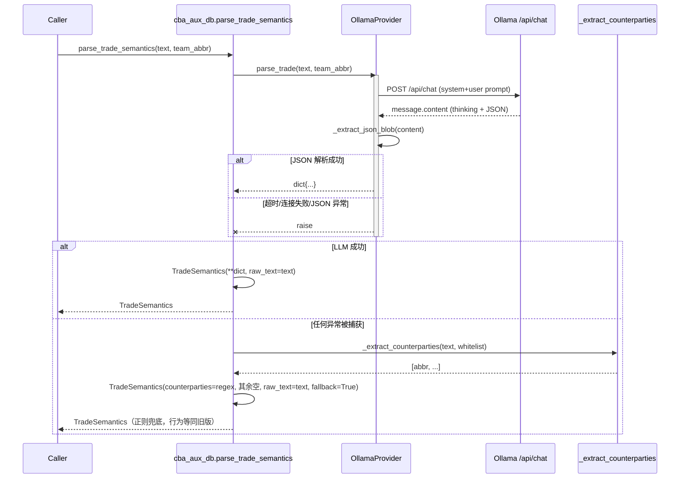
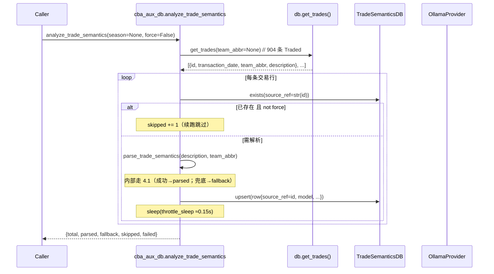
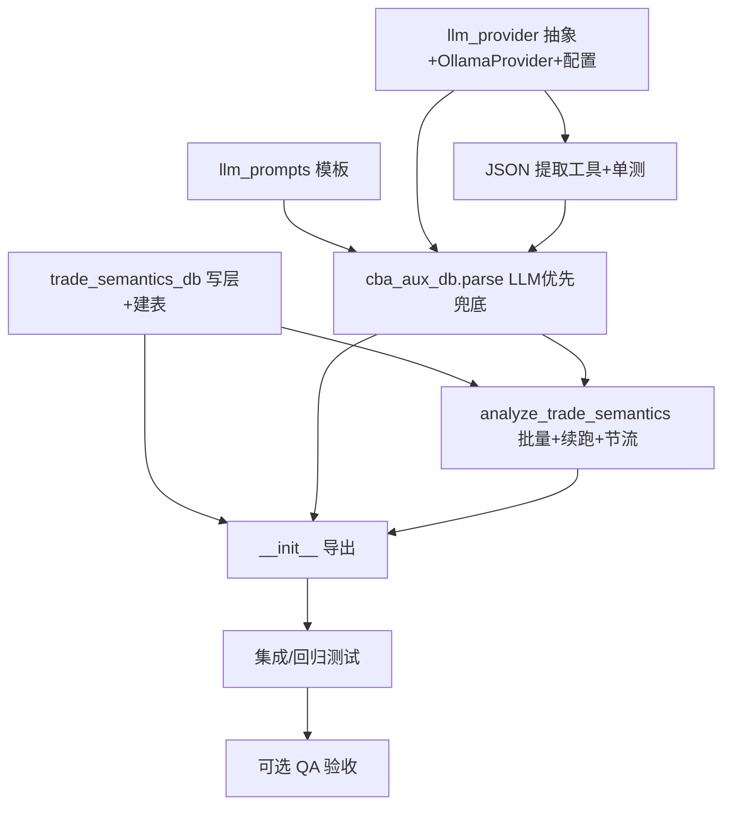

# NBACore Studio v8 — AI 交易语义解析：系统架构设计 + 任务分解

> 文档类型：技术方案（架构师产出，交工程师实现）
> 作者：高见远 / Gao（架构师）
> 关联 PRD：`docs/ai-trade-semantics/prd-ai-trade-semantics.md`
> 关联 seam：`backend/services/trade_engine/cba_aux_db.py`
> 设计约束：v8 §6 四层隔离（Frontend → API → Engine → Data）；SQL 全部收口写层；cba_aux 链路保持纯 stdlib / 零内联 SQL；Ollama 默认 provider，数据不出网。

---

# Part A：系统设计

## 1. 实现方案（Implementation Approach）

### 1.1 核心难点

| 难点 | 说明 | 对策 |
|---|---|---|
| D1 LLM 接入零依赖 | PRD 要求仅用 stdlib，不引入 `requests` | 用 `urllib.request` + `json` 直接 POST Ollama `/api/chat` |
| D2 qwen 思维链噪声 | qwen3.5 可能输出 `<think>…</think>` 或 ```` ```json ```` 围栏，尾随解释文本 | 稳健 JSON 提取：直解析 → 围栏截取 → 首个`{`到末个`}`截取，失败即兜底 |
| D3 非破坏兜底 | LLM 不可达/超时/解析失败时不能抛异常、不能中断 | `parse_trade_semantics` 统一 try/except，回退既有 `_extract_counterparties`，其余字段留空、`raw_text` 保留 |
| D4 批量 904 条不压垮 Ollama | 并发/速率需控 | 串行 + 固定节流 sleep（默认 0.15s），瞬时失败 1 次指数退避重试 |
| D5 续跑幂等 | 中断后重跑不重复解析、行数稳定 | 以 `transactions.id` 为 `source_ref` 唯一键，`ON CONFLICT` upsert，`force=False` 跳过已存在 |
| D6 §6 合规 | 新表读写不得出现内联 SQL / 路由层禁 SQL | 新建 `trade_semantics_db.py` 为唯一写层（psycopg2 参数化），`cba_aux_db.py` 仅调用、不含 SQL 字符串 |

### 1.2 框架 / 库选型（零新增依赖）

- **LLM 调用**：Python 标准库 `urllib.request` + `json`。（环境已实测：Ollama `http://localhost:11434`，默认模型 `qwen3.5-16k`，9.7B，16k 上下文；返回 `message.content`。）**不引入 requests / openai SDK。**
- **DB 写层**：复用既有 `psycopg2`（`backend.core.config.DB_CONFIG` + `ThreadedConnectionPool`，范式同 `workspace_db.py`）。**无新依赖。**
- **配置读取**：复用 `backend.core.config` 的 `_get/_get_int/_get_bool` 约定，新增 `LLM_*` 常量集中管理。
- **领域模型**：复用现有 `TradeSemantics` dataclass（**不改动字段**，仅由 LLM 填充）。

### 1.3 架构模式

- **Strategy / 可插拔 Provider**：`LLMProvider` ABC + `OllamaProvider` 默认实现；未来 `OpenAIProvider` 等实现同一接口即可热切换（满足 R1 / R10）。
- **Write-Layer 收口**：所有 SQL 位于 `trade_semantics_db.py`（§6 写层），`cba_aux_db` 纯编排（读 `db.get_trades`、调用 provider、写 `trade_semantics_db`），自身零 `import psycopg2`、零 SQL 子串。
- **LLM-First + Regex-Fallback**：解析函数双层结构，失败面收窄到"正则兜底"（等同旧版行为）。

---

## 2. 文件清单（相对路径）

> 仓库根：`backend/services/trade_engine/...` 与 `backend/core/...`。

| 文件 | 类型 | 说明 |
|---|---|---|
| `backend/services/trade_engine/llm_provider.py` | **新建** | `LLMProvider` ABC + `OllamaProvider` 实现 + `LLMConfig`（读 env）+ `_extract_json_blob` 稳健提取工具 |
| `backend/services/trade_engine/llm_prompts.py` | **新建** | system / user prompt 模板（few-shot JSON 抽取） |
| `backend/services/trade_engine/cba_aux_db.py` | **修改** | `parse_trade_semantics` 改 LLM 优先 + 正则兜底；新增 `analyze_trade_semantics`；内部调用 `trade_semantics_db` 写层 |
| `backend/services/trade_engine/trade_semantics_db.py` | **新建** | `trade_semantics` 表 DDL（内联常量，幂等）+ 参数化 DML（`ensure_schema/upsert/get_by_source_ref/exists`），§6 写层 |
| `backend/services/trade_engine/__init__.py` | **修改** | 导出 `OllamaProvider` / `LLMConfig` / `analyze_trade_semantics` / `trade_semantics_db` 等新符号 |
| `backend/services/trade_engine/tests/test_llm_provider.py` | **新建** | provider 接口 mock、JSON 提取、正则兜链路、Ollama 集成（可用则跑否则 skip） |
| `backend/services/trade_engine/tests/test_cba_aux_db.py` | **修改** | 新增 `analyze_trade_semantics` 落表校验 + `parse` LLM 优先验证；现有 77 测试不回归 |
| `backend/core/config.py` | **修改（推荐）** | 新增 `LLM_PROVIDER` / `OLLAMA_BASE_URL` / `OLLAMA_MODEL` / `LLM_TIMEOUT` / `LLM_TEMPERATURE` / `LLM_THROTTLE_SLEEP` / `LLM_MAX_RETRIES` 常量（集中 env 读取） |

> 说明：DDL 采用 `trade_semantics_db.py` 内联常量（同 `workspace_db._SCHEMA_SQL` 范式），**不另建 `sql/004_*.sql` 迁移文件**，减少文件、保持一致。

---

## 3. 数据结构与接口（classDiagram）



**关键接口契约**

- `LLMProvider.parse_trade(text: str, team_abbr: str | None = None) -> dict`
  返回键：`{counterparties:list[str], players_out:list[str], players_in:list[str], picks:list[str], cash:float|None, notes:str}`。
  任何网络/超时/JSON 异常都应由实现层抛出，由 `parse_trade_semantics` 捕获并兜底。
- `OllamaProvider._extract_json_blob(raw: str) -> dict`
  直解析 → ```` ```json ```` 围栏 → 首个`{`末个`}`；字段缺失/类型不符抛 `ValueError`。
- `TradeSemanticsDB.upsert(row)`：`ON CONFLICT (source_ref) DO UPDATE`（幂等覆盖，刷新 `parsed_at`）。
- `analyze_trade_semantics(season: str | None = None, force: bool = False) -> dict`
  返回 `{total, parsed, fallback, skipped, failed}`。

---

## 4. 程序调用流程（sequenceDiagram）

### 4.1 单条解析：LLM 优先 + 正则兜底



### 4.2 批量预解析：续跑 + 节流 + 落表



---

## 5. 待明确事项（需用户 / PM 拍板）

1. **`source_ref` 稳定映射**：本设计建议直接用 `transactions.id`（自然主键，最稳）。PRD 曾建议 `transaction_date||'|'||team_abbr`，但其可重复（同日多笔）。**请确认采用 `id`**。
2. **model 版本共存 vs 覆盖**：默认设计为 `UNIQUE(source_ref)` + upsert（每条交易仅留"最新"一行，`force=True` 覆盖）。若需同交易多模型共存，改为 `UNIQUE(source_ref, model)`。请确认。
3. **批量默认行为**：`analyze_trade_semantics()` 默认全量跑 904 条（`season=None`）；是否首次自动触发、是否需 CLI/API 显式触发？建议"不自动，显式触发"。
4. **正则角色**：默认"仅兜底填充器"，LLM 产出 `counterparties` 以 LLM 为准（静默优先）；如需"校验器"对不一致告警，需在 R8 日志中追加比对。请确认。
5. **JSON 字段结构**：v1 简化——`picks` 为可读字符串列表（如 `"2027 1st round (LAL)"`），`cash` 为 float（单位：百万美元），`notes` 为字符串。结构化 pick 对象（year/round/team）留待后续（R11 置信度一并考虑）。
6. **置信度字段（R11, P2）**：本设计未加 `confidence` 列；如要，建议在 `trade_semantics` 增 `confidence JSONB` 并在 prompt 要求模型输出。当前不阻塞 P0。

---

# Part B：任务分解

## 6. 依赖包

```
# 零新增第三方依赖
- urllib.request  # Python 标准库，调用 Ollama HTTP API
- json            # Python 标准库，请求/响应序列化
- psycopg2        # 已存在（backend 现有依赖），仅 trade_semantics_db 写层使用
- backend.core.config  # 已存在，集中读取 LLM_* env 配置

# 开发/测试
- pytest          # 已存在（现有 77 测试在用）
```

> **明确声明**：本需求不引入任何新运行时依赖；`requests` / `openai` SDK 均不使用。

---

## 7. 任务列表（有序、含依赖、按实现顺序）

| Task ID | 任务名称 | 源文件 | 依赖 | 优先级 |
|---|---|---|---|---|
| **T1** | LLM Provider 抽象 + OllamaProvider + 配置读取 | `llm_provider.py`（新建）、`config.py`（改） | — | P0 |
| **T2** | LLM Prompt 模板（few-shot JSON 抽取） | `llm_prompts.py`（新建） | — | P0 |
| **T3** | JSON 稳健提取工具 + 单测 | `llm_provider.py`（补 `_extract_json_blob`）、`tests/test_llm_provider.py`（新建） | T1 | P0 |
| **T4** | `trade_semantics` 写层 + 建表（§6） | `trade_semantics_db.py`（新建） | — | P0 |
| **T5** | `parse_trade_semantics` 改 LLM 优先 + 正则兜底 | `cba_aux_db.py`（改） | T1, T2, T3 | P0 |
| **T6** | `analyze_trade_semantics` 批量 + 续跑 + 节流 | `cba_aux_db.py`（改）、`trade_semantics_db.py`（用） | T4, T5 | P0 |
| **T7** | `__init__.py` 导出新符号 | `__init__.py`（改） | T4, T5 | P1 |
| **T8** | 集成 / 回归测试（现有 77 不回归） | `tests/test_cba_aux_db.py`（改）、`tests/test_llm_provider.py` | T7 | P0 |
| **T9** | （可选）独立 QA 验收 | —（人工/脚本抽样核对 R8） | T8 | P2 |

> 实现顺序遵循依赖：T1/T2/T4 可并行起步；T3 依赖 T1；T5 依赖 T1+T2+T3；T6 依赖 T4+T5；T7 收口导出；T8 验证；T9 可选验收。

---

## 8. 共享知识 / 约定（跨任务一致）

- **模型名 / 地址统一从 env 读**：`OLLAMA_MODEL` 默认 `qwen3.5-16k`、`OLLAMA_BASE_URL` 默认 `http://localhost:11434`、`LLM_PROVIDER` 默认 `ollama`；经 `backend.core.config` 集中暴露，禁止在业务代码硬编码。
- **超时 / 温度常量**：`LLM_TIMEOUT=30s`、`LLM_TEMPERATURE=0`（保证确定性）；`LLM_THROTTLE_SLEEP=0.15s`（批量节流）、`LLM_MAX_RETRIES=1`（瞬时失败退避）。
- **JSON 提取失败一律兜底**：`parse_trade_semantics` 对任何 provider 异常（连接/超时/JSON/字段缺失）统一 catch → 正则回退，`raw_text` 必保留，函数永不抛错（满足 AC2）。
- **续跑以 `source_ref` 唯一键判断**：`exists(source_ref)` 命中且 `force=False` 则跳过；upsert 幂等覆盖。
- **§6 红线**：`cba_aux_db` 与 `llm_provider` 零 `import psycopg2`、零 SQL 子串；所有 DB 操作经 `db`（读）/ `trade_semantics_db`（写）；路由层 `backend/api/routers/*` 不出现任何 SQL。
- **`fallback` 可观测**：`trade_semantics.fallback` 布尔列记录是否走正则兜底，支撑 R8 回退率统计。
- **确定性测试**：单测 mock `urllib`（`unittest.mock` 或 `responses` 风格手写 stub），不依赖真实 Ollama；集成测试探测 `OLLAMA_BASE_URL` 可用则跑、否则 `pytest.mark.skip`。

---

## 9. 任务依赖图（graph）


