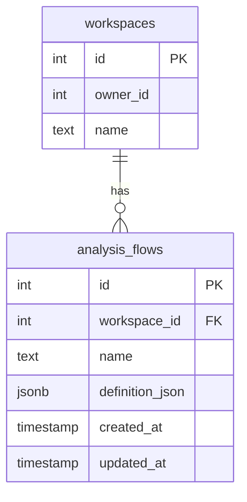
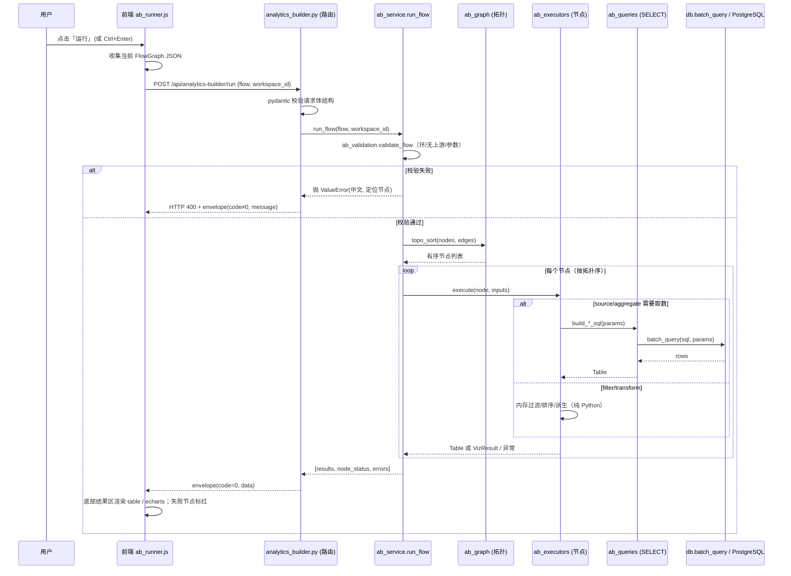
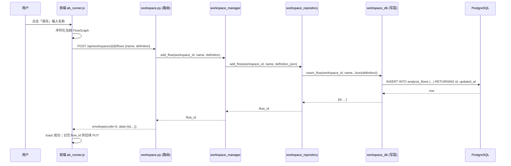

# NBACore Studio v8.3.2 — Analytics Builder 系统架构设计 + 任务分解

> 版本：v8.3.2（SOP 第二阶段产出：架构设计 + 任务分解）
> 角色：架构师 高见远（Gao）
> 日期：2026-07-11
> 上游：PRD `docs/analytics-builder/prd-v832.md`（已通读）、v8.3.1 Workspace 已 LOCKED 可复用、合约 NBACore_Execution_Contract_v8（§6 四层隔离）
> 读者：工程师（据此批量写文件）、QA（据此设计验收）

---

## 0. 设计前提（确认 PRD §5 锁定决策，不再议）

| # | 锁定决策 | 本设计落地方式 |
|---|----------|----------------|
| 1 | 节点画布 = 自研轻量 SVG/Canvas | 节点用绝对定位 `<div>`，连线用 SVG `<path>`，缩放/平移用 CSS `transform`；不引入任何节点库（litegraph/rete 等）。前端为 vanilla JS + echarts（CDN 全局加载），无构建工具 |
| 2 | 执行模型 = 服务端 DAG 执行器 | 新路由 `backend/api/routers/analytics_builder.py`（纯编排、零 SQL）+ 新引擎 `backend/services/analytics_builder_engine/`。引擎做拓扑排序，逐节点复用既有引擎或经各 engine 的 `*_queries.py` 取数/聚合（一律经 `db.batch_query` 走 SELECT），中间结果在内存传递，终点可视化节点返回 table 数据 |
| 3 | 绑定 v8.3.1 Workspace | 分析流（Analysis Flow）作为 Workspace 的**新资源类型**（与 charts 平级）。**单独立表 `analysis_flows`**（不修改已 LOCKED 的 Workspace 模型），由 `workspace_manager` 暴露 `add_flow/get_flow/update_flow/remove_flow/list_flows` 门面 |
| 4 | P0 节点范围 = 纯 5 类 | 数据源(source) / 过滤(filter) / 聚合(aggregate) / 变换(transform：排序+截断TopN+派生列) / 可视化(visualize：表格+折线+柱状)。派生指标节点留 P1 |
| 5 | 小项默认 | 单节点结果 ≤5000 行；P0 允许多个可视化终点节点；键盘基线 `Delete` / `Ctrl+Z`(撤销) / `Ctrl+Enter`(运行) |

**硬性架构约束（§6 四层隔离，违反即 CI 失败）：**
- `backend/api/routers/*` 禁止任何 SQL 字符串子串（`"SELECT "` / `"INSERT "` / `"UPDATE "` / `"DELETE "` 带尾随空格）。所有 SQL 落在 engine 的 `*_queries.py` 或 workspace 的专属写层 `workspace_db.py`。
- 前端组件零计算，只渲染 + 交互；计算全在后端 engine。
- 路由文件 ≤200 行、不 import pandas/numpy；纯编排 + 参数校验 + 调 engine。
- 既有的权威参考实现：`backend/services/career_engine/`（引擎范本）+ `backend/api/routers/career.py`（路由零 SQL 范本）+ `backend/services/workspace_engine/`（资源扩展范本）。

---

## 1. 实现方案 + 框架选型

### 1.1 框架选型

- **后端**：沿用现有 **FastAPI + psycopg2 + pydantic** 技术栈，无新依赖。DAG 引擎为纯 Python 标准库实现（拓扑排序、内存表、安全算术求值），不引入 pandas/numpy（既满足 §6「路由不 import pandas/numpy」，也避免引入新包）。
- **前端**：沿用 **vanilla JS + echarts@5.5.0（CDN）**，无构建工具、无 npm 依赖。**无新前端依赖**。
- **数据库**：沿用 PostgreSQL，新增 1 张表 `analysis_flows`（JSONB 存储定义）。所有写 SQL 收敛到 workspace 专属写层 `workspace_db.py`（已是该模块唯一的 psycopg2 入口，`core.db` 保持 SELECT-only）。所有读/聚合 SQL 收敛到 `analytics_builder_engine/ab_queries.py`。

### 1.2 DAG 执行引擎执行模型

- **节点图（DAG）模型**：图由 `nodes`（顶点）与 `edges`（有向边）组成。每个非 source 节点恰好 1 个输入端口（左）、每个非 visualize 节点恰好 1 个输出端口（右），边上挂 `from`/`to` 节点 id。P0 不允许多输入汇聚以外的复杂端口，保持画布简单、连线判定廉价。
- **拓扑排序算法**：采用 **Kahn 算法**（入度表 + 队列）。
  1. 计算每个节点入度（指向它的边数）。
  2. 入度为 0 的节点入队，依次出队执行，执行后将其下游节点入度 −1，归零则入队。
  3. 若执行结束仍有节点未出队 → 图存在环（理论上前端已拦截，引擎侧再兜一层）。
- **中间结果内存表结构（Table）**：
  ```python
  Table = {
      "columns": [ {"name": str, "type": str} ],   # type ∈ text/int/float/...
      "rows":    [ {col: value, ...}, ... ],         # list[dict]，行 ≤ ROW_LIMIT(5000)
      "row_count": int,
      "truncated": bool,                              # 是否因超 5000 被截断
  }
  ```
  节点间以 `Table` 在内存中传递；不落库、不跨进程。
- **错误传播到节点**：执行器对**每个节点**包 `try/except`，任何异常（SQL 失败、字段未知、除零、运算非法）被捕获并转为该节点的 `status="error"` + 中文 `error`（指向节点 id 与原因），**不中断整条链路的非依赖分支**；依赖该失败节点的下游节点标记为 `skipped`（上游缺失）。最终响应携带 `node_status` 与 `errors` 列表，前端据此在对应节点标红。
- **可视化终点**：visualize 节点**不产生新 Table**，而是把输入 Table + `viz_type`/`x_field`/`y_fields`/`title` 打包成 `VizResult` 收进响应 `results`。echarts option 由前端依据该结果就地构建（属渲染配置，非计算，不违反「前端零计算」）。

### 1.3 前端画布自研方案技术要点

| 要点 | 方案 |
|------|------|
| **节点渲染** | 每个节点一个绝对定位 `<div class="ab-node">`，`left/top` 由 `node.x/node.y` 决定；左侧一个输入端口圆点 `.ab-port.in`、右侧一个输出端口圆点 `.ab-port.out`；类型色条用 `data-type` + CSS 变量区分（source=蓝 / filter=灰 / aggregate=绿 / transform=紫 / visualize=橙） |
| **连线渲染** | 一个全画布覆盖的 `<svg class="ab-edges">`，每条边一个 `<path>`；路径用 **三次贝塞尔曲线**（水平进出端口更自然）或正交走线（P0 默认贝塞尔，C-7 正交留 P1） |
| **命中检测 / 端口** | 端口为小圆点 DOM，监听 `pointerdown`；从 out 端口按下→拖动生成「临时连线」→在 in 端口 `pointerup` 命中则成边；命中检测用元素 `elementFromPoint` / 端口 DOM 事件，不依赖 canvas 命中测试（DOM 方案天然命中准确） |
| **平移 / 缩放** | 画布内容包在 `.ab-viewport > .ab-world`；平移改 `world.style.transform = translate(tx,ty)`；缩放改 `scale(s)`，以鼠标位置为锚点。`Ctrl+滚轮` 或滚轮缩放，空格+拖拽/空白拖拽平移 |
| **节点拖拽** | 节点体 `pointerdown` → 记录起点 → `pointermove` 改 `node.x/y` → 重绘该节点与所有相关连线（连线 path 根据两节点端口坐标实时重算）|
| **选中 / 删除** | 单击节点体设 `selected` 高亮并打开属性面板；`Delete`/`Backspace` 删选中节点并级联删其边；单击连线选中连线（P1 删除连线）|
| **撤销栈** | `history: Graph[]`（快照式），每次结构变更（增/删/移动结束/连线/改参）push 一份深拷贝；`Ctrl+Z` 弹栈还原。P0 实现结构级快照即可（移动中也算一次提交）|
| **点阵网格背景** | `.ab-world` 用 CSS `background-image: radial-gradient(...)` 点阵，随 transform 平移/缩放自然移动 |

### 1.4 与既有代码的关系（关键取舍）

- **SQL 落点**：执行引擎的 SELECT 全部走 `analytics_builder_engine/ab_queries.py`（`core.db.batch_query`）；Flow 持久化的 DML 走 **`workspace_db.py`**（workspace 模块既有的「专属写层」，是唯一允许 psycopg2 的模块，符合 §6）。**路由器一律零 SQL**。
- **Flow 资源与 LOCKED Workspace 模型解耦**：`analysis_flows` 为**独立表**，`workspace_manager` 新增 `add_flow/.../list_flows` 门面，但**不修改 `models.Workspace`**（不新增 `flows` 字段），避免触碰已 LOCKED 模型。Flow 列表按需经 `list_flows(workspace_id)` 拉取，与 charts 平级。

---

## 2. 文件列表及相对路径

### 2.1 后端（新建，除非标注）

| 层 | 文件相对路径 | 作用 |
|----|--------------|------|
| Engine 常量 | `backend/services/analytics_builder_engine/ab_constants.py` | 节点 type 枚举、聚合函数白名单、viz 类型、ROW_LIMIT=5000、端口定义 |
| Engine 图模型 | `backend/services/analytics_builder_engine/ab_graph.py` | `FlowGraph` 解析、Kahn 拓扑排序、环检测、入度计算 |
| Engine 校验 | `backend/services/analytics_builder_engine/ab_validation.py` | 运行前校验：环、无上游的 visualize、参数缺失/未知字段、非法 op |
| Engine SQL | `backend/services/analytics_builder_engine/ab_queries.py` | 读层 SELECT builder：表内省（INFORMATION_SCHEMA）、source/filter/aggregate/transform 的 SQL 拼接（全部参数化，经 batch_query） |
| Engine 工具 | `backend/services/analytics_builder_engine/ab_utils.py` | 安全算术求值（派生列）、类型推断、Table 构造、结果截断 |
| Engine 执行器 | `backend/services/analytics_builder_engine/ab_executors.py` | 5 类节点执行器（source/filter/aggregate/transform/visualize）+ 节点注册表 `REGISTRY` |
| Engine 门面 | `backend/services/analytics_builder_engine/ab_service.py` | `run_flow()` 编排（校验→拓扑→逐节点执行→收集 VizResult）、`get_meta()` |
| Engine 包 | `backend/services/analytics_builder_engine/__init__.py` | 导出 `run_flow` / `get_meta` / `validate_flow`，统一门面 |
| Engine 测试 | `backend/services/analytics_builder_engine/tests/test_engine.py` | 引擎单测（拓扑/校验/各节点执行/截断/错误传播） |
| Router 契约 | `backend/api/routers/analytics_builder_schemas.py` | pydantic：`FlowGraph`/`NodeSpec`/`EdgeSpec`/`RunRequest`/`RunResponse`/`MetaResponse`/`FlowCreate`/`FlowResponse` |
| Router | `backend/api/routers/analytics_builder.py` | 零 SQL 路由：`/run` POST、`/meta` GET（≤200 行） |
| 路由注册 | `backend/api/routers/__init__.py` | 新增 import + 加入 `__all__` |
| 应用注册 | `backend/app.py` | `app.include_router(analytics_builder.router)`（在 workspace 之后） |
| Workspace 门面 | `backend/services/workspace_engine/workspace_manager.py` | 新增 `add_flow/get_flow/update_flow/remove_flow/list_flows` 委托到 repository |
| Workspace 仓库 | `backend/services/workspace_engine/workspace_repository.py` | 新增 `add_flow/get_flow/update_flow/remove_flow/list_flows`（委托到 workspace_db） |
| Workspace 写层 | `backend/services/workspace_engine/workspace_db.py` | DDL：新增 `analysis_flows` 建表语句；新增 flow 的 INSERT/SELECT/UPDATE/DELETE 函数 |
| Workspace 包导出 | `backend/services/workspace_engine/__init__.py` | 导出 5 个 flow 门面函数 |
| Workspace 路由 | `backend/api/routers/workspace.py` | 新增 `/{workspace_id}/flows` GET/POST/PUT/DELETE + GET `/{workspace_id}/flows/{flow_id}` |
| 路由测试 | `backend/tests/test_analytics_builder_api.py` | API 集成测试（run/meta/flows CRUD/envelope） |
| 合规测试 | `backend/tests/test_six_layer_compliance.py` | grep `backend/api/routers/*.py` 无 SQL 子串；节点 type 常量一致性 |

### 2.2 前端（新建 + 改动）

| 类型 | 文件相对路径 | 作用 |
|------|--------------|------|
| 画布组件 | `frontend/js/components/ab_canvas.js` | 画布渲染/拖拽/连线/缩放/选中/删除/撤销栈 |
| 节点组件 | `frontend/js/components/ab_nodes.js` | 节点 DOM 工厂（按 type 渲染端口/色条/标题）、端口坐标计算 |
| 属性面板 | `frontend/js/components/ab_properties.js` | 按节点 type 渲染表单，枚举来自 `/meta`，即时校验标红 |
| 运行器 | `frontend/js/components/ab_runner.js` | POST `/run`、解析结果、渲染 table/echarts；保存/加载（调 flows CRUD） |
| 页面装配 | `frontend/js/components/analytics_builder.js` | 顶层装配 4 个子模块、注册 `window.AnalyticsBuilder.render(containerId, workspaceId)` |
| 页面骨架 | `frontend/index.html` | 新增侧栏 nav-item `data-page="analytics-builder"` + `<div id="page-analytics-builder" class="page">` 三栏骨架 + 引入上面 5 个 JS |
| 导航装配 | `frontend/js/app.js` | `nav()` 新增 `analytics-builder` 分支 + `loadAnalyticsBuilderPage()`；`<script>` 引入新 JS |
| 样式 | `frontend/css/style.css` | 新增 `.ab-*` 系列样式（画布/节点/端口/连线/工具条/属性面板/结果区），复用现有暗色 CSS 变量 |

### 2.3 文档

- `docs/analytics-builder/architecture-v832.md`（本文件）
- `docs/analytics-builder/prd-v832.md`（上游，已存在）

---

## 3. 数据结构与接口

### 3.1 节点图 JSON 模型（最终版，定稿 PRD §5 Q4 草案）

```mermaid
classDiagram
    class FlowGraph {
        +string version = "1"
        +int workspace_id
        +NodeSpec[] nodes
        +EdgeSpec[] edges
    }
    class NodeSpec {
        +string id            // "n1"
        +NodeType type        // source|filter|aggregate|transform|visualize
        +string title
        +int x
        +int y
        +dict params          // 见下，按 type 不同
    }
    class EdgeSpec {
        +string id            // "e1"
        +string from          // 上游节点 id（其 out 端口）
        +string to            // 下游节点 id（其 in 端口）
    }
    FlowGraph "1" o-- "many" NodeSpec
    FlowGraph "1" o-- "many" EdgeSpec

    class SourceParams {
        source_mode: "table"|"workspace_dataset"
        table: str|null         // 表直选：来自 meta.tables
        dataset_id: int|null    // 工作区数据集模式：来自 meta.workspace_datasets
        season_from: int|null
        season_to: int|null
        limit: int = 5000
    }
    class FilterParams {
        logic: "AND"|"OR"
        conditions: FilterCond[]
    }
    class FilterCond {
        field: str
        op: "="|"!="|">"|"<"|">="|"<="|"in"|"like"
        value: any
    }
    class AggregateParams {
        group_by: string[]
        measures: Measure[]
    }
    class Measure {
        field: str
        agg: "sum"|"avg"|"count"|"max"|"min"
        alias: str
    }
    class TransformParams {
        sort: SortSpec|null
        top_n: int|null
        derived: DerivedCol[]
    }
    class SortSpec { field: str; order: "asc"|"desc" }
    class DerivedCol { name: str; expr: str }   // 安全算术，见 3.3
    class VisualizeParams {
        viz_type: "table"|"line"|"bar"
        x_field: str|null
        y_fields: string[]
        title: str
    }
```

边简化为「一对一」（每节点 1 in / 1 out 端口），`EdgeSpec` 仅含 `from`/`to` 节点 id；成环由画布（实时）与引擎（兜底）双重拦截。

### 3.2 `analysis_flows` 表结构（ER）



| 列 | 类型 | 说明 |
|----|------|------|
| id | SERIAL PK | 自增主键 |
| workspace_id | INTEGER NOT NULL | 归属工作区（FK 逻辑关联 `workspaces.id`，不强制外键约束以保持与 `workspace_charts` 一致风格） |
| name | TEXT NOT NULL DEFAULT 'flow' | 分析流名称 |
| definition_json | JSONB NOT NULL | 完整 `FlowGraph`（nodes+edges+params+坐标） |
| created_at | TIMESTAMP DEFAULT now() | |
| updated_at | TIMESTAMP DEFAULT now() | 更新时刷 now() |

> 与 `workspace_charts` 完全同构（单列 JSONB 存定义 + workspace_id 关联），风格一致、零侵入现有模型。

### 3.3 各节点类型输入/输出契约

| 节点 | 输入 | 输出 | params 关键字段 | 执行说明 |
|------|------|------|------------------|----------|
| source | 无 | `Table` | `source_mode, table/dataset_id, season_from/to, limit` | 直选：对 `table` 做 `SELECT * FROM <table> [WHERE season BETWEEN ...] LIMIT`；工作区数据集：`dataset_id` → 经 `datasets` 表解析出 `table_name`（见 §8 待明确），再同上 |
| filter | `Table` | `Table`（同 schema，行数减少） | `logic, conditions[{field,op,value}]` | 基于输入 Table 的列做 `WHERE`（op 白名单映射），字段须存在于上游 columns（校验拦截未知字段） |
| aggregate | `Table` | `Table`（列为 `group_by` + 各 `measure.alias`） | `group_by[], measures[{field,agg,alias}]` | `GROUP BY` + 聚合；`count` 忽略 field 取值（用 `*`）；alias 唯一 |
| transform | `Table` | `Table` | `sort{field,order}, top_n, derived[{name,expr}]` | 先按 `sort` 排序、`top_n` 截断；再对每行用**安全算术求值器**计算 `derived` 新列（expr 仅允许列名+数字+`+-*/()`+空格，禁止函数/字母函数调用/括号注入）；行超 5000 截断 |
| visualize | `Table` | `VizResult`（非 Table） | `viz_type, x_field, y_fields[], title` | 消费输入 Table，产出 `{node_id, viz_type, title, columns, rows, row_count}`，前端据此构建 echarts option / 表格 |

> `Table` 结构统一：`{columns:[{name,type}], rows:[{...}], row_count, truncated}`。所有中间结果行数超过 `ROW_LIMIT=5000` 时截断并置 `truncated=true`，保证前端表格性能。

> **安全算术求值器（派生列）**：不调用 `eval()`。自研一个 tokenizer + 递归下降解析器，仅接受 token 集 `{标识符, 数字, +, -, *, /, (, )}`，标识符必须是输入 Table 的已知列名；求值在「一行 dict」上下文中进行，除零/非法返回明确错误并定位节点。这是 §6「无 eval/exec」与「前端零计算」共同要求的后端唯一正确实现。

### 3.4 前端 ↔ 后端 API 契约

**统一响应 envelope**（全站一致，FastAPI 直接返回 dict 即可，pydantic 仅用于请求体）：
```json
{ "code": 0, "data": { ... }, "message": "ok" }
```
- `code == 0` 成功；`code != 0` 业务/校验错误（同时 HTTP 状态码 400/404/500 仍按异常抛出）。
- 错误信息中文，`message` 给人读，`data` 给程序。

**端点清单**

| 方法 | 路径 | 说明 | 请求体 / 参数 | 响应 data |
|------|------|------|---------------|-----------|
| POST | `/api/analytics-builder/run` | 执行整图 | `{ flow: FlowGraph, workspace_id: int }` | `{ results: VizResult[], node_status: {id: "ok"|"error"|"skipped"}, errors: [{node_id, message}] }` |
| GET | `/api/analytics-builder/meta` | 枚举元数据 | `?workspace_id=int`（可选） | `{ tables:[{name, columns:[{name,type}]}], agg_functions:[...], viz_types:[...], workspace_datasets:[{id,name,table}] }` |
| GET | `/api/workspaces/{workspace_id}/flows` | 列出工作区分析流 | — | `[{id, workspace_id, name, updated_at}]` |
| POST | `/api/workspaces/{workspace_id}/flows` | 新建分析流 | `{ name: str, definition: FlowGraph }` | `{id, workspace_id, name, updated_at}` |
| GET | `/api/workspaces/{workspace_id}/flows/{flow_id}` | 取单条（加载还原） | — | `{id, workspace_id, name, definition: FlowGraph, updated_at}` |
| PUT | `/api/workspaces/{workspace_id}/flows/{flow_id}` | 更新 | `{ name?, definition? }` | `{id, workspace_id, name, updated_at}` |
| DELETE | `/api/workspaces/{workspace_id}/flows/{flow_id}` | 删除 | — | `{deleted: true}` |

> 端点路径遵循既有 `/api/workspaces/...` 复数约定（PRD 中 `/api/workspace/...` 为示意，本设计以与 `workspace.py` 现有 charts 路由一致为准）。
> `meta` 的 `tables` 通过 `INFORMATION_SCHEMA.columns` 内省 nba 业务表（建议白名单过滤到 `fact_*`/`dim_*` 等分析表），`columns` 含 `name`+`type`，前端属性面板据此渲染字段下拉。`workspace_datasets` 经 `workspace_manager` 解析工作区已挂载数据集。

---

## 4. 程序调用流程

### 4.1 运行流程（用户点运行）



### 4.2 保存流程（保存分析流）



---

## 5. 任务列表（T1..TN，有序、含依赖）

> 约定：每个任务列出「涉及文件」，工程师可据此批量落地。阶段顺序：后端引擎 → 路由+持久化 → 前端画布 → 属性面板 → 运行器+保存 → 测试。

### 阶段 A：后端引擎核心（DAG 模型 + 拓扑 + 节点注册表 + 5 类执行器 + 校验）

- **T1 节点常量与枚举** — 依赖：无
  - `backend/services/analytics_builder_engine/ab_constants.py`
  - 内容：`NODE_TYPES`、`PORT_IN/PORT_OUT`、`AGG_FUNCTIONS`（sum/avg/count/max/min）、`VIZ_TYPES`（table/line/bar）、`ROW_LIMIT=5000`、`FILTER_OPS`（=,!=,>,<,>=,<=,in,like）。
- **T2 图模型 + 拓扑排序 + 环检测** — 依赖：T1
  - `backend/services/analytics_builder_engine/ab_graph.py`
  - 内容：`FlowGraph.from_dict()`、`topo_sort()`（Kahn）、`detect_cycle()`、入度计算、单节点出/入端口校验。
- **T3 读层 SQL builder（含表内省）** — 依赖：T1
  - `backend/services/analytics_builder_engine/ab_queries.py`
  - 内容：`introspect_tables()`（INFORMATION_SCHEMA，白名单 fact_/dim_）、`get_dataset_table(dataset_id)`（datasets 表解析）、`build_source_sql()`、`build_filter_sql()`、`build_aggregate_sql()`（全部参数化 `%s`，经 `db.batch_query`）。**零动态列名拼接风险**：列名来自白名单内省结果，表名来自内省白名单。
- **T4 工具：安全算术 + Table 构造 + 截断** — 依赖：T1
  - `backend/services/analytics_builder_engine/ab_utils.py`
  - 内容：`safe_arithmetic_eval(expr, row_dict)`（tokenizer+递归下降，禁 eval/exec）、`build_table(columns, rows)`、`truncate(table)`（超 5000 截断置 flag）、`infer_type()`。
- **T5 5 类节点执行器 + 注册表** — 依赖：T2,T3,T4
  - `backend/services/analytics_builder_engine/ab_executors.py`
  - 内容：`REGISTRY = {type: executor}`；`exec_source/filter/aggregate/transform/visualize`，每个接收 `(node, input_table, ctx)` 返回 `Table` 或 `VizResult`，异常就地捕获转 `error`。
- **T6 运行前校验** — 依赖：T2,T5
  - `backend/services/analytics_builder_engine/ab_validation.py`
  - 内容：`validate_flow(flow)` → 环检测、无上游的 visualize、`params` 必填校验、filter/aggregate/transform 字段是否在上游 columns 内（source 阶段无法知列时延迟到执行期校验）、op/agg 白名单。
- **T7 引擎门面（run_flow + get_meta）** — 依赖：T2,T3,T5,T6
  - `backend/services/analytics_builder_engine/ab_service.py` + `__init__.py`
  - 内容：`run_flow(flow, workspace_id)`（校验→拓扑→逐节点执行→收集 results/node_status/errors）、`get_meta(workspace_id)`（调 T3 内省 + workspace 数据集）。

### 阶段 B：后端路由 + schemas + workspace 持久化 + 建表

- **T8 Flow 请求/响应 pydantic schemas** — 依赖：T1
  - `backend/api/routers/analytics_builder_schemas.py`
  - 内容：`NodeSpec`/`EdgeSpec`/`FlowGraph`/`RunRequest`/`RunResponse`/`MetaResponse`/`FlowCreate`/`FlowResponse`（镜像 career_schemas 风格）。
- **T9 路由 analytics_builder.py（零 SQL）** — 依赖：T7,T8
  - `backend/api/routers/analytics_builder.py`（≤200 行）
  - 内容：`POST /run`、`GET /meta`，仅做 pydantic 校验 + 调 `ab_service`，包 `{code,data,message}`。**不含任何 SQL 子串**。
- **T10 路由注册** — 依赖：T9
  - `backend/api/routers/__init__.py`（import + __all__）、`backend/app.py`（include_router）。
- **T11 建表 analysis_flows + flow DML（workspace 写层）** — 依赖：无（独立）
  - `backend/services/workspace_engine/workspace_db.py`
  - 内容：DDL 常量追加 `analysis_flows` + 索引；新增 `insert_flow/get_flow/update_flow/delete_flow/select_flows(workspace_id)`（参数化 DML，全走 psycopg2，符合 §6 写层豁免）。
- **T12 workspace 仓库 + 门面扩展** — 依赖：T11
  - `backend/services/workspace_engine/workspace_repository.py`（委托 DB）、`workspace_manager.py`（新增 5 个 `add_flow/get_flow/update_flow/remove_flow/list_flows`）、`__init__.py` 导出。
- **T13 Workspace 路由 flows CRUD** — 依赖：T8,T12
  - `backend/api/routers/workspace.py`
  - 内容：`GET/POST /{workspace_id}/flows`、`GET/PUT/DELETE /{workspace_id}/flows/{flow_id}`，调 workspace_manager，包 envelope；复用现有 404 辅助函数。

### 阶段 C：前端画布（渲染/拖拽/连线/缩放/选中/删除/撤销）

- **T14 画布与节点 DOM + 样式骨架** — 依赖：无
  - `frontend/css/style.css`（`.ab-*`）、`frontend/index.html`（nav-item + page 骨架 + script 引入）、`frontend/js/app.js`（nav 分支 + 加载入口）。
- **T15 节点组件 ab_nodes.js** — 依赖：T14
  - `frontend/js/components/ab_nodes.js`：按 type 生成节点 DOM、端口圆点、色条、标题渲染、端口坐标计算（相对 world）。
- **T16 画布交互 ab_canvas.js** — 依赖：T15
  - `frontend/js/components/ab_canvas.js`：节点拖拽、端口连线（贝塞尔 path）、平移/缩放（CSS transform）、选中/删除（Delete/Backspace）、撤销栈（Ctrl+Z）、临时连线渲染、连线随节点实时重绘。

### 阶段 D：前端属性面板（按节点类型渲染表单，枚举来自 /meta）

- **T17 属性面板 ab_properties.js** — 依赖：T15（需 node 模型）
  - `frontend/js/components/ab_properties.js`：根据选中节点 type 渲染对应表单（source 的表/数据集下拉来自 `/meta`；filter/aggregate/transform/visualize 字段下拉来自「上游节点列」或 `/meta`）；改动即时写回 FlowGraph；非法参数标红阻止运行。

### 阶段 E：前端运行器（POST 图、渲染 table/echarts）+ 保存/加载

- **T18 运行器 + 渲染 ab_runner.js** — 依赖：T16,T17 + 后端 T9
  - `frontend/js/components/ab_runner.js`：`POST /run` → 解析 `results`/`node_status`/`errors` → 底部结果区按 `viz_type` 渲染 table 或 echarts（echarts option 由前端据 columns/rows/x_field/y_fields 构建）；失败节点标红 + toast。
- **T19 保存/加载 flows** — 依赖：T18 + 后端 T13
  - 同 `ab_runner.js`（或 `analytics_builder.js`）：保存调 `POST/PUT /flows`、打开 Builder 时 `GET /flows/{id}` 完整还原 nodes/edges/坐标/参数。
- **T20 页面装配 analytics_builder.js** — 依赖：T16,T17,T18,T19
  - `frontend/js/components/analytics_builder.js`：装配画布/属性/运行器，暴露 `window.AnalyticsBuilder.render(containerId, workspaceId)`；`app.js` 注册 `loadAnalyticsBuilderPage()`。

### 阶段 F：测试（引擎单测 + API 集成 + §6 合规 + 前端 node --check）

- **T21 引擎单测** — 依赖：T7
  - `backend/services/analytics_builder_engine/tests/test_engine.py`：拓扑排序/环检测、5 类节点执行、5000 截断、安全算术求值、错误传播到节点、未知字段拦截。
- **T22 API 集成测试** — 依赖：T9,T13
  - `backend/tests/test_analytics_builder_api.py`：`/run` 成功与各类校验失败（环/无上游/参数）、`/meta` 返回表/字段/聚合/可视化枚举、`/flows` CRUD 与 envelope 形状。
- **T23 §6 合规测试 + 前端 node --check** — 依赖：T9,T13,T20
  - `backend/tests/test_six_layer_compliance.py`：`grep` 全部 `backend/api/routers/*.py` 不得含 `"SELECT "/"INSERT "/"UPDATE "/"DELETE "` 子串；节点 type 常量在前后端一致；对 `frontend/js/components/ab_*.js` 与 `analytics_builder.js` 跑 `node --check` 确保语法合法。

---

## 6. 依赖包

- **后端新依赖：无**。DAG 引擎、安全算术、拓扑排序均用 Python 标准库；psycopg2/pydantic/FastAPI 已存在。
- **前端新依赖：无**。仅 echarts@5.5.0（已在 `index.html` 经 CDN 全局加载），无 npm、无打包。
- 明确结论：**本版本不引入任何新 npm / PyPI 依赖**。

---

## 7. 共享知识（跨文件约定）

1. **Envelope 形状**：全站统一 `{code:int, data:any, message:str}`。成功 `code=0`，失败 `code≠0`；HTTP 状态码仍按异常语义返回（400/404/500），但 body 总带 `code/message`。
2. **错误码约定**：`code=0` 成功；`code=400xx` 校验/参数错误（环、无上游、未知字段）；`code=500xx` 引擎执行失败。`message` 一律中文且带节点 id（如「节点 n2：未知字段 season_x」）。
3. **节点 type 枚举常量**：单一真理源 = `backend/services/analytics_builder_engine/ab_constants.py::NODE_TYPES`（`source|filter|aggregate|transform|visualize`）。前端 `ab_nodes.js` 深拷贝同一份常量（或以 `/meta` 下发），**不允许前后端各写一份魔法字符串**。
4. **Table schema 前后端约定**：`{columns:[{name,type}], rows:[...], row_count, truncated}`。`type` 取值 `{text,int,float,bool}`，由 `ab_utils.infer_type` 产出，前端据此决定表格对齐/格式化，不在前端推断类型（前端零计算）。
5. **画布坐标与端口命中约定**：坐标为世界坐标（`node.x/node.y` 为节点左上角，相对 `.ab-world`）；端口坐标 = 节点坐标 + 固定偏移（输入端口在左中、输出端口在右中，存于 `ab_constants` 端口尺寸常量）。连线 path 由两个端口世界坐标经贝塞尔公式算出，缩放/平移只改 `.ab-world` 的 CSS transform，端口坐标换算统一用一个 `toScreen()` 函数（避免重复实现）。
6. **聚合函数 / 可视化类型枚举**：`AGG_FUNCTIONS`、`VIZ_TYPES` 同源于 `ab_constants`，`/meta` 原样下发，前端下拉直接消费，不另存副本。
7. **行数上限**：`ROW_LIMIT=5000`（仅定义于 `ab_constants`），前端表格渲染以 `row_count`/`truncated` 提示「已截断」，**不**在前端再次切片。
8. **SQL 落点铁律**：所有 SELECT 在 `analytics_builder_engine/ab_queries.py`；所有 Flow DML 在 `workspace_db.py`；`backend/api/routers/*` 零 SQL 子串（CI 由 T23 守护）。

---

## 8. 待明确事项（需老程/工程师定夺，附推荐默认）

| # | 事项 | 现状/风险 | 推荐默认 |
|---|------|-----------|----------|
| O1 | **工作区数据集（source_mode=workspace_dataset）的数据集定义来源** | 现有 `workspace_datasets` 仅存 `(workspace_id, dataset_id)`，未见底层 `datasets` 表在本仓库定义。source 节点需把 `dataset_id` 解析成「真实表名+可选筛选」 | 新增轻量 `datasets` 表（`id, name, table_name, description`）由 crawler/种子维护；`ab_queries.get_dataset_table(dataset_id)` 读它取 `table_name`。若老程确认无此表，则 P0 的 workspace_dataset 模式回退为「仅 table 模式」，UI 隐藏该选项 |
| O2 | **表内省白名单范围** | `/meta` 的 `tables` 应只暴露分析用表，避免暴露 `workspace_*`/系统表 | 默认白名单：`fact_%` 与 `dim_%`（正则过滤 `INFORMATION_SCHEMA.columns` 的 `table_name`） |
| O3 | **派生列安全算术是否支持函数** | 首版要求「安全算术」，PRD 说「限安全算术」 | 首版仅 `+ - * / ()` 与列名/数字；函数（如 `ROUND`）留 P1。若老程希望首版支持少量函数，再在 T4 求值器加白名单函数表 |
| O4 | **多输入端口/多输出端口** | P0 简化为单 in/单 out | 维持单端口；Join（P1）再扩展双输入 |
| O5 | **可视化节点「雷达图」** | PRD N-5 标注雷达为 P1 | 首版 `VIZ_TYPES` 仅 `table/line/bar`；雷达留 P1，不进 `ab_constants.VIZ_TYPES` |
| O6 | **运行时节点状态灯（R-5）** | PRD 标 P1 | 首版 `/run` 同步返回，状态灯（等待/计算中/完成/失败）在 P1 做增量/异步；首版 `node_status` 仅 `ok/error/skipped` |
| O7 | **节点标题改名（P-4）/ 复制删除资源（SV-4）** | PRD 标 P1 | 首版支持节点 `title` 改名（params 已有 title）；flow 的复制/重命名走现有 `duplicate` 模式在 P1；首版提供重命名+删除即可 |
| O8 | **前端撤销栈粒度** | 移动中也算一次提交可能让 Ctrl+Z 太碎 | 默认「拖拽结束（pointerup）提交一次快照」，连续输入改参防抖 400ms 提交一次 |

> 以上 O1 为唯一可能阻塞 T3/T12 实现的硬依赖点，建议老程在开工前确认 `datasets` 表是否存在；其余均有可用默认，不阻塞 T1–T23 推进。

---

## 9. 验收口径（与 PRD §7 对齐，供 QA）

1. 画布可拖拽放置 5 类 P0 节点并连线成 DAG（连成环前端拒绝 + toast）。
2. 属性面板按节点 type 渲染表单，字段/函数枚举来自 `/meta`（或上游列）。
3. 点「运行」后端按拓扑序执行，终点 visualize 节点在结果区出 **表格/折线/柱状**。
4. 运行前校验拦住「成环 / 可视化无上游 / 参数缺失 / 未知字段」并中文定位节点。
5. 分析流可保存到指定 Workspace（`analysis_flows`）并完整加载还原（节点/连线/坐标/参数）。
6. 全链路无 SQL 出现在 `backend/api/routers/*`（`grep` 校验，T23）；前端无计算逻辑（仅渲染 + 交互）。
7. 单节点结果 ≤5000 行截断；P0 支持多可视化终点。
