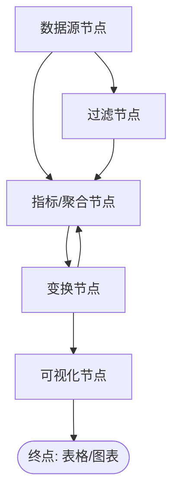
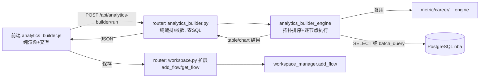

# NBACore Studio v8.3.2 — Analytics Builder（节点式分析构建器）PRD

> 版本：v8.3.2（简单 PRD / SOP 第一阶段产出）
> 角色：产品经理 许清楚（Xu）
> 日期：2026-07-11
> 状态：Draft，待产品 Owner（老程）拍板关键假设
> 上游约束：合约 NBACore_Execution_Contract_v8（PLAN→BUILD→VERIFY→VALIDATE→FIX→LOCK）、四层严格隔离 §6、v8.3.1 Workspace 已 LOCKED 可复用

---

## 1. 产品目标

NBACore Studio 当前提供的是"预设分析页面"（VS、Rankings、Context、Workspace 等）——用户只能被动消费固定视图。懂球的分析师/玩家（如老程）想要的往往是"**把几个数据源和指标按我的想法串起来**"，而这需要写 SQL 或改代码，门槛高、迭代慢。

**Analytics Builder** 让用户无需写 SQL/代码：通过**拖拽节点 + 连线**的可视化方式，把「数据源 → 过滤 → 指标/聚合 → 变换 → 可视化」组合成一条有向无环图（DAG）分析流水线，一键运行后产出表格或图表。它把 v8.3.1 Workspace 沉淀的数据集/公式真正"用起来"，是平台从"看报表"走向"搭分析"的关键一步。

设计原则（来自用户偏好）：**数据质量第一**（运行前做拓扑/参数校验，错误在运行前暴露）；**暗色极简 UI**；**键盘优先**（节点操作可走快捷键）；**一步到位**（API + 前端同版本交付）。

---

## 2. 用户故事

| # | 角色 | 故事 | 验收（Given/When/Then 简化） |
|---|------|------|------------------------------|
| US-1 | 分析师 | 作为分析师，我想从某张表（如球员逐赛季数据）出发，按位置分组、聚合出场数与场均得分，画一张柱状图，看看哪个位置的进攻产出最高。 | Given 我拖入「数据源→聚合→可视化」三个节点并连线，When 我点运行，Then 画布右侧出现对应柱状图。 |
| US-2 | 懂球玩家 | 作为懂球玩家，我想在 v8.3.1 的某个工作区里，复用其已挂载的数据集，加一个"赛季≥2015 且 场均得分>20"的过滤，再排序截断 Top 20，做成折线趋势。 | Given 我打开一个 Workspace 并进入其 Builder，When 我选它的数据集作数据源，Then 无需重新选表即可过滤/排序出图。 |
| US-3 | 分析师 | 作为分析师，我想把搭好的分析流**保存**下来，下次打开工作区能一键还原继续改。 | Given 我已搭好一条流，When 我点保存并命名，Then 它作为工作区资源持久化；再次打开可完整还原节点与连线。 |
| US-4 | 分析师 | 作为分析师，我想**删除/移动/连错就改**——节点能拖动、连线能断开、画布能缩放，方便我试不同组合。 | Given 画布上已有节点，When 我拖动/删除/重连/缩放，Then 视图与底层图结构实时同步且可运行。 |
| US-5 | 懂球玩家 | 作为玩家，我想运行前就知道"这条流合不合法"（比如可视化节点没有上游、过滤条件写错），而不是跑一半报错。 | Given 我搭了一条不完整/有错的流，When 我点运行或保存，Then 系统给出明确的中文校验提示，定位到具体节点。 |

---

## 3. 需求池（P0 / P1 / P2）

> 优先级定义：**P0**=MVP 必做；**P1**=重要、紧随 MVP；**P2**=增强/后续。

### 3.1 节点画布（Canvas）

| ID | 需求 | 优先级 | 说明 |
|----|------|--------|------|
| C-1 | 拖拽放置节点 | P0 | 从左侧节点面板拖拽节点类型到画布即生成实例 |
| C-2 | 节点间连线成 DAG | P0 | 从一个节点的输出端口拖到下游节点输入端口；仅允许形成有向无环图（连成环时拒绝并提示） |
| C-3 | 移动 / 删除节点 | P0 | 拖动节点体移动；选中后 Delete/Backspace 删除节点及其连线 |
| C-4 | 画布平移 / 缩放 | P0 | 空格+拖拽平移，滚轮缩放；或工具栏按钮 |
| C-5 | 选中高亮 + 端口提示 | P0 | 选中节点高亮，悬停端口显示可连类型 |
| C-6 | 撤销 / 重做 | P1 | Ctrl+Z / Ctrl+Shift+Z 还原图操作（满足"键盘优先"） |
| C-7 | 连线删除 / 重新路由 | P1 | 点选连线删除；支持折线/正交走线美化 |
| C-8 | 迷你地图（minimap） | P2 | 大型流程导航 |
| C-9 | 节点对齐辅助线 | P2 | 拖动时显示对齐参考线 |

### 3.2 节点类型（Node Types）

节点分类 Mermaid 图：



| ID | 节点 | 优先级 | 输入 | 输出 | 关键参数（属性面板） |
|----|------|--------|------|------|----------------------|
| N-1 **数据源** | Data Source | P0 | 无 | 表/数据集 | 来源方式：`表直选` 或 `绑定 Workspace 数据集`；选表/选数据集；可选赛季过滤 |
| N-2 **过滤** | Filter | P0 | 表 | 表 | 多条件 AND/OR：字段、运算符（=,≠,>,<,≥,≤,in,like）、值 |
| N-3 **指标/聚合** | Aggregate | P0 | 表 | 聚合表 | 分组维度（group by 字段列表）；聚合项（字段+聚合函数 sum/avg/count/max/min） |
| N-4 **变换** | Transform | P0 | 表 | 表 | 排序（字段+升/降序）；截断 TopN；派生列（新列名=表达式，首版限安全算术） |
| N-5 **可视化** | Visualize | P0 | 表 | 图表/表格 | 类型：表格 / 折线 / 柱状 / 雷达（雷达 P1）；X 轴字段、Y 轴字段/系列 |
| N-6 **派生指标** | Derived Metric | P1 | 无/表 | 标量或列 | 调用 v8.3.1 公式/预设公式生成新指标列 |
| N-7 **联接** | Join | P1 | 两表 | 表 | 两数据源按键 left/inner join（复用多数据集） |
| N-8 **导出** | Export | P2 | 表 | 文件 | 导出 JSON/CSV（复用现有 export 能力） |

### 3.3 属性面板（Properties Panel）

| ID | 需求 | 优先级 | 说明 |
|----|------|--------|------|
| P-1 | 选中节点编辑参数 | P0 | 右侧面板渲染该节点类型的表单；改动实时写入图模型 |
| P-2 | 下拉依赖后端枚举 | P0 | 表列表、字段列表、聚合函数、可视化类型等由 API 提供（前端零计算，仅渲染） |
| P-3 | 参数即时校验 | P0 | 非法参数（如空分组、未知字段）标红并阻止运行 |
| P-4 | 节点标题可改名 | P1 | 画布上节点显示自定义标题 |

### 3.4 运行（Run / Execute）

| ID | 需求 | 优先级 | 说明 |
|----|------|--------|------|
| R-1 | 拓扑排序执行 DAG | P0 | 后端执行器按依赖顺序逐节点计算 |
| R-2 | 节点间中间结果传递 | P0 | 上游输出表作为下游输入表在内存中传递 |
| R-3 | 终点可视化出图/出表 | P0 | 可视化节点结果返回前端，由 echarts 渲染或表格渲染 |
| R-4 | 运行前校验 | P0 | 环检测、无上游的可视化节点、参数缺失等，运行前报中文错误 |
| R-5 | 节点级运行状态 | P1 | 运行中逐节点显示"等待/计算中/完成/失败"状态灯 |
| R-6 | 错误定位到节点 | P0 | 失败时在对应节点上标红并给出原因 |
| R-7 | 运行结果缓存/重跑 | P2 | 相同图结构命中缓存 |

### 3.5 保存 / 加载（Persistence）

| ID | 需求 | 优先级 | 说明 |
|----|------|--------|------|
| SV-1 | 分析流 JSON 持久化 | P0 | 节点数组 + 连线数组 + 参数 + 元信息，存为文档 |
| SV-2 | 挂到 Workspace | P0 | 作为 v8.3.1 Workspace 的新资源类型（类比 charts），复用 `workspace_manager` 链接模式 |
| SV-3 | 加载还原 | P0 | 打开工作区 Builder 时完整还原节点位置、连线、参数 |
| SV-4 | 重命名 / 复制 / 删除 | P1 | 与现有 Workspace 资源操作一致 |
| SV-5 | 导出/导入 JSON 文件 | P2 | 跨环境迁移分析流 |

---

## 4. UI 设计草图

### 4.1 整体布局（文字 + ASCII）

遵循既有 `index.html` 的 `nav + main` 结构，新增 `data-page="analytics-builder"`；主体为三栏 + 顶部工具条 + 底部结果区。

```
┌──────────────────────────────────────────────────────────────────────────┐
│ Sidebar (复用既有 nav)          │  Analytics Builder 工具条 (顶)            │
│  - ...                          │  [工作区 ▼] [保存] [运行 ▶] [撤销][重做]  │
│  - Workspace                    │  [适应画布] [清空] 状态: 就绪/校验失败    │
│  - Analytics Builder  ← 新增    │──────────────────────────────────────────│
│  - ...                          │ ┌────────┬──────────────────────┬──────┐ │
│                                │ │ 左:节点 │   中:节点画布(Canvas)  │右:属性│ │
│                                │ │ 面板    │   ┌──┐    ┌──┐        │面板   │ │
│  数据源                          │ │ [拖我]  │   │数│───▶│聚合│──▶... │ 选中  │ │
│   ├ 数据源                       │ │ [拖我]  │   └──┘    └──┘        │ 节点  │ │
│   ├ 工作区数据集                 │ │ [拖我]  │        ╲   ┌──┐       │ 参数  │ │
│  过滤                          │ │ [拖我]  │         ▶│可视│       │ 表单  │ │
│   ├ 过滤                        │ │ [拖我]  │          └──┘        │      │ │
│  指标/聚合                      │ │ [拖我]  │                       │      │ │
│   ├ 聚合                        │ └────────┴──────────────────────┴──────┘ │
│  变换                          │ │ 底部: 运行结果区 (表格 / echarts 图)    │ │
│   ├ 排序/截断/派生              │ │ ┌────────────────────────────────────┐ │ │
│  可视化                        │ │ │  结果标签: 表 / 折线 / 柱状  + 导出  │ │ │
│   ├ 表格/折线/柱状              │ │ └────────────────────────────────────┘ │ │
└──────────────────────────────────────────────────────────────────────────┘
```

### 4.2 交互说明

| 交互 | 方式 | 备注 |
|------|------|------|
| 放置节点 | 从左侧面板**拖拽**节点类型到画布 | 也可单击节点类型→在画布中心生成 |
| 连线 | 从源节点输出端口（右）拖到目标节点输入端口（左） | 松开时校验是否成环，成环则拒绝+toast |
| 选中 | 单击节点体 / 单击连线 | 选中节点→右侧属性面板显示参数 |
| 移动 | 拖动节点体 | 端口随之移动，连线实时重绘 |
| 删除 | 选中 + `Delete`/`Backspace`（键盘优先） | 同时删除其连线 |
| 平移/缩放 | 画布空白拖拽平移；`Ctrl+滚轮` 或滚轮缩放 | 顶部"适应画布"复位 |
| 运行 | 顶部 `▶ 运行` 按钮（或 `Ctrl+Enter`） | 触发后端 DAG 执行 |
| 保存 | 顶部 `保存` 按钮 | 持久化为 Workspace 资源 |

### 4.3 视觉风格

- 完全沿用现有暗色主题：`--bg-dark`、`--border`、`--text-dim`、`--danger`、`--primary` 等 CSS 变量（见 `frontend/css/style.css`）。
- 节点：圆角卡片，左侧输入端口圆点 + 右侧输出端口圆点；类型用左侧色条区分（数据源=蓝、过滤=灰、聚合=绿、变换=紫、可视化=橙）。
- 连线：SVG `<path>` 正交/贝塞尔曲线，选中高亮。
- 画布背景：点阵网格（CSS 或 SVG pattern），契合"极简"。

---

## 5. 待确认问题（需老程拍板）

### Q1. 节点画布：自建 vs 用库？
- **现状**：前端是 vanilla JS + echarts（CDN），**无构建工具、无 npm 包管理**；且前端"零计算"只渲染。画布本身只负责"渲染 + 交互"（拖拽/连线/缩放），不含计算逻辑。
- **选项 A（推荐）自研轻量 SVG/Canvas**：节点用绝对定位 `<div>`，连线用 SVG `<path>`，缩放/平移用 CSS transform。
  - 优点：零依赖、完全契合暗色极简主题、与现有组件模式一致、无 CDN/打包风险；节点集小（首版 ~5 类），自研成本可控。
  - 缺点：需自己写拖拽/连线/命中检测，约 1–2 天工作量。
- **选项 B 引库（litegraph.js / rete.js vanilla）**：开箱即用的节点编辑器。
  - 优点：连线/缩放开箱即用。
  - 缺点：canvas 渲染风格与暗色 DOM 主题割裂、需额外 CDN、API 心智负担、后续定制受限。
- **推荐：选项 A 自研。** 理由：与 §6 "前端零计算、只渲染"哲学一致，且主题可控、零依赖最稳。

### Q2. 执行模型：服务端 DAG 执行器 vs 前端本地执行？
- **现状**：§6 四层隔离要求 `backend/api/routers/*` **禁止任何 SQL 字符串**；计算/SQL 必须落在 engine 的 `*_queries.py`，经 `db.batch_query` 执行；前端只渲染。
- **选项 A（推荐）服务端执行**：前端把节点图 JSON POST 到 `backend/api/routers/analytics_builder.py`（纯编排），由新引擎 `backend/services/analytics_builder_engine/` 拓扑排序，逐节点调用现有 engine（`metric`/`career`/…）或经 `*_queries.py` 取数/聚合，中间结果在内存传递，终点可视化节点返回 table/chart 数据。
  - 优点：严守 §6（router 无 SQL）；可复用全部既有引擎；前端零计算；便于服务端校验与缓存。
- **选项 B 前端本地执行**：前端直接拼查询、拉数据后在浏览器算。
  - 缺点：违反 §6（计算落到前端）、无法复用 engine、数据安全/口径难统一、与"数据质量第一"冲突。
- **推荐：选项 A 服务端执行。** 路由层只做编排与参数校验，真正计算在 engine。

### Q3. 与 v8.3.1 Workspace 的关系？
- **现状**：Workspace 已 LOCKED，拥有 `datasets`/`formulas`/`charts` 资源，由 `workspace_manager` 门面管理（repository + validator + serializer）。
- **选项 A（推荐）绑定 Workspace**：分析流（Analysis Flow）作为 Workspace 的**新资源类型**，与 charts 平级；进入 Builder 需先选工作区；数据源节点可直接选该工作区已挂载的数据集。
  - 优点：复用 v8.3.1 数据集资产、复用保存/加载/复制/删除模式、符合"资产复用"定位。
- **选项 B 独立存在**：分析流不绑定工作区，全局管理。
  - 缺点：无法复用已沉淀数据集，与 v8.3.1 脱节。
- **推荐：选项 A 绑定 Workspace。** 数据源节点同时支持「表直选」与「选工作区数据集」两种方式，降低迁移成本。

### Q4. 持久化格式：分析流 JSON Schema 草案
草案（供确认/调整）：

```json
{
  "flow": {
    "id": "string|null",
    "name": "string",
    "workspace_id": "int",
    "version": "1",
    "nodes": [
      {
        "id": "n1",
        "type": "source|filter|aggregate|transform|visualize",
        "title": "数据源: 球员赛季",
        "x": 120, "y": 80,
        "params": {
          "source_mode": "table|workspace_dataset",
          "table": "player_seasons",
          "dataset_id": null,
          "season": 2025
        }
      }
    ],
    "edges": [
      { "id": "e1", "from": "n1", "from_port": "out", "to": "n2", "to_port": "in" }
    ],
    "updated_at": "ISO8601"
  }
}
```
落库建议：在 Workspace 体系加 `analysis_flows` 表与链接表（仿 `workspace_charts`），由 `workspace_manager` 暴露 `add_flow/update_flow/remove_flow/get_flow`，`workspace.to_dict()` 增加 `flows` 字段（可选，避免破坏已 LOCKED 结构——也可单独立表不侵入 Workspace 模型）。

### Q5. 首版（P0）节点范围确认
- 建议 P0 仅 5 类：`数据源 / 过滤 / 聚合 / 变换(排序+截断+派生) / 可视化(表格+折线+柱状)`。
- 待确认：是否把「派生指标（调用 v8.3.1 公式）」也压进 P0？它依赖公式引擎联调，若老程接受稍后 P1，MVP 更快交付。

### Q6. 其它需确认
- **键盘快捷键集**：除 Delete / Ctrl+Z / Ctrl+Enter 外，是否需要节点级快捷键（如 `N` 新建、`C` 连线模式）？
- **数据规模上限**：单节点结果行数是否设上限（如 5000 行）以保证前端表格渲染性能？
- **多可视化节点**：一条流是否允许多个终点可视化节点（各自出图）？建议 P0 支持多终点。

---

## 6. 架构落点（供后续架构师/工程师参考，非 PRD 强制）



> 注：以上为产品视角建议，最终以架构师设计为准，但须满足 §6 四层隔离与"路由零 SQL"。

---

## 7. 验收口径（MVP / P0 完成定义）
1. 可在画布拖拽放置 5 类 P0 节点并连线成 DAG（拒绝成环）。
2. 右侧属性面板可编辑选中节点参数，字段/函数等枚举来自后端。
3. 点「运行」后，后端按拓扑顺序执行，终点可视化节点在底部结果区出**表格/折线/柱状**之一。
4. 运行前校验能拦住"成环 / 可视化无上游 / 参数缺失"并中文定位节点。
5. 可将分析流保存到指定 Workspace 并完整加载还原。
6. 全链路无 SQL 出现在 `backend/api/routers/*`（严守 §6）；前端无计算逻辑。
