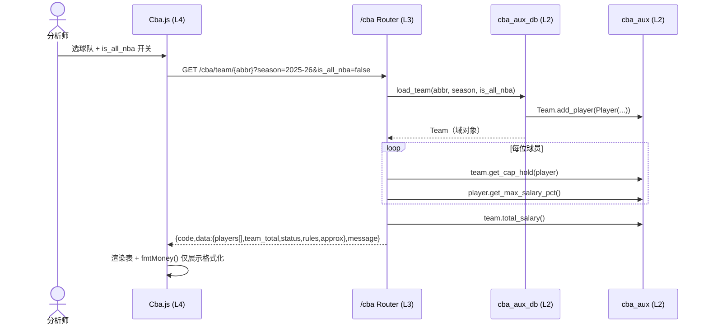
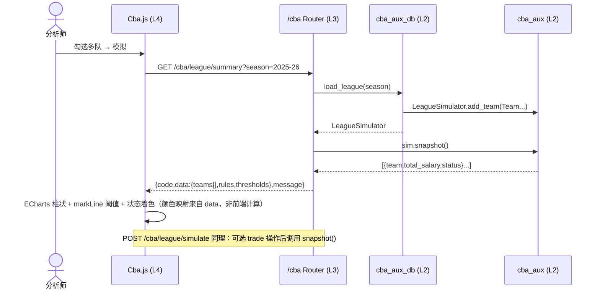
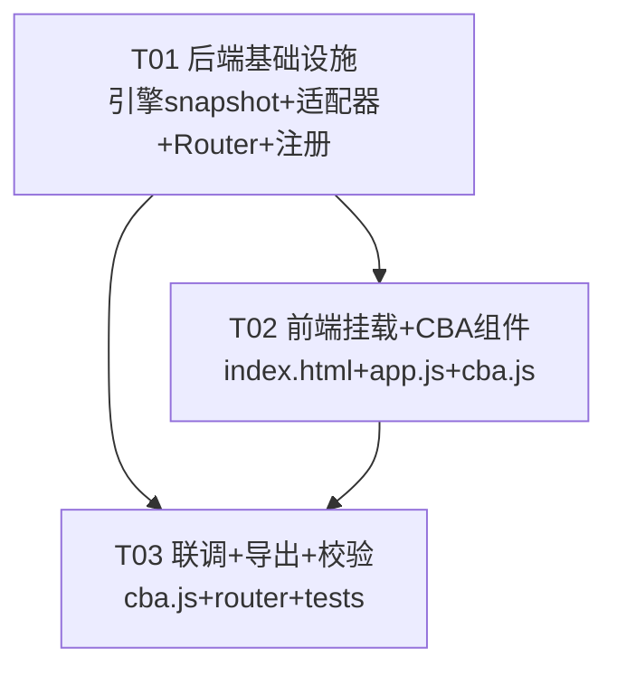

# cba_aux 前端可视化 · 系统架构设计 + 任务分解

> 产出人：架构师 高见远（software-architect）
> 关联 PRD：`cba_aux_frontend_prd.md`（产品经理 许清楚）
> 项目根：`C:/autopick/AutoPick/nba_data/nba_desktop/nba_desktop_omega`
> 语言：中文 ｜ 类型：系统架构设计 + 任务分解
> 依赖决策：主理人 齐活林 已授权 PRD 中 Q2 / Q3 / Q4 / Q5 默认决策，本文档直接采用，不阻塞。

---

## Part A · 系统设计

### 1. 实现方案（Implementation Approach）

#### 1.1 难点分析
- **D1 · 多队数据来源**：`load_league(season)` 已从 `team_payroll` 构造 30 队 `LeagueSimulator`，数据来源已解决，前端无需造数。
- **D2 · 结构化快照缺失**：`LeagueSimulator.season_summary()` 仅 `print`，无结构化返回。需在引擎层**追加非破坏性 `snapshot()`**，供 `/cba/league/summary` 使用（计算必须留在引擎层，见 Q4）。
- **D3 · `is_all_nba` 恒 False**：`load_player` 强制 `is_all_nba=False` → `get_max_salary_pct()` 恒 0.25。采用后端**透传 `is_all_nba` 参数（默认 False）**，前端加手动开关并标注「未接入真实全明星标记，默认按 25%」；不修改既有默认行为之外的逻辑。
- **D4 · 四层隔离（§6）**：router 层禁 SQL 子串、禁薪资计算；计算在 `cba_aux.py`；DB 读取经 `cba_aux_db.py`（零 SQL）；前端零业务计算。

#### 1.2 框架与库选型（沿用现状，**不引 React/Vite**）
| 层 | 选型 | 理由 |
| --- | --- | --- |
| 后端 API | **FastAPI**（既有 `APIRouter`，`prefix="/cba"`） | 与 24 个现有 router 一致，纯编排 |
| 计算引擎 | **Python stdlib**（既有 `cba_aux.py`，零依赖） | 追加 `snapshot()` 即可，不改既有路径 |
| DB 适配 | 既有 `cba_aux_db.py`（经 `trade_engine.db` 封装，零 SQL） | 仅追加可选 `is_all_nba` 参数 |
| 前端框架 | **原生 JS（IIFE + `window.Cba.render`）**（既有模式） | 不引入 React/Vite，遵循现状 |
| 图表 | **ECharts 5（既有 CDN）** | 复用 `echarts.init` + `setOption` + `markLine` |

#### 1.3 架构模式
严格 **四层隔离（v8 §6）**：

```
前端 cba.js (L4 纯渲染)
   │ api()  GET/POST /cba/*
   ▼
/cba router (L3 纯编排：校验入参 + 调引擎/适配器 + 塑形 {code,data,message})
   │
   ├─► cba_aux_db (L2 只读适配：DB→域对象，透传 is_all_nba，零 SQL 子串)
   └─► cba_aux.py (L2 计算：cap_hold / max_pct / total_salary / status 判定)
   │
   ▼
DB (L1，经 trade_engine.db 封装)
```

---

### 2. 文件列表（File List）

#### 新增文件
| 相对路径 | 作用 |
| --- | --- |
| `backend/api/routers/cba_aux.py` | 新增 `/cba` router（L3，纯编排，6 个端点） |
| `frontend/js/components/cba.js` | 新增前端组件 `window.Cba`（L4，三个 Tab） |

#### 修改文件（最小变更，均向后兼容）
| 相对路径 | 改动 |
| --- | --- |
| `backend/services/trade_engine/cba_aux.py` | **仅追加** `LeagueSimulator.snapshot()`（+ 私有 `_team_status()`，供 `snapshot`/`season_summary` 共用）；不删不改既有方法 |
| `backend/services/trade_engine/cba_aux_db.py` | **仅追加** `load_player` / `load_team` 的可选 `is_all_nba: bool = False` 参数（默认仍 False，非破坏）；命中后覆盖 `Player.is_all_nba` |
| `backend/api/routers/__init__.py` | 追加 `cba_aux` 导入 + `__all__` 条目 |
| `backend/app.py` | `create_app()` 中 `app.include_router(cba_aux.router)` |
| `frontend/index.html` | 侧栏加 `nav-item`（data-page="cba"）+ 主区加 `page-cba` div + 底部加 `cba.js` 的 `<script>` |
| `frontend/js/app.js` | `nav()` 加 `cba` 分支 + 新增 `loadCbaPage()` 调 `window.Cba.render('cbaRoot')` |

> 注：`trade_engine/__init__.py` 已导出 `cba_aux` / `cba_aux_db` / `LeagueSimulator` 等，**无需再改**（符合「只追加、不删既有导出」）。

---

### 3. 数据结构与接口（Data Structures and Interfaces）

#### 3.1 类图（Class Diagram）

```mermaid
classDiagram
    class SalaryCapRules {
        +int base_cap
        +int luxury_tax_line
        +int first_apron
        +int second_apron
        +int min_team_salary
        +__post_init__()
    }
    class Player {
        +str name
        +int salary
        +int yos
        +bool is_all_nba
        +int contract_years_left
        +str bird_rights_with_team
        +float get_max_salary_pct()
    }
    class Team {
        +str name
        +Dict~str,Player~ roster
        +Dict~str,int~ cap_holds
        +bool is_repeat_luxury_payer
        +add_player(p)
        +int total_salary()
        +int get_cap_hold(p)
        +to_dict()
        +from_dict(d)
    }
    class LeagueSimulator {
        +Dict~str,Team~ teams
        +SalaryCapRules rules
        +add_team(t)
        +season_summary()
        +save_league(path)
        +load_league(path)
        +dict snapshot()  «NEW 追加»
        -str _team_status(total)  «NEW 追加»
    }
    class CbaAuxRouter {
        «FastAPI L3»
        +GET /cba/rules
        +GET /cba/team/{abbr}
        +GET /cba/player/{abbr}/{name}
        +GET /cba/league/summary
        +POST /cba/league/simulate
        +GET /cba/league/export
    }
    class CbaAuxDbAdapter {
        +load_salary_rules(season)
        +load_player(abbr,name,season,is_all_nba)  «EXT 追加参数»
        +load_team(abbr,season,is_all_nba)  «EXT 追加参数»
        +load_league(season)
    }
    class CbaFrontend {
        «window.Cba L4»
        +render(id)
        +renderRules()
        +renderTeam()
        +renderLeague()
    }
    LeagueSimulator "1" *-- "0..30" Team : teams
    Team "1" *-- "0..*" Player : roster
    CbaAuxRouter ..> CbaAuxDbAdapter : 调 L2
    CbaAuxRouter ..> LeagueSimulator : 调 L2
    CbaAuxDbAdapter ..> Player : 构造
    CbaAuxDbAdapter ..> Team : 构造
    CbaAuxDbAdapter ..> SalaryCapRules : 构造
    CbaFrontend ..> CbaAuxRouter : api() /cba/*
```

#### 3.2 端点 Request / Response JSON Schema

**统一响应信封**：`{ "code": 0, "data": <见下>, "message": "ok" }`（错误时 `code != 0` + `message` 描述；router 捕获异常转 `HTTPException`）。

**① GET `/cba/rules?season=2025-26`**
```json
{ "code":0, "data": {
  "season":"2025-26",
  "base_cap":168000000,
  "luxury_tax_line":204120000,
  "first_apron":210120000,
  "second_apron":221620000,
  "min_team_salary":151200000
}, "message":"ok" }
```

**② GET `/cba/team/{team_abbr}?season=2025-26&is_all_nba=false`**
```json
{ "code":0, "data": {
  "team_abbr":"GSW",
  "season":"2025-26",
  "team_total":210000000,
  "status":"FIRST_APRON",
  "rules": { "base_cap":168000000, "luxury_tax_line":204120000, "first_apron":210120000, "second_apron":221620000, "min_team_salary":151200000 },
  "players": [
    { "name":"Stephen Curry", "salary":62000000, "yos":17,
      "bird_factor":1.5, "cap_hold":93000000, "max_pct":0.25,
      "basis": { "yos":17, "is_all_nba":false } }
  ],
  "approx": { "yos_heuristic":true, "is_all_nba_unverified":true }
}, "message":"ok" }
```
> `bird_factor` ∈ {1.5, 1.25, 1.2}；`status` ∈ {HEALTHY, LUXURY_TAX, FIRST_APRON, SECOND_APRON}；`approx` 必在 UI 显式标注。

**③ GET `/cba/player/{team_abbr}/{player_name}?season=2025-26&is_all_nba=false`**
```json
{ "code":0, "data": {
  "team_abbr":"GSW", "name":"Stephen Curry", "salary":62000000,
  "yos":17, "is_all_nba":false,
  "bird_factor":1.5, "cap_hold":93000000, "max_pct":0.25,
  "basis": { "yos":17, "is_all_nba":false },
  "approx": { "yos_heuristic":true, "is_all_nba_unverified":true }
}, "message":"ok" }
```

**④ GET `/cba/league/summary?season=2025-26`**
```json
{ "code":0, "data": {
  "season":"2025-26",
  "rules": { "...": "同 ①" },
  "thresholds": { "base_cap":168000000, "luxury_tax_line":204120000, "first_apron":210120000, "second_apron":221620000 },
  "teams": [
    { "team":"GSW", "total_salary":210000000, "status":"FIRST_APRON" },
    { "team":"LAL", "total_salary":190000000, "status":"HEALTHY" }
  ]
}, "message":"ok" }
```
> `teams` 含全部 30 队（由 `load_league` 构造）。

**⑤ POST `/cba/league/simulate`**（P1）
```json
// request body:
{ "season":"2025-26",
  "team_abbrs":["GSW","LAL"],
  "trade": null
  // 可选: "trade": {"team_a":"GSW","team_b":"LAL","players_a_to_b":["..."],"players_b_to_a":["..."]}
}
// response data: 同 ④ 的 teams 形状，但仅含 team_abbrs 所选队（含可选 trade 操作后状态）
```

**⑥ GET `/cba/league/export?season=2025-26`**（P2）
```json
{ "code":0, "data": {
  "rules": { "...": "同 ①" },
  "teams": { "GSW": {"name":"GSW","roster":{...},"cap_holds":{...},"is_repeat_luxury_payer":false}, "...": {...} }
}, "message":"ok" }
```
> `data` 即 `LeagueSimulator.to_dict()` 结构；前端据此生成 JSON blob 下载（零后端写）。

---

### 4. 程序调用流程（Program Call Flow）

#### 4.1 球队/Bird&Max 视图（前端 → router → adapter → engine）


#### 4.2 联盟模拟 / 汇总（前端 → router → adapter → engine）


---

### 5. 待明确事项（Anything UNCLEAR，均为非阻塞）

- **U1（Q1 路径偏差）**：已确认以实际位置 `backend/services/trade_engine/cba_aux.py` 为准，无需迁移。
- **U2（Q6 赛季对齐）**：cba 端点统一使用 `'YYYY-YY'`（如 `'2025-26'`）格式字符串，与 `cba_aux_db.DEFAULT_SEASON` 一致；`cba.js` 自带赛季选择器默认 `'2025-26'`，不复用其他页的纯数字年选择器。
- **U3（Q7 持久化/分享）**：P2 采用**前端 blob 下载 JSON**（零后端写，符合 §6）；服务端存档返回 share id **不在本范围**（需走 §6 写层评估），列为后续。
- **U4（P1-3 交易执行）**：`/cba/league/simulate` 的 `trade` 字段为**可选**；核心交付为「多队勾选 + 状态对比」，交易执行作为增强，时间允许再实现。
- **U5（真实 All-NBA 来源）**：DB 无该字段，手动开关仅覆盖展示判定，不伪造数据；UI 必标注「未接入」。

---

## Part B · 任务分解

### 6. 依赖包（Required Packages）

> **无新增第三方包**。全部沿用既有依赖：
```
- fastapi           # 既有，router 编排（APIRouter / Query / HTTPException）
- pydantic          # 既有（随 fastapi 安装），仅用于 POST /cba/league/simulate 请求体模型
- 标准库 json / dataclasses / typing   # cba_aux.py snapshot() 使用
- ECharts 5.5.0     # 前端 CDN 既有，复用，不新增
```
> 金额约定：全链路 `int`（美元整数），前端仅 `fmtMoney(int→$X.XM)` 展示格式化。

### 7. 任务列表（按实现顺序，含依赖）

#### T01 · 后端基础设施：引擎快照 + 适配器透传 + /cba Router 全端点 + 注册
- **Task ID**：T01
- **Task Name**：后端内核与 Router 基础设施
- **Source Files**：
  - `backend/services/trade_engine/cba_aux.py`（追加 `snapshot()` + `_team_status()`）
  - `backend/services/trade_engine/cba_aux_db.py`（追加 `is_all_nba` 可选参数）
  - `backend/api/routers/cba_aux.py`（**新建**，6 端点）
  - `backend/api/routers/__init__.py`（注册导入）
  - `backend/app.py`（`include_router`）
- **Dependencies**：无
- **Priority**：P0

#### T02 · 前端挂载 + CBA 组件（三个 Tab）
- **Task ID**：T02
- **Task Name**：前端页面挂载与 CBA 组件
- **Source Files**：
  - `frontend/index.html`（nav-item + page-cba div + script 标签）
  - `frontend/js/app.js`（nav 分支 + `loadCbaPage()`）
  - `frontend/js/components/cba.js`（**新建** `window.Cba`：renderRules / renderTeam / renderLeague）
- **Dependencies**：T01
- **Priority**：P0

#### T03 · 联调、JSON 导出与边界校验
- **Task ID**：T03
- **Task Name**：集成联调与导出收尾
- **Source Files**：
  - `frontend/js/components/cba.js`（导出 JSON 按钮 + 联盟图阈值线/状态着色打磨）
  - `backend/api/routers/cba_aux.py`（`/export`、`/simulate` 终校 + 异常分支）
  - `tests/test_cba_aux_router.py`（**新建** 冒烟测试：6 端点返回结构 + 信封）
- **Dependencies**：T01、T02
- **Priority**：P1

### 8. 共享知识（Shared Knowledge，跨文件约定）

- **§6 四层隔离**：
  - L3 router：仅校验入参 + 调 L2 + 塑形 `{code,data,message}`；**禁 SQL 子串、禁薪资计算**。
  - L2 engine（`cba_aux.py`）：`cap_hold`/`max_pct`/`total_salary`/`status` 判定全部在此；新 `snapshot()` 也在此。
  - L2 adapter（`cba_aux_db.py`）：经 `trade_engine.db` 只读，**零 SQL**；`is_all_nba` 仅作透传参数，不计算。
  - L4 前端：**零业务计算**；阈值与状态判定一律来自 API；仅 `fmtMoney(int→$X.XM)` 展示格式化。
- **金额约定**：全链路 `int`（美元整数），前端格式化展示，不传字符串金额。
- **状态枚举**：`HEALTHY` / `LUXURY_TAX` / `FIRST_APRON` / `SECOND_APRON`（引擎 `_team_status` 与 router 共用，顺序：second_apron > first_apron > luxury_tax_line）。
- **近似必标注**：`yos = age - 19`（启发式）、`is_all_nba` 默认 False（未接入真实标记）；每个含球员/球队的响应带 `approx` 字段，前端在表头/脚注显式标注。
- **响应信封**：`{code:0, data, message:"ok"}`；非 0 即错误。
- **赛季格式**：cba 端点用 `'YYYY-YY'`（如 `'2025-26'`），`cba.js` 选择器默认 `'2025-26'`。
- **最小变更纪律**：`cba_aux.py` 只追加、不删不改既有；`__init__.py` 已导出无需动；`trade` router 等现有模块零改动。

### 9. 任务依赖图（Task Dependency Graph）


