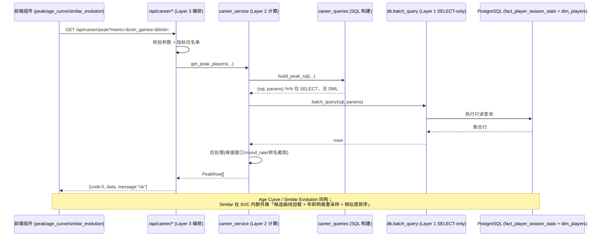
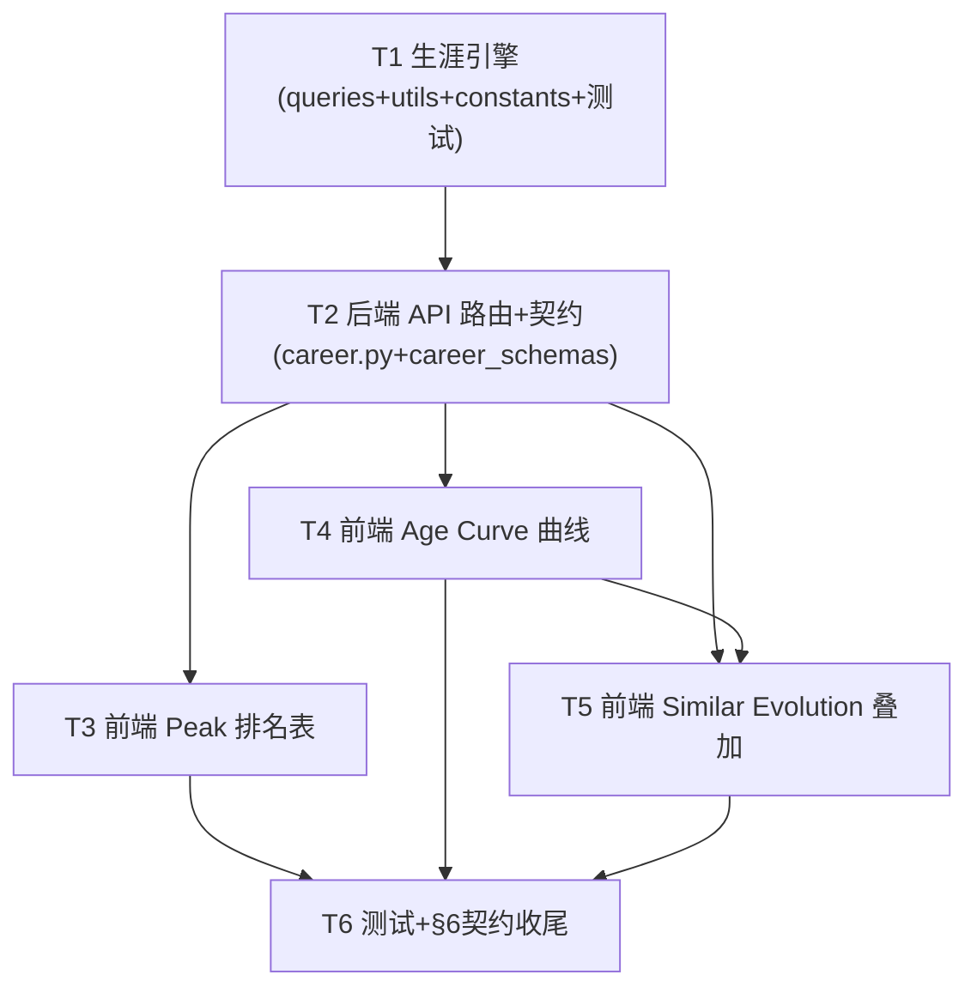

# NBACore Studio v8.2-C — Peak / Age Curve / Similar Evolution 增量架构设计

> **文档版本**：v1.0（增量设计 + 有序任务列表，仅设计、不改源码）
> **作者**：架构师（general-purpose-1）
> **关联**：`clutch_analysis_incremental_prd.md`（仅覆盖 Clutch）、`backend/services/clutch_engine/*`、`frontend/js/components/clutch.js`、`docs/system_design.md`
> **范围**：v8.2-C 第一刀 Clutch **已实现**后，剩余三块高级分析功能的**增量设计**：
> 1. **Peak**（巅峰期 / 高峰表现分析）
> 2. **Age Curve**（年龄曲线）
> 3. **Similar Evolution**（相似球员进化轨迹）

---

## 0. 来源标注约定

| 标记 | 含义 |
|---|---|
| **来自 PRD** | 口径/需求在 `clutch_analysis_incremental_prd.md` 或既有代码中已明确 |
| **设计假设** | PRD 未细化 Peak/Age/Similar，由本设计基于 NBA 领域常识 + clutch_engine 模式自行定义 |

> ⚠️ **重要前提**：既有增量 PRD **只覆盖 Clutch**。Peak / Age Curve / Similar Evolution 三块在 PRD 中**均无细化需求**，因此本文档中这三块的口径、数据源、前端形态**全部为「设计假设」**，已在各节显式标注，待产品/主理人拍板。

---

## 1. 决策摘要（先看这里）

| 维度 | 决策 | 理由 / 依据 |
|---|---|---|
| 数据源 | **`fact_player_season_stats`（生涯逐季聚合，含 `age`）+ `dim_players`（姓名/生日）**，**不是** `play_by_play` | Clutch 用 `play_by_play` 是事件级；Peak/Age/Similar 是**生涯级**，既有 `growth_loader.py` 已证实该表是生涯轨迹唯一权威源（见 `backend/data_layer/growth_loader.py:18`） |
| 引擎组织 | **单一共享引擎包 `backend/services/career_engine/`**（queries/service/utils/constants），而非 3 个独立包 | 三块共用：生涯表、年龄网格、相似度算法、`TOT` 排除、`min_games` 阈值；合并可避免工具三重复制（**设计假设**，偏离 clutch「一特征一包」但更经济） |
| 路由 | **`backend/api/routers/career.py`** 单文件 3 端点（`/peak`、`/age-curve`、`/similar-evolution`），纯编排、零 SQL | 对齐 §6（路由层禁含 SQL 字符串）；单路由聚合三端点更整洁 |
| 响应风格 | 沿用 **Clutch 信封 `{code,data,message}`**（**设计假设**） | 与 Clutch 同属「分析家族」保持一致；备选：直接 Pydantic（players.py 风格） |
| 前端 | 3 个 vanilla IIFE 组件 `peak.js` / `age_curve.js` / `similar_evolution.js`；曲线图用已引入的 **echarts** | 与 `clutch.js` 同模式；echarts 已通过 CDN 引入（`index.html:8`） |
| 玩家定位 | 复用既有 `GET /players?name=` 搜索端点拿 `player_id`（Age/Similar 需要） | Growth 页已用同机制（`app.js:215 searchPlayer`） |
| 相似度算法 | 默认 **Pearson 相关（对齐到统一年龄网格 [18,42] + 线性插值）**，得分归一化到 [0,1] | 纯 Python、零依赖（scipy 不可用假设）；DTW 作 P2 增强 |
| 年龄来源 | 优先用 `fact_player_season_stats.age`（BR 已算好）；缺值时 `age_in_season(birth_date, season)` 兜底 | 见「跨文件共享约定」 |

---

# Part A：系统设计

## 2. 实现方案 + 框架选型

### 2.1 关键架构事实（已探明）

1. **四层隔离 §6**：前端 → API（仅编排，禁含裸 SQL 子串 `"SELECT "`/`"INSERT "`/`"UPDATE "`/`"DELETE "` 带尾随空格）→ 指标引擎（计算）→ 数据层（`db.batch_query` 仅 SELECT）。路由层 ≠ 计算层。**Clutch 已验证该模式可行**：SQL 全在 `clutch_queries.py`，`clutch.py` 路由零 SQL、≤200 行。
2. **生涯数据源已存在**：`backend/data_layer/growth_loader.py` 的 `get_player_career_stats(player_id)` 已从 `fact_player_season_stats` 取生涯逐季数据（字段含 `season, age, team, pos, g, pts, per, ts_percent, usg_percent, ws, bpm, vorp, orb_percent, drb_percent, ...`），并排除 `TOT/2TM/3TM`。`dim_players` 含 `player_id, player_name, full_name, birth_date, ...`。
3. **类似度/画像已有先例**：`backend/services/intelligence_engine/player_dna.py`（7 维 DNA 向量）、`role_classification.py`、`scoring_profile.py` 均已做「从赛季指标推导特征向量」的工作，可借鉴其指标口径。
4. **前端组件契约**：`clutch.js` 暴露 `window.Clutch.render('rootId')`，内部 `api()` 拉数、`escapeHtml()` 防注入、`toast()` 报错；曲线图用 `echarts`（全局 `echarts` 对象）。页面通过 `index.html` 的 `<div class="page" id="page-xxx">` + `app.js` 的 `nav('xxx')`/`loadXxxPage()` 挂载。

### 2.2 框架与库

- **前端**：原生 ES（IIFE + `window.*`），`echarts`（已引入）。**不引入** React/D3/dayjs 等新库。
- **后端**：FastAPI + Pydantic（已用）。相似度/插值用**纯 Python**（不引入 numpy/scipy/pandas；引擎层允许 pandas 但本设计刻意零依赖以保持与 clutch 一致、易测）。
- **聚合位置**：全部在 `career_engine`（引擎层）+ `db.batch_query`（数据层）。路由零计算。

### 2.3 三块功能定义（全部为「设计假设」）

#### 2.3.1 Peak（巅峰期）

- **定义**：对每个球员计算其生涯中某指标的**峰值单季值**，再对所有球员按该峰值排名 → Top N 榜单。
- **双视图**：
  - **A. 联盟巅峰榜（P0）**：`GET /peak`，返回按峰值降序的球员榜（默认 `pts_per_game`，可切 `per`/`ws`/`vorp`/`ts_percent`/`bpm`）。
  - **B. 单球员巅峰详情（P1）**：`GET /age-curve?player_ids=` 已含轨迹，前端标记峰值点即可，无需独立端点。
- **筛选**：`metric`（指标白名单）、`min_games`（默认 20，过滤小样本赛季）、`position`（P1）、`era`（P1，如 2010s）。
- **去噪**：排除 `TOT/2TM/3TM`；仅统计 `g >= min_games` 的赛季再取峰值。

#### 2.3.2 Age Curve（年龄曲线）

- **定义**：给定 `player_id(s)`，以 `age` 为 X 轴、选定指标为 Y 轴，绘制生涯轨迹曲线，直观展示「何时巅峰 / 衰退斜率」。
- **数据源**：`fact_player_season_stats.age`（**已存在**，无需由 `birth_date` 推算）。
- **多球员对比（P0）**：`player_ids` 支持 1..N（逗号分隔），echarts 叠加多条线。
- **返回**：每球员 `{player_id, player_name, curve:[{season, age, value, team}], peak_age}`。

#### 2.3.3 Similar Evolution（相似球员进化轨迹）

- **定义**：给定目标 `player_id`，在所有候选球员中找出 K 个**生涯轨迹（age→指标 曲线）最相似**者，按相似度排序返回，供叠加对比。
- **特征向量**：统一年龄网格 `[18,42]` 上的指标序列（缺失年龄线性插值填充）。
- **相似度算法（默认 Pearson）**：
  - `pearson(target, cand)` → 归一到 `[0,1]`：`score = (pearson + 1) / 2`。
  - 备选 `cosine` / `euclidean`（z-score 后 1 - 归一距离），由 `algorithm` 参数选择（**设计假设**）。
  - **DTW（P2）**：处理不同生涯长度/峰值年龄的对齐，纯 Python 实现（小 n 可接受）。
- **候选集降噪（默认）**：按目标球员 `position` 预过滤 + 要求 `seasons >= 3` + `g >= min_games`，避免跨位置/短生涯噪声（**设计假设**，可 `same_position=false` 放开）。
- **返回**：`{target:{...curve}, similar:[{player_id, player_name, similarity, curve, peak_age}]}`。

---

## 3. 文件清单（标注 新增 / 修改）

### 后端

| 文件 | 状态 | 说明 |
|---|---|---|
| `backend/services/career_engine/__init__.py` | **新增** | 包导出 `career_queries, career_service, career_utils, career_constants` |
| `backend/services/career_engine/career_constants.py` | **新增** | 表名、指标白名单 `METRIC_WHITELIST`（含 `higher_is_better`）、`AGE_GRID=range(18,43)`、`EXCLUDED_TEAMS=('TOT','2TM','3TM','4TM')`、默认 `MIN_GAMES` |
| `backend/services/career_engine/career_queries.py` | **新增** | **所有只读 SELECT 构建器**（严禁在路由出现 SQL）：`build_peak_sql`、`build_age_curve_sql`、`build_similar_candidates_sql`，复用 `career_utils` 片段（`TOT` 排除、`min_games`、指标白名单校验、年龄插值表达式） |
| `backend/services/career_engine/career_utils.py` | **新增** | 纯函数：`age_in_season(birth_date, season)`、`resample_curve_to_grid(rows, grid)`、`similarity_score(t, c, method)`（pearson/cosine/euclidean）、`round_rate`（复用 clutch 同名逻辑，避免跨包依赖） |
| `backend/services/career_engine/career_service.py` | **新增** | 编排 + 后处理：调 `db.batch_query` → 计算峰值/年龄曲线/相似度排序；不含 SQL、不含 pandas |
| `backend/api/routers/career.py` | **新增** | 3 端点 `/peak`、`/age-curve`、`/similar-evolution`，纯编排、零 SQL、≤200 行；信封 `{code,data,message}` |
| `backend/api/routers/career_schemas.py` | **新增** | 请求/响应 Pydantic 模型（`PeakQuery`、`PeakRow`、`AgeCurveQuery`、`AgeCurvePlayer`、`SimilarQuery`、`SimilarResponse` 等） |
| `backend/app.py` | **不变** | 新路由在 `routers/__init__.py` 已注册机制下自动挂载（同 clutch）；若需手动 include 则小改 |
| `backend/tests/test_career_engine.py` | **新增** | 引擎单测：年龄插值、相似度（pearson 已知向量）、峰值窗口、TOT 排除、min_games |
| `backend/tests/test_career_api.py` | **新增** | 端点集成 + `TestLayerIsolation` 兼容（路由无 SQL/无 pandas/≤200 行） |

### 前端

| 文件 | 状态 | 说明 |
|---|---|---|
| `frontend/js/components/peak.js` | **新增** | `window.Peak.render('peakRoot')`：筛选器（metric/min_games/limit）+ Top N 排名表（列：#/球员/巅峰赛季/巅峰年龄/球队/峰值值/次优值） |
| `frontend/js/components/age_curve.js` | **新增** | `window.AgeCurve.render('ageCurveRoot')`：玩家搜索框（复用 `api('/players?name=')`）→ `player_id(s)`；echarts 折线（X=age, Y=metric），多球员叠加 |
| `frontend/js/components/similar_evolution.js` | **新增** | `window.SimilarEvo.render('similarEvoRoot')`：目标球员搜索 + 算法选择；echarts 叠加（目标实线高亮）+ 相似度排名列表 |
| `frontend/index.html` | **修改** | ① `<nav>` 新增 3 个 `nav-item`（`peak`/`age-curve`/`similar-evolution`）；② 新增 3 个 `<div class="page" id="page-xxx">`；③ 末尾 `<script>` 引入 3 个新组件（置于 `app.js` 之前或之后均可，但需在 `nav()` 调用前加载） |
| `frontend/js/app.js` | **修改** | ① `nav()` 分发新增 3 个 page key；② 新增 `loadPeakPage()`/`loadAgeCurvePage()`/`loadSimilarEvoPage()` 调各组件 `render`；③ 复用既有 `searchPlayer` 模式提供 player_id |
| `frontend/css/style.css` | **修改** | 新增排名表/筛选器/echarts 容器（`.chart-box`）基础样式（复用 clutch 既有 `.card`/`.tbl`/`.select`/`.input`） |

---

## 4. 接口 / 数据结构表

> 三端点统一前缀 `/api/career`。响应信封 `{code:0, data:<见下>, message:"ok"}`。

### 4.1 Peak — `GET /api/career/peak`

**请求参数**（Query）

| 参数 | 类型 | 默认 | 说明 |
|---|---|---|---|
| `metric` | str | `pts_per_game` | 白名单：`pts_per_game`/`per`/`ws`/`vorp`/`ts_percent`/`bpm`（**设计假设**） |
| `min_games` | int | `20` | 取峰值前，单季 `g >= min_games` 才计入 |
| `position` | str? | 无 | P1：按位置过滤候选（`PG/SG/SF/PF/C`） |
| `era` | str? | 无 | P1：年代过滤（如 `2010s`） |
| `limit` | int | `30` | 返回行数上限（1–100） |

**返回行字段**（`data: PeakRow[]`）

| 字段 | 类型 | 说明 |
|---|---|---|
| `rank` | int | 排名（1 起） |
| `player_id` | str | BBR id |
| `player_name` | str | 来自 `dim_players` |
| `peak_value` | float | 该球员生涯峰值单季 `metric` |
| `peak_season` | int | 峰值所在赛季 |
| `peak_age` | float? | 峰值赛季年龄（来自 `age`） |
| `peak_team` | str? | 峰值赛季球队 |
| `second_value` | float? | 次优单季值（上下文参考） |
| `seasons_played` | int | 符合 `min_games` 的赛季数 |

### 4.2 Age Curve — `GET /api/career/age-curve`

**请求参数**

| 参数 | 类型 | 默认 | 说明 |
|---|---|---|---|
| `player_ids` | str | 必填 | 逗号分隔 1..N 个 BBR id（如 `jamesle01,curryan01`） |
| `metric` | str | `pts_per_game` | 同 Peak 白名单 |
| `min_games` | int | `1` | 单季最少出场（单球员默认 1，保留全部赛季） |

**返回结构**（`data: { players: AgeCurvePlayer[] }`）

```jsonc
AgeCurvePlayer {
  player_id: str,
  player_name: str,
  team_last: str?,           // 最近赛季球队（图例用）
  peak_age: float?,          // 该指标峰值所在年龄
  curve: [ { season:int, age:float, value:float, team:str? } ]  // 按 age 升序
}
```

### 4.3 Similar Evolution — `GET /api/career/similar-evolution`

**请求参数**

| 参数 | 类型 | 默认 | 说明 |
|---|---|---|---|
| `player_id` | str | 必填 | 目标球员 BBR id |
| `metric` | str | `pts_per_game` | 轨迹指标（白名单） |
| `top_k` | int | `5` | 返回最相似球员数（1–20） |
| `min_games` | int | `20` | 候选赛季最少出场 |
| `same_position` | bool | `true` | 候选是否限定同位置（降噪） |
| `algorithm` | str | `pearson` | `pearson`/`cosine`/`euclidean` |
| `min_seasons` | int | `3` | 候选最少赛季数 |

**返回结构**（`data: SimilarResponse`）

```jsonc
SimilarResponse {
  target: { player_id, player_name, curve:[{age,value}], peak_age },
  similar: [
    { player_id, player_name, similarity:float/*[0,1]*/, peak_age,
      curve:[{age,value}] }
  ]   // 按 similarity 降序
}
```

> 所有 `value`/`similarity` 为 `null` 时前端显示 `—`；空候选集返回 `similar:[]` + 提示「暂无足够相似球员」。

### 4.4 前端组件签名（契约）

```javascript
// peak.js
window.Peak = { render(rootId){}, reload(){} };

// age_curve.js
window.AgeCurve = { render(rootId){}, reload(){} };  // 内部调 api('/players?name=')

// similar_evolution.js
window.SimilarEvo = { render(rootId){}, reload(){} };
```

---

## 5. 程序调用流程（时序图）



> **Similar Evolution 额外步骤**（在 `career_service` 内）：① 取目标曲线 → ② `build_similar_candidates_sql` 取同位置候选全部曲线 → ③ `resample_curve_to_grid` 对齐到 `AGE_GRID` → ④ `similarity_score` 逐人计算 → ⑤ 取 `top_k` 降序。全过程无 pandas、无 SQL 在路由。

---

## 6. 跨文件共享约定（Shared Knowledge）

- **响应信封**：沿用 Clutch `{code,data,message}`（**设计假设**，备选 players.py 直返 Pydantic）。
- **指标白名单**：唯一真相源 `career_constants.METRIC_WHITELIST = {name: {label, higher_is_better}}`。Peak 排名方向、Age/Similar 的 Y 轴含义都读它；前端下拉选项也由它生成（避免前后端各写一份）。
- **年龄网格**：`career_constants.AGE_GRID = range(18, 43)`。Similar 重采样统一用此网格；`resample_curve_to_grid` 用线性插值，首尾外推用最近值（**设计假设**）。
- **相似度**：`career_utils.similarity_score(t, c, method) -> [0,1]`。pearson 归一到 `(r+1)/2`；euclidean/cosine 用 z-score 后 `1 - d/max_d`（**设计假设**）。无 scipy 依赖。
- **TOT 排除**：`career_constants.EXCLUDED_TEAMS`，SQL 统一 `team NOT IN (...)`（复用 growth_loader 口径）。
- **年龄来源**：优先 `fact_player_season_stats.age`；仅当该列为空时用 `age_in_season(birth_date, season)` 兜底（兜底路径需在实现时 `SELECT` 验证 `age` 是否真有空值，见待明确 ⑤）。
- **玩家定位**：Age/Similar 的 `player_id` 来自前端调 `api('/players?name=' + q)`（复用 `searchPlayers` 端点，返回 `player_id`/`player_name`）。
- **空态/错误**：任一区块无数据 → 前端显示「暂无数据」；后端返回空 `data` 数组（不抛 500）。API 异常 → 信封 `code!=0` + `message`，前端 `toast()` 提示。
- **round_rate**：`career_utils.round_rate` 与 `clutch_utils.round_rate` 同实现，独立副本（避免跨包 import，保持引擎自治、可单测）。
- **echarts 容器**：曲线图用 `.chart-box`（`min-height:360px`），`window.addEventListener('resize', chart.resize)` 防变形。

---

## 7. 待明确事项（Open Questions）

1. **巅峰口径**：默认「生涯峰值单季值」排名。**是否还要「连续 N 季平均峰值」口径？** 默认单季峰值（**设计假设**）。
2. **Similar 候选范围**：默认同位置 + `seasons>=3` 预过滤。**是否放开跨位置对比？** 默认同位置（**设计假设**）。
3. **指标白名单**：`pts_per_game/per/ws/vorp/ts_percent/bpm` 是否足够？是否补 `trb_per_game/ast_per_game`？默认上述 6 项（**设计假设**）。
4. **响应风格**：信封 vs 直返 Pydantic。**推荐信封**（与 Clutch 一致），需拍板（**设计假设**）。
5. **`age` 列完整性**：`fact_player_season_stats.age` 是否全量非空？若缺，需 `birth_date` 兜底——实现时先 `SELECT COUNT(*) WHERE age IS NULL` 验证（**设计假设** + 待验证）。
6. **相似度默认算法**：pearson（默认）vs DTW（P2）。确认默认（**设计假设**）。
7. **前端落点**：新增 3 个独立 nav 项（与 clutch 平级）vs 并入 Growth 页做 Tab。**推荐独立 nav 项**（**设计假设**）。
8. **Similar 性能**：全量候选曲线加载的内存/耗时，需实现时压测；位置预过滤已默认开启以收敛候选集（**设计假设** + 待压测）。
9. **赛季范围**：Peak/Similar 是否限定某赛季区间（如仅现代 NBA）？默认全生涯（跨赛季），`era` 作 P1 可选（**设计假设**）。

---

# Part B：任务分解（有序、含依赖）

> 原则：前端严格**依赖后端 API 契约**（先 T1→T2 定契约，再 T3/T4/T5 前端）；引擎计算与相似算法在 T1 一次性落地，前端仅渲染。

## 8. 依赖包

**无新增依赖。** 前端 vanilla JS + echarts（已引入）；后端 FastAPI + Pydantic（已用）；相似度/插值纯 Python（零依赖）。

## 9. 任务列表（按实现顺序）

### T1 — 生涯引擎：SQL 构建 + 计算工具 + 常量  ⭐ P0
- **Source Files**：`backend/services/career_engine/{__init__,career_constants,career_queries,career_utils}.py`(新)、`backend/tests/test_career_engine.py`(新)
- **Dependencies**：无
- **子项**：
  - `career_constants`：`METRIC_WHITELIST`、`AGE_GRID`、`EXCLUDED_TEAMS`、默认 `MIN_GAMES`
  - `career_queries`：`build_peak_sql`（峰值窗口 `ROW_NUMBER() OVER (PARTITION BY player_id ORDER BY metric DESC)` + JOIN `dim_players` 取 name + `TOT` 排除 + `min_games`）、`build_age_curve_sql`（按 `player_ids` 取 `season,age,metric,team`）、`build_similar_candidates_sql`（同位置候选全曲线）
  - `career_utils`：`age_in_season`、`resample_curve_to_grid`、`similarity_score`（pearson/cosine/euclidean）、`round_rate`
  - 单测：插值正确、pearson 已知向量得分、峰值窗口去 TOT、min_games 生效
- **Priority**：P0

### T2 — 后端 API 路由 + 契约模型  ⭐ P0
- **Source Files**：`backend/api/routers/career.py`(新)、`backend/api/routers/career_schemas.py`(新)、`backend/app.py`(按需小改)
- **Dependencies**：T1
- **子项**：
  - `/peak`、`/age-curve`、`/similar-evolution` 三端点，纯编排调 `career_service`
  - `career_schemas`：请求/响应模型；`metric` 用白名单正则校验
  - **§6 校验**：路由零 SQL / 零 pandas / 零计算 / ≤200 行；信封 `{code,data,message}`
- **Priority**：P0

### T3 — 前端 Peak 组件 + 排名表  ⭐ P0
- **Source Files**：`frontend/js/components/peak.js`(新)、`frontend/index.html`(改)、`frontend/js/app.js`(改)、`frontend/css/style.css`(改)
- **Dependencies**：T2（API 契约）
- **子项**：
  - 筛选器（metric/min_games/limit）+ Top N 排名表渲染（复用 clutch 表格样式）
  - nav 项 + page div + script 引入 + `loadPeakPage()`
- **Priority**：P0

### T4 — 前端 Age Curve 组件 + echarts 曲线  ⭐ P0
- **Source Files**：`frontend/js/components/age_curve.js`(新)、`frontend/index.html`(改)、`frontend/js/app.js`(改)、`frontend/css/style.css`(改)
- **Dependencies**：T2、复用 `api('/players?name=')` 搜索拿 `player_id`
- **子项**：
  - 玩家搜索框（多 id 逗号分隔）→ echarts 折线（X=age, Y=metric），多球员叠加
  - 峰值点标记 + 空态处理
- **Priority**：P0

### T5 — 前端 Similar Evolution 组件 + 叠加图  ⭐ P1（算法已在 T1 落地）
- **Source Files**：`frontend/js/components/similar_evolution.js`(新)、`frontend/index.html`(改)、`frontend/js/app.js`(改)、`frontend/css/style.css`(改)
- **Dependencies**：T2、T4（复用 echarts + 搜索）
- **子项**：
  - 目标球员搜索 + 算法下拉 → echarts 叠加（目标实线高亮，相似者淡化）+ 相似度排名列表
  - `same_position`/`top_k` 筛选器
- **Priority**：P1

### T6 — 测试与契约收尾  ⭐ P0/P1
- **Source Files**：`backend/tests/test_career_api.py`(新)、前端冒烟（手动/Playwright）
- **Dependencies**：T2、T3、T4、T5
- **子项**：
  - `TestLayerIsolation` 兼容（career.py 无 SQL 子串/无 pandas/≤200 行）
  - 三端点集成测试（空态、白名单越界 400、信封结构）
  - 前端冒烟：三页可切换、图表可渲染、搜索可得 player_id
- **Priority**：P1（其中 §6 合规校验为 P0 收尾必做）

## 10. 任务依赖图



> **并行说明**：T1 与前端无关、可最先启动；T2 依赖 T1；T3/T4/T5 都依赖 T2（API 契约），其中 T5 额外依赖 T4 的 echarts/搜索复用；T6 在全部功能完成后做合规与集成收尾。

---

## 11. 与 Clutch 的 §6 合规对照（设计自检）

| 检查项 | Clutch 做法 | 本设计做法 |
|---|---|---|
| SQL 位置 | 全在 `clutch_queries.py` | 全在 `career_queries.py`（路由零 SQL）✅ |
| 数据获取 | `db.batch_query`（SELECT-only） | 同 `db.batch_query` ✅ |
| 路由计算 | 无 | 无（仅编排 + 信封）✅ |
| 路由行数 | ≤200 | `career.py` 三端点预计 ≤200 ✅ |
| 跨源去重/合并 | 引擎层 `dedup` CTE | Similar 候选加载 + 相似度合并均在引擎层 ✅ |
| 前端纯渲染 | `clutch.js` 零计算 | `peak/age_curve/similar_evolution.js` 零计算 ✅ |
