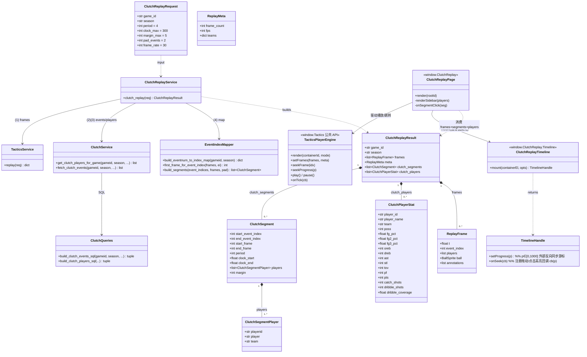
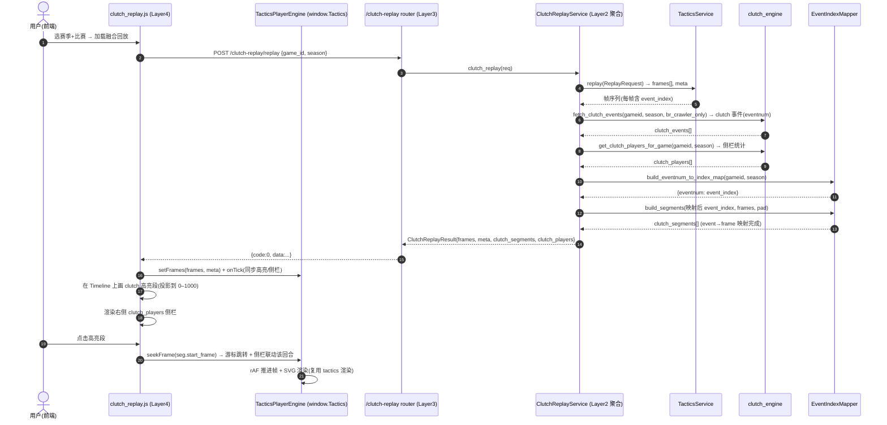

# NBACore Studio v8 — 关键时刻回放融合（Clutch Replay）系统架构设计

> 作者：高见远（Gao）｜角色：架构师（Bob）｜项目：NBACore Studio v8（nba_desktop_omega）
> 版本：v1（架构设计稿）｜上游：PRD `docs/clutch-replay/prd.md`（许清楚）、战术板架构 `docs/tactics-board/architecture.md`
> 编排者：齐活林（交付总监）｜日期：2026-07-10
> 范围：仅架构设计 + 任务分解，**不含实现代码**（可含接口签名 / 伪代码）。

---

## 0. 设计摘要（一页结论）

| 维度 | 决策 |
|------|------|
| 后端形态 | 新增**轻量聚合层** `backend/services/clutch_replay_engine/`（编排 + 映射，非重型引擎）；新增薄路由 `backend/api/routers/clutch_replay.py` |
| 四层隔离 | Frontend(渲染+rAF+Timeline 交互) → API(纯编排) → 聚合层(取数+映射+塑形) → 复用 `clutch_engine`(clutch 计算) + `tactics_engine`(帧生成)。**坐标/插值/帧生成/clutch 窗口计算全留在原 Engine** |
| 核心映射 | `eventnum → event_index → frame_index`：用与 `tactics_engine.load_pbp_events` **完全相同的排序**（`period ASC, clock_seconds DESC, id ASC`）查询 `br_crawler` 事件，按行序建 `eventnum→event_index` 表；再按帧的 `event_index` 字段映射到绝对 `frame_index` |
| 数据源口径 | **映射与 clutch 取数均限定 `source='br_crawler'`**（tactics 帧仅 br_crawler 有坐标）。非 br_crawler 独占的 clutch 事件在回放中无对应帧 → 跳过（记为「无回放帧」，非 bug，见 §9） |
| 复用而非重造 | `frames` 原样复用 `TacticsService.replay()` 输出；`clutch_players` 复用 `clutch_engine` 的 `_post_process` 与 `build_clutch_players_sql` 片段（加 `gameid` 过滤 + 去跨场 `LIMIT`） |
| 前端融合 | 复用 `tactics.js` 的半场 SVG / 双色圆圈 / 篮球 / 事件气泡 / 控制条，**扩展其公共 API 为可驱动的播放引擎**；`clutch_replay.js` 在其上叠加 Timeline 高亮段 overlay + 右侧统计侧栏 + 点击跳转 |
| 视觉一致 | 与战术板 v1 完全一致；高亮段用红/金区分于球队双色；无新增特效 |
| 新增依赖 | **无**（沿用 fastapi / psycopg2 / pydantic / core.db.batch_query） |
| 默认口径（已拍板） | Timeline=frame-based 0–1000；clutch 阈值=period=4 且 clock≤300 且 \|margin\|≤5；赛季=2020–2026；逐事件步进/多球员对比=P1 |

---

## 1. 实现方案 + 框架选型

### 1.1 技术挑战与框架选择

| 难点 | 选型 / 方案 | 理由 |
|------|------------|------|
| clutch 回合 ↔ 回放帧 映射 | 新增 `clutch_replay_engine.mapper`：纯 Python 字典映射（eventnum→event_index）+ 线性扫描（event_index→frame） | 映射是确定性、无坐标/数学；复用 tactics 同序查询保证一致 |
| clutch 事件级取数 | 复用 `clutch_engine`：新增 `build_clutch_events_sql`（br_crawler 事件级）+ `get_clutch_players_for_game`（单场 per-player） | SQL 全在 clutch_engine（其 docstring 约定「All aggregate SQL lives HERE」），仅扩展不加重型引擎 |
| 回放帧序列 | 直接复用 `TacticsService.replay()`，frames 原样下发 | 零重写，保证视觉/帧一致 |
| 只读 PBP 接入 | 复用 `core.db.batch_query`（参数化、可 trace） | 与现有 Engine 一致，禁 per-row 循环 |
| 前端渲染 | 原生 JS + SVG（复用 `tactics.js`），rAF 推进帧 | 与现有前端一致，无构建链 |
| 后端框架 | FastAPI（沿用 `app.py`） | 四层架构已落地，挂新 router + 聚合层 |
| Timeline 高亮 | 在 tactics 控制条上方叠加自定义高亮轨道（absolute 定位 div），点击段调 `Tactics.seekFrame` | 不重写 tactics 渲染；range input 仍负责细粒度 scrub |

**架构模式**：经典分层（Layered）+ 门面（Facade，`clutch_replay_engine.service` 汇总编排，供 API 编排）+ 策略（Mapper 映射策略）。无新运行时依赖。

### 1.2 聚合层模块划分 `backend/services/clutch_replay_engine/`

```
clutch_replay_engine/
├── __init__.py      # 导出 ClutchReplayService
├── schemas.py       # Pydantic：ClutchReplayRequest / ClutchReplayResult / ClutchSegment / ClutchSegmentPlayer / ClutchPlayerStat
├── mapper.py        # 核心映射：build_eventnum_to_index_map / first_frame_for_event_index / build_segments
└── service.py       # ClutchReplayService.clutch_replay()：编排 tactics + clutch + mapper
```

> 复用对象（务必直接引用，禁止重写）：
> - `backend.services.tactics_engine.service.TacticsService.replay(req)` → `{frames, meta}`
> - `backend.services.clutch_engine.clutch_service.get_clutch_players_for_game(...)`（**新增**，单场 per-player，GROUP BY player 名）
> - `backend.services.clutch_engine.clutch_queries.build_clutch_events_sql(...)`（**新增**，br_crawler 事件级 clutch 行）
> - `backend.services.tactics_engine.db.load_pbp_events(...)`（映射建表时复用同序查询）

### 1.3 调用关系（后端聚合层）

```
ClutchReplayService.clutch_replay(gameid, season)
   ├─(1) TacticsService.replay(ReplayRequest) ──────────► frames[], meta   （tactics_engine 生成帧）
   ├─(2) clutch_queries.build_clutch_events_sql(gameid, season, br_crawler_only)
   │        └─ clutch_service.fetch_clutch_events(...) ─► clutch_events[]  （eventnum, period, clock, player, margin）
   ├─(3) clutch_service.get_clutch_players_for_game(gameid, season) ─► clutch_players[]
   └─(4) mapper:
            ├─ build_eventnum_to_index_map(gameid, season)  → {eventnum: event_index}   （同序 br_crawler 查询）
            ├─ 对每个 clutch event: event_index = map[eventnum]; 跳过无映射者
            ├─ build_segments(event_indices, frames)         → clutch_segments[]（锚定 ±pad，映射到 frame_index）
            └─ 返回 frames(原样) + meta(+clutch_segment_count) + clutch_segments + clutch_players
```

---

## 2. 文件列表（新建 / 修改）

### 新建文件（后端聚合层）

| 路径 | 职责 |
|------|------|
| `backend/services/clutch_replay_engine/__init__.py` | 导出 `ClutchReplayService` 与 schemas |
| `backend/services/clutch_replay_engine/schemas.py` | Pydantic 契约：`ClutchReplayRequest` / `ClutchReplayResult` / `ClutchSegment` / `ClutchSegmentPlayer` / `ClutchPlayerStat` |
| `backend/services/clutch_replay_engine/mapper.py` | 映射核心：`build_eventnum_to_index_map` / `first_frame_for_event_index` / `build_segments`（纯 Python，无 DB） |
| `backend/services/clutch_replay_engine/service.py` | `ClutchReplayService`：编排 tactics + clutch + mapper，塑形 `ClutchReplayResult` |

### 修改文件（后端复用 / 扩展，最小化）

| 路径 | 改动 |
|------|------|
| `backend/services/clutch_engine/clutch_queries.py` | **新增** `build_clutch_events_sql(gameid, season, period, clock_max, margin_max)`：复用 `clutch_utils` 片段，终端 SELECT 改为**事件级**（br_crawler 过滤），返回 `(eventnum, period, clock_seconds, playerid, player, team, margin)` |
| `backend/services/clutch_engine/clutch_service.py` | **新增** `get_clutch_players_for_game(gameid, season, ...)`：复用 `build_clutch_players_sql`（加 `gameid` 过滤、去跨场 `LIMIT`）+ `_post_process`，返回该场 per-player 统计（GROUP BY player 名，规避 playerid 分组 bug） |
| `backend/api/routers/clutch_replay.py` | **新增** 薄编排路由：`POST /clutch-replay/replay`（调 `ClutchReplayService.clutch_replay`），返回 `{code,data,message}` |
| `backend/api/routers/__init__.py` | import 元组加入 `clutch_replay` |
| `backend/app.py` | 挂载 `clutch_replay` router |

### 新建文件（前端融合页）

| 路径 | 职责 |
|------|------|
| `frontend/js/components/clutch_replay.js` | 融合页组件（`window.ClutchReplay.render`）+ **可复用 Timeline 组件**（`window.ClutchReplay.Timeline.mount`，见 §3.2）：调 `/clutch-replay/replay` → 用 `Tactics` 引擎 API 播放 `frames/meta` → 通过 `Timeline.mount` 画 clutch 高亮段（自身也消费该组件，DRY）→ 点击段跳转 → 右侧侧栏联动 `clutch_players` |

### 修改文件（前端复用 / 扩展）

| 路径 | 改动 |
|------|------|
| `frontend/js/components/tactics.js` | **扩展公共 API 为可驱动播放引擎**：保留 `render`，新增 `setFrames(frames, meta)` / `seekFrame(idx)` / `seekProgress(p)` / `play()` / `pause()` / `onTick(cb)`；`buildLayout` 支持 `mode='clutch'` 预留侧栏容器与高亮轨道插槽。**不重写**渲染/插值逻辑 |
| `frontend/css/style.css` | 追加 clutch 高亮段、统计侧栏样式类（复用现有 `.card/.page` 体系，少量新增） |
| `frontend/index.html` | 侧栏新增 `nav-item data-page="clutch-replay"`；新增 `<div id="page-clutch-replay" class="page">` 容器 |
| `frontend/js/app.js` | `nav()` 增加 `if(page==='clutch-replay') loadClutchReplayPage()`；新增 `loadClutchReplayPage()` 调 `window.ClutchReplay.render('clutchReplayRoot')` |

---

## 3. 数据结构与接口（类图 / Mermaid）

> 完整 Mermaid `classDiagram` 另存于 `class-diagram.mermaid`。



### 3.1 关键方法签名（接口契约，供 Engineer 实现）

```python
# ── clutch_replay_engine/schemas.py ──
class ClutchReplayRequest(BaseModel):
    game_id: str
    season: str
    period: int = 4
    clock_max: int = 300
    margin_max: int = 5
    pad_events: int = 2          # 每个 clutch 事件前后各取多少相邻事件构成可回放片段
    frame_rate: int = 30

class ClutchSegment(BaseModel):
    start_event_index: int
    end_event_index: int
    start_frame: int
    end_frame: int
    period: int
    clock_start: float
    clock_end: float
    players: list[ClutchSegmentPlayer]
    margin: int

class ClutchPlayerStat(BaseModel):
    # 字段口径与 clutch.js / clutch_schemas.ClutchPlayerResponse 完全一致
    player_id: str | None = None
    player_name: str
    team: str | None = None
    poss: int = 0
    fg_pct: float | None = None
    fg2_pct: float | None = None
    fg3_pct: float | None = None
    oreb: int = 0
    dreb: int = 0
    ast: int = 0
    stl: int = 0
    tov: int = 0
    pf: int = 0
    pts: int = 0
    catch_shots: int | None = None
    dribble_shots: int | None = None
    dribble_coverage: float | None = None

# ── clutch_replay_engine/mapper.py ──
def build_eventnum_to_index_map(gameid: str, season) -> dict[int, int]:
    """同 tactics_engine.load_pbp_events 的排序查询 br_crawler 事件，
    额外 SELECT eventnum，按行序建 {eventnum: event_index}。"""

def first_frame_for_event_index(frames: list[dict], event_index: int) -> int:
    """返回第一帧 event_index==event_index 的帧下标（deterministic）。"""

def build_segments(clutch_event_indices: list[int], frames: list[dict],
                   pad: int = 2) -> list[ClutchSegment]:
    """以每个 clutch event_index 为锚，前后 pad 个相邻事件构成片段，
    映射到 [start_frame, end_frame]；相邻片段可合并。"""

# ── clutch_replay_engine/service.py ──
class ClutchReplayService:
    def clutch_replay(self, req: ClutchReplayRequest) -> ClutchReplayResult: ...

# ── clutch_engine 扩展（最小化）──
# clutch_queries.build_clutch_events_sql(gameid, season, period=4, clock_max=300, margin_max=5)
#   -> (sql, params)：复用 clutch_utils 片段，src_priority/dedup 后加
#      `AND source = 'br_crawler'`，终端 SELECT 事件级 (eventnum, period, clock_seconds, playerid, player, team, margin)
# clutch_service.get_clutch_players_for_game(gameid, season, period=4, clock_max=300, margin_max=5)
#   -> list[dict]：复用 build_clutch_players_sql(gameid=gameid) + _post_process，GROUP BY player（名）
```

### 3.2 前端共享契约（与 Video Library 复用，单一事实源）

录像库（Video Library）双视角（P2）将**直接复用**本功能的播放引擎与 Timeline 组件，不重造。以下契约由 `clutch_replay.js` 实现并供 `video_library.js` 消费（与 `docs/video-library/architecture.md §3.2` 对齐）：

```javascript
// 1) 可驱动播放引擎（tactics.js 暴露，clutch_replay 透传）
window.Tactics.setFrames(frames, meta);   // 载入帧序列，不重建 DOM
window.Tactics.seekFrame(idx);            // 跳到绝对帧下标
window.Tactics.seekProgress(p);           // p∈[0,1000] 归一化定位
window.Tactics.play();  window.Tactics.pause();
window.Tactics.onTick(cb);                // cb(fraction, frameIndex) 每 rAF 回调（前端同步高亮/侧栏/视频游标）

// 2) 可复用 Timeline 高亮组件（clutch_replay.js 暴露，clutch_replay 自身也消费）
const handle = window.ClutchReplay.Timeline.mount(containerEl, {
  segments,        // [{start_frame, end_frame, ...}] 投影到 0–1000 画高亮
  frameCount,      // meta.frame_count，用于投影
  onSeek,          // 初始回调 cb(p)，p∈[0,1000]，用户拖动/点击高亮段时触发
});
handle.onSeek(cb);     // 注册额外拖动/点击回调（追加，不替换）
handle.setProgress(p); // p∈[0,1000]，外部（如 <video> 播放进度）反向同步游标
```

**契约要点（双方一致）**
- `p` 始终是 **0–1000 归一化空间**（非帧下标）；消费者用 `frameIndex = round(p/1000*(frameCount-1))` 自行换算。Timeline 组件只发 `p`、只收 `p`，零偏移/零帧算术。
- `mount` 的 `onSeek` 与 `handle.onSeek(cb)` 均为**追加注册**语义（多监听者并存），互不覆盖；`setProgress` 仅用于外部反向同步，不触发 `onSeek`（避免回环）。
- `clutch_replay.js` 的融合页**自身通过 `Timeline.mount` 渲染高亮**（DRY），录像库 `video_library.js` 仅做：列表渲染 + `<video>` + `SyncController`（用本句柄桥接 `<video>`↔Timeline↔Tactics 双向同步，前端仅二分查找后端预计算 `timeline[]`）。
- 后端复用：`video_library.js` 直接调用 `ClutchReplayService.clutch_replay()` 取 `frames+segments`，并复用 `clutch_replay_engine.mapper.first_frame_for_event_index`，**不新增后端映射逻辑**。

---

## 4. 程序调用流程（时序图 / Mermaid）

> 完整 Mermaid `sequenceDiagram` 另存于 `sequence-diagram.mermaid`。



---

## 5. 后端 API 端点清单（router `clutch_replay.py`）

前缀 `/clutch-replay`，全部返回 `{code, data, message}` 信封（与 clutch / tactics router 一致）。**纯编排，无 SQL / 无计算**。

| 方法 | 路径 | 入参 | 说明 | 调用引擎 |
|------|------|------|------|----------|
| POST | `/clutch-replay/replay` | `ClutchReplayRequest` body | 生成融合回放：frames（原样）+ clutch_segments（高亮）+ clutch_players（侧栏） | `ClutchReplayService.clutch_replay()` |
| GET | `/clutch-replay/games?season=` | query | （可选复用）该季可回放比赛，复用 `TacticsService.list_games` | `tactics_engine` |

> 逐事件步进（P1）由前端基于 `ReplayFrame.event_index` 定位；速度/暂停/进度均为前端 rAF 控制，帧数据已含全部坐标，无需新增端点。

### 5.1 返回信封结构（后端 → API → 前端）

```jsonc
{
  "code": 0,
  "data": {
    "game_id": "20250101_TEAMA_TEAMB",
    "season": "2025",
    "frames": [ /* 原样复用 TacticsService.replay() 的 ReplayFrame 序列 */ ],
    "meta": { /* 复用 ReplayMeta + 扩展字段 */ "clutch_segment_count": 7 },
    "clutch_segments": [
      { "start_event_index": 312, "end_event_index": 318,
        "start_frame": 9340, "end_frame": 9520,
        "period": 4, "clock_start": 292.0, "clock_end": 268.0,
        "players": [{"playerid":"203999","player":"N. Jokić","team":"DEN"}],
        "margin": 3 }
    ],
    "clutch_players": [
      { "player_id":"203999", "player_name":"N. Jokić", "team":"DEN",
        "poss":18, "fg_pct":58.3, "fg2_pct":61.0, "fg3_pct":40.0,
        "oreb":2, "dreb":3, "ast":4, "stl":1, "tov":1, "pf":2, "pts":22,
        "catch_shots":12, "dribble_shots":4, "dribble_coverage":80.0 }
    ]
  },
  "message": "ok"
}
```

---

## 6. 任务列表（有序、含依赖、按实现顺序）

> 约束遵循：≤5 个任务；单任务 ≥3 文件；按功能/层次分组；T01 为基础设施/入口；后端纯聚合、前端零计算。

| ID | 任务（对应 PRD 项） | Source Files | 依赖 | 优先级 |
|----|--------------------|--------------|------|--------|
| **T01** | 基础设施与契约：数据模型 + 入口 + 路由注册 | `backend/services/clutch_replay_engine/schemas.py`、`backend/api/routers/__init__.py`、`backend/app.py`、`frontend/index.html`、`frontend/js/app.js` | 无 | P0 |
| **T02** | 聚合层核心：映射 + 编排 + API 端点（调 tactics/clutch） | `backend/services/clutch_replay_engine/mapper.py`、`service.py`、`backend/services/clutch_engine/clutch_queries.py`（+`build_clutch_events_sql`）、`backend/services/clutch_engine/clutch_service.py`（+`get_clutch_players_for_game`）、`backend/api/routers/clutch_replay.py` | T01 | P0 |
| **T03** | 前端融合页：复用战术板引擎 + Timeline 高亮 + 侧栏联动 | `frontend/js/components/tactics.js`（暴露可驱动播放引擎 API + clutch 布局模式）、`frontend/js/components/clutch_replay.js`、`frontend/css/style.css` | T01, T02 | P0 |
| **T04** | 回归测试：映射正确性 + clutch/tactics 现有测试不受影响 | `backend/services/clutch_replay_engine/tests/test_mapper.py`、`backend/services/clutch_replay_engine/tests/test_service.py`、`backend/services/tactics_engine/tests/test_clutch_replay_integration.py` | T02, T03 | P0 |

### 6.1 依赖关系

- T02（聚合层）依赖 T01（schemas 契约 + router 已注册，保证 `app.py` import 不失败）。
- T03（前端）依赖 T02（API 契约 `ClutchReplayResult`）+ T01（入口已挂载）。
- T04（测试）依赖 T02、T03 落地后验证。
- 依赖链：`T01 → T02 → {T03, T04}`，其中 T03 亦依赖 T01。无循环依赖，可并行推进 T02 之后的前端/测试。

---

## 7. 依赖包列表

| 包 | 版本/说明 | 是否新增 |
|----|-----------|----------|
| fastapi | 沿用 v8 现有 | 否 |
| psycopg2 | 沿用 v8 现有（`core.db`） | 否 |
| pydantic | 沿用 v8 现有（schemas） | 否 |
| core.db.batch_query | 沿用 v8 既有只读数据接入 | 否 |
| 无新增前端库 | 复用 tactics.js 原生 SVG/DOM；Timeline 高亮用绝对定位 div 叠加 | 否 |

**结论：v1 不引入任何新增 Python / 前端依赖。** 映射为纯 Python 字典与线性扫描；SVG 由前端原生渲染。

---

## 8. 共享知识（跨文件约定）

### 8.1 三键标识体系（映射基石）

| 键 | 来源 | 含义 | 在本功能中的角色 |
|----|------|------|------------------|
| `eventnum` | `play_by_play.eventnum` | clutch_engine 标识回合的列（跨三源 dedup） | clutch 取数的锚 |
| `event_index` | `tactics_engine` 按 `period ASC, clock_seconds DESC, id ASC` 枚举的行序号 | tactics 帧的锚 | 映射中间键 |
| `frame_index` | `frames` 列表下标（0..frame_count-1） | 前端 Timeline 真实定位 | 最终跳转目标 |

- **映射建表查询**必须与 `tactics_engine.db.load_pbp_events` **同序**（`ORDER BY period ASC, clock_seconds DESC, id ASC`，`AND source='br_crawler'`），否则 `event_index` 错位。
- **帧→事件**：`ReplayFrame.event_index` 由 `animation.build_frames` 写入（`f==0` 帧取 `i`，`f>0` 帧取 `i+1`）；`first_frame_for_event_index(E)` 取首个 `event_index==E` 的帧，即该 clutch 时刻起始帧。

### 8.2 gameid / season 约定

- `game_id`：统一使用 `br_crawler` 的 `gameid`（与 `play_by_play.gameid` 一致）。
- `season`：4 位字符串，如 `"2025"`；默认范围 2020–2026（仅 br_crawler 有 xy）。聚合层按 `season` 参数化，无硬编码上限（预留 P2 扩展）。

### 8.3 Timeline frame-based 约定（0–1000）

- 滑动条 `range` 0–1000 归一化映射到 `frame_index ∈ [0, frame_count-1]`：`frame_index = round(p/1000 * (frame_count-1))`。
- `clutch_segments` 携带**绝对** `start_frame/end_frame`；前端用 `meta.frame_count` 投影到 0–1000 画高亮段：`p_start = start_frame/(frame_count-1)*1000`。
- 点击高亮段 → `Tactics.seekFrame(seg.start_frame)`（误差 ≤1 帧，deterministic）。

### 8.4 clutch 阈值与分组口径

- 默认窗口：`period=4 且 clock_seconds<=300 且 ABS(margin)<=5`（沿用 clutch_engine 现有定义）。
- **侧栏分组键 = player 名**（非 playerid），规避 BBRef 源 `playerid=NULL` 分组错乱 bug（后台回填中，不阻塞 v1）。
- 不可区分源（catch/dribble 等）返回 `null` → 前端显「—」。

### 8.5 错误码格式

统一信封 `{code, data, message}`：`code=0` 成功；非 0 错误。复用战术板/ clutch 现有码，新增：

| code | 含义 |
|------|------|
| 0 | 成功 |
| 40001 | 比赛不存在 / season 非法 |
| 40002 | 该赛季无 br_crawler xy 回放数据 |
| 40003 | 该场无 clutch 高亮（无 br_crawler 内 clutch 事件）→ 返回空 `clutch_segments`，`frames` 仍可回放（降级渲染，见 §9） |
| 50000 | 聚合层映射/编排异常 |

### 8.6 与 Video Library 共享前端契约（跨功能复用）

录像库（双视角 P2）复用本功能的播放引擎与 Timeline 组件，契约以 **§3.2** 为单一事实源，双方（Clutch Replay 与 Video Library）不得各自另立形态：

- `window.Tactics` 可驱动 API（`setFrames/seekFrame/seekProgress/play/pause/onTick`）——本功能与录像库共用，固定不变。
- `window.ClutchReplay.Timeline.mount(containerEl, {segments, frameCount, onSeek}) → { setProgress(p), onSeek(cb) }`——高亮段组件，本功能融合页自身消费，`video_library.js` 经 `SyncController` 桥接 `<video>`↔Timeline↔Tactics。
- 归一化空间恒为 **0–1000**（`p`），帧换算由消费者负责；句柄 `onSeek` 为追加语义、`setProgress` 不回环触发 `onSeek`。
- 后端映射逻辑（`clutch_replay()` / `first_frame_for_event_index`）为共享资产，录像库直接复用，不新增。

---

## 9. 待明确事项 / 假设（仍存疑点 + 本设计处理）

| # | 疑点 | 本设计处理 / 假设 |
|---|------|------------------|
| ① | **clutch 跨源 eventnum 与 br_crawler event_index 对齐的精确 SQL/逻辑** | 不依赖 eventnum 单调性。映射表用**与 tactics 同序**的 br_crawler 查询逐行建 `{eventnum: 行序}`；clutch 取数同样限定 `source='br_crawler'`，故 eventnum 必在该表中。仍假设：**单场内 br_crawler 的 eventnum 唯一**（如有重复，取首次出现；若实测有重复需回填/去重，列为 P1 校验项）。 |
| ② | **无 clutch 数据时段 / 整场无 br_crawler clutch 事件的降级渲染** | 聚合层仍返回完整 `frames` + 空 `clutch_segments` +（可能空）`clutch_players`，`code=0`（或 40003 提示）。前端照常播放整场、时间线无高亮、侧栏显「本场无关键时刻数据」。不报错、不阻断。 |
| ③ | **非 br_crawler 独占的 clutch 事件（仅 BBRef / nba_api 有）** | 在 br_crawler 映射表中无对应 eventnum → 该 clutch 高亮被跳过（标记为「无回放帧」）。这是数据源口径差异的必然结果（tactics 帧仅 br_crawler），非 bug；与 PRD §7 #3 一致。v1 不跨源拼帧。 |
| ④ | **clutch 片段「回合」边界（possession 级合并 vs 单事件 ±pad）** | v1 采用**单事件锚定 ±pad_events（默认 2）**生成片段，简单 deterministic；相邻片段可合并（gap≤pad 即并）。更精细的 possession 级切分（按 score/possession 语义）列为 P2 增强，不改 API 结构。 |
| ⑤ | **加时（period≥5）是否纳入高亮** | v1 默认沿用 `period=4`（与 PRD 拍板一致）；`period` 参数化，加时可经 `ClutchReplayRequest.period` 扩展，无需改结构。 |
| ⑥ | **高亮段与 tactics 控制条 range input 的交互叠放** | 高亮用绝对定位 div 轨道叠加在 range 上方同一坐标区间；range 负责细粒度 scrub，点击高亮段委托 `seekFrame`。两者共用 0–1000 归一化，互不冲突。 |
| ⑦ | **clutch_players 与当前游标所在回合的联动精度** | 侧栏默认展示该场全局 clutch 球员榜；游标进入某高亮段时，高亮该段 `players` 中的球员行（前端基于 `seg.players` 过滤/高亮），不重新请求。 |
| ⑧ | **与 Video Library（双视角 P2）的前端契约对齐** | 已锁定共享契约（§3.2 / §8.6）：`window.Tactics` 可驱动 API + `window.ClutchReplay.Timeline.mount(...)` 句柄形态固定不变；录像库复用本功能播放引擎与 Timeline 组件、复用后端 `clutch_replay()` / `first_frame_for_event_index`，不重造、不新增映射。 |

---

## 10. 四层隔离验收对照

| 检查项 | 合规点 |
|--------|--------|
| 前端零计算 | `clutch_replay.js` 仅消费后端 `frames+segments+players`，用 rAF 推进 + SVG 渲染 + Timeline 交互；不出现 `map_xy_to_svg` / 插值 / 映射 / clutch 计算 |
| API 纯编排 | `clutch_replay.py` 只接收参数、调 `ClutchReplayService`、返回信封；无 `import psycopg2`、无 SQL |
| 聚合层仅编排+映射 | `clutch_replay_engine` 调用 tactics/clutch 取数 + mapper 映射 + 塑形；不重写坐标/插值/clutch 窗口计算 |
| 计算留在原 Engine | 坐标映射/插值/帧生成在 `tactics_engine`；clutch 窗口/统计在 `clutch_engine` |
| Data 只读 | 所有 SQL 经 `core.db.batch_query`（SELECT + 参数化），无 DML/动态 SQL |
| 无新增依赖 | 仅复用现有栈 |
| 复用不重造 | `frames` 原样复用；`clutch_players` 复用 `_post_process`；映射为轻量字典 |

---

*文档结束。任务分解见 §6，Mermaid 图见 `class-diagram.mermaid` / `sequence-diagram.mermaid`。*
