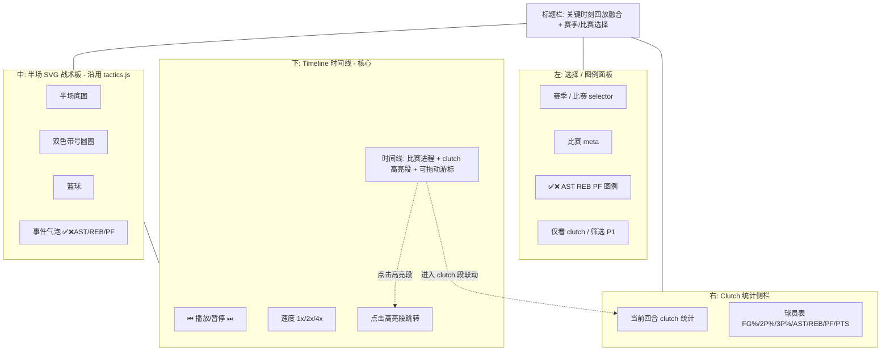
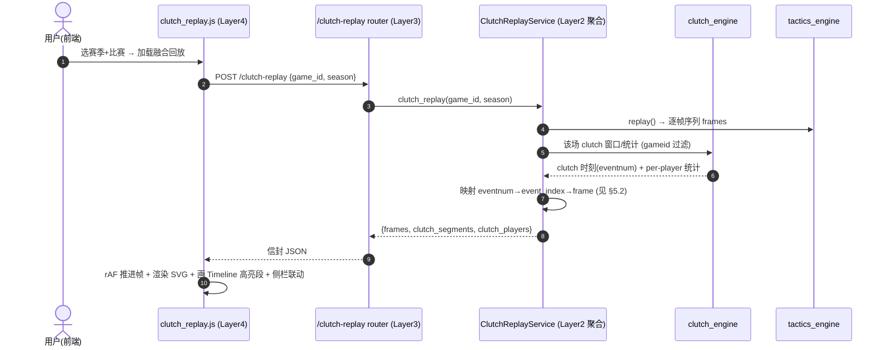

# NBACore Studio v8 — 关键时刻回放融合（Clutch Replay）产品需求文档（PRD）

> 作者：许清楚（Xu）｜角色：产品经理｜项目：NBACore Studio v8（代号 nba_desktop_omega）｜版本：v1（Draft）｜日期：2026-07-10
> 适用范围：本文件仅定义产品需求（PRD），不含任何实现代码；实现由交付总监编排、研发团队落地。
> 设计依据（必读上游）：战术板 PRD/架构（`docs/tactics-board/prd.md`、`docs/tactics-board/architecture.md`）、战术板前端（`frontend/js/components/tactics.js`）、关键时刻 PRD（`clutch_analysis_incremental_prd.md`）、`clutch_engine/`、`tactics_engine/replay_engine.py`、`tactics_engine/service.py`、`tactics_engine/db.py`、`tactics_engine/schemas.py`。

---

## 0. 文档信息

| 字段 | 值 |
|------|-----|
| **语言** | 中文 |
| **技术栈** | 沿用现有四层架构：前端原生 JS + SVG（`frontend/js/components/tactics.js` 同源渲染器）；后端 FastAPI（Layer 3 编排）+ Engine（Layer 2）+ Data（Layer 1 只读 `play_by_play`）。新增一个**轻量聚合 Engine 层**（非重型引擎）。 |
| **数据库** | PostgreSQL localhost:5433/nba，`play_by_play` 表（只读）。 |
| **模块代号** | `clutch_replay` |
| **原始需求（用户原话）** | 「我们能有关键时刻和 pbp 动态回放这两个功能，是不是可以将这两个功能做一定的融合，比如回放时有个 timeline 滑动条。在我看来二者都是对 pbp 的调用。」 |
| **需求提炼** | ① 统一回放体验（clutch 分析 + PBP 回放融合为以 PBP 时间线为核心的页面）；② Timeline 滑动条（拖动/播放/暂停/逐事件步进）；③ clutch 时刻高亮 + 点击跳转；④ clutch 统计联动侧栏；⑤ 复用 `clutch_engine` + `tactics_engine`，不新建重型引擎；⑥ 视觉与战术板 v1 一致，不华丽。 |

---

## 1. 产品目标

**一句话目标**：把已有的「关键时刻（clutch）分析」与「PBP 动态回放（战术板）」融合成一个以 PBP 时间线为核心的页面——用户在一条可拖动的 Timeline 滑动条上任意定位比赛时刻，clutch 回合被高亮标记并可一键跳转，回放到 clutch 回合时侧栏联动展示该时刻/该球员的 clutch 统计。

**成功标准（可度量）**：

| 指标 | 目标值 | 说明 |
|------|--------|------|
| 融合页面可达 | 导航新增 `clutch-replay` 页，入口可见，与战术板页并列 | 复用现有页面挂载模式（`index.html` nav-item + `app.js` 分支 + `js/components/clutch_replay.js`） |
| Timeline 拖动定位 | 拖动游标到任意位置，回放跳转到对应帧，误差 ≤ 1 帧 | 沿用战术板 `tacticsProgress`（frame-based 0–1000）控件范式 |
| clutch 高亮命中 | 时间线上 clutch 段高亮显示，点击段跳转至该回合开始帧，准确率 100%（基于确定性映射） | 映射由后端聚合层 deterministic 计算（见 §5） |
| clutch 统计联动 | 进入 clutch 回合时侧栏展示 per-player clutch 统计，字段与 `clutch.js` 口径一致 | FG%/2P%/3P%/Catch/Dribble/Cov%/OREB/DREB/AST/STL/TOV/PF/POSS/PTS |
| 复用而非重造 | 不新建 clutch 计算/帧生成逻辑；100% 复用 `clutch_engine` 与 `tactics_engine` | 架构评审：新增代码仅为「编排 + 映射」，无坐标/插值数学 |
| 四层隔离合规 | 前端零计算、API 纯编排、clutch 计算与帧生成仍在原 Engine 层 | 见 §4 架构约束与 §7 风险 |
| 视觉一致 | 半场、双色带号圆圈、篮球、✅/❌/AST/REB/PF 气泡、播放/暂停/速度/进度条与战术板 v1 一致 | 无新增特效 |

---

## 2. 用户故事（覆盖 6 项能力）

- **US1（统一回放体验）**：As a **分析师/解说**, I want **在一个以 PBP 时间线为核心的页面里同时看到动态回放与关键时刻标记** so that **我不必在「战术板」与「关键时刻」两个独立模块间来回切换即可复盘比赛**。
- **US2（Timeline 滑动条）**：As a **所有用户**, I want **拖动一条时间线滑动条定位到任意比赛时刻，并支持播放/暂停/逐事件步进** so that **我能自由探索比赛进程而非只能从头播放**。
- **US3（clutch 时刻高亮 + 点击跳转）**：As a **内容创作者**, I want **时间线上把 clutch 回合（末段分差≤5）高亮标记，点击高亮段即跳转到该回合开始处** so that **我能秒级定位比赛最焦灼的回合做内容**。
- **US4（clutch 统计联动）**：As a **数据分析师**, I want **回放到某个 clutch 回合时，侧栏展示该时刻/该球员的 clutch 统计（得分、命中率、助攻等）** so that **我在看回放的同时能直接读到该回合的量化表现**。
- **US5（复用而非重造）**：As a **产品经理/架构师**, I want **本功能主要复用 `clutch_engine` 与 `tactics_engine`，仅新增轻量后端聚合把 clutch 回合映射到回放帧** so that **不重复建设引擎、降低维护与一致性风险**。
- **US6（简洁一致）**：As a **所有用户**, I want **视觉与交互延续战术板 v1（半场、双色带号圆圈、篮球、✅/❌/AST/REB/PF 气泡、播放/暂停/速度/进度条）** so that **学习成本为零、低配设备也能流畅使用**。

---

## 3. 需求池（P0 / P1 / P2）

> 优先级定义：**P0** 必须有（v1 核心）、**P1** 应该有（v1 增强）、**P2** 规划项（v1 不实现，但预留结构与接口）。

### 3.1 P0 — 必须有（v1 核心）

| 优先级 | 编号 | 需求 | 做什么 | 验收口径 |
|--------|------|------|--------|----------|
| P0 | CR-01 | Timeline 滑动条（拖动/播放/暂停/逐事件步进） | 在战术板控制条基础上，提供可拖动时间线游标；支持播放/暂停、逐事件步进（见 §8③确认是否进 P0） | 拖动游标即时定位到对应帧；播放/暂停可用；步进精确到单个 PBP 事件（`event_index`） |
| P0 | CR-02 | clutch 时刻高亮 + 点击跳转 | 时间线上按后端返回的 `clutch_segments` 绘制高亮段（红/金），点击段跳转至该回合开始帧 | 高亮段位置与回放帧一一对应（deterministic）；点击跳转误差 ≤1 帧 |
| P0 | CR-03 | clutch 统计侧栏联动 | 右侧面板展示当前/所选 clutch 回合的 per-player clutch 统计（复用 `clutch.js` 字段口径）；进入 clutch 回合自动联动 | 侧栏数据来自后端 `clutch_players`；字段与 `clutch.js` 一致；不可区分源显示「—」 |
| P0 | CR-04 | 复用 clutch_engine + tactics_engine | 不新建重型引擎；clutch 窗口计算复用 `clutch_engine`，帧序列复用 `tactics_engine` | 代码评审确认：无重复的 clutch/坐标/插值计算；新增仅为聚合编排（见 §5） |
| P0 | CR-05 | 四层严格隔离（非功能） | 前端只渲染 + rAF 推进；clutch 计算与帧生成仍在原 Engine；新增聚合层为 Layer 2 | 架构评审通过：前端零计算、API 纯编排、聚合层不碰 SQL/坐标数学（见 §4、§7） |
| P0 | CR-06 | 视觉与战术板 v1 一致 | 半场 SVG、双色带号圆圈、篮球、事件气泡、控制条样式沿用 `tactics.js` | 视觉 diff 与战术板页一致；无新增特效；低配 ≥30fps |

### 3.2 P1 — 应该有（v1 增强）

| 优先级 | 编号 | 需求 | 做什么 | 验收口径 |
|--------|------|------|--------|----------|
| P1 | CR-07 | 多球员 clutch 对比叠加 | 时间线上叠加多名球员的 clutch 高亮（不同色/层），可在侧栏勾选对比 | 多段高亮可同时显示且可区分；对比球员统计并列 |
| P1 | CR-08 | 按球队/球员筛选 clutch 高亮 | 提供筛选器仅显示某队/某球员的 clutch 段 | 筛选后时间线高亮与侧栏统计同步收敛 |
| P1 | CR-09 | 回放速度档与战术板一致 | 速度档 1x/2x/4x，沿用战术板控件 | 速度切换即时生效，与战术板表现一致 |
| P1 | CR-10 | 键盘快捷键（左右键步进） | ← / → 逐事件步进，空格播放/暂停 | 快捷键可用；步进粒度 = 单 `event_index` |

### 3.3 P2 — 规划项（v1 不实现，预留结构）

| 优先级 | 编号 | 需求 | 做什么（规划） | 验收口径（接口级） |
|--------|------|------|----------------|--------------------|
| P2 | CR-11 | clutch 回合自动剪辑/导出 | 将选中 clutch 段导出为 GIF/视频或帧序列包；数据结构预留 `clutch_segments` 已是可导出单元 | `clutch_segments` 含完整 `[start_frame,end_frame]` 区间，可无重构接入导出器 |
| P2 | CR-12 | 与战术板模板联动 | 在 clutch 回合叠加战术标注（复用 `tactics` 模板/箭头渲染插槽） | `clutch_segments` 可挂接 `tactic_id` 关联；前端渲染层预留叠加位 |
| P2 | CR-13 | 历史赛季覆盖 | 回放默认覆盖 2020–2026（见 §8⑤），预留更宽赛季范围配置 | 赛季选择器可扩展；聚合层按 `season` 参数化，无硬编码上限 |

---

## 4. 非功能需求与架构约束（四层隔离）

```
flowchart LR
  F[Frontend 层<br/>SVG 渲染 + rAF 推进帧 + Timeline 控件] -->|调用 API| API[API 层<br/>纯编排, 禁 SQL/计算]
  API -->|调用聚合 Engine| AGG[clutch_replay 聚合层<br/>编排: 取 clutch 回合 + 取帧 + 映射]
  AGG -->|复用| CE[clutch_engine<br/>clutch 窗口/统计计算]
  AGG -->|复用| TE[tactics_engine<br/>坐标映射+插值+帧生成]
  CE -->|batch_query| DB[(Data 层<br/>play_by_play 只读)]
  TE -->|batch_query| DB
```

- **Frontend（Layer 4）**：仅消费后端返回的 `frames` + `clutch_segments` + `clutch_players`，用 rAF 推进帧并渲染 SVG；Timeline 拖动/步进/高亮均为前端交互，**不计算 clutch、不计算坐标/插值/映射**。
- **API（Layer 3）**：仅编排——接收 `game_id`/`season` 等参数，调用聚合层，返回统一信封 `{code, data, message}`（与 `clutch.py`/`tactics.py` 一致）。**禁止 SQL、禁止计算、禁止业务逻辑**。
- **聚合层（Layer 2，新增轻量）**：`clutch_replay` 引擎，职责=编排两个现有引擎 + 把 clutch 回合映射到帧时间点（见 §5）。**不做坐标映射/插值/动画数学**（那些仍在 `tactics_engine`）；**不做 clutch 窗口重算**（仍在 `clutch_engine`）。本层只做「取数 + 映射 + 塑形」。
- **Data（Layer 1）**：仅 `play_by_play` 只读；所有访问走 `core.db.batch_query`（参数化、可 trace、禁 per-row 循环），与现有一致。

> 红线：**前端零计算、API 纯编排、clutch/帧计算留在原 Engine、新增聚合层仅做编排+映射**。任何「前端算 clutch 坐标」或「在聚合层重写坐标映射」均视为违规。

---

## 5. 后端聚合设计（初步）

### 5.1 定位：轻量聚合层，不是重型引擎

建议新增 `backend/services/clutch_replay_engine/`（或在现有 service 上加 `clutch_replay(game_id, season)` 门面方法）。它**编排**而非**重算**：

1. 调 `clutch_engine` 取该场落在 clutch 窗口内的回合（事件级）。
2. 调 `tactics_engine` 取该场 PBP 逐帧坐标序列（直接复用现有 `ReplayResult`）。
3. 把「clutch 回合」映射到「回放帧时间点」，输出 `clutch_segments` + `clutch_players`。

可复用的既有资产（务必直接引用，避免重写）：

| 复用对象 | 来源文件 | 在本功能中的用途 |
|----------|----------|------------------|
| clutch 窗口 SQL 片段（source 优先级、margin 解析/推导、shot 分类、finish 分类） | `backend/services/clutch_engine/clutch_queries.py`、`clutch_utils.py`、`backend/core/clutch_constants.py` | 在既有 `build_clutch_players_sql` 基础上加 `AND gameid=%s`、改最终 SELECT 为「该场 per-game clutch 时刻」而非跨场聚合 |
| 单场 clutch per-player 统计 + 后处理 | `backend/services/clutch_engine/clutch_service.py::get_clutch_players` / `_post_process` | 加 `gameid` 过滤、去掉跨场 `LIMIT`，得到该场 clutch 窗口内每位球员的 FG%/2P%/3P%/OREB/DREB/AST/STL/TOV/PF/PTS 等（字段口径与 `clutch.js` 完全一致，不可区分源返回 null→「—」） |
| 回放帧序列 | `backend/services/tactics_engine/service.py::replay` / `replay_engine.py::build_frames` | 直接复用，frames 原样下发给前端 |
| 帧↔事件索引契约 | `backend/services/tactics_engine/schemas.py::PbPEvent.event_index`、`ReplayFrame.event_index` | 映射的落点（见 5.2） |

### 5.2 核心：「clutch 时刻 ↔ 回放帧」映射方式

**两套标识键不同，必须建立映射（这是聚合层唯一的新增逻辑）：**

- **clutch 回合**以 `(gameid, eventnum)` 标识——`clutch_engine` 用 `eventnum` 做 `PARTITION BY gameid, eventnum` 去重（`clutch_queries.py` 的 `dedup` CTE 已暴露 `gameid, eventnum, period, clock_seconds, playerid, player, team, margin`）。
- **tactics 帧**以 `event_index`（= `br_crawler` 的 PBP 按 `period ASC, clock_seconds DESC, id ASC` 顺序的 0-based 行序号）标识；`ReplayFrame.event_index` 锚定到对应 `PbPEvent`（`db.py::load_pbp_events` 与 `replay_engine.py`）。
- ⚠️ **数据源口径差异（关键）**：`clutch_engine` 跨 `br_crawler/nba_api/BBRef` 三源去重（保留最高优先级源），而 `tactics_engine` 帧**仅 `br_crawler`**（`db.py` 硬编码 `AND source='br_crawler'`）。因此映射必须落到 **`br_crawler` 事件**——对只存在于 BBRef/nba_api 的 `eventnum`，在 `br_crawler` 中无对应帧，应跳过或标记为「无回放帧」。

**映射步骤（deterministic）：**

1. **建 `eventnum → event_index` 映射**：用与 `tactics_engine` 完全相同的事件序（`ORDER BY period ASC, clock_seconds DESC, id ASC`，`source='br_crawler'`）查询该场 PBP，额外 `SELECT eventnum`（必要时 `id`），按行序生成 `eventnum → event_index`。该查询与 `load_pbp_events` 同序，确保映射与 tactics 帧号一致。
2. **取该场 clutch 时刻**：复用 `clutch_queries` 的 CTE 链，加 `AND gameid=%s`，把最终 `GROUP BY player` 聚合改为返回**事件级**结果——`eventnum, period, clock_seconds, playerid, player, team, margin`（窗口仍为 `period=4, clock_seconds<=300, ABS(margin)<=5`，阈值见 §8②）。
3. **定位帧区间**：对每个 clutch `eventnum`，经步骤 1 映射得 `event_index`，再取其 tactics 帧区间。推荐以「该 clutch 事件帧」为锚，前后各取若干相邻事件构成一个可回放的**回合片段**（`[start_event_index, end_event_index]` → 对应 `[start_frame, end_frame]`）。
4. **输出 `clutch_segments`**：`[{start_event_index, end_event_index, start_frame, end_frame, period, clock_start, clock_end, players:[{playerid, player, team}], margin}]`，供时间线高亮与点击跳转。

### 5.3 返回结构（Backend → API → Frontend 信封）

```jsonc
{
  "code": 0,
  "data": {
    "game_id": "20250101_TEAMA_TEAMB",
    "season": "2025",
    "frames": [ /* 直接复用现有 ReplayFrame 序列，原样下发 */ ],
    "meta": { /* 复用现有 ReplayMeta + clutch 扩展字段（如 clutch_segment_count）*/ },
    "clutch_segments": [
      { "start_event_index": 312, "end_event_index": 318,
        "start_frame": 9340, "end_frame": 9520,
        "period": 4, "clock_start": 292, "clock_end": 268,
        "players": [{"playerid":"203999","player":"N. Jokić","team":"DEN"}],
        "margin": 3 }
    ],
    "clutch_players": [
      { "player_id":"203999", "player_name":"N. Jokić", "team":"DEN",
        "poss":18, "fg_pct":58.3, "fg2_pct":61.0, "fg3_pct":40.0,
        "oreb":2, "dreb":3, "ast":4, "stl":1, "tov":1, "pf":2, "pts":22,
        "catch_shots":12, "dribble_shots":4, "dribble_coverage":80.0 }
      /* 字段口径与 clutch.js 一致；不可区分源返回 null → 前端显 "—" */
    ]
  },
  "message": "ok"
}
```

> 要点：`frames` 完全复用 tactics 帧，**聚合层不改动其结构**；仅新增 `clutch_segments`（时间线高亮/跳转）与 `clutch_players`（侧栏统计）。这是「编排不是重算」的具体落地。

---

## 6. UI 设计稿（融合页面）

### 6.1 页面布局（文字 + ASCII）

融合页面 = **战术板 v1 页面 + 扩展控制条（Timeline）+ 右侧 clutch 统计侧栏**。半场 SVG、双色带号圆圈、篮球、✅/❌/AST/REB/PF 气泡完全沿用 `tactics.js`，不重画。

```
+------------------------------------------------------------------------------+
| NBACore Studio v8 · 关键时刻回放融合 Clutch Replay      [赛季▼][比赛▼][加载]   |
+-------------------------+----------------------------+----------------------+
| 选择 / 图例面板          |  半场 SVG 战术板（沿用）      | Clutch 统计面板(侧栏) |
| [赛季 selector]          |  +----------------------+    | ┌──────────────────┐  |
| [比赛 selector]          |  | 半场底图 + 双色带号圆圈 |    | │ 当前回合 clutch │  |
| 比赛 meta（节/事件/xy）  |  | + 篮球 + 事件气泡     |    | │ 球员 clutch 统计│  |
| ──────────────────      |  +----------------------+    | │ FG%/2P%/3P%/AST │  |
| 事件类型图例             |                            | │ REB/PF/STL/TOV  │  |
| ✅命中 ❌投失 AST REB PF  |                            | │ PTS / POSS      │  |
| ──────────────────      |                            | └──────────────────┘  |
| [仅看 clutch ☑]         |                            | (字段与 clutch.js 一致)|
| [按球员/球队筛选 ▼](P1)  |                            |                      |
+-------------------------+----------------------------+----------------------+
| Timeline 时间线（核心 · 沿用战术板控制条范式并扩展）                              |
| [⏮][▶/⏸][⏭] 速度[1x|2x|4x]  [======▓▓▓▓(clutch 高亮段)====o(游标)===]  [4:32] |
|        ▲ 红/金高亮段 = clutch 回合      ▲ 可拖动游标 = 任意时刻定位              |
| 点击高亮段 → 跳转至该 clutch 回合开始帧；进入 clutch 段 → 侧栏联动               |
+------------------------------------------------------------------------------+
```

### 6.2 时间线如何同时承载「比赛进程」与「clutch 标记」

- **底层 = 比赛进程**：沿用战术板 `tacticsProgress` 的 frame-based 范式（0–1000 映射 `frames` 索引）。拖动游标 = 在整场回放帧序列中定位任意时刻（见 §8①确认最小粒度）。
- **上层 = clutch 标记**：把后端 `clutch_segments` 的 `[start_frame, end_frame]` 投影到同一条时间轴，绘制为**高亮色段**（建议红/金，与双色球队色区分）。多段不重叠、可并列。
- **交互**：高亮段可点击 → 游标跳至 `start_frame`（即该 clutch 回合开始帧）；游标进入某高亮段时，右侧 `clutch_players` 自动联动该回合/该球员统计。
- **复用而非重造**：控制条（播放/暂停/速度/进度）的 DOM 与样式直接复用 `tactics.js` 的 `.tactics-controls`；仅在其上叠加高亮段 overlay 与「步进/跳转」按钮。

### 6.3 布局与数据流（Mermaid）





---

## 7. 依赖与风险（已知上下文，直接采信）

| # | 项 | 处理 / 风险说明 | 是否 v1 解决 |
|---|----|----------------|--------------|
| 1 | **clutch `playerid` 分组 bug** | BBRef 源 PBP 的 `playerid=NULL` 导致按 playerid 分组时同一球员被拆多组（如 Jokić 真实组 `203999/DEN` 被 BBRef 组乱标 `TOR`）。clutch 引擎当前 `GROUP BY player` + `MAX(playerid)`，受影响。 | **否**——后台数据回填 agent 修复中，v1 列为已知依赖/风险，不阻塞（侧栏统计以 `player` 名为聚合键，规避 playerid 错乱）。 |
| 2 | **br_crawler AST 覆盖率** | 助攻字段在 `br_crawler` 源部分缺失（`(Name AST)` 解析回填中），`nba_api` 源完整。 | **否**——v1 注明 AST 气泡在 br_crawler 数据的覆盖率将随回填提升；侧栏 AST 数遵循既有口径（缺失即 0/null）。 |
| 3 | **数据源口径差异（映射必读）** | clutch 跨三源、tactics 帧仅 `br_crawler`。映射必须落到 `br_crawler` 事件（见 §5.2）。 | 设计已规避：映射表以 `br_crawler` 事件序构建，非 br_crawler 的 clutch 事件跳过。 |
| 4 | **四层隔离** | 所有 clutch 计算与回放帧生成在后端 Engine；前端只渲染 + 推进帧（rAF）。本融合功能严禁前端计算 clutch/坐标。 | 是——红线（§4）。 |
| 5 | **PBP 回放覆盖 2020–2026** | 仅 `br_crawler` 源有 x/y 坐标；与战术板 v1 一致。 | 是——默认范围建议 2020–2026（§8⑤）。 |
| 6 | **帧体量与性能** | 单场约 250–400 事件 ×30fps×2s ≈ 1.5–2.4 万帧（战术板架构 §9）。 | 沿用战术板策略：整场生成 deterministic 帧，前端按需推进；若过大 P1 改「按节/回合流式」。 |

---

## 8. 待确认问题（供用户拍板）

| # | 待确认问题 | 建议 / 备注 |
|---|-----------|------------|
| ① | **时间线最小粒度**：按事件（event_index）/ 按帧（frame index）/ 按真实时间（frame.t 秒）？ | 建议 **frame-based（按帧）**，沿用战术板 `tacticsProgress` 范式（0–1000→frame 索引），内部保留 `event_index` 映射以支持逐事件步进。请拍板。 |
| ② | **clutch 高亮默认阈值**：分差≤5 且末段几分钟，是否沿用 clutch_engine 现有定义（`period=4, clock_seconds<=300, ABS(margin)<=5`）？ | 建议 **直接沿用** clutch_engine 现有窗口定义（与 `clutch_analysis_incremental_prd.md` §3.1 一致），保证两模块口径统一。是否把加时（`period>=5`）纳入请拍板。 |
| ③ | **「逐事件步进」是否进 P0**？ | 战术板 v1 中逐事件步进归 P1（架构 §1.2 / PRD TB-10）。本功能建议同样归 **P1（CR-10 键盘快捷键）**，P0 先保证拖动+播放/暂停+高亮跳转。请确认。 |
| ④ | **多球员对比是否 v1 做**？ | 建议 **v1 仅做单场 clutch 高亮 + 侧栏全球员统计**；多球员对比叠加（CR-07）与按球员/球队筛选（CR-08）归 **P1**。请拍板。 |
| ⑤ | **回放默认赛季范围**？ | 建议 **2020–2026**（与战术板 v1 回放覆盖一致，仅 `br_crawler` 有 xy）。是否默认全量还是用户自选？建议默认全量 + 选择器可选。 |

---

## 9. UX 调研参考（体育回放 + 时间线 scrubber + 关键时刻高亮）

> 调研目的：为 Timeline 滑动条 + clutch 高亮 + 侧栏联动的交互寻找成熟 UX 范式。下列为行业实践参考，非本项目的 API/数据依赖。

### 9.1 关键参考与引用

1. **NBA App / League Pass「smart rewind + key plays highlighted」**（2024-25 赛季上线）
   - 来源：NBA 官方公告（nba.com/news/nba-app-launches-new-features-ahead-of-2024-25），经 SportsPro（2024-10-16）与 TVTechnology（2024-10-16）报道。
   - 要点：*"League Pass subscribers able to smart rewind games from any point, with key plays highlighted"*；并提供 *"interactive synced stats and analytics"*，以及 *"All Possessions / 10-Minute Condensed / Key Highlights"* 等多种回放模式。
   - 对本设计的启发：① 时间线 scrubber 上直接标出「关键回合」高亮段，用户可「任意点回放 + 关键段一键跳转」——正是本功能 Timeline + clutch 高亮的核心范式；② 「synced stats」= 回放与统计同步联动，对应本功能 §3 CR-03 侧栏联动；③ 「Key Highlights / All Possessions」回放模式 → 对应本功能「仅看 clutch」过滤（§6.1 左栏开关）。

2. **Second Spectrum（NBA 官方 AI 追踪）**
   - 来源：行业综述（如 youngju.dev 2026 AI in Sports Analytics 指南；知乎《当 NBA 遇见 AI：Second Spectrum》）。
   - 要点：Second Spectrum 基于光学追踪与 AI，对场上球员/球做**回合级（possession-level）**语义标注与预测，是 NBA 战术/关键时刻分析的技术底座。
   - 对本设计的启发：clutch 高亮本质是「回合级语义标记」的可视化落点；后端 `clutch_segments` 即按回合（而非连续帧）切分高亮，与该范式一致。

3. **Synergy Sports（篮球视频分析）**
   - 来源：行业综述（hashmeta.ai 2026 Generative AI Sports 指南，将 Synergy Sports 列为篮球视频分析代表）。
   - 要点：以**回合/play-type 标签**组织比赛视频，支持按战术类型检索与标注。
   - 对本设计的启发：时间线高亮段作为「可点击的回合标签」，点击即跳转——与 Synergy 的回合检索交互一致；也为 P2（CR-12 战术板模板联动）预留了「回合挂接战术标注」的思路。

### 9.2 调研结论（落地到设计）

- **Timeline scrubber + 关键段高亮**是体育回放的主流成熟范式（NBA League Pass 已规模化验证），本功能采用该范式风险低、用户预期一致。
- **回放与统计「同步联动」（synced stats）**是提升复盘效率的关键，对应 CR-03 侧栏联动，应作为 P0 核心而非附属。
- **「仅看关键段」过滤**是高 ROI 的轻量增强（对应 §6.1 左栏 `仅看 clutch` 开关），建议 P0/P1 落地。
- 视觉保持战术板 v1 的简洁风格即可，无需引入视频播放器的华丽特效（与 §1 成功标准、PRD ⑥一致）。

---

> 交付说明：本 PRD 由产品经理许清楚（Xu）产出，覆盖用户原始需求 6 项能力；以既有 `clutch_engine` 与 `tactics_engine` 为复用基座，仅新增轻量后端聚合层做「编排 + 映射」。不含任何实现代码。后续由交付总监编排研发，依据 §4 四层隔离红线、§5 映射设计、§7 已知风险与 §8 待确认问题推进。
