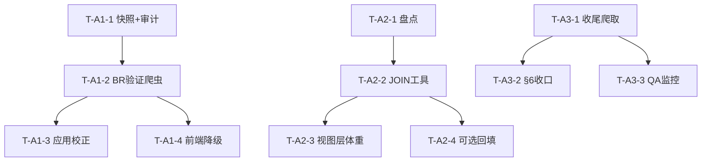

# NBACore Studio v8 — 数据质量修复架构设计

**作者**：Bob（高见远），架构师
**日期**：2026-07-12
**范围**：3 个已知数据质量问题的实地诊断 + 修复架构设计 + 任务分解
**原则**：数据质量优先于前端；所有写操作遵守 §6 四层隔离；用真实查询复核，不轻信记忆。

---

## 0. 执行摘要（关键结论先讲）

| 问题 | 记忆中的描述 | 实地复核后的真实状态 | 结论 |
|------|-------------|---------------------|------|
| **A1 draft_picks.player_id** | 部分行 player_id 指错 BR id，点链接 404 | 8446 行中 **3998 行** player_id 不在 `dim_players`；但可用"姓名/姓名+学校"自动纠正的子集 = **0** | 绝大多数 3998 是"被选但从未打 NBA、无 BR 球员页"的球员，链接 404 是**天然现象，非可纠正错误**。真正"指错人"的子集**无法仅靠 DB 隔离，需 BR 验证**。 |
| **A2 37 张表缺体重** | 37 张表本应带体重字段 | 全库 91 表，41 张有球员键，**恰好 37 张**缺体重列（属实） | 体重属**球员维度属性**，应通过 **JOIN `dim_players`** 提供，而非向 37 张表物理回填（反范式/漂移/37 次迁移风险）。 |
| **A3 BR 体重爬取** | 只完成约 40/4607，大量缺失 | 爬取宇宙（`player_per_game`）**5416** 人，**仅剩 3 人**未爬；`dim_players` 体重 **5473/5476** | **"40/4607" 记忆已过时**。体重实际 ~99.9% 完成。剩余工作 = 收尾 3 人 + 回填派生 weight_kg + 固化可续跑/§6 收口。 |

> ⚠️ **给主理人的提醒**：A3 的"大量缺失"已不成立，投料爬取前请先确认；A1 的"47% 错误"被严重高估，真正可自动修正的极少。两个结论都依赖真实查询，已记录在 §1。

---

## 1. 实地诊断（真实数据，非推测）

环境：`backend/core/db.batch_query`（SELECT-only），venv `.venv/Scripts/python.exe`，前缀 `env -u http_proxy ...`。
DB：`localhost:5433/nba`，`postgres/postgres`。

### A1 — `draft_picks.player_id`

**结构**
- `draft_picks` 是 **VIEW**，定义：`SELECT ... FROM dim_draft_history`（28 列）。
- 基表 **`dim_draft_history`**：8446 行，29 列，含关键列 `player_id` 与 **`player_id_orig`**（原始抓取值，回滚锚点）。
- `player_id` 格式为 BR id（如 `peterbu01`、`jamesle01`，长度分布：len6=2, len7=108, len8=696, len9=7637, NULL=3）。

**错误规模**
- `draft_picks.player_id NOT IN dim_players.player_id` → **3998 行（47.3%）**。
- 但纠正信号几乎为零：
  - `player_name IN dim_players 但 player_id NOT IN dim_players` → **0 行**
  - 姓名唯一匹配（同表仅 1 人）→ **0 行**
  - 姓名+学校精确匹配到 `dim_players` 但 id 不同 → **0 行**
- `dim_draft_history` 中 `player_id IS DISTINCT FROM player_id_orig` → **376 行**（历史已有一次校正尝试）。
- 3998 行中 **3868 行有 college** 字段（但组合匹配仍无结果）。

**判定**
- 3998 行绝大多数 = 被选秀但**从未出现在 NBA 比赛**、故 `dim_players`（仅含有 BR 球员页的球员）中不存在的球员。其 BR 链接 404 是数据现实，**没有"正确 id"可替换**。
- 真正"指错人"（id 指向了别的真实球员 / 乱码）的子集**无法用 DB 内信号隔离**，唯一可靠方法是逐条 BR 验证（抓取页面确认 `player_name` 是否一致）。
- 修复必须打 `dim_draft_history.player_id`（VIEW 自动透传），并以 `player_id_orig` + 备份表为回滚锚点。

### A2 — 体重字段缺失

**全库盘点**
- 总表数：**91**；含球员键（`player_id` 或 `br_player_id`）的表：**41**；其中**缺体重列者：恰好 37**（与记忆一致）。

**37 张表清单（含 JOIN 键 / 类型 / 标记）**

| 表 | 球员键 | 类型 | 备注 |
|----|--------|------|------|
| all_star_selections | player_id | BASE | |
| dim_draft_history | player_id | BASE | |
| draft_pick_history | player_id | VIEW | |
| draft_picks | player_id | VIEW | |
| end_of_season_teams | player_id | BASE | |
| fact_player_season_stats | player_id | BASE | |
| play_by_play | br_player_id | BASE | |
| play_by_play_dup2026_bak | br_player_id | BASE | **[备份/不要动]** |
| player_advanced | player_id | VIEW | |
| player_award_shares | player_id | BASE | |
| player_contracts | player_id | BASE | |
| player_contracts_league | player_id | BASE | |
| player_game_details | player_id | VIEW | |
| player_gamelog | br_player_id | BASE | |
| player_gamelog_dup2026_bak | br_player_id | BASE | **[备份/不要动]** |
| player_id_bridge | br_player_id | BASE | **[桥表/不应带体重]** |
| player_per_100_poss | player_id | VIEW | |
| player_per_36_minutes | player_id | VIEW | |
| player_per_game | player_id | VIEW | |
| player_play_by_play | player_id | BASE | |
| player_season_info | player_id | BASE | |
| player_season_splits | player_id | BASE | |
| player_shooting | player_id | BASE | |
| player_totals | player_id | VIEW | |
| playoff_player_advanced | player_id | VIEW | |
| playoff_player_per_100 | player_id | VIEW | |
| playoff_player_per_36 | player_id | VIEW | |
| playoff_player_per_game | player_id | VIEW | |
| playoff_player_shooting | player_id | VIEW | |
| playoff_player_totals | player_id | VIEW | |
| v_player_env_metrics | player_id | VIEW | |
| v_player_growth_tracking | player_id | VIEW | |
| v_player_per_100_poss | player_id | VIEW | |
| v_player_per_36_min | player_id | VIEW | |
| v_player_per_game | player_id | VIEW | |
| v_player_role_tags | player_id | VIEW | |
| v_player_tactical_profile | player_id | VIEW | |

**体重当前存在位置**
- `dim_players.weight_lbs` / `weight_kg`：**5473/5476** 有值（仅 3 行 NULL：`mitchmu01` Murray Mitchell、`wertira01` Ray Wertis、`leedi01` Dick Lee）。
- `player_weight_history`：5473 行 / 5473 去重球员（BR 爬取的原始体重档）。
- **JOIN 键**：`player_id`（BR id）或 `br_player_id`（如 `player_gamelog`/`play_by_play`），二者均为 BR id，可 `JOIN dim_players ON player_id = <键>`。
- 读路径已有先例：`backend/data_layer/joins.py` 已用 `p.weight_lbs` JOIN；`growth_loader.py` 已取 `p.weight_lbs, p.weight_kg`。

### A3 — BR 体重爬取

**现有爬虫**：`C:/autopick/AutoPick/nba_data/crawler/scrape_player_weight.py`（父目录 `nba_data/crawler/`，非 omega 内）。
- 写目标表 **`player_weight_history`**（`player_id` PK，`ON CONFLICT (player_id) DO UPDATE` → **幂等可重跑**）。
- 待爬队列来源：`player_per_game`（**VIEW**，去重 `player_id` 5416），`WHERE player_id NOT IN (SELECT player_id FROM player_weight_history)` → **自动跳过已爬**。
- 速率：默认 12–18s/请求（≈3–5/min，远低于 § 上限 15/min）；连续失败 3 次即停（防封）。
- 复用 `br_safe_scraper`/`BrowserManager` 过 CF；cookie 持久化。

**真实进度（复核）**
- `player_per_game` 去重球员 = **5416**；其中仍未爬 = **3**。
- `dim_players` 体重 **5473/5476**；`player_weight_history` 5473 行。
- `dim_players` 有体重但不在 `player_weight_history` = **0**（两表一致）。
- `player_weight_history.weight_kg` 仅 **3912/5473**（kg 可由 lbs 派生，无需再爬）。
- **"40/4607" 记忆已过时**；当前爬取宇宙分母应为 ~5416，而非 4607，且基本已完成。

---

## 2. 修复方案设计（3 问题）

### §6 四层隔离约束（硬性，贯穿三问题）
- **写收口**：所有 DDL / 回填 / 爬取落库必须在**数据层/引擎层**用 `psycopg2` **参数化 SQL** 执行（参考 `backend/data_layer/` 写路径 / `import_engine`）。
- **路由层禁令**：`backend/api/routers/*` 不得出现任何 SQL 子串（仅调用数据层/服务层函数）。
- **前端禁令**：不计算任何坐标/聚合；体重由后端 JOIN 后随行返回。
- **爬虫落库**：走现有 crawler 写路径，或新建 `backend/data_layer/` 下参数化写模块；复用 `BrowserManager` 单会话过 CF，速率 ≤15/min。

---

### A1 — `draft_picks.player_id` 校正

**目标状态**
- 高置信度的"指错人"行被校正到 `dim_players` 中的正确 BR id；所有变更前均有快照与 `player_id_orig` 锚点。
- 对"无 BR 球员页"的球员，前端对其 BR 链接做**健壮性降级**（不渲染死链），而非强行改 id。
- 历史 376 次校正被审计，错误校正被回滚。

**技术方案**
1. **基线快照 + 审计（先做的低风险步）**
   - `CREATE TABLE dim_draft_history_bak_<YYYYMMDD> AS SELECT * FROM dim_draft_history;`
   - 审计 376 行 `player_id != player_id_orig`：逐条（或批量）BR 验证 `player_name` 是否一致；不一致的回滚到 `player_id_orig` 或重校正。
2. **候选集 + BR 验证爬虫（唯一可靠隔离手段）**
   - 独立 CLI（参考 `scrape_player_weight.py` 模式，复用 `BrowserManager`，速率 ≤15/min）遍历 3998 候选 id，抓取 `https://www.basketball-reference.com/players/{id[0]}/{id}.html`，分类：
     - 页面存在且 `player_name` 一致 → id 正确（该球员可能也该进 `dim_players`）；
     - 404 / `player_name` 不符 → id 错误或球员无页；尝试用 (姓名+学校+选秀年+球队) 在 BR 选秀页反查正确 id。
   - 产出**校正映射表** `draft_id_corrections (wrong_id, correct_id, evidence, confidence)`（参数化落库）。
3. **应用校正（参数化 UPDATE，先 dry-run 报告后 execute）**
   - `UPDATE dim_draft_history SET player_id = %s WHERE player_id = %s AND <高置信>;`（保留 `player_id_orig` 不变）。
   - 仅对 `confidence = high` 的行落库；中/低置信留给人工复核。
4. **前端降级**：`frontend/js/app.js` 的选秀视图中，若 `player_id NOT IN dim_players`，BR 链接渲染为"无资料"而非可点击死链。

**§6 合规**：快照/UPDATE/映射表写入全部走 `import_engine` 参数化写；爬虫为独立 CLI（skill 已允许），复用 `BrowserManager`。
**风险与回滚**：
- 误校正风险 → 用 `dim_draft_history_bak_<date>` + `player_id_orig` 一键回滚：`UPDATE ... SET player_id = player_id_orig WHERE ...`。
- 爬取触发 CF → 速率 ≤15/min、连续失败即停、冷却后再续（幂等可重跑）。
- 不影响线上查询：VIEW 透传基表，校正即时生效；建议在低峰期批量 UPDATE。

---

### A2 — 37 张表体重可用性

**目标状态**
- 所有"需要展示/使用体重"的球员键查询，通过 **JOIN `dim_players`**（或历史场景 JOIN `player_weight_history`）获得体重；**不向 37 张表物理回填体重列**。
- 单一数据源（`dim_players.weight_lbs/kg`），无漂移。

**技术方案**
1. **分类盘点（37 → 可动/不可动）**
   - 排除：`play_by_play_dup2026_bak`、`player_gamelog_dup2026_bak`（备份）、`player_id_bridge`（桥表）→ 不处理。
   - VIEW（约 15 张）：不可 `ALTER`，体重须经其底层 SELECT 或消费方 loader 的 JOIN 提供。
   - BASE 事实表（其余）：在各自 data_layer loader 中加 `LEFT JOIN dim_players`。
2. **统一 JOIN 工具**：在 `backend/data_layer/joins.py` 新增 `join_player_weight(key_col)`  helper，按 `player_id` 或 `br_player_id` 返回 `weight_lbs, weight_kg`，被各 loader 复用（已见于 `joins.py`/`growth_loader.py` 模式）。
3. **回填派生字段（如确需物理列的具体表）**：仅对团队明确要求物理列的少数表，做**定向**参数化 `UPDATE ... SET weight_lbs = (SELECT weight_lbs FROM dim_players WHERE ...)` + 备份表 + 幂等重跑。**不做 37 张全量回填**。
4. **Schema Registry / 文档更新**：在 `backend/data_layer/schema.py` 标注各表"体重经 JOIN 获取"，并补 QA 检查。

**§6 合规**：JOIN 为只读（数据层）；任何定向回填走参数化 UPDATE（数据层），路由层零 SQL。
**风险与回滚**：
- 不做 37 表 DDL → 几乎无迁移风险；VIEW 不改动。
- 定向回填风险：先 `CREATE TABLE <t>_bak AS SELECT * FROM <t>`，回填后可 `UPDATE ... FROM <t>_bak` 回滚。
- 不影响线上：JOIN 为读取时计算，零写入。

---

### A3 — BR 体重爬取收尾

**目标状态**
- 爬取宇宙（`player_per_game`）全部完成；`dim_players` 体重 0 NULL；`weight_kg` 全量派生。
- 爬虫为**幂等、可续跑、§6 收口**的独立任务。

**技术方案**
1. **收尾爬取**：再跑一次 `scrape_player_weight.py`（自动跳过已爬，仅处理剩余 3 人；速率合规）。
2. **派生回填（无需 BR）**：一次性参数化 `UPDATE player_weight_history SET weight_kg = ROUND(weight_lbs * 0.453592) WHERE weight_kg IS NULL;`（同步考虑 `dim_players.weight_kg`）。
3. **§6 收口**：将爬虫 `save_player()` 的写操作封装进 `backend/data_layer/` 新写模块（或显式登记为"已批准的独立 CLI"，复用 `BrowserManager`），强制速率 ≤15/min，落库参数化。
4. **一致性 QA**：定时检查 `dim_players.weight_lbs` NULL 数、`player_weight_history` vs `dim_players` 漂移、剩余爬取数。

**§6 合规**：落库参数化；爬虫为独立 CLI 复用 `BrowserManager`（skill 已批准模式）。
**风险与回滚**：
- 爬取中断 → 幂等，重跑安全（`ON CONFLICT DO UPDATE` + 跳过已爬）。
- CF 封禁 → 停手冷却；本任务仅剩 3 人，风险极低。
- 不影响线上：体重已 99.9% 就绪，仅为补尾。

---

## 3. 任务分解清单（交工程师实现）

> 格式：`任务名 / 涉及文件 / 依赖 / 工作量(轻·中·重)`。所有写操作遵守 §6。

### A1 工作流（draft_picks.player_id 校正）
| ID | 任务名 | 涉及文件 | 依赖 | 工作量 |
|----|--------|---------|------|--------|
| T-A1-1 | 基线快照 + 审计 376 历史校正 | `backend/data_layer/`（新备份/审计模块）、`scripts/`（审计 SQL） | — | 轻 |
| T-A1-2 | 候选集 BR 验证爬虫 + 校正映射表 | `crawler/`（新验证 CLI，复用 `BrowserManager`）、`draft_id_corrections`(新表) | T-A1-1 | 重 |
| T-A1-3 | 应用高置信校正（参数化 UPDATE，dry-run→execute） | `backend/data_layer/import_engine`、`dim_draft_history` | T-A1-2 | 中 |
| T-A1-4 | 前端 BR 链接健壮性降级 | `frontend/js/app.js`（选秀视图） | T-A1-2 | 轻 |

### A2 工作流（37 表体重可用性）
| ID | 任务名 | 涉及文件 | 依赖 | 工作量 |
|----|--------|---------|------|--------|
| T-A2-1 | 37 表分类与读路径盘点（排除 2 备份 + 1 桥表） | `docs/`（盘点表）、`backend/data_layer/`（各 loader 审计） | — | 轻 |
| T-A2-2 | 统一体重 JOIN 工具 + 应用到 BASE 事实表读路径 | `backend/data_layer/joins.py`、`game_loader.py`、`team_loader.py`、`player_chart_loader.py`、`growth_loader.py`、`entity_loader.py`、`batch_loader.py` | T-A2-1 | 中 |
| T-A2-3 | 视图层体重（确保消费方 loader JOIN dim_players） | `backend/data_layer/*_loader.py`、`backend/data_layer/schema.py` | T-A2-2 | 中 |
| T-A2-4 | （可选）定向物理列回填（仅团队明确要求的表） | `backend/data_layer/import_engine`、对应 `<t>_bak` 备份表 | T-A2-2 | 中 |

### A3 工作流（体重爬取收尾）
| ID | 任务名 | 涉及文件 | 依赖 | 工作量 |
|----|--------|---------|------|--------|
| T-A3-1 | 收尾爬取剩余 3 人 + 派生回填 weight_kg | `crawler/scrape_player_weight.py`（运行）、`backend/data_layer/`（kg 回填） | — | 轻 |
| T-A3-2 | 爬虫落库 §6 收口（封装写模块 / 登记为批准 CLI） | `backend/data_layer/`（新体重写模块）、`crawler/scrape_player_weight.py` | T-A3-1 | 中 |
| T-A3-3 | 体重一致性 QA 监控 | `backend/data_layer/system_loader.py` 或 `monitor` router、`tests/` | T-A3-1 | 轻 |

### 依赖关系（mermaid）


---

## 4. 待明确事项（需主理人/用户确认）

1. **A3 投料优先级**：复核显示体重已 ~99.9% 完成，"40/4607"记忆过时。是否仍按原计划投料爬取？建议先跑 T-A3-1 收尾即可。
2. **A1 "可纠正错误"的定义**：DB 内无自动信号隔离"指错人"子集（姓名/学校匹配=0）。是否接受"仅 BR 验证能确认的行才校正"的策略？还是希望对所有 3998 做保守处理（如统一标记 `br_link_unverified`）？
3. **A2 是否真要物理列**：当前推荐 JOIN-at-read（不碰 37 表）。若某些下游（导出/第三方）强制要物理 `weight` 列，请指明**具体哪几张表**，走 T-A2-4 定向回填，而非全量 37 张。
4. **`dim_players` 3 个 NULL 体重**（`mitchmu01`/`wertira01`/`leedi01`）：是否并入 A3 收尾一并补齐？
5. **历史 376 行 `player_id != player_id_orig`**：是否需先回滚到 `player_id_orig` 再统一重新验证（更保守），还是仅审计不改？

---

## 附：诊断查询可复现
诊断脚本（SELECT-only，venv 运行）位于 `docs/diagnostics/`：
- `docs/diagnostics/_diag_bob.py`（A1/A2/A3 主体）
- `docs/diagnostics/_diag_bob2.py`（A1 姓名可纠正性 / A2 逐表键 / A3 续跑）
- `docs/diagnostics/_diag_bob3.py`（VIEW 定义 / `dim_draft_history` / `player_id_orig`）
- `docs/diagnostics/_diag_bob4.py`（A1 高精度候选 / 组合匹配）

运行方式（必须前缀 unset proxy，PYTHONPATH 指向项目根）：
```
cd <project_root>
env -u http_proxy -u https_proxy -u HTTP_PROXY -u HTTPS_PROXY ^
  PYTHONPATH="<project_root>" .venv/Scripts/python.exe docs/diagnostics/_diag_bob.py
```
