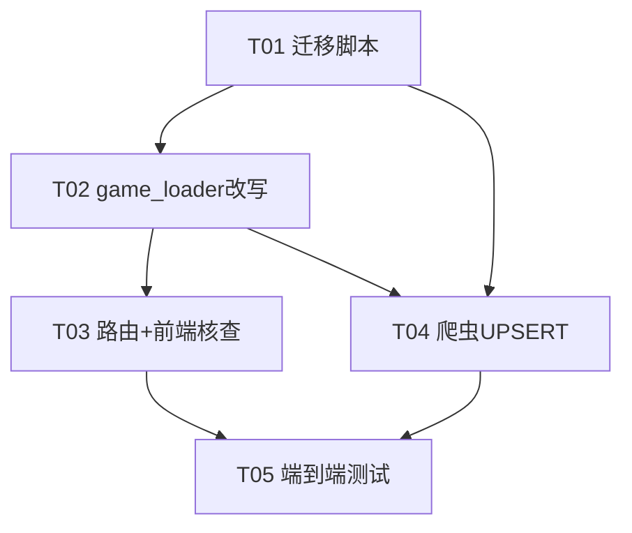

# NBACore v8 — `games.game_id` → Basketball Reference 命名迁移方案 + 任务分解

> 范围：仅 `season IN (2025, 2026)`（即 2024-25、2025-26 两季）。老赛季暂不迁移。
> 本文件为**设计与任务分解**，不写最终代码；工程师据此实现。
> 现有 `docs/system_design.md` 为 v8 总体架构，本文为其针对本次迁移的专项附录，未改动它。

---

## 1. 实现方案（A–E）与列语义

### 1.1 列语义（最终定义）

| 列 | 类型 | 迁移后含义 |
|----|------|-----------|
| `game_id` | text | **对外主标识**。近期两季（2025/2026）= BR 字母数字格式 `YYYYMMDD`+3字母BR缩写（如 `202605130DET`）。老赛季保持原数字 NBA-API 式（如 `22500494`）。 |
| `nba_api_id` | bigint | **数字 join 真值源** = 原 `game_id`，用于关联 `player_gamelog.gameid` / `play_by_play.gameid`。近期两季已全填；新爬比赛（未来）暂为 `NULL`。 |
| `br_crawled_id` | varchar | BR id 的持久化副本（2025 季来源）。迁移后与 `game_id` 冗余，保留作审计 / 对缺失行回填。代码库当前无任何引用。 |
| `boxscore_url` | text | BR boxscore 页面 URL；BR id 可由 `/boxscores/(\d{8,}[A-Z]{3})\.html` 正则提取（2026 季来源）。 |

> 共享判断：`game_id` 是 BR **展示/API** 真相源（迁移范围内）；`nba_api_id` 是数字 **join** 真相源。season 映射：2024-25 → `season=2025`，2025-26 → `season=2026`。

### 1.2 各步骤改动

- **A. `games.game_id` 翻成 BR（近期两季）**：通过迁移脚本 `UPDATE` 完成（见 §2）。BR 取值优先级：`br_crawled_id` 非空 → 否则 `boxscore_url` 正则提取 → 两者皆空则跳过（保留数字）。
- **B. `nba_api_id` 保留数字作 join key**：列已存在且近期两季已全填（`game_id='22500033'` ⇔ `nba_api_id=22500033`，已实测）。本步**无需改动**，只是明确语义与用途。
- **C. `game_loader` join 改用 `nba_api_id`**：所有 `WHERE gameid=%s` 前，先 `SELECT nba_api_id FROM games WHERE game_id=%s` 解析；再用 `nba_api_id` 查 gamelog/pbp。API 接收的仍是 `game_id`（现 BR 格式），内部解析即可。老赛季 `nba_api_id` 若为 `NULL`，**回退**用 `game_id` 本身作 join key（老赛季 `game_id` 即数字）。
- **D. 爬虫 `crawl_daily_games` 改 UPSERT**：按 `(game_date, home_team_abbr, away_team_abbr)` 匹配已存在行 → `UPDATE` 设 `game_id`=BR、`boxscore_url`、`br_crawled_id`（保留 `nba_api_id`/比分）；找不到才 `INSERT`（新比赛 `game_id`=BR，`nba_api_id=NULL`）。彻底消除重复行。
- **E. 前端基本不动**：传 `game_id`（现已是 BR），API 能解析。需核查是否某处用数字 id 拼 URL / 展示（见 §5、§9）。

---

## 2. 迁移脚本设计

针对 `season IN (2025, 2026)`。**必须在单个事务内、先 SELECT 复核再 UPDATE、输出影响行数、可回滚。**

### 2.1 前置核查（必做）
```sql
-- 1) game_id 是否已有 UNIQUE 约束？（预期：无，因爬虫曾插入 BR 重复行）
SELECT conname, pg_get_constraintdef(oid)
FROM pg_constraint
WHERE conrelid='games'::regclass AND contype IN ('p','u');

-- 2) 爬虫历史重复行是否存在（nba_api_id 为 NULL 的 BR 行，与数字 canonical 行同 (date,home,away)）
SELECT count(*) FROM games g
WHERE g.season IN (2025,2026) AND g.nba_api_id IS NULL
  AND EXISTS (SELECT 1 FROM games c WHERE c.game_date=g.game_date
              AND c.home_team_abbr=g.home_team_abbr AND c.away_team_abbr=g.away_team_abbr
              AND c.nba_api_id IS NOT NULL);
```

### 2.2 去重合并（关键补充）
> 发现：爬虫曾对已有数字行重复插入 BR 格式行（`nba_api_id=NULL`）。若直接 `UPDATE` 数字行→BR，会与这些 BR 重复行撞 `game_id`。故先去重：每 `(game_date,home,away)` 保留 `nba_api_id` 非空行（真正带 gamelog/pbp 的 canonical 行），将其 `boxscore_url`/`br_crawled_id` 从兄弟行回补，再删兄弟行。

```sql
-- 回补 boxscore_url / br_crawled_id 到 canonical 行
WITH grp AS (
  SELECT game_date, home_team_abbr, away_team_abbr,
         (array_agg(game_id ORDER BY (nba_api_id IS NOT NULL) DESC, game_id))[1] AS canonical_game_id
  FROM games WHERE season IN (2025,2026)
  GROUP BY game_date, home_team_abbr, away_team_abbr
  HAVING count(*) > 1
)
UPDATE games g
SET boxscore_url  = COALESCE(g.boxscore_url,  s.boxscore_url),
    br_crawled_id = COALESCE(g.br_crawled_id, s.br_crawled_id)
FROM grp
JOIN games s ON s.game_date=grp.game_date AND s.home_team_abbr=grp.home_team_abbr
            AND s.away_team_abbr=grp.away_team_abbr AND s.game_id <> grp.canonical_game_id
WHERE g.game_id = grp.canonical_game_id;

-- 删除爬虫重复行（保留 canonical）
DELETE FROM games g
WHERE g.season IN (2025,2026) AND g.nba_api_id IS NULL
  AND EXISTS (SELECT 1 FROM games c WHERE c.game_date=g.game_date
              AND c.home_team_abbr=g.home_team_abbr AND c.away_team_abbr=g.away_team_abbr
              AND c.nba_api_id IS NOT NULL);
```

### 2.3 主干 UPDATE（数字 → BR）
```sql
WITH tgt AS (
  SELECT g.game_id AS old_id,
         COALESCE(g.br_crawled_id,
                  (regexp_match(g.boxscore_url,'/boxscores/(\d{8,}[A-Z]{3})\.html'))[1]) AS br_id
  FROM games g
  WHERE g.season IN (2025,2026)
    AND g.nba_api_id IS NOT NULL
    AND (g.br_crawled_id IS NOT NULL OR g.boxscore_url ~ '/boxscores/(\d{8,}[A-Z]{3})\.html')
)
UPDATE games g SET game_id = tgt.br_id
FROM tgt WHERE g.game_id = tgt.old_id;   -- 按【旧】数字 id 关联
-- GET DIAGNOSTICS v_updated = ROW_COUNT;  -- 记录影响行数（预期 ≈ 2025 有 BR 源的行 + 2026 有 BR 源的行）
```

### 2.4 后置校验（决定 COMMIT / ROLLBACK）
```sql
-- 唯一性：应为 0 行
SELECT game_id, count(*) FROM games WHERE season IN (2025,2026)
GROUP BY game_id HAVING count(*) > 1;

-- 残留数字 id（无 BR 源，预期 = 2026 中既无 br_crawled_id 也无 boxscore_url 的 ~91 行）：仅报告，不失败
SELECT count(*) FROM games WHERE season IN (2025,2026) AND game_id ~ '^\d+$';

-- nba_api_id 非空（近期两季应全非空，预期 = 总行数）
SELECT count(*) FROM games WHERE season IN (2025,2026) AND nba_api_id IS NULL;
```

### 2.5 回滚与备份
- 事务内执行；校验异常即 `ROLLBACK`。
- 执行前建备份表：`CREATE TABLE games_bak_pre_br AS SELECT * FROM games WHERE season IN (2025,2026);`（回滚用 `INSERT ... SELECT` 还原并删新行）。
- 建议在低峰期执行；近期两季仅约 2,557 行，UPDATE/DELETE 很快，但加约束时会短暂锁表（见 §9 风险）。

---

## 3. `game_loader` 改写点清单

统一引入解析助手，逐函数把 gamelog/pbp 的 join key 从 `game_id` 换成 `nba_api_id`；老赛季 `nba_api_id=NULL` 时回退用 `game_id`。

```python
# backend/data_layer/game_loader.py 新增助手
def _resolve_join_key(conn, game_id):
    cur = conn.cursor()
    cur.execute("SELECT nba_api_id FROM games WHERE game_id=%s", (game_id,))
    row = cur.fetchone()
    nba_api_id = row[0] if row and row[0] is not None else None
    return nba_api_id if nba_api_id is not None else game_id   # 回退：老赛季 game_id 即数字
```

| 函数 | 改动要点 |
|------|---------|
| `get_game_detail(game_id)` | 先用 `game_id` 取本场 `games` 行（box score / 季度分）；调用 `_aggregate_team_stats_from_gamelog` 时传入 `join_key = _resolve_join_key(conn, game_id)`。 |
| `_aggregate_team_stats_from_gamelog(...)` | 内部 `SELECT ... FROM player_gamelog WHERE gameid=%s` 的参数由 `game_id` 改为 `join_key`（即 `nba_api_id`，回退数字）。 |
| `get_play_by_play(game_id)` | `SELECT ... FROM play_by_play WHERE gameid=%s` 改用 `join_key`。 |
| `_get_gamelog_players(game_id)` | `WHERE gameid=%s` 改用 `join_key`。 |
| `get_game_player_performance(game_id)` | 基于 gamelog，全部 `gameid=%s` 改用 `join_key`。 |
| `get_game_radar(game_id)` | 基于 gamelog，全部 `gameid=%s` 改用 `join_key`。 |

> 关键片段（以 `get_play_by_play` 为例）：
> ```python
> join_key = _resolve_join_key(conn, game_id)
> cur.execute("SELECT * FROM play_by_play WHERE gameid=%s ORDER BY event_num", (join_key,))
> ```
> 所有端点经 `games` 路由 → `game_loader`，API 入参始终是 `game_id`（BR 格式），解析发生在 loader 内。

---

## 4. 爬虫改写点（`crawl_daily_games`）

> ⚠️ 源文件定位见 §9 风险 #1：`nba_daily_crawler.py` 不在本 checkout，爬虫逻辑由 `backend/api/routers/crawler.py` 的 `_run_crawl_task` 委托给外部脚本。T04 需先确认真实路径。

原逻辑：`br_id = boxscore_url.split('/')[-1].replace('.html','')` → `SELECT 1 FROM games WHERE game_id=%s`（BR id 永远查不到数字行）→ 总是 `INSERT` 重复行。改为按 `(game_date,home,away)` 匹配：

```python
br_id = boxscore_url.split('/')[-1].replace('.html','')
cur.execute(
    "SELECT game_id, nba_api_id FROM games "
    "WHERE game_date=%s AND home_team_abbr=%s AND away_team_abbr=%s",
    (game_date, home, away))
row = cur.fetchone()
if row:
    # 已存在 → 仅更新 BR 标识字段，保留 nba_api_id / 比分 / pbp 标志
    cur.execute(
        "UPDATE games SET game_id=%s, boxscore_url=%s, br_crawled_id=%s "
        "WHERE game_date=%s AND home_team_abbr=%s AND away_team_abbr=%s",
        (br_id, boxscore_url, br_id, game_date, home, away))
else:
    # 新比赛 → 插入；nba_api_id 暂 NULL（待 gamelog 导入时回填）
    cur.execute(
        "INSERT INTO games (game_id, nba_api_id, boxscore_url, br_crawled_id, "
        "game_date, home_team_abbr, away_team_abbr, ...) "
        "VALUES (%s, NULL, %s, %s, %s, %s, %s, ...)",
        (br_id, boxscore_url, br_id, game_date, home, away))
```

可选增强：迁移后给 `games` 加 `UNIQUE (game_date, home_team_abbr, away_team_abbr)`，改为 `INSERT ... ON CONFLICT (...) DO UPDATE SET game_id=EXCLUDED.game_id, boxscore_url=EXCLUDED.boxscore_url, br_crawled_id=EXCLUDED.br_crawled_id`（不覆盖 `nba_api_id`/比分）。加约束前必须先完成 §2.2 去重。

---

## 5. 文件列表（相对仓库根）

| 文件 | 改动类型 |
|------|---------|
| `migrations/2025xxxx_games_gameid_to_br.sql` | 新增：迁移 SQL（去重合并 + UPDATE + 校验 + 备份/回滚） |
| `scripts/run_migration.py` | 新增：dry-run / apply / rollback 运行器（psycopg2） |
| `scripts/verify_migration.py` | 新增：唯一性 / 非空 / 格式校验脚本 |
| `backend/data_layer/game_loader.py` | 改：新增 `_resolve_join_key`；6 个函数 join 改 `nba_api_id` + 回退 |
| `backend/api/routers/games.py` | 核查：端点入参 `game_id` 透传即可，预期**无需改**（仅确认无内部数字 id 假设） |
| `frontend/js/app.js` | 核查：`showGameDetail` / `api('/games/'+gameId)` 传 BR id，确认无数字 id 拼 URL/展示 |
| `backend/api/routers/crawler.py` | 改（或改其委托的外部爬虫脚本）：`crawl_daily_games` → UPSERT（见 §9 #1） |
| `backend/core/db.py` | 参考：DB 连接助手（migration runner / loader 复用） |
| `tests/test_gameid_migration.py` | 新增：迁移 + 解析 + 爬虫复跑端到端测试 |
| `docs/games_gameid_migration.md` | 本文 |
| `docs/games_gameid_class.mermaid` / `docs/games_gameid_sequence.mermaid` | 配套图 |

---

## 6. 任务列表（有序，按实现顺序，≤5 个）

| Task | 名称 | 源文件 | 依赖 | 优先级 |
|------|------|--------|------|--------|
| **T01** | 数据库迁移脚本（去重合并 + UPDATE + 唯一性校验 + 备份/回滚） | `migrations/2025xxxx_games_gameid_to_br.sql`, `scripts/run_migration.py`, `scripts/verify_migration.py` | 无 | P0 |
| **T02** | `game_loader` 改写（引入 `nba_api_id` 解析 + gamelog/pbp join 切换 + 老赛季回退） | `backend/data_layer/game_loader.py`, `backend/core/db.py`, `tests/test_gameid_migration.py` | T01 | P0 |
| **T03** | `games` 路由确认 + 前端核查（API 透传、前端无数字 id 依赖） | `backend/api/routers/games.py`, `frontend/js/app.js`, `tests/test_gameid_migration.py` | T02 | P1 |
| **T04** | 爬虫 UPSERT 改写（去重 + `INSERT/UPDATE` + 加唯一约束） | `backend/api/routers/crawler.py`（或外部爬虫脚本，见 §9 #1）, `migrations/002_add_games_unique_constraint.sql`, `tests/test_gameid_migration.py` | T01, T02 | P1 |
| **T05** | 端到端测试与验证（迁移核对 + 爬虫复跑行数不变） | `tests/test_gameid_migration.py`, `scripts/verify_migration.py`, `docs/test_report.md` | T01–T04 | P0 |

> 说明：将原 6 项（迁移/loader/路由/爬虫/前端/测试）压缩为 5 项——③路由确认与⑤前端核查合并为 T03，⑥测试并入 T05。每任务 ≥3 个相关文件。T01 即本次迁移的“基础”，对应通用模板里的首项。



---

## 7. 依赖包

无新增依赖。复用现有：`psycopg2`（DB 连接）、爬虫既有库（`undetected_chromedriver` 等）、`pytest`（测试）。纯 SQL + 现有 Python 栈。

---

## 8. 共享知识（跨任务约束）

- BR id 正则（取值）：`/boxscores/(\d{8,}[A-Z]{3})\.html`；格式校验：`^(\d{8,})([A-Z]{3})$`。
- `nba_api_id` 是数字 join 真相源（`player_gamelog.gameid` / `play_by_play.gameid`）。
- `game_id` 是 BR 展示/API 真相源（迁移范围内 2025/2026）；老赛季保持数字。
- `(game_date, home_team_abbr, away_team_abbr)` 是比赛的自然唯一键，UPSERT 与去重均以此为锚。
- season 映射：2024-25 → `season=2025`；2025-26 → `season=2026`。
- loader 解析铁律：`join_key = nba_api_id if nba_api_id is not None else game_id`（兼顾老赛季与新爬行）。

---

## 9. 待明确 / 风险

1. **爬虫源文件缺失（阻塞 T04）**：team-lead 指定的 `nba_daily_crawler.py` 不在本 checkout；爬虫逻辑由 `backend/api/routers/crawler.py` 的 `_run_crawl_task` 委托给外部脚本（`_get_crawler_script`）。**需在实现 T04 前确认 `crawl_daily_games` 真实路径/分支**，否则改写点无法落地。
2. **`game_id` 无 UNIQUE 约束**：预期无（爬虫曾插 BR 重复行）。迁移靠 §2.2 去重保证近期两季 BR id 唯一；老赛季数字 id 不与 BR 冲突（BR 含字母）。可后续加 `UNIQUE(game_id)` 与 `UNIQUE(game_date,home,away)`。
3. **老赛季 `nba_api_id` 是否为空**：本发现仅覆盖 2025/2026（全有）。老赛季当前 `game_loader` 直接用 `game_id` join gamelog（数字，正常）。改写后若老赛季 `nba_api_id=NULL`，靠 §3 回退用 `game_id` 仍可工作——但需 T03/T05 实测一条老赛季回归验证。
4. **迁移期间服务是否停**：近期两季仅约 2,557 行，UPDATE/DELETE 快；加约束时短暂锁表。建议低峰期执行，或先在从库/备份验证；非必须停服。
5. **`pbp_saved` / `pbp_imported` 等字段**：属 `games` 或 pbp 表的每行标志，随 canonical 行保留（去重时保留 `nba_api_id` 非空行即保留这些标志）。需确认它们挂在 `games` 行上（而非以 `game_id` 为外键的独立表）；若是独立表且以 `game_id` 关联，则需同步更新其外键——T02 核查时一并确认。
6. **新爬比赛 `nba_api_id=NULL` 的空窗**：爬虫 `INSERT` 新比赛时 `nba_api_id` 暂为 `NULL` → gamelog/pbp 暂时 join 不上（端点返回空）。是否可接受？建议：在 gamelog 导入流程中按 `(game_date,home,away)` 回填 `nba_api_id`，闭合循环。T04 实现时确认回填路径。
7. **2026 季约 91 行无 BR 源**：既无 `br_crawled_id` 也无 `boxscore_url`，迁移后保留数字 `game_id`（不翻 BR）。这些行的 gamelog/pbp join 走 `nba_api_id`（已填），**不受影响**，仅前端展示为非 BR id。是否需补爬 boxscore 另议。

---

## 10. 测试计划

1. **迁移正确性**：迁移后近期两季 `game_id` 全部匹配 `^\d{8,}[A-Z]{3}$` 且 `GROUP BY game_id HAVING count(*)>1` 为 0；`nba_api_id` 全非空（近期两季）；`game_id ~ '^\d+$'` 仅余预期的 ~91 行（2026 无 BR 源）。
2. **`get_game_detail(BR_id)` 正常**：传入 BR id 返回正确本场（box score / 季度分）。
3. **join 走 `nba_api_id`**：以 BR id 调用 `get_game_radar` / `play_by_play` / `get_game_player_performance` / players 端点，仍返回数据（验证 gamelog/pbp 经 `nba_api_id` 关联成功）。
4. **爬虫幂等**：对同一历史赛季 schedule 复跑爬虫，行数不变、缺失 BR id 被补全、无新增重复行（验证 UPSERT）。
5. **老赛季回归**：取一条 pre-2025 数字 `game_id`，端点仍可返回数据（验证 `nba_api_id=NULL` 回退路径不破老行为）。
6. **回滚演练**：在备份库执行 T01，校验通过后 `ROLLBACK`，确认数据无损、可还原。

---

## 附：配套图

- 实体/关联图：`docs/games_gameid_class.mermaid`
- 调用时序图（以 `get_game_detail` 为例）：`docs/games_gameid_sequence.mermaid`
