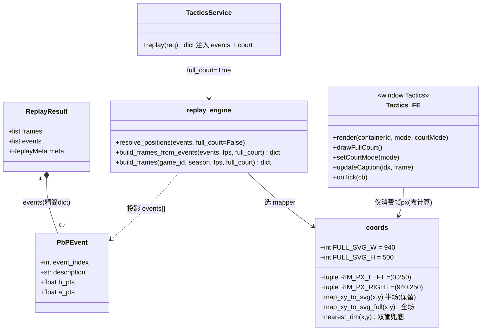

# PBP 全场回放 + 文字同步 — 增量架构设计（NBACore Studio v8）

- **作者**：高见远（架构师 Bob）
- **日期**：2026-07-12
- **范围**：在现有 `tactics_engine`（v8 T04–T07）之上做两处增量
  1. **B1** — PBP 回放改为**全场**坐标（双篮筐广播视角）；战术板模板保持半场。
  2. **B2** — 回放时**同步显示 PBP 文字解说**（含节次 / 时钟 / 比分）。
- **硬约束（§6）**：写/取数走数据层参数化 SQL；路由 `backend/api/routers/tactics.py` 不改；前端零坐标计算。

---

## A. 实地复核（DB 抽样，venv + 取消代理）

**环境**：`.venv/Scripts/python.exe`（py3.10 + psycopg2），`env -u http_proxy -u https_proxy -u HTTP_PROXY -u HTTPS_PROXY`；DB `localhost:5433 / nba / postgres`（来自 `backend/core/config.py`）。

### A.1 关键发现 —— 修正原始假设

原始需求假设「`homedescription`/`visitordescription` 更口语化、含队名，最适合展示」。**联库抽样证明该假设不成立**：

| 检查项 | 结果 |
|---|---|
| `play_by_play` 文本/记分列是否存在 | ✅ 存在 `description` / `homedescription` / `visitordescription` / `neutraldescription` / `period` / `clock_seconds` / `h_pts` / `a_pts` / `scorehome` / `scorevisitor` / `scoremargin` |
| **全局 2026 `br_crawler` 非空率**（653,519 行） | `description` = **653,519（100%）**；`homedescription` = **0**；`visitordescription` = **0**；`neutraldescription` = **0** |
| 2025 `br_crawler` 抽样（22400001/2/3） | 同构：`description` 100%，`home`/`visitor` 全 0 |
| `scorehome`/`scorevisitor`（game 22500001） | **全 NULL** |
| `h_pts`/`a_pts`（game 22500001，611 行） | 仅在得分行非空：**154 / 611** |

> **结论（设计决策）**：展示用文字列**只能用 `description`**（100% 填充、可读性好，如 `S. Jump misses 3-pt shot from 25 ft`、`H. Layup makes 2-pt shot from 1 ft`、`Rockets Turnover: Shot Clock (T#1)`）。`homedescription`/`visitordescription` 在本数据源全部为空，不可用。`scorehome`/`scorevisitor` 为空，记分牌需对 `h_pts`/`a_pts` 做「末次非空向前填充（carry-forward）」。

### A.2 样本（game `22500001`，season 2026，第 1 节前若干事件）

| period | clock_s | h_pts / a_pts | description |
|---|---|---|---|
| 1 | 720.0 | – / – | Start of 1st Period (7:44 PM EST) |
| 1 | 720.0 | – / – | Jump Ball Holmgren vs. Adams: Tip to Thompson |
| 1 | 696.0 | – / – | S. Jump misses 3-pt shot from 25 ft |
| 1 | 686.0 | 2 / 0 | H. Layup makes 2-pt shot from 1 ft |
| 1 | 686.0 | – / – | S. FOUL by A. Jr. |
| 1 | 686.0 | 3 / 0 | C. Holmgren makes free throw 1 of 1 |
| 1 | 650.0 | 5 / 2 | H. Jump makes 2-pt shot from 7 ft |
| 1 | 624.0 | – / – | Rockets Rebound |
| 1 | 624.0 | – / – | Rockets Turnover: Shot Clock (T#1) |

→ `description` 信息量充足、含球员缩写 + 动作 + 距离 + 队名（部分），**适合做同步解说条**。

### A.3 记分牌可行性

- `period`：1–4 为常规，5/6 为 OT（可映射 `Q1…Q4` / `OT1` / `OT2`）。
- `clock_seconds`：0–720（12 分钟 × 60），可格式化为 `M:SS`（如 `720 → 12:00`，`448 → 7:28`）。
- `h_pts`/`a_pts`：仅得分事件非空（154/611）。**前端对 `events[]` 做末次非空向前填充**即可得到任意时刻比分 → `Q1 7:32 | 42-38`。纯展示逻辑，不违反 §6。

### A.4 现状基线（回放当前为半场）

`replay_verify.json`（game 22500001）实测：`meta.court={"w":500,"h":470}`、`frame_count=3661`、`fps=20`、坐标 `max x_px=483, y_px=470` → **确认回放当前被折叠成半场**（错）。改造后须为 `[0,940] × [0,500]`。

---

## B. 增量架构设计

### B1. 回放全场坐标（广播视角，双篮筐）

**原则**：新增一套**独立的**全场映射函数；**保留**现有 `map_xy_to_svg`（半场，供战术板模板）。动画层 `animation.build_frames` 只做像素插值，完全不改。

#### B1.1 `coords.py` 新增（唯一映射点，确定性、无副作用）

```python
# ── 全场（广播视角）SVG 尺寸：保持 94:50 真实比例，1:1 像素 ──
FULL_SVG_W: int = 940   # 94 ft × 10 = 940 单位
FULL_SVG_H: int = 500   # 50 ft × 10 = 500 单位

def map_xy_to_svg_full(x: float, y: float) -> tuple[float, float]:
    """NBA (x,y) → 全场 SVG 像素（广播视角，篮筐在左右两端）。
    x∈[-250,250] 横向；y∈[0,940] 纵向（0=左底线，940=右底线）。
      sx = y * (FULL_SVG_W/940)   → y=0→左端(0)，y=940→右端(940)
      sy = (x+250) * (FULL_SVG_H/500) → x=-250→顶(0)，x=250→底(500)
    """
    sx = float(y) * (FULL_SVG_W / FULL_COURT_Y)          # FULL_COURT_Y=940
    sy = (float(x) + 250.0) * (FULL_SVG_H / 500.0)
    return (sx, sy)

# 双篮筐像素（全场广播视角）：左端 (0,250)、右端 (940,250)
RIM_PX_LEFT  = (0.0, FULL_SVG_H / 2.0)    # (0.0, 250.0)
RIM_PX_RIGHT = (FULL_SVG_W, FULL_SVG_H / 2.0)  # (940.0, 250.0)

def nearest_rim(x: float, y: float) -> tuple[float, float]:
    """坐标缺失/(0,0) 投篮的兜底落点：按 shooter 所在半场选就近篮筐。
    y<470（左半场）→ 左筐；否则 → 右筐。绝不返回 (0,0)。"""
    return RIM_PX_LEFT if float(y) < COURT_HALF_Y else RIM_PX_RIGHT
```

**边界自检（写测试用）**：

| 源 (x,y) | map_xy_to_svg_full | 说明 |
|---|---|---|
| (-250, 0) | (0, 0) | 左上角 |
| (250, 0) | (0, 500) | 左下角 |
| (-250, 940) | (940, 0) | 右上角 |
| (250, 940) | (940, 500) | 右下角 |
| (0, 0) | (0, 250) | 左筐 |
| (0, 940) | (940, 250) | 右筐 |
| (0, 470) | (470, 250) | 中线中点（中圈） |

→ 全部落在 `[0,940] × [0,500]`，无越界。

#### B1.2 `replay_engine.resolve_positions(events, full_court: bool = False)`

- 新增参数 `full_court`，**默认 `False`**（保留现有半场/模板路径与既有单测，见 §C / 待明确事项）。
- 内部 `mapper = coords.map_xy_to_svg_full if full_court else coords.map_xy_to_svg`。
- 初始篮球：`{"x_px": (FULL_SVG_W/2 if full_court else SVG_W/2),
  "y_px": (FULL_SVG_H/2 if full_court else SVG_H-40), "holder": None}`（full court → 中圈 (470,250)）。
- **真实坐标投篮**（has_real_coords）：`actor_px = mapper(ev.x, ev.y)`，`pos_source="real"`。
- **缺失坐标投篮 (0,0)**：`actor_px = coords.nearest_rim(ev.x, ev.y)`（→ 左/右筐，**绝不为 (0,0)**），`pos_source="default"`，球 `holder=None`。
- **无历史 actor 默认位**：`actor_px = mapper(dx, dy)`（用现有 `dx/dy` 默认错位逻辑，仅换映射器）。
- 篮球持有/标注逻辑、last-known 策略、AST 气泡全部**保持不变**。
- `ResolvedEvent` **无需新增字段**（文字/比分由 B2 的 `events[]` 从 `PbPEvent` 投影，见 B2）。

#### B1.3 透传链（回放恒 `full_court=True`）

- `build_frames_from_events(events, fps=30, full_court=False)` → 调 `resolve_positions(events, full_court)`。
- `build_frames(game_id, season, fps=30, full_court=False)` → 透传。
- `service.replay(req)` → 调 `build_frames_from_events(events, fps, full_court=True)`；`_build_meta` 写入 `court = {"mode": "full", "w": FULL_SVG_W, "h": FULL_SVG_H}`（即 `{w:940,h:500}`）。
- **战术板模板**（`service.render_template` / `animation.build_frames_from_template`）继续用 `map_xy_to_svg`（半场），`meta.court` 不变 `{w:500,h:470}`。
- `animation.build_frames` **不改**（纯像素插值，坐标系无关）。

---

### B2. PBP 文字同步

#### B2.1 数据层 `db.load_pbp_events`（参数化，加列）

在现有 SELECT 增加 `description, h_pts, a_pts`（`period`/`clock_seconds` 已取）。**列名用常量**，仍走 `core_db.batch_query(sql, (...))` 参数化占位符，**不拼表名/不拼值**。

```python
# 列名常量（避免字符串散落）
PBP_TEXT_COL = "description"
PBP_HSCORE_COL = "h_pts"
PBP_ASCORE_COL = "a_pts"
# SELECT 增加: description, h_pts, a_pts
# PbPEvent(..., description=r[PBP_TEXT_COL] or "", h_pts=float(r[PBP_HSCORE_COL] or 0), a_pts=...)
```

#### B2.2 `schemas.py` 扩展

- `PbPEvent` 新增：`description: str = ""`、`h_pts: float = 0.0`、`a_pts: float = 0.0`。
- `ReplayResult` 新增：`events: List[dict] = Field(default_factory=list)`（**顶层、不塞进每帧**，保体积）。
- `ResolvedEvent`（replay_engine 内部）**不变**（events 由 PbPEvent 投影，无需其字段）。

#### B2.3 `replay_engine.build_frames_from_events` 收集 `events`

改为返回 **dict** `{"frames": [...], "events": [...]}`，`events` 为 `PbPEvent` 列表的投影（与 frames **同序、按 `event_index` 对应**）：

```python
events_list = [{
    "event_index":  ev.event_index,
    "period":       ev.period,
    "clock_seconds": ev.clock_seconds,
    "description":  ev.description,
    "team":         ev.team,
    "action_verb":  ev.action_verb,
    "player":       ev.player,
    "player2":      ev.player2,
    "h_pts":        ev.h_pts,
    "a_pts":        ev.a_pts,
} for ev in events]
```

（`player2` 在 `PbPEvent` 已有，`ResolvedEvent` 无此字段 → 直接从 `PbPEvent` 投影，干净。）

#### B2.4 `service.replay` 注入 `events`

```python
res = replay_engine.build_frames_from_events(events, fps, full_court=True)
return {
    "game_id": req.game_id, "season": str(req.season),
    "frames": res["frames"], "events": res["events"],   # ← 新增
    "meta": self._build_meta(req, res["frames"], events, fps, full_court=True),
}
```

路由 `backend/api/routers/tactics.py` **不改**（纯塑形 `{code,data,message}`，透传 `data`）。

#### B2.5 前端 `frontend/js/components/tactics.js`（纯渲染，§6）

**新增 `courtMode` 参数 + 全场底图 + 解说条，不做任何坐标计算**。

1. **`render(containerId, mode, courtMode)`**：新增 `courtMode`（`'full'` | `'half'`）。`state.courtMode = courtMode || 'full'`；布局 SVG `viewBox` 按 `courtMode` 取；`buildCourt(state.courtMode)`。
2. **`buildCourt(mode)`**：分派
   - `mode==='full'` → `viewBox "0 0 940 500"` + `drawFullCourt()`；
   - 否则 → `viewBox "0 0 500 470"` + `drawHalfCourt()`（现有图形原样迁入）。
3. **`drawFullCourt()`**（广播视角，硬编码图形，无计算）：
   - 背景 + 边线：`rect 0 0 940 500`；
   - 中线：`line x1=470 y1=0 x2=470 y2=500`；中圈：`circle cx=470 cy=250 r=60`；
   - **左端**（篮筐中心 `(0,250)`，由半场图绕 `(250,470)→(0,250)` 映射 `(fx,fy)=(470-hy, hx)`）：
     - 三分弧：圆心 `(0,250)` r=237，自 `(0,13)` 向场内凸至 `(0,487)`；
     - paint：`rect x=0 y=170 w=190 h=160`；罚球圈：`circle cx=190 cy=250 r=60`；
     - 篮板：`line x1=18 y1=232 x2=18 y2=268`；篮圈：`circle cx=8 cy=250 r=8`（红）；
   - **右端**（镜像 `fx→940-fx`）：三分弧圆心 `(940,250)`；paint `rect x=750 y=170 w=190 h=160`；罚球圈 `circle cx=750 cy=250 r=60`；篮板 `line x1=922 y1=232 x2=922 y2=268`；篮圈 `circle cx=932 cy=250 r=8`。
4. **运行时切换 `setCourtMode(mode)`**：更新 `state.courtMode`、改 SVG `viewBox` 属性、清空并重绘底图、重渲染当前帧（供「先加载模板再加载回放」场景）。
5. **PBP 解说条 DOM**（在控制条上方新增，固定高度卡片）：
   ```html
   <div class="tactics-pbp-bar card" id="tacticsPbpBar">
     <div class="tactics-pbp-score" id="tacticsPbpScore"></div>
     <div class="tactics-pbp-desc"  id="tacticsPbpDesc">加载回放后显示 PBP 解说…</div>
   </div>
   ```
6. **`updateCaption(idx, frame)`**（经 `onTick` 回调，每帧仅更新文字节点，**不重绘球场**）：
   - 取 `ei = frame.event_index`；在 `state.events` 中找 `event_index <= ei` 且 `description` 非空的最大一条；
   - 渲染 `description`；记分牌 `Q{period}/OT` + `M:SS(clock_seconds)` + `h_pts-a_pts`（对 `h_pts/a_pts` 末次非空向前填充）。
7. **数据加载**：
   - `loadGame(gid, season)`：取到 `data` 后 `state.events = data.events || []`；`setCourtMode('full')`；再 `renderFrame(state.frames[0])`。
   - `loadTemplate(id)`：`setCourtMode('half')`（战术板模板保持半场）。
8. **clutch 模式**：`render(..., 'clutch', 'full')` 即可吃到全场（clutch 复用 tactics 播放引擎，详见 §D）。`clutch_replay.js` 调用处同步改 `'full'`。

> 全部为展示/布局逻辑，坐标仅来自帧 `px` 与 `events[]` 文本，**零坐标映射/插值**，符合 §6。

---

### B3. 体积红线确认（< 15MB）

- 现有回放（game 22500001）实测 `replay_verify.json` ≈ **9.37 MB**（含 `{code,data,message}` 信封，data 约 9.2 MB，3661 帧）。
- 新增 `events[]`：611 条 × ≈140 B ≈ **85 KB**（轻量文本，一场 ~600 条短文本）。
- 合计 ≈ **9.3 MB ≪ 15 MB**。体积红线安全；回归测试断言（d）直接复用上轮 `< 15MB` 校验。

---

## C. 任务分解清单（按实现顺序，依赖优先）

> 说明：本增量基于已建好的 Vite+React 工程，**无需新增构建配置/入口**（§全局模板的「T01=项目基础设施」不适用，配置文件不变），故首任务从坐标/数据层起，按层分组、每组 ≥3 文件。

| 任务 | 任务名 | 涉及文件 | 依赖 | 工作量 |
|---|---|---|---|---|
| **T01** | 坐标层：全场映射 + 双篮筐 | `backend/services/tactics_engine/coords.py`、`tests/test_coords.py`、`tests/test_fullcourt_coords.py`（新） | — | 轻 |
| **T02** | 数据契约 + 数据层：取 PBP 文字列 | `backend/services/tactics_engine/schemas.py`、`backend/services/tactics_engine/db.py`、`tests/test_api.py`（或新增 schema/db 测试） | — | 轻 |
| **T03** | 回放引擎：full_court 参数 + events 收集 | `backend/services/tactics_engine/replay_engine.py`、`tests/test_replay_engine.py`、`tests/test_ball_holder_and_zero_coord_shots.py` | T01, T02 | 中 |
| **T04** | 服务门面：court 元数据 + events 注入 + 回归体积 | `backend/services/tactics_engine/service.py`、`tests/test_replay_engine.py`（扩展预算测试）、`tests/test_clutch_replay_integration.py` | T03 | 轻 |
| **T05** | 前端：courtMode + drawFullCourt + PBP 解说条 | `frontend/js/components/tactics.js`、`frontend/js/clutch_replay.js`、`frontend/css/style.css`（解说条样式） | T04（API 契约） | 中 |

### 各任务关键交付 & 测试断言

- **T01**：`map_xy_to_svg_full` / `nearest_rim` / `RIM_PX_LEFT` / `RIM_PX_RIGHT`；保留 `map_xy_to_svg`。
  - 断言(a) 全场映射边界（上表）落在 `[0,940]×[0,500]`；`nearest_rim(0,0)` → `RIM_PX_LEFT` ≠ `(0,0)`。
- **T02**：`PbPEvent.description/h_pts/a_pts`；`ReplayResult.events`；`db.load_pbp_events` 加列（参数化）。
- **T03**：`resolve_positions(events, full_court)` 切换 mapper；`build_frames_from_events` 返回 `{frames, events}`；`events` 与 frames 同序。
  - 断言(b) 模板路径（`full_court=False`）帧仍在 `[0,500]×[0,470]`；
  - 断言(e) `(0,0)` 投篮落 `nearest_rim` 非 `(0,0)`；既有 Bug1/Bug2 单测（默认半场）**不回归**。
  - ⚠️ 更新 `test_ball_never_flies_to_nonholder_on_real_game` / `test_zero_coord_shots_in_real_game_never_place_ball_at_zero` 中 `build_frames_from_events(...)` 调用取 `["frames"]`。
- **T04**：`service.replay` 注入 `events`、`meta.court={"mode":"full","w":940,"h":500}`；扩展预算测试加 `result["events"]` 非空断言。
  - 断言(c) `ReplayResult.events` 非空且 `event_index` 与 `frames` 对应；
  - 断言(d) 体积仍 `< 15MB`（复用）；
  - ⚠️ `test_real_replay_coords_in_bounds` 边界改为 `[0,940]×[0,500]`（因 `real_frames` 固件走 `service.replay` 现全场）。
- **T05**：`render(containerId,mode,courtMode)`、`drawFullCourt()`、`setCourtMode()`、PBP 解说条 DOM + `updateCaption`（onTick）；`loadGame` 设 `state.events` + `setCourtMode('full')`；`loadTemplate` → `'half'`；`clutch_replay.js` → `render(...,'clutch','full')`。
  - 手测：加载回放→全场双筐 + 解说条随帧同步；加载模板→半场；clutch→全场。

---

## D. 待明确事项（交回主理人）

1. **展示列唯一性**：本数据源 `description` 是唯一非空文本列（已 100% 确认）。若未来接入含 `homedescription`/`visitordescription` 的数据源，仅需改 `db.load_pbp_events` 的列名常量（已参数化），前端/引擎零改动。
2. **clutch 解说条为可选 follow-up**：clutch 回放**自动继承全场帧**（其 `ClutchReplayService` 内部即调用 `TacticsService.replay`，无需后端改动即全场）。若要 clutch 也显示 PBP 解说，需让 clutch service **透传 `events`**（它已能拿到 `tactics.replay()` 的 `events`，加一个字段即可），前端 `clutch_replay.js` 注册 `onTick` 更新解说条。本设计将 clutch 解说条列为**低优先级可选**，不在 T05 强制。
3. **`(0,0)` 投篮默认落左筐**：当前 `nearest_rim(0,0)` → `RIM_PX_LEFT`（因 y=0<470）。若产品要求「按出手队归属对侧筐」，需额外 team→半场映射（低优先级，先按当前简单策略）。
4. **前端 courtMode 调用方同步**：战术板页（app.js 调 `Tactics.render` 处）传 `'full'`、clutch 页传 `'full'`、模板演示 `'half'`，集成时一并改调用点。
5. **回归红线**：T04 必须更新 `test_real_replay_coords_in_bounds` 边界；T03 必须更新两处 `build_frames_from_events` 调用取 `["frames"]`。这两处是「改返回结构」必然的调用点适配，已列入任务。
6. **体积**：events 数组为轻量文本，已确认不破 <15MB 红线（见 B3）。

---

## 附录 — Mermaid 图

### 时序图（回放 + 同步解说）

```mermaid
sequenceDiagram
    participant FE as 前端 tactics.js
    participant API as /tactics/replay (router, 不改)
    participant SVC as TacticsService.replay
    participant ENG as replay_engine
    participant DB as db.load_pbp_events
    participant CO as coords
    participant AN as animation.build_frames
    participant CB as onTick→updateCaption

    FE->>API: POST {game_id, season, frame_rate}
    API->>SVC: replay(req)
    SVC->>ENG: build_frames_from_events(events, fps, full_court=True)
    ENG->>DB: SELECT ... description, h_pts, a_pts (参数化)
    DB-->>ENG: PbPEvent(含 description/h_pts/a_pts)
    ENG->>ENG: resolve_positions(events, full_court=True)
    ENG->>CO: map_xy_to_svg_full / nearest_rim (双筐)
    CO-->>ENG: 像素 (全场 [0,940]×[0,500])
    ENG->>AN: build_frames(resolved) 纯像素插值
    AN-->>ENG: frames[]
    ENG-->>SVC: {frames, events(投影PbPEvent)}
    SVC-->>API: {frames, events, meta{court:{mode:full,w:940,h:500}}}
    API-->>FE: {code,data,message}
    FE->>FE: state.events = data.events; setCourtMode('full')
    loop 每帧 (rAF)
        FE->>CB: onTick(idx, frame)
        CB->>CB: 在 events 中找 event_index<=frame.event_index 最大条
        CB-->>FE: 更新解说条文字 + 记分牌(向前填充 h_pts/a_pts)
    end
```

### 类图（增量部分）


