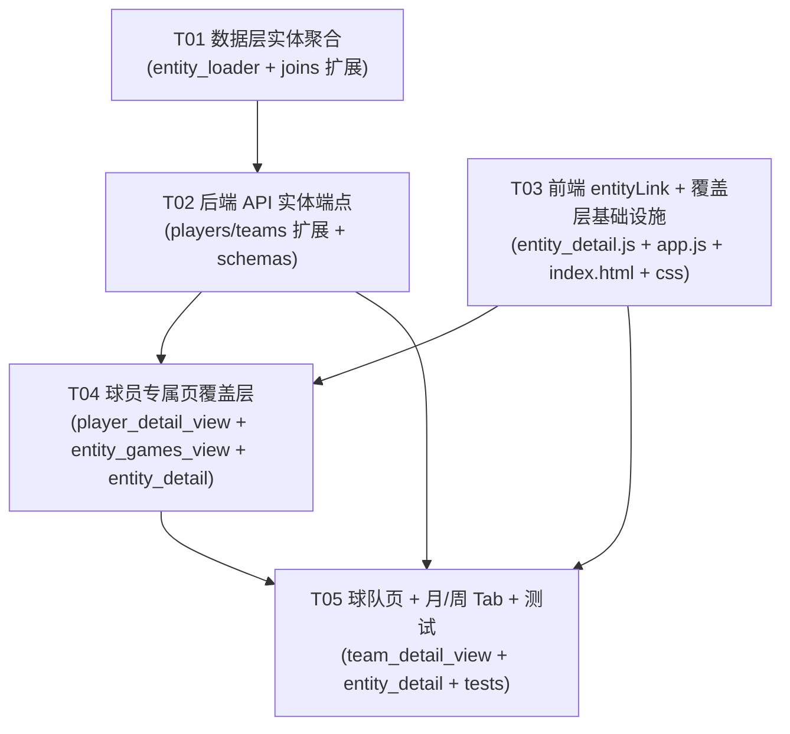

# NBACore Studio v8 — 实体详情页（球员/球队专属数据页）系统架构设计 + 任务分解

> **设计人**：高见远（Architect / Bob）
> **输入**：PRD（产品经理 许清楚，简单 PRD）+ 已探明代码事实（主理人 齐活林）
> **范围**：仅架构设计与任务分解，**不写实现代码**，不修改任何现有代码文件。
> 本文件与 `docs/class-diagram.mermaid`、`docs/sequence-diagram.mermaid` 为本次新增文档产物。

---

## 决策摘要（给主理人先看）

| 维度 | 决策 | 理由 / 依据 |
|---|---|---|
| 框架 | **不引入任何新框架**，沿用 vanilla JS（前端）+ FastAPI（后端） | 与现有代码库一致；前端纯渲染约束 |
| 覆盖层 vs 新导航 | **全屏覆盖层（Overlay）**，非新增 nav 项 | 符合 PRD 建议；复用 `intelligence.js`/`workspace.js` 的 `window.Xxx.render` + 内联 HTML 模式 |
| 聚合位置 | **后端聚合**（数据层 `entity_loader.py`），前端只渲染 | 架构契约：前端纯渲染、Layer 3 零计算；避免把整季 gamelog 下发前端 |
| 年份列表数据源 | **实体详情接口内返回 `seasons`（实体实际覆盖赛季）**，不沿用全局 `/players/seasons` | 解决 Q6（缺赛季不展示）；区块内无数据显示「暂无数据」 |
| 周口径 | **默认 ISO 周（周一起始，`YYYY-Www`）** | 解决 Q1；原生 `datetime.isocalendar()`，无需依赖 |
| 后端落点 | **扩展现有 `players.py` / `teams.py`**（URL 自然，且 `app.py` 无需改动） | 两 router 当前均 <200 行、纯编排，新增 2 端点仍合规；避免新建 router + 注册 |
| 任务数 | **5 个顶层任务**（角色硬性上限 ≤5），内部以子项覆盖主理人要求的 T1–T7 | 见 Part B |

---

# Part A：系统设计

## 1. 实现方案 + 框架选型

### 1.1 技术挑战与选型

1. **名字全站可点击 + 专属数据页**
   - 前端需一个统一链接组件 `entityLink(type, id, name)`，并在 ≥6 个名字渲染点统一替换。
   - 打开方式采用**覆盖层**（Overlay），点击名字 → `EntityDetail.open()` 渲染 `#player-detail` / `#team-detail` 置顶 → 返回/Esc 关闭。
   - 复用既有覆盖层模式：`window.Intelligence.render(containerId, playerId, season)` 把 `api()` 结果内联为 HTML（见 `frontend/js/components/intelligence.js:61`）。

2. **「年份列表 + 时间粒度 Tab」完整数据呈现**
   - 时间粒度 = `赛季`(默认) / `月` / `周` / `单场`。
   - **核心难点**：月/周/单场聚合。球员侧已有 `load_player_gamelog_with_game_context(season)`（已 join `dim_games` 返回 `game_date`，见 `joins.py:22`）—— 这是关键数据源。球队侧**无 `team_gamelog` 表**，但存在 `team_stats_per_game`（球队逐场统计，已被 `teams.py:18` 引用）可 join `games`/`dim_games` 得到 `game_date`。
   - **聚合必须下沉到数据层**（`entity_loader.py`），严禁在 router / 前端做计算。

3. **架构契约（致命约束）**
   - Layer 3 router：**零 SQL、零 pandas、零计算、纯编排、单文件 ≤200 行**。`TestLayerIsolation` 会扫描 `api/**` 拒绝 import psycopg2 / 含 SQL 字符串 / 文件 >200 行。
   - 数据层（`backend/data_layer/*`）是唯一 SELECT 层；聚合逻辑放 `data_layer` 或 `services`。
   - 注意：现有 `backend/api/routers/data_import.py` 已违反契约（内联 psycopg2+SQL），本次**严禁重蹈**。

### 1.2 框架与库

- **前端**：原生 ES（IIFE 组件，暴露 `window.*` 全局），`echarts`（已通过 CDN 引入，见 `index.html:8`）用于雷达/趋势图。无新库。
- **后端**：FastAPI + Pydantic（已用）。无新库。
- **日期聚合**：后端用 Python 标准库 `datetime.isocalendar()`（ISO 周）与 `strftime('%Y-%m')`（月），**不引入 dayjs/date-fns**。前端仅做展示格式化，用原生 `Date` 即可；若后续需要，可选项 `dayjs`（本期**不引入**）。

### 1.3 架构模式

- 前端：覆盖层控制器 `EntityDetail` + 视图模块（`PlayerDetailView` / `TeamDetailView` / `EntityGamesView`），事件委托（全局 click 捕获 `.entity-link`）。
- 后端：经典三层——Layer 3 router（编排）/ services（既有）/ Layer 1 data_layer（SELECT+聚合）。新增聚合全部落在 data_layer。

---

## 2. 文件清单及相对路径（标注 新增 / 修改）

### 后端

| 文件 | 状态 | 说明 |
|---|---|---|
| `backend/data_layer/entity_loader.py` | **新增** | 实体详情全部聚合/SELECT：`load_player_seasons`、`load_team_seasons`、`load_player_games_aggregated`、`load_team_gamelog_with_game_context`、`load_team_games_aggregated`、`_aggregate_games`（按月/周/赛季/单场分组与均值） |
| `backend/data_layer/joins.py` | **修改** | `load_player_gamelog_with_game_context(season, player_id=None)` 增加可选 `player_id` 过滤（向后兼容，默认 `None`） |
| `backend/api/routers/players.py` | **修改** | 新增 `GET /players/{id}/detail`、`GET /players/{id}/games`；保持纯编排、<200 行 |
| `backend/api/routers/teams.py` | **修改** | 新增 `GET /teams/{abbr}/detail`、`GET /teams/{abbr}/games`；保持纯编排、<200 行 |
| `backend/api/schemas.py` | **修改** | 新增 `EntityGamesResponse` / `GameGroup` / `GameRow` / `GameAggregate` / `SeasonCoverage` / `PlayerEntityDetail` / `TeamEntityDetail` |
| `backend/app.py` | **不变** | 因扩展现有 router（已注册），**无需改动** |
| `backend/tests/test_entity_loader.py` | **新增** | 数据层聚合单测（分组/均值/ISO 周） |
| `backend/tests/test_entity_api.py` | **新增** | 端点集成测试 + `TestLayerIsolation` 兼容校验（router 无 SQL/无 pandas/≤200 行） |

> 注：`backend/tests/` 当前不存在，需新建目录（测试落地路径按仓库既有测试约定，若实际在 `tests/` 则对应调整）。

### 前端

| 文件 | 状态 | 说明 |
|---|---|---|
| `frontend/js/components/entity_detail.js` | **新增** | 全局函数 `entityLink(type,id,name)` + 控制器 `window.EntityDetail`（open/render/close、年份列表、粒度 Tab、Esc/返回/键盘） |
| `frontend/js/components/player_detail_view.js` | **新增** | `window.PlayerDetailView`：bio/指标/投篮/防守/情报 区块渲染 |
| `frontend/js/components/team_detail_view.js` | **新增** | `window.TeamDetailView`：standings/stats/radar/trend 区块渲染 |
| `frontend/js/components/entity_games_view.js` | **新增** | `window.EntityGamesView`：按 `granularity` 渲染 games groups（赛季/月/周/单场通用） |
| `frontend/js/app.js` | **修改** | ① 全局 click 委托捕获 `.entity-link` → `EntityDetail.open`；② 6 处名字渲染点替换为 `entityLink(...)`（searchPlayer 下拉 / renderRankings / renderContextSimilar / renderTeams / showGameDetail / loadTableData） |
| `frontend/index.html` | **修改** | ① `<body>` 末尾新增 `<div id="entity-overlay" class="entity-overlay hidden">`；② 引入 `<script src="js/components/entity_detail.js">`（置于 `app.js` 之后） |
| `frontend/css/style.css` | **修改** | 新增 `.entity-overlay` / `.entity-link` / 年份列表 / 粒度 Tab / 模块区块 样式 |

---

## 3. 数据结构与接口（schema）

### 3.1 新增 API 端点（推荐：后端聚合）

> 推荐**后端聚合**而非前端拉原始 gamelog 后聚合：① 满足「前端纯渲染」契约；② 避免整季大体积数据下发；③ 复用既有 `load_player_gamelog_with_game_context` 已 join `game_date`。

**球员**
```
GET /players/{player_id}/detail?season=2024
  → PlayerEntityDetail { bio, season, metrics, shooting, defense, intelligence, seasons[] }

GET /players/{player_id}/games?season=2024&granularity=season|month|week|game
  → EntityGamesResponse { entity_type, entity_id, season, granularity, groups[], totals }
```

**球队**
```
GET /teams/{team_abbr}/detail?season=2024
  → TeamEntityDetail { team_abbr, team_name, season, standings, stats, radar, trend, seasons[] }

GET /teams/{team_abbr}/games?season=2024&granularity=season|month|week|game
  → EntityGamesResponse { entity_type, entity_id, season, granularity, groups[], totals }
```

**响应模型（Pydantic，定义在 `schemas.py`）**
```python
class GameRow(BaseModel):
    game_id: str
    game_date: str            # ISO 'YYYY-MM-DD'
    opponent: str | None = None
    is_home: bool = False
    result: str | None = None # 'W' / 'L'
    pts: float | None = None
    # ... 其余逐场个人/球队字段

class GameAggregate(BaseModel):
    gp: int = 0
    pts: float | None = None
    fg_pct: float | None = None
    # ... 该分组聚合指标

class GameGroup(BaseModel):
    key: str                  # 赛季='2024-25' / 月='2024-11' / 周='2024-W45' / 单场=game_id
    label: str
    games: list[GameRow] = []
    aggregate: GameAggregate

class EntityGamesResponse(BaseModel):
    entity_type: str          # 'player' | 'team'
    entity_id: str
    season: int
    granularity: str          # 'season' | 'month' | 'week' | 'game'
    groups: list[GameGroup] = []
    totals: GameAggregate

class SeasonCoverage(BaseModel):
    season: int
    label: str                # seasonLabel(s) → '2024-25'
    has_data: bool

class PlayerEntityDetail(BaseModel):
    bio: PlayerBio
    season: int
    metrics: dict
    shooting: dict
    defense: dict
    intelligence: dict
    seasons: list[SeasonCoverage]

class TeamEntityDetail(BaseModel):
    team_abbr: str
    team_name: str | None = None
    season: int
    standings: dict
    stats: dict
    radar: dict
    trend: dict
    seasons: list[SeasonCoverage]
```

### 3.2 前端组件签名

```javascript
// entity_detail.js
window.entityLink = function(type, id, name) {
  // 返回 `<a class="entity-link" data-etype="player|team" data-eid="...">名称</a>`
  // 内部用 escapeHtml 防注入
};

window.EntityDetail = {
  open(type, id, name) {},        // 打开覆盖层，默认最近覆盖赛季 + granularity='season'
  render(season, granularity) {}, // 切换年份/粒度后重渲染
  close() {},                     // 关闭 + 恢复焦点 + 解绑 Esc
  // 内部: onYearChange / onGranularityChange / fetchDetail / fetchGames (调全局 api())
};
```

### 3.3 数据层聚合函数签名（`entity_loader.py`）

```python
def load_player_seasons(player_id: str) -> list[int]: ...
def load_team_seasons(team_abbr: str) -> list[int]: ...

def load_player_games_aggregated(player_id, season, granularity) -> dict: ...
#   内部: load_player_gamelog_with_game_context(season, player_id) → _aggregate_games(rows, granularity)

def load_team_gamelog_with_game_context(season, team_abbr=None) -> list[dict]: ...
#   新增: team_stats_per_game JOIN games/dim_games ON game_id → game_date + 主客队 + 比分

def load_team_games_aggregated(team_abbr, season, granularity) -> dict: ...
#   内部: load_team_gamelog_with_game_context(season, team_abbr) → _aggregate_games(rows, granularity)

def _aggregate_games(rows, granularity) -> dict: ...
#   分组键: season→seasonLabel; month→strftime('%Y-%m'); week→isocalendar 'YYYY-Www'; game→game_id
#   每组计算 gp / pts 均值 / fg_pct 等聚合; totals = 全量聚合
```

> **聚合字段范围**：首期覆盖 `gp / pts / fg_pct` 等核心指标；其余指标（篮板/助攻/三分等）在 `GameRow` 与 `GameAggregate` 中按需扩展，结构保持一致即可。

### 3.4 类图

见 `docs/class-diagram.mermaid`（Mermaid `classDiagram`）。

---

## 4. 程序调用流程（时序图）

见 `docs/sequence-diagram.mermaid`（Mermaid `sequenceDiagram`）。要点：
1. 点击名字 → `app.js` 全局委托捕获 `.entity-link` → `EntityDetail.open()`。
2. 并行拉取 `detail`（bio/模块/年份列表）与默认粒度 `games`（season 汇总）。
3. 渲染：年份列表 + 粒度 Tab + 模块区块 + 比赛明细。
4. 切年份 → 重新 `GET /detail`；切粒度 → 重新 `GET /games?granularity=`。
5. 关闭：返回按钮 / Esc / 点背景 → `close()` 恢复焦点。

---

## 5. 待明确事项（Anything UNCLEAR）

> 以下问题多数已有推荐方案，但需主理人/用户最终拍板（已写入「跨文件约定」作为默认实现）。

1. **Q1 周口径**：默认 ISO 周（周一起始，`YYYY-Www`）。若用户要「NBA 赛程周」，需额外 mapping 表 → 建议作 P2 / 后续，默认 ISO。
2. **Q3 球队比赛级数据源**：`team_stats_per_game` 是否含 `game_id` + `team_abbr` 两列，需工程师实现时 `SELECT * FROM team_stats_per_game LIMIT 1` 确认。设计按「含」假设；若不含 `game_id`，回退方案：用 `games` 表（含 `game_date`、主客队）关联球队逐场统计的其他可用表（注意 `team_game_splits` 无 `game_id`，不可用）。
3. **Q4 链接化范围**：P0 覆盖 search / rankings / context / teams / games / system 内的分析向名字；dataimport / crawler 等运维页留 P2。确认是否需更早覆盖。
4. **Q6 缺赛季**：年份列表只展示实体**实际有数据**的赛季（来自 `detail.seasons`）；无数据赛季**不展示**（而非置灰），对应区块显示「暂无数据」。
5. **P2 范围**：分享 URL（pushState）、键盘 ←→ 在年份间导航、VS 快捷对比、收藏 —— PRD 标 P2。建议本期至少实现**低成本项**：Esc 关闭 + 返回按钮（+ 可选 ←→ 切年份）；分享/VS/收藏可后续迭代。需主理人确认本期是否必做。
6. **detail 拉取策略**：默认全量拉取 bio/指标/投篮/防守/情报（简单）；若性能成问题再改按需懒加载。请确认接受默认全量。
7. **球队「bio」等价物**：球队无 bio，球队 detail 用 standings/stats/radar/trend 区块替代 bio 区块；区块命名以「球队概况」呈现。
8. **落点确认**：本次采用「扩展 `players.py`/`teams.py`」（`app.py` 无需改）。若主理人更偏好独立 `entity.py` router（URL 变 `/entity/...`），可在 T02 切换，但需改 `app.py` 注册。

---

# Part B：任务分解（有序、含依赖）

> 角色硬性约束：**任务数 ≤ 5**，每个任务 ≥ 3 个相关文件。
> 主理人原始示例为 T1–T7；下方以 **5 个顶层任务**承载，每个任务的「子项」即对应 T1–T7 的具体工作，确保粒度不丢失。

## 6. 依赖包（Required Packages）

**无新增依赖。** 前端 vanilla JS + echarts（已引入）；后端 FastAPI + Pydantic（已用）；日期聚合用 Python 标准库 `datetime`。
- 可选（**本期不引入**）：`dayjs`（仅当前端需复杂日期格式化时备用）。

## 7. 任务列表（Task List，按实现顺序）

### T01 — 数据层实体聚合函数  ⭐ P0（+P1 基础）
- **Source Files**：`backend/data_layer/entity_loader.py`(新)、`backend/data_layer/joins.py`(改)、`backend/tests/test_entity_loader.py`(新)
- **Dependencies**：无
- **子项（覆盖主理人 T1）**：
  - `load_player_seasons` / `load_team_seasons`（实体覆盖赛季 → 解决 Q6）
  - `load_player_games_aggregated`（复用 `joins.load_player_gamelog_with_game_context` + 过滤 player_id）
  - `load_team_gamelog_with_game_context`（新增 join：team_stats_per_game × games/dim_games）
  - `load_team_games_aggregated`
  - `_aggregate_games`（按月 `%Y-%m` / 周 ISO `YYYY-Www` / 赛季 / 单场 分组与均值）
  - 单测：分组键正确、均值正确、ISO 周边界
- **Priority**：P0

### T02 — 后端 API 实体详情端点（扩展 players/teams，纯编排）  ⭐ P0
- **Source Files**：`backend/api/routers/players.py`(改)、`backend/api/routers/teams.py`(改)、`backend/api/schemas.py`(改)
- **Dependencies**：T01
- **子项（覆盖主理人 T2）**：
  - `players.py` 新增 `GET /players/{id}/detail`、`GET /players/{id}/games?granularity=`
  - `teams.py` 新增 `GET /teams/{abbr}/detail`、`GET /teams/{abbr}/games?granularity=`
  - `schemas.py` 新增 7 个响应模型
  - **契约校验**：router 零 SQL / 零 pandas / 零计算 / ≤200 行；团队 abbr 入参用 `team_loader._to_br_abbr` 归一化（如涉及 BR 风格表）
  - `app.py` 无需改动（扩展已注册 router）
- **Priority**：P0

### T03 — 前端 entityLink 组件 + 全局名字链接化 + 覆盖层基础设施  ⭐ P0
- **Source Files**：`frontend/js/components/entity_detail.js`(新)、`frontend/js/app.js`(改)、`frontend/index.html`(改)、`frontend/css/style.css`(改)
- **Dependencies**：无（可与 T01/T02 并行）
- **子项（覆盖主理人 T3）**：
  - `entity_detail.js`：全局函数 `entityLink(type,id,name)` + `EntityDetail.open/close` 骨架 + `#entity-overlay` 渲染容器
  - `app.js`：全局 `click` 委托捕获 `.entity-link` → `EntityDetail.open`；6 处名字渲染点替换为 `entityLink(...)`（searchPlayer 下拉 / renderRankings / renderContextSimilar / renderTeams / showGameDetail / loadTableData）
  - `index.html`：新增 `#entity-overlay` 容器 + 引入 `entity_detail.js`
  - `style.css`：覆盖层 / 链接 / 年份列表 / 粒度 Tab 基础样式
- **Priority**：P0

### T04 — 球员专属页覆盖层（#player-detail：模块整合 + 年份列表 + 粒度 Tab 赛季/单场）  ⭐ P0
- **Source Files**：`frontend/js/components/player_detail_view.js`(新)、`frontend/js/components/entity_games_view.js`(新)、`frontend/js/components/entity_detail.js`(改)
- **Dependencies**：T02、T03
- **子项（覆盖主理人 T4）**：
  - `PlayerDetailView`：bio / 指标 / 投篮 / 防守 / 情报 区块渲染（调既有 `window.Intelligence` 等或独立渲染）
  - `EntityGamesView`：渲染 games groups（granularity=season → 整季汇总；game → 逐场）
  - `EntityDetail` 接入：年份列表渲染（来自 `detail.seasons`）+ 粒度 Tab（默认 `season`，含 `game`）；默认拉取并展示
- **Priority**：P0

### T05 — 球队专属页 + 月/周粒度 Tab + 测试收尾  ⭐ P1（测试 P0 收尾）
- **Source Files**：`frontend/js/components/team_detail_view.js`(新)、`frontend/js/components/entity_detail.js`(改)、`backend/tests/test_entity_api.py`(新)
- **Dependencies**：T02、T03、T04
- **子项（覆盖主理人 T5 / T6 / T7）**：
  - `TeamDetailView`：standings / stats / radar / trend 区块渲染（#team-detail）
  - `EntityDetail` 接入 `month` / `week` Tab：切换时调 `GET /games?granularity=month|week`（后端已由 T01 支持）
  - P2 低成本项：Esc 关闭、返回按钮、键盘 ←→ 切年份（其余 P2 如分享 URL/VS/收藏留后续）
  - 测试：`TestLayerIsolation` 兼容校验（routers 无 SQL/无 pandas/≤200 行）+ 端点集成测试 + 前端冒烟（覆盖层可开关、链接可点）
- **Priority**：P1

## 8. 跨文件约定（Shared Knowledge）

- **响应风格**：沿用现有 API 直接返回 Pydantic model（**无** `{code,data,message}` 包裹），与 `players.py`/`teams.py` 一致；前端 `api()` 在 HTTP 非 2xx 时抛错，覆盖层捕获后显示错误块。
- **granularity 枚举**：`season | month | week | game`。`season`=整季一个汇总组；`month`=`YYYY-MM`；`week`=`YYYY-Www`（ISO，周一起始）；`game`=逐场。
- **日期格式**：响应中 `game_date` 统一 ISO `YYYY-MM-DD`（字符串）。
- **年份列表数据源**：以 `detail.seasons`（实体实际覆盖赛季）为准，**不**用全局 `/players/seasons`；无数据赛季不展示，对应区块显示「暂无数据」（解决 Q6）。
- **覆盖层关闭协议**：`EntityDetail.close()` → 给 `#entity-overlay` 加 `.hidden`、恢复 `document.body` 滚动、焦点归还 `lastFocused`（打开时记录触发元素）；Esc 键 + 返回按钮 + 点背景均可关闭。
- **链接生成**：所有名字渲染统一走 `entityLink(type,id,name)`，内部 `escapeHtml` 防 XSS；禁止在业务代码里手写 `<a>` 跳名字。
- **entity id 类型**：player_id 为字符串；team_abbr 为 NBA 标准缩写（如 `BOS`），涉及 BR 风格表时用 `team_loader._to_br_abbr` 归一化。
- **错误与空态**：任一区块数据缺失时显示「暂无数据」，不整页崩溃；`detail` 拉取失败显示错误块并提供关闭。
- **聚合字段扩展**：新增指标只需在 `GameRow`/`GameAggregate` 加字段并在 `_aggregate_games` 补计算，前端 `EntityGamesView` 自动遍历展示，无需改接口结构。

## 9. 任务依赖图（Task Dependency Graph）



> **并行说明**：T01 与 T03 互不依赖，可并行启动；T02 依赖 T01；T04/T05 依赖 T02+T03；T05 额外依赖 T04。
