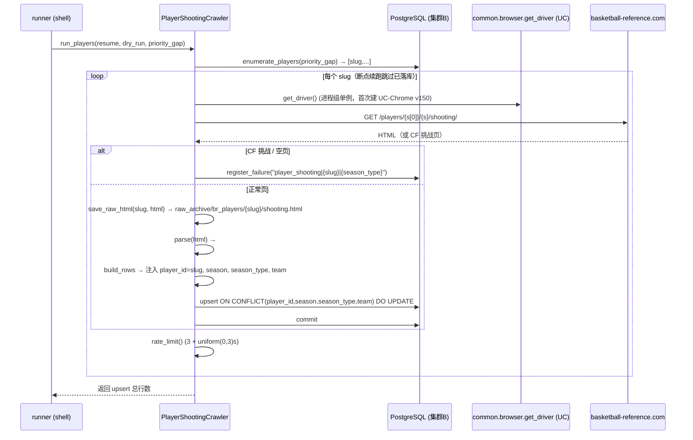
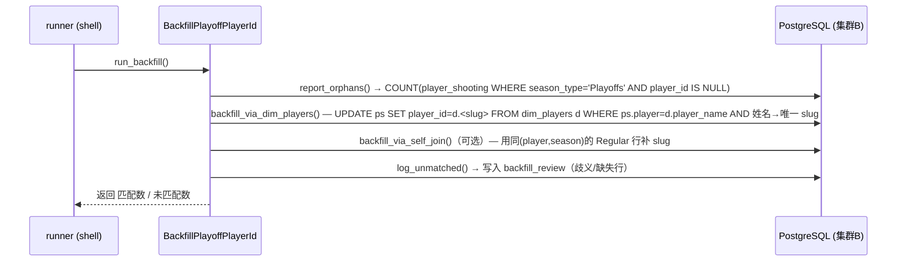
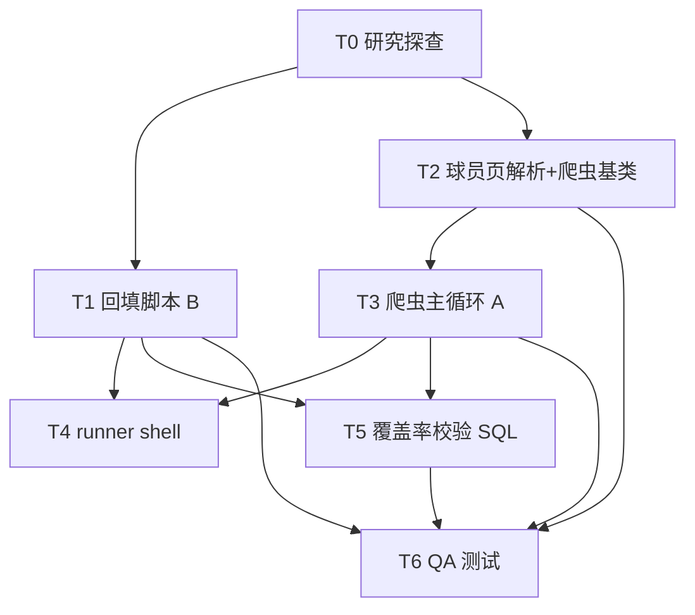

# player_shooting_backfill — 系统设计 + 任务分解

> 作者：高见远（架构师） ｜ 范围：内部 Python 数据管线（无前端）
> 仓库根：`/Users/deocheng/Downloads/nba_desktop_omega_mac_migrate_2026-07-13/`
> 目标：B 先回填 6,099 行 Playoffs 孤儿 `player_id`；A 再建球员级 shooting 爬虫补齐 ~9,797 个 Regular 缺口，覆盖率 59.8% → ~100%。

---

## 0. 设计约束摘要（审计铁律）

| 项 | 内容 |
|---|---|
| 连接键铁律 | `player_shooting.player_id` = **BR slug**（text，如 `'abdulma02'`），须对齐 `player_gamelog.br_player_id`（text）。`player_gamelog.player_id`（bigint）= **nba_api id**，另一命名空间，**绝不可混用**。 |
| 覆盖率基准 | gamelog 有 BR slug 的 (球员,赛季) 组合 = **24,366**；`player_shooting` 有 `player_id` 的组合 = **14,569**（均 Regular）。Regular 覆盖 ≈ **59.8%**，缺口 ≈ **9,797**。 |
| 年代 | 1983–1996 全 0%（shooting 表只从 1997 起）；2001–2026 约 58%–87%。爬虫下界 `MIN_SEASON=1997`。 |
| Bug1（本次修 B） | 全部 6,099 行 Playoffs 的 `player_id` 为 NULL（但 `player` 姓名字段有值）。孤儿行，非重复。 |
| Bug2（本次只记录） | `player_gamelog` 的 1997–2000 `br_player_id` 全 NULL（约 8 万行）。不修，仅 T5 记录。 |
| 反屏蔽铁律 | **只能复用既有**（`common/browser` + `common/browser_uc`），**禁止新建**反屏蔽/限速/CF 机制。 |
| 解耦 | B（一次性回填脚本）先跑；A（爬虫）后跑；顺序符合用户方向 C。Playoffs 借同页顺带抓。 |

**已核实的既有资产（直接影响设计）：**
- `common/br_team_page.py`：`BRTeamPageCrawler` 基类，封装 `get_driver()`（委托 `common.browser`）、`fetch_team_page()`（导航+CF 检测）、`rate_limit()`（3+uniform(0,3)s）、`register_failure()`（`crawl_failures`）、`_upsert_rows()`（`execute_values + ON CONFLICT`）、`safe_int/safe_float/_row_data_stats` 纯函数。
- `common/browser.py`：**默认 Playwright**；**末尾重绑定 uc**——当 `BROWSER_BACKEND=uc` 时把 `get_driver/reset_driver/warmup_once/quit_driver` 绑定到 `common.browser_uc`（undetected_chromedriver，`version_main=150` 对齐系统 Chrome 150.0.7871.129）。爬虫只 `from common.browser import get_driver` 即可，由 runner 切后端。**这正是"复用既有反屏蔽"的接入口。**
- `external_crawler/crawler/crawl_br_team_shooting.py`：被砍的 team 级版本，**仅作结构参考**（parse 纯函数 + 子类钩子 `parse/build_rows/upsert` + `dispatch_cli`）。路径逻辑须改。
- 既有回填先例：`backfill_gamelog_identity.py`（同族项目）经 `dim_players`/`player_id_bridge` 回填 NULL 行，并**同名多值安全跳过**——B 脚本沿用此范式。
- `dim_players` 列（来自 `01_metrics_layer.sql` 实测）：存在 `player_name`（与 `player_shooting.player` 同义，可 JOIN）与 `player_id`（实测作为 BR slug 与外键对齐）。**具体 slug 列名以 T0 确认为准。**

---

## 1. 实现方案 + 框架选型

**技术栈**：Python 3 + 复用 `common/*` + `psycopg2` 入库（与既有爬虫一致）。

**关键技术难点与决策：**

1. **反屏蔽必须零新建** → 爬虫全程只调用 `common.browser.get_driver()`；runner shell 设 `BROWSER_BACKEND=uc` 切到 UC-Chrome 后端（`version_main=150`）。限速（≤15 req/min）、CF 挑战检测/熔断、失败登记、`merge`/upsert **全部来自既有**，不新增一行反屏蔽代码。
2. **球员页 ≠ 球队页（结构差异大）** →
   - URL 无赛季：`/players/{slug[0]}/{slug}/shooting/`（如 `/players/b/brownja02/shooting/`）。
   - 一页含该球员**全部赛季**两张表：`#shooting`（Regular）+ `#shooting_playoffs`（Playoffs），每行=一个赛季。
   - 这与 `BRTeamPageCrawler` 的 `build_url(season)` / `enumerate_team_seasons` / `_crawl_one(slug,season,season_type)` 模型不兼容。
   - **决策：新增 `common/br_player_page.py`（`BRPlayerPageCrawler` 继承 `BRTeamPageCrawler`），复用其反屏蔽/限速/CF/upsert/失败登记与解析纯函数，仅重写**球员级枚举、URL、双表解析、单页主循环、原始 HTML 归档**。不改动 `br_team_page.py`（最小爆炸半径，满足"复用既有结构"）。
3. **原始 HTML 归档**（非 JSON 缓存）→ 落盘 `raw_archive/br_players/{slug}/shooting.html`（可重解析，对齐 `br_fill_pbp` 的 `pbp_raw/` 约定）。`--rework` 从归档重解析落库，免重爬。
4. **入库幂等（MERGE）** → `psycopg2.extras.execute_values + ON CONFLICT (player_id, season, season_type, team) DO UPDATE`。冲突键含 `team` 以处理赛季中交易（一季多队多行）。要求 `player_shooting` 上存在该 4 列唯一约束（T0 验证，缺则 T5 DDL 补）。
5. **B 回填是纯 SQL，无浏览器** → `player_shooting.player`（姓名）JOIN `dim_players` 取 BR slug；仅更新"姓名→唯一 slug"的行；歧义/缺失行写入回查表 `backfill_review`，不影响主流程。
6. **优先补缺（P0）** → 枚举球员时优先返回"在 gamelog 宇宙内、但 `player_shooting` 缺 Regular 组合"的 slug，先爬这些，把 9,797 缺口快速补齐；其余（已全覆盖的球员）可后续按需刷新。

**架构模式**：模板方法（基类固化抓取/限速/CF/upsert 主流程，子类仅实现 `parse/build_rows/upsert` 钩子）+ 纯函数解析层（便于单测）。

---

## 2. 文件列表（相对仓库根）

**新建文件：**

| 路径 | 职责 | 任务 |
|---|---|---|
| `common/br_player_page.py` | `BRPlayerPageCrawler(BRTeamPageCrawler)`：球员级枚举 / URL / 单页主循环 / 原始 HTML 归档 / 复用反屏蔽·限速·CF·upsert·失败登记；声明抽象钩子 `parse/build_rows/upsert`。 | T2 |
| `external_crawler/crawler/crawl_br_player_shooting.py` | 球员 shooting 爬虫（A）：`parse_player_shooting_html()` 纯函数（解析 `#shooting`+`#shooting_playoffs` 双表）+ `PlayerShootingCrawler(BRPlayerPageCrawler)` + `__main__`（`dispatch_cli`）。 | T2/T3 |
| `external_crawler/backfill/backfill_playoff_player_id.py` | 回填脚本（B）：纯 SQL `UPDATE player_id` via `dim_players` + 可选自连接兜底 + 未匹配登记 `backfill_review`。无浏览器。 | T1 |
| `external_crawler/runner/run_player_shooting_backfill.sh` | runner：先跑 B → 再跑 A（按季或全量）；`export PGPASSWORD` / `BROWSER_BACKEND=uc`；日志；`--resume` 开关。 | T4 |
| `docs/coverage_report.sql` | 覆盖率校验 SQL（Regular/Playoffs 覆盖率、缺口、Bug2 记录）。 | T5 |
| `tests/test_br_player_page.py` | QA：`parse_player_shooting_html` 单元（用 `raw_archive` 夹具）、回填 dry-run、覆盖率断言。 | T6 |

**运行时产物（不入库）：** `raw_archive/br_players/{slug}/shooting.html`

**仅作参考、不修改的既有文件：**
- `external_crawler/crawler/crawl_br_team_shooting.py`（结构参考）
- `common/br_team_page.py`、`common/browser.py`、`common/browser_uc.py`（复用）
- `common/cf_breaker.py`（CF 熔断，经 `common.browser` 自动生效）

---

## 3. 数据结构与接口（类图）

```mermaid
classDiagram
    class BRTeamPageCrawler {
        +DOMAIN: str
        +TASK_TYPE: str
        +TABLE: str
        +CONFLICT_COLS: tuple
        +get_driver()$  /* 委托 common.browser，BROWSER_BACKEND=uc */
        +fetch_team_page(driver, url) str  /* 导航+CF检测，空/挑战页→'' */
        +rate_limit()  /* 3+uniform(0,3)s */
        +register_failure(conn, token)
        +_upsert_rows(conn, table, rows, conflict_cols) int
        +safe_int(val)  /* 纯函数 */
        +safe_float(val)  /* 纯函数 */
        +_row_data_stats(row) dict  /* 纯函数 */
    }

    class BRPlayerPageCrawler {
        +DOMAIN = "player_shooting"
        +TASK_TYPE = "br_player_shooting"
        +TABLE = "player_shooting"
        +CONFLICT_COLS = (player_id, season, season_type, team)
        +MIN_SEASON = 1997
        +RAW_ARCHIVE = "raw_archive/br_players"
        +build_url(slug) str  /* /players/{slug[0]}/{slug}/shooting/ */
        +enumerate_players(conn, priority_gap) list  /* gamelog.br_player_id ∪ dim_players.slug */
        +save_raw_html(slug, html)
        +_crawl_player(conn, driver, slug) int
        +run_players(conn, slugs, resume, dry_run) int
        +rework_from_archive(slug) int
        +parse(html) list*
        +build_rows(conn, slug, season, season_type, rec) dict*
        +upsert(conn, rows) int*
    }
    BRPlayerPageCrawler --|> BRTeamPageCrawler

    class PlayerShootingCrawler {
        +parse(html) list   /* 委托 parse_player_shooting_html */
        +build_rows(conn, slug, season, season_type, rec) dict
        +upsert(conn, rows) int  /* _upsert_rows(...,CONFLICT_COLS) */
    }
    PlayerShootingCrawler --|> BRPlayerPageCrawler

    class BackfillPlayoffPlayerId {
        -conn
        +report_orphans(conn) int
        +backfill_via_dim_players(conn) int
        +backfill_via_self_join(conn) int  /* 可选兜底 */
        +log_unmatched(conn)
    }
    BackfillPlayoffPlayerId ..> dim_players : JOIN player_name→slug
    BackfillPlayoffPlayerId ..> player_shooting : UPDATE player_id

    note for BRPlayerPageCrawler "复用 common.browser.get_driver (BROWSER_BACKEND=uc)\n复用 rate_limit / CF检测 / _upsert_rows / register_failure"
```

**关键接口契约：**
- `parse(html: str) -> List[Dict]`：纯函数，解析双表，每条记录含 `season, lg, player, age, team, pos, g, gs, mp, fg_percent, avg_dist_fga, percent_fga_from_*, fg_percent_from_*, percent_assisted_*, percent_dunks_of_fga, num_of_dunks, percent_corner_3s_of_3pa, corner_3_point_percent, num_heaves_attempted, num_heaves_made, season_type`（**不含 `player_id`**，`player_id` 由 `build_rows` 注入=slug）。
- `build_rows(conn, slug, season, season_type, rec) -> Dict`：拷贝 rec，注入 `player_id=slug`、`season`、`season_type`、`team`（team 来自 rec 的 BR `Tm` 列）。
- `upsert(conn, rows) -> int`：调用基类 `_upsert_rows(conn, "player_shooting", rows, CONFLICT_COLS)`。
- `enumerate_players(conn, priority_gap=False) -> List[str]`：`SELECT DISTINCT br_player_id FROM player_gamelog WHERE br_player_id IS NOT NULL`（UNION `SELECT slug FROM dim_players WHERE slug IS NOT NULL`）；`priority_gap=True` 时仅返回"在 gamelog 宇宙内、但 `player_shooting`(Regular) 缺该 (slug,season) 组合"的 slug，实现优先补缺。

---

## 4. 程序调用流程（时序图）

### 4.1 爬虫 A：球员级 shooting 抓取（MERGE 入库）



### 4.2 回填 B：孤儿 Playoffs 行补 player_id（纯 SQL，无浏览器）



---

## 5. 待明确事项（仅 T0 研究能定的细节）

> 以下均**不阻塞整体设计**，但 T1/T2 实现前必须拍板。列入 T0 研究清单。

1. **`dim_players` 的确切 slug 列名**：实测 `dim_players.player_id` 似为 BR slug（与 `player_shooting.player_id` 对齐），但同族项目提及 `dim_players.br_player_id`。T0 确认回填 JOIN 用哪一列。
2. **`player_shooting` 唯一约束**：是否存在 `UNIQUE(player_id, season, season_type, team)`？无则 `ON CONFLICT` 失败（T0 验证，T5 DDL 补）。
3. **表名确认**：统一表是 `player_shooting`（34 列含 `season_type`，Regular/Playoffs 同表）？还是另有 `playoff_shooting`？设计按"单表 `player_shooting` + `season_type`"进行，T0 二次确认。
4. **BR 球员页双表 `data-stat` 列顺序/名称**：`#shooting` 与 `#shooting_playoffs` 每列 `data-stat` 与 `player_shooting` 34 列的映射（尤其距离分段 `pct_fga_*`/`fg_pct_*`、`percent_assisted_*`、`percent_dunks_of_fga`/`num_of_dunks`、`percent_corner_3s_of_3pa`/`corner_3_point_percent`、`num_heaves_*`、`weight`）。需抓一页真实 HTML 核对。
5. **`weight` 来源**：BR 球员 shooting 页是否每行带 `weight`？若否，回填/置 NULL 或从 `dim_players` 取（T0 确认）。
6. **`season` 解析口径**：BR 球员页行首赛季链接文本为结束年（如 2026=2025-26），与 `player_gamelog`/既有表一致，直接取整数（T0 二次确认无偏移）。
7. **DB host 严格性**：集群 B 为 `127.0.0.1:5433`；`br_team_page` 基类的 `DB_CONFIG` 用 `localhost`（可能走 Unix socket/IPv6）。玩家爬虫模块自定 `DB_CONFIG(host="127.0.0.1", port=5433)` 以严格对齐铁律（T0/T2 落实）。
8. **枚举去重**：`player_gamelog.br_player_id` 与 `dim_players.slug` 的并集去重方式（CASE/UNION），T0 跑一遍确认 slug 数量级（预期数千级）。

---

## 6. 依赖包列表

```
- psycopg2 / psycopg2-binary  ：PostgreSQL 入库（execute_values + ON CONFLICT）
- undetected_chromedriver      ：common/browser_uc 已含；须 version_main=150 对齐 Chrome 150.0.7871.129
- beautifulsoup4               ：解析 BR 页 HTML（配合 html.parser / lxml）
- lxml                         ：可选，BS4 解析器加速
- playwright                   ：common/browser 默认后端已含；本次经 BROWSER_BACKEND=uc 走 UC，不启用但需安装以满足 import 安全
- 标准库（无需安装）：argparse, os, sys, time, random, json, pathlib, logging
```
> 反屏蔽/限速/CF/熔断：**不新增任何包**，全部来自既有 `common/*`。

---

## 7. 任务列表（T0–T6，有序、含依赖）

| ID | 任务 | 源文件 | 依赖 | 优先级 |
|---|---|---|---|---|
| **T0** | 研究探查：inspect `dim_players` 列、`common/br_team_page.py` 内部、抓一页真实 BR 球员 shooting HTML 核对双表 `data-stat` 顺序与列映射、确认 `player_shooting` 唯一约束与表名。产出 `docs/T0_findings.md`。 | （只读；产出 `docs/T0_findings.md`） | 无 | P0 |
| **T1** | 回填脚本 B：`player_shooting` 孤儿 Playoffs 行 `UPDATE player_id` via `dim_players`（唯一 slug）；可选自连接兜底；未匹配登记 `backfill_review`。 | `external_crawler/backfill/backfill_playoff_player_id.py` | T0 | P0 |
| **T2** | 球员页解析/爬虫基类：新增 `common/br_player_page.py`（`BRPlayerPageCrawler`）；`parse_player_shooting_html` 纯函数 + 列映射；自定 `DB_CONFIG(host=127.0.0.1)`。 | `common/br_player_page.py`, `external_crawler/crawler/crawl_br_player_shooting.py` | T0 | P0 |
| **T3** | 爬虫主循环（A）：`run_players` + `enumerate_players`（优先补缺）+ 原始 HTML 归档 + 断点续跑 + 进度日志 + 复用 CF/限速/失败登记 + `upsert` 幂等。 | `external_crawler/crawler/crawl_br_player_shooting.py`, `common/br_player_page.py` | T2 | P0 |
| **T4** | runner shell：B 先跑→A 后跑；`export PGPASSWORD` / `BROWSER_BACKEND=uc`；日志；`--resume` 开关；可分段按季。 | `external_crawler/runner/run_player_shooting_backfill.sh` | T1, T3 | P0 |
| **T5** | 覆盖率校验 SQL：Regular/Playoffs 覆盖率、缺口、Bug2 记录；缺唯一约束则补 DDL；回填后重跑断言 `po_orphan→0`。 | `docs/coverage_report.sql` | T1, T3 | P1 |
| **T6** | QA 测试：`parse_player_shooting_html` 单元（用 `raw_archive` 夹具）、回填 dry-run、覆盖率断言。 | `tests/test_br_player_page.py` | T1, T2, T3, T5 | P1 |

**执行顺序**：`T0 → {T1, T2}`（可并行）→ `T3` → `T4` → `T5` → `T6`。

---

## 8. 共享知识（跨文件约定）

- **连接键只用 BR slug**：`player_shooting.player_id` 永远 = BR slug（text）。绝不写入 `player_gamelog.player_id`（bigint, nba_api id）。跨表对齐只用 `player_gamelog.br_player_id` / `dim_players.<slug列>`。
- **MERGE upsert 键**：`(player_id, season, season_type, team)`。`team` 入键以容纳赛季中交易多行。冲突时 `DO UPDATE SET` 非键列。
- **HTML 归档路径约定**：`raw_archive/br_players/{slug}/shooting.html`（对齐 `br_fill_pbp` 的 `pbp_raw/`）。`--rework` 从此重解析，免重爬。
- **反屏蔽复用点（唯一入口）**：爬虫只 `from common.browser import get_driver`；runner 设 `BROWSER_BACKEND=uc` 切 UC 后端（`version_main=150`）。限速 `rate_limit()`（3+uniform(0,3)s）、CF 检测（`fetch_team_page` 返回 `''`）、失败登记 `register_failure(token)`（`crawl_failures`）全部来自基类，禁止各爬虫自写。
- **失败 token 约定**：`player_shooting|{slug}|{season_type}`（区别于 team 版 `{slug}|{season}|{domain}`）。
- **DB 连接约定**：`host=127.0.0.1, port=5433, dbname=nba, user=postgres`，口令走环境变量 `PGPASSWORD`（runner `export`），**禁止硬编码**。
- **枚举宇宙**：`player_gamelog.br_player_id`（非 NULL）∪ `dim_players.slug`（非 NULL），去重；`MIN_SEASON=1997`，pre-1997 不抓（仅记日志）。
- **季节性**：一页含 Regular(`#shooting`)+Playoffs(`#shooting_playoffs`)，`season_type` 由表 id 判定；两表都解析，Playoffs 顺带覆盖。
- **幂等/断点**：`--resume` 探测已落库 (player_id,season,season_type,team) 跳过；重跑安全（upsert 覆盖）。
- **Bug2 仅记录**：`player_gamelog` 1997–2000 `br_player_id` NULL 不修，T5 SQL 统计。

---

## 9. 任务依赖图



---

## 附录 A：回填 SQL 设计（T1 落库，纯 SQL）

```sql
-- 阶段1：经 dim_players 回填（姓名 → 唯一 slug 才更新；歧义行不动）
WITH uniq AS (
  SELECT player_name,
         COUNT(DISTINCT <slug_col>)        AS n,
         MAX(<slug_col>)                   AS slug
  FROM dim_players
  WHERE <slug_col> IS NOT NULL
  GROUP BY player_name
  HAVING COUNT(DISTINCT <slug_col>) = 1
)
UPDATE player_shooting ps
SET player_id = u.slug
FROM uniq u
WHERE ps.season_type = 'Playoffs'
  AND ps.player_id IS NULL
  AND ps.player = u.player_name;

-- 阶段2（可选兜底）：同 (player,season) 的 Regular 行补 slug
UPDATE player_shooting po
SET player_id = reg.player_id
FROM player_shooting reg
WHERE po.season_type = 'Playoffs'
  AND po.player_id IS NULL
  AND reg.season_type = 'Regular'
  AND reg.player_id IS NOT NULL
  AND po.player = reg.player
  AND po.season = reg.season;

-- 阶段3：未匹配行登记回查表（歧义/缺失，供人工）
CREATE TABLE IF NOT EXISTS backfill_review (
  id          SERIAL PRIMARY KEY,
  season      BIGINT,
  player      TEXT,
  season_type VARCHAR,
  reason      TEXT,
  created_at  TIMESTAMPTZ DEFAULT now()
);
INSERT INTO backfill_review (season, player, season_type, reason)
SELECT season, player, season_type, 'no_unique_dim_players_slug'
FROM player_shooting
WHERE season_type = 'Playoffs' AND player_id IS NULL;
```

## 附录 B：覆盖率校验 SQL（T5，详见 `docs/coverage_report.sql`）

```sql
WITH universe AS (               -- 基准：gamelog 有 BR slug 的 (球员,赛季)
  SELECT DISTINCT br_player_id AS slug, season
  FROM player_gamelog
  WHERE br_player_id IS NOT NULL AND season >= 1997
),
covered AS (                     -- 已覆盖：player_shooting Regular 有 player_id
  SELECT DISTINCT player_id AS slug, season
  FROM player_shooting
  WHERE season_type = 'Regular' AND player_id IS NOT NULL
)
SELECT
  (SELECT COUNT(*) FROM universe)                              AS universe_combos,
  (SELECT COUNT(*) FROM covered)                               AS covered_combos,
  ROUND(100.0*(SELECT COUNT(*) FROM covered)
        / NULLIF((SELECT COUNT(*) FROM universe),0), 1)        AS regular_coverage_pct,
  (SELECT COUNT(*) FROM universe) - (SELECT COUNT(*) FROM covered) AS regular_gap;

-- Playoffs 覆盖率（随页顺带；回填后 po_orphan 应→0）
SELECT
  COUNT(*) FILTER (WHERE season_type='Playoffs' AND player_id IS NOT NULL) AS po_with_id,
  COUNT(*) FILTER (WHERE season_type='Playoffs' AND player_id IS NULL)     AS po_orphan,
  COUNT(*) FILTER (WHERE season_type='Regular' AND player_id IS NOT NULL)  AS rs_with_id
FROM player_shooting;

-- Bug2 记录（仅记录，不修）
SELECT season, COUNT(*) AS null_slug_rows
FROM player_gamelog
WHERE season BETWEEN 1997 AND 2000 AND br_player_id IS NULL
GROUP BY season ORDER BY season;
```
