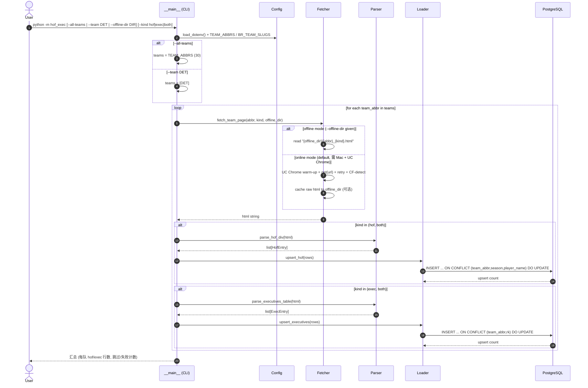
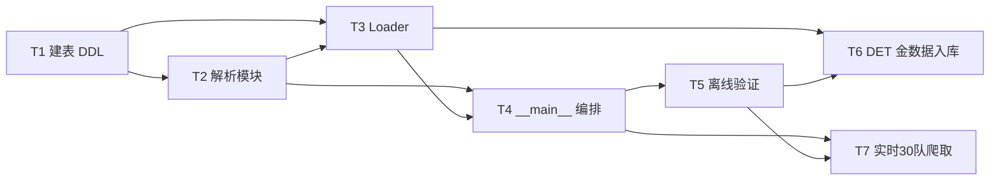

# 系统架构设计 + 任务分解：BR 球队 HOF / Executives 爬虫与落库（C 项）

> 角色：架构师（高见远）｜语言：中文｜交付对象：工程师（经 team-lead 转发）
> 前置：A 项（transactions 孤儿行）、B 项（HOF 名字修正）已完成并落盘，本设计不触及。
> 本次范围 = **C + 爬虫化**：把 BR 球队页的「名人堂 HoF」与「高管 executives」落成两张新表，并写一个可复用的爬虫模块铺到全部 30 支 NBA 球队。

---

## 0. 范围与边界（确认）

| 项 | 状态 |
|---|---|
| A：Dennis Schröder transactions 孤儿行 | 已完成，不处理 |
| B：HOF 23 名反转名/漏抓 | 已完成，不处理 |
| **C：新增 `team_hof` + `team_executives` 两张表** | **本次交付** |
| **爬虫化：复用 `scrape_br_hof_exec.py` 套路，铺 30 队** | **本次交付** |
| 实时爬取执行环境 | 仅用户 Mac（沙箱被 CF 403 / WebFetch 丢注释表）；解析逻辑在沙箱用已存 `DET_*.html` 离线验证 |

---

## 1. 实现方案 + 框架选型

### 1.1 技术难点
1. **HOF 页面不是 `<table>`**：是 `div#div_leaderboard` 容器下、按赛季切块的 `div#leaderboard_number-<season>` 文本列表（`h4` 标赛季 + `<span><a>` 列球员）。沙箱 `curl` 被 CF 403、WebFetch 丢 BR 注释块，**必须用 UC Chrome 真实浏览器**才拿得到完整 DOM；但已有离线 `DET_hof.html` 可用于验证。
2. **executives 是干净 `<table>`**（偶发藏在 HTML 注释块内），字段 `Rk,Executive,Start,End,Notes`，且金 CSV 第 22 行混入了重复表头行，须跳过。
3. **数据格式不统一**：`start/end` 混排 `'1948'` / `'1954-03-27'` / `'present'`；`season` 形如 `'2013-14'`（个别源有笔误）。须保留原文、做防御式归一。
4. **环境隔离**：口令从 `.env` 的 `DB_PASSWORD` 经 `os.environ` 注入，严禁硬编码；实时爬取只在 Mac 跑。

### 1.2 框架与库选型（不引入新框架）
纯 Python，复用项目既有资产：

| 用途 | 选型 | 说明 |
|---|---|---|
| DB 连接 | `psycopg2`（已在 `.venv`） | **复用** `common/bridge_constants.get_pg_conn()` / `PG_DSN`，口令来自 `DB_PASSWORD` |
| HTML 解析 | `bs4`（已在 `.venv`） | `BeautifulSoup(html, "html.parser")`；遍历注释块取 `<table>` |
| 实时抓取 | `undetected_chromedriver`（已在 `.venv`） | **复用** `scrape_br_hof_exec.py` 的 UC Chrome 套路（warm-up + 重试 + CF 检测） |
| 30 队常量 | **复用** `common/bridge_constants._CANON` | 当前 30 队规范缩写集合 |
| CLI | 标准库 `argparse` | `--all-teams` / `--team` / `--offline-dir` / `--kind` |
| 记录载体 | 标准库 `dataclasses` | `HofEntry` / `ExecEntry` |
| `.env` 加载 | **自写 ~12 行轻量 loader**（不新增 `python-dotenv` 依赖） | 读项目根 `.env` 注入 `os.environ`，仅在变量缺失时填充 |

### 1.3 架构模式
**分层 + 函数式**（无强制 OOP 框架）：
`config`（连接/常量/路径） → `fetch`（决定 html 来源：离线文件 or UC Chrome） → `parse`（纯函数：html 字符串 → 记录列表，离线在线通用） → `load`（upsert 入库 + 金数据导入） → `__main__`（CLI 编排）。
关键原则：**`parse` 层是纯函数，只吃 html 字符串**，因此离线与在线共用同一解析路径，沙箱即可完整验证解析正确性。

---

## 2. 两张表 DDL（含索引、upsert 唯一约束）

> 完整文件见 `db/team_hof_exec.sql`（已写入项目根 `db/`）。要点如下。

### 2.1 `team_hof`（粒度 = 一个 `(队, 赛季, 球员)`）
```sql
CREATE TABLE IF NOT EXISTS team_hof (
    id           BIGSERIAL PRIMARY KEY,
    team_abbr    VARCHAR(3)  NOT NULL,   -- 规范 3 字母缩写
    season       VARCHAR(7)  NOT NULL,   -- '2013-14' (YYYY-YY)
    player_name  TEXT        NOT NULL,   -- 球员名原文
    br_slug      TEXT        NULL,       -- BR 球员页 slug, 可选, 留待桥接
    scraped_at   TIMESTAMP   NOT NULL DEFAULT now(),
    UNIQUE (team_abbr, season, player_name)
);
CREATE INDEX IF NOT EXISTS idx_th_team   ON team_hof (team_abbr);
CREATE INDEX IF NOT EXISTS idx_th_player ON team_hof (player_name);
```
- DET 金数据：118 条 `season_entries` → 本表 118 行；23 名去重球员由 `(team_abbr, player_name)` 派生，无需单独列。

### 2.2 `team_executives`（粒度 = 一个 `(队, 任期序号 rk)`）
```sql
CREATE TABLE IF NOT EXISTS team_executives (
    id           BIGSERIAL PRIMARY KEY,
    team_abbr    VARCHAR(3)  NOT NULL,
    rk           INTEGER     NOT NULL,   -- BR 表 Rk 列
    executive    TEXT        NOT NULL,
    start        TEXT        NOT NULL,   -- 保留原文: '1948' / '1954-03-27' / 'present'
    "end"        TEXT        NOT NULL,   -- end 是保留字, 须双引号
    notes        TEXT        NULL,
    scraped_at   TIMESTAMP   NOT NULL DEFAULT now(),
    UNIQUE (team_abbr, rk)
);
CREATE INDEX IF NOT EXISTS idx_te_team ON team_executives (team_abbr);
CREATE INDEX IF NOT EXISTS idx_te_exec ON team_executives (executive);
```
- DET 金数据：22 条 tenure → 本表 22 行（解析时跳过 `Rk=="Rk"` 重复表头行）。

### 2.3 是否外键到 `dim_players` —— 权衡结论
| 方案 | 优点 | 缺点 | 结论 |
|---|---|---|---|
| **A. 先不建外键，只存名 + 可选 `br_slug`** | 零桥接复杂度；`br_slug` 已顺手从 `<a href>` 抓取，留作后续 name→id 匹配锚点 | 暂时无法 JOIN `dim_players` | ✅ **采用** |
| B. 现在就建 `player_key` 桥接表 | 可直接关联事实表 | name 归一/消歧未决（绰号、中间名、字符转义如 `Charles "Chuck" Cooper`）；YAGNI | ❌ 暂不做 |

**结论**：采用方案 A。表内不引外键，`br_slug` 设为可空 TEXT，后续单独开「name→player_id 桥接」任务再处理。

---

## 3. 文件列表及相对路径（职责）

新增封装为 `hof_exec/` 包（放在项目根，与既有 `scrape_br_hof_exec.py` 同级），DB 复用 `common/`：

| 文件 | 职责 |
|---|---|
| `db/team_hof_exec.sql` | **T1** 两张表 DDL（IF NOT EXISTS + 唯一约束 + 索引） |
| `hof_exec/__init__.py` | 包标识 |
| `hof_exec/config.py` | **T2/T4** 读项目根 `.env`（轻量 loader，不引 `python-dotenv`）；导出 `TEAM_ABBRS`（复用 `_CANON`）、`BR_TEAM_SLUGS`（规范缩写→BR URL slug 映射）、`PROJECT_ROOT`、`OFFLINE_DEFAULT`；`get_conn()` 转发自 `common.bridge_constants` |
| `hof_exec/fetch.py` | **T4** `fetch_team_page(abbr, kind, offline_dir=None) -> str`：离线=读 `{offline_dir}/{abbr}_{kind}.html`；在线=UC Chrome（复用 warm-up/重试/CF 检测）；在线可顺手缓存 raw 到 `offline_dir` |
| `hof_exec/parse.py` | **T2** `parse_hof_div(html) -> list[HofEntry]`、`parse_executives_table(html) -> list[ExecEntry]`、`normalize_season(token) -> str`；纯函数，离线在线通用 |
| `hof_exec/load.py` | **T3** `upsert_hof(rows)`、`upsert_executives(rows)`（INSERT … ON CONFLICT DO UPDATE）、`load_from_gold(json_path, csv_path)`（从 DET 金文件直接入库，双入口） |
| `hof_exec/validate.py` | **T5** `assert_parse_matches_gold(html_dir, gold_json, gold_csv)`：断言解析产出 23 HOF / 22 executives 且与金文件一致 |
| `hof_exec/__main__.py` | **T4** CLI 入口：`--all-teams` / `--team ABBR` / `--offline-dir DIR` / `--kind hof\|exec\|both` |
| `tests/test_hof_exec_offline.py` | **T5** pytest：用已存 `DET_hof.html` + `DET_executives.html` + 金文件做离线断言 |
| `docs/run_live_crawl.md` | **T7** 实时 30 队爬取 runbook（Mac 执行步骤、CF warm-up 注意、失败重试） |

**复用关系**：`hof_exec/config.py` 直接 `from common.bridge_constants import get_pg_conn, PROJECT_ROOT, _CANON`；`hof_exec/fetch.py` 的在线分支移植 `scrape_br_hof_exec.py` 的 `scrape()` + `_is_cf_challenge()`。

---

## 4. 解析算法（关键）

### 4.1 HOF `div` 列表解析（`parse_hof_div`）
**输入**：html 字符串（在线/离线等价）。**输出**：`list[HofEntry]`。

1. `soup = BeautifulSoup(html, "html.parser")`
2. 定位容器：`container = soup.find("div", id="div_leaderboard") or soup.find("div", class_="leaderboard_grid")`。
3. 遍历每个 `block = container.find_all("div", id=re.compile(r"^leaderboard_number-(.+)$"))`：
   - **赛季**：`season_raw = block.find("h4").get_text(strip=True)`（人类可见标签，作为规范来源）；解析失败再回退取 id 正则分组。
   - `season = normalize_season(season_raw)`
   - 遍历 `block` 内所有 `<span><a>`：`player_name = a.get_text(strip=True)`；`br_slug =` 从 `a["href"]` 形如 `/players/b/billuch01.html` 提取末段文件名去后缀（可选，健壮处理缺 href）。
   - 产出 `HofEntry(team_abbr, season, player_name, br_slug)`。
4. 返回列表。

**`normalize_season(token)`（防御式容错）**：
- `token = token.strip()`
- 若匹配 `^\d{4}-\d{2}$` → 原样返回（规范 `'2013-14'`；gold 的 118 条 `season_entries` 全部命中此类）。
- 否则尝试修复：提取前导 4 位年份 `Y = re.search(r"(\d{4})", token)`；若命中则 `end = Y+1`，返回 `f"{Y}-{str(Y+1)[2:]}"`，并打 warning 日志（覆盖 `'2010-1'` / `'2010--11'` 等畸形）。
- 仍失败 → 记录为不可解析并跳过（理论不发生）。

> 说明：gold `DET_hof_players.json` 的 118 条 `season_entries` 全部符合 `^\d{4}-\d{2}$`，团队 lead 提到的「`'2010-11'` 笔误」在本金数据中实为合法赛季（麦蒂底特律最后一季），故 normalize 以防御式实现为主，并非针对单一固定字符串。若有具体畸形样本请补（见 §9）。

**与金文件对齐**：解析产出 118 个 `(season, player)` 对 == `season_entries`；去重球员 23 == `count`/`players`。故 `team_hof` 粒度 = `season_entry`。

### 4.2 executives `<table>` 解析（`parse_executives_table`）
**输入**：html 字符串。**输出**：`list[ExecEntry]`。

1. `soup = BeautifulSoup(html, "html.parser")`
2. 取表（**注释块感知**，兼容 BR 把表藏进 `<!-- -->` 的情况——复用 `scrape_br_hof_exec.py` 的 `extract_tables` 思路）：遍历主文档 `<table>` + 所有 `Comment` 节点内 `<table>`，挑表头含 `Executive` + `Start`（或严格等于 `[Rk,Executive,Start,End,Notes]`）的那张。
3. 逐行：
   - **跳过重复表头行**：若首单元格 `== "Rk"`（金 CSV 第 22 行混入的重复表头）或整行等于表头 → `continue`。
   - 跳过空行 / 首格非数字（rk 无法解析）的行（计 warning）。
   - 映射 `rk=int(cells[0])`、`executive=cells[1]`、`start=cells[2]`、`end=cells[3]`、`notes=cells[4] or ""`。
   - `start/end` **保持 TEXT 原样**（含 `'1948'`、`'1954-03-27'`、`'present'`，**不转 DATE**）。
   - 产出 `ExecEntry(team_abbr, rk, executive, start, end, notes)`。
4. 返回列表。

### 4.3 离线 / 在线双模式
- **解析层是纯函数**：只接收 html 字符串，无任何网络/IO 分支 → 离线（`DET_*.html`）与在线（UC Chrome 抓取）走同一代码路径，保证沙箱验证 == 线上行为。
- **fetch 层隔离来源**：`fetch_team_page(abbr, kind, offline_dir)` 内部 `if offline_dir: 读文件 else: UC Chrome`。在线模式可把 raw html 顺手落盘 `offline_dir` 做缓存/复核。

---

## 5. 程序调用流程（时序图 Mermaid）

> 单独文件见 `docs/sequence-diagram.mermaid`；此处为同图预览。



**三种调用形态**
- `python -m hof_exec --offline-dir det2026_br --team DET --kind both` → 沙箱可跑，纯离线验证+入库。
- `python -m hof_exec --team DET --kind both` → 在线抓 DET 两页并入库（需 Mac）。
- `python -m hof_exec --all-teams --kind both` → 在线铺全部 30 队（需 Mac；建议分批/限速避免 CF）。

---

## 6. 任务列表（有序、含依赖、按实现顺序）

> 说明：本分解按团队 lead 明确要求拆为 **T1–T7**（含独立的离线验证/离线入库/线上爬取阶段）。这有意超出通用「≤5 任务」默认上限，因为各阶段可独立验证、且 T5/T6/T7 是明确不同的交付与执行环境。

| Task | 名称 | 源文件 | 依赖 | 优先级 |
|---|---|---|---|---|
| **T1** | 写 `db/team_hof_exec.sql` 并连库执行建表 | `db/team_hof_exec.sql` | — | P0 |
| **T2** | 写解析模块（HOF div 列表 + executives table，离线/在线双模式） | `hof_exec/parse.py`、`hof_exec/config.py`（常量/`.env` loader）、`hof_exec/__init__.py` | T1（仅概念依赖；解析本身不触库） | P0 |
| **T3** | 写 upsert loader（解析结果入口 + DET 金文件入口双支持） | `hof_exec/load.py` | T1, T2 | P0 |
| **T4** | 写 `__main__` 编排（30 队常量 + `--all-teams`/`--team`/`--offline-dir`/`--kind`） | `hof_exec/__main__.py`、`hof_exec/fetch.py` | T2, T3 | P0 |
| **T5** | 离线验证：用已存 `DET_*.html` 跑解析，断言 23 HOF / 22 executives 且对齐金文件 | `hof_exec/validate.py`、`tests/test_hof_exec_offline.py` | T2, T4（offline 模式） | P1 |
| **T6** | 用 loader 把 DET 金数据写入新表（离线入库） | 复用 `hof_exec/load.py:load_from_gold` + `hof_exec/__main__.py`（offline 模式调用） | T3, T5 | P1 |
| **T7** | （需用户 Mac）实时 30 队爬取：runbook + 执行命令说明 | `docs/run_live_crawl.md`（CLI 已在 T4 具备） | T4, T5 | P2 |

**依赖关系图（Mermaid）**


---

## 7. 依赖包列表

```
- psycopg2          # 已在 .venv；DB 连接（经 common.bridge_constants）
- beautifulsoup4    # 已在 .venv；HTML 解析
- undetected_chromedriver  # 已在 .venv；UC Chrome 实时抓取（仅在线/Mac）
- 标准库（无需安装）: os, re, json, argparse, dataclasses, datetime, unittest.mock
```
**无需新增任何第三方包**。`.env` 加载用自写轻量 loader，不引入 `python-dotenv`。

---

## 8. 共享知识（跨文件约定）

| 约定 | 内容 |
|---|---|
| **DB 连接** | `from common.bridge_constants import get_pg_conn`；口令 **仅** 来自 `os.environ["DB_PASSWORD"]`，禁止硬编码。用项目 `.venv/bin/python` 运行。 |
| **`.env` 加载** | `hof_exec/config.py` 内轻量 loader：若 `DB_PASSWORD` 等未设，则读项目根 `.env`（`PROJECT_ROOT/.env`）注入 `os.environ`；已设则不动。`.env` 已被 gitignore。 |
| **30 队缩写** | `TEAM_ABBRS` 直接复用 `common.bridge_constants._CANON`（当前 30 队规范缩写）。 |
| **BR URL slug 映射** | `BR_TEAM_SLUGS`：规范缩写 → BR `/teams/{slug}/` slug。已知差异：`BKN→BRK`、`CHA→CHO`（其余同名）。fetch 对 404 优雅跳过+记录（见 §9-3）。 |
| **season 规范** | 字符串 `'YYYY-YY'`（如 `'2013-14'`），`VARCHAR(7)`；经 `normalize_season` 防御式归一。 |
| **`present` 不转日期** | `team_executives.start/end` 一律 `TEXT` 原样存：`'1948'` / `'1954-03-27'` / `'present'`，不强行转 DATE。 |
| **重复表头跳过** | executives 解析时，首格 `== "Rk"` 或整行等于表头 → 跳过；空行/非数字 rk 跳过并 warning。 |
| **解析纯函数化** | `parse_*` 只吃 html 字符串，离线/在线共用；fetch 层才区分来源。 |
| **审计列** | 两表均有 `scraped_at TIMESTAMP DEFAULT now()`，upsert 时刷新。 |
| **upsert 语义** | 同唯一键覆盖（`ON CONFLICT … DO UPDATE`）；不保留历史快照（如需快照另开任务）。 |

---

## 9. 待明确事项（需用户拍板）

1. **是否现在就建 `player_key` 桥接？** 设计倾向「否」（只存名 + 可选 `br_slug`），留后续单独任务做 name→id 匹配。请确认。
2. **30 队范围**：默认用当前 30 队（`_CANON`）。是否需含历史 franchise（如已迁址/更名的旧队页）？建议仅当前 30 队。
3. **BR URL slug 映射需实测确认**：BR 用 `BRK`(篮网)/`CHO`(黄蜂)，而 `_CANON` 用 `BKN`/`CHA`。个别队可能无 `executives.html` 或返回 404/空页（如极年轻球队）。建议 `BR_TEAM_SLUGS` 内置映射 + fetch 对 404 优雅跳过并记录，而非中断全量。请确认映射表或授权我按 BR 现行 slug 内置。
4. **实时爬取由用户手动在 Mac 跑**：本设计交付 = CLI + `docs/run_live_crawl.md` runbook；实际执行在用户 Mac（本沙箱 CF 403）。请确认此分工。
5. **HOF `season` 笔误的具体形态**：gold 的 118 条均合法，`normalize_season` 按防御式实现。如有具体畸形样本（非 `'2010-11'`）请补充，以校准修复规则。
6. **`start/end` 未来是否转 DATE**：当前保留 TEXT；若后续要做任期时长/在职分析，再开解析（`present` → `NULL` 或 `now()`）。请确认暂不强转。
7. **更新策略**：默认 upsert 覆盖（同唯一键刷新 `scraped_at`）。是否需要保留历史快照/软删？建议覆盖即可。

---

## 附：DET 金数据校验基线（供 T5/T6 断言）
- `DET_hof_players.json`：`count=23` 去重球员；`season_entries=118` 条 → `team_hof` 应落 **118 行**。
- `DET_executives.csv`：22 条 tenure（含第 22 行重复表头须跳过）→ `team_executives` 应落 **22 行**。
- 唯一性：HOF `(DET, season, player)`、Exec `(DET, rk)` 在金数据内无冲突。
