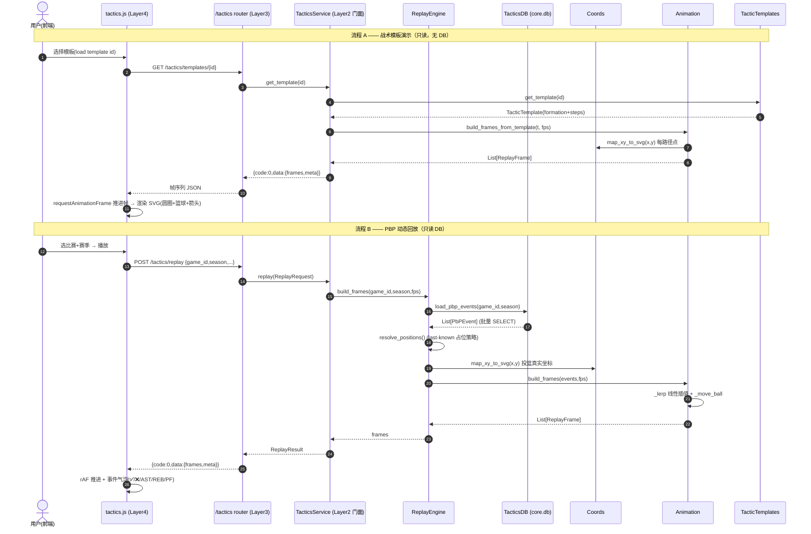

# NBACore Studio v8 — 球队战术板 + PBP 动态回放（v1）系统架构设计

> 作者：高见远（Gao）｜角色：架构师（Bob）｜项目：NBACore Studio v8（nba_desktop_omega）
> 版本：v1（架构设计稿）｜上游：PRD `docs/tactics-board/prd.md`（许清楚）
> 编排者：齐活林（交付总监）｜日期：2026-07-10
> 范围：仅架构设计 + 任务分解，**不含实现代码**（可含伪代码 / 接口签名）。

---

## 0. 设计摘要（一页结论）

| 维度 | 决策 |
|------|------|
| 后端形态 | 新增 `backend/services/tactics_engine/`（坐标映射 + 插值 + 帧序列生成）；薄编排路由 `backend/api/routers/tactics.py` |
| 四层隔离 | Frontend(SVG 渲染 + rAF) → API(只编排) → Engine(唯一计算点) → Data(只读 `play_by_play`)。**坐标映射 / 插值 / 帧生成 100% 在 Engine 层，前端零计算** |
| 模板策略 | v1 内置 ≥8 个战术模板（只读、硬编码于 `tactic_templates.py`），无写路径；AI 生成 P2 预留可插拔接口 |
| 回放控制 | v1：播放/暂停 + 速度档(1x/2x/4x) + 进度条；逐事件步进归入 P1 |
| 坐标范围 | 半场即可；x∈[-250,250]、y∈[0,94]（y=距底线距离，英尺×10 量级）；映射到 500×470 半场 SVG 像素 |
| 占位策略 | 非投篮事件 (0,0) → **last-known 位置延续**；投篮用真实 x/y；无历史的新上场球员 → 球场语义默认位 |
| 动画插值 | 线性插值（固定帧率 30fps），无缓动；deterministic |
| 回放赛季 | 2020–2026（仅 `source='br_crawler'` 有 xy） |
| 新增依赖 | **无**（复用 fastapi / psycopg2 / pydantic / core.db.batch_query） |
| AI 接口 | `TacticGenerator` ABC + 注册表；v1 默认 `StaticTemplateGenerator`，预留 `LLMTacticGenerator`（Ollama/LLM 插槽） |

---

## 1. 实现方案 + 框架选型

### 1.1 技术挑战与框架选择

| 难点 | 选型 / 方案 | 理由 |
|------|------------|------|
| 坐标映射 x/y→半场像素 | 自研 `coords.py`（纯函数，1:1 线性 + 半场折叠） | 量级固定、需 deterministic；无需第三方库 |
| 逐帧坐标序列生成 | 自研 `animation.py`（线性插值 + 球/球员编排） | 帧数据必须后端生成；纯 Python 即可 |
| 只读 PBP 接入 | 复用 `backend.core.db.batch_query`（SELECT + 参数化） | 与 v8 §2/§6 一致；禁止动态 SQL / per-row 循环 |
| 前端渲染 | 原生 JS + SVG（`js/components/tactics.js`），rAF 推进帧 | 与现有 frontend 风格一致；无构建链 |
| 后端框架 | FastAPI（沿用 v8 入口 `backend/app.py`） | 四层架构已落地，直接挂载新 router |
| AI 生成（P2） | `TacticGenerator` 抽象基类 + 注册表模式 | 可插拔、零重构接入 LLM/Ollama |

**架构模式**：经典分层（Layered）+ 门面（Facade，`service.py` 汇总引擎能力供 API 编排）。无新引入运行时依赖。

### 1.2 战术板引擎模块划分（`backend/services/tactics_engine/`）

```
tactics_engine/
├── __init__.py            # 导出 service / 常量
├── schemas.py             # Pydantic 数据模型（TacticTemplate / ReplayFrame / ReplayRequest / ReplayResult ...）
├── coords.py              # 坐标映射 x/y → 半场 SVG 像素（唯一映射点）
├── db.py                  # 只读 PBP 数据接入（batch_query，参数化）
├── tactic_templates.py    # 内置 ≥8 战术模板库（站位 + 路径数据 + StaticTemplateGenerator 数据）
├── replay_engine.py       # PBP 回放：查 PBP → 映射 → 组装事件序列 → last-known 策略
├── animation.py           # 线性插值 / 帧生成 / 球移动编排（输出 ReplayFrame 序列）
├── ai_generator.py        # TacticGenerator ABC + Static(默认) + LLM(预留) + 注册表
└── service.py             # 门面：replay / list_templates / get_template / generate_tactic(预留)
```

### 1.3 PBP 回放引擎流程

1. `replay_engine.build_event_sequence(gameid, season)`：经 `db.py` 批量取该场全部 PBP 行（按 `period ASC, clock_seconds DESC` 取时间序），转为 `PbPEvent` 列表。
2. 逐事件解析 actor 坐标：
   - 投篮（action_verb∈{makes,misses}）→ 真实 `coords.map_xy_to_svg(x,y)`，标记 `pos_source='real'`。
   - 非投篮且 (x,y)==(0,0) → 取该 player 的 `last_known` 像素坐标；若首次出现无历史 → 球场语义默认位（替补席 / 本方半场底线附近），标记 `pos_source='last_known'|'default'`。
3. `animation.build_frames(events, fps)`：在相邻事件间按 `clock` 差（或默认 2s）线性插值每位球员/篮球像素坐标，生成 `ReplayFrame` 列表；actor 事件帧附加 `Annotation`（✅/❌/AST/REB/PF…）。
4. `service` 打包为 `ReplayResult{frames, meta}` 返回 API。

### 1.4 战术模板动画（同一帧管道）

`animation.build_frames_from_template(template, fps)`：把 `TacticTemplate.steps`（每步含 actor 路径 polyline、球移动目标、duration_s）插值展开为同一 `ReplayFrame` 序列 → 前端用同一套渲染器播放，无需感知"模板 vs PBP"差异。

### 1.5 AI 战术生成（P2 预留，可插拔）

```text
TacticGenerator (ABC):
    generate_from_natural_language(prompt: str, constraints: dict) -> TacticTemplate
    extract_from_pbp(game_id: str, segment: dict) -> TacticTemplate

REGISTRY = {
    "static": StaticTemplateGenerator,   # v1 默认：返回内置模板
    "llm":    LLMTacticGenerator,        # P2 预留：对接 Ollama/LLM（Mac 版远期目标）
}
```

v1 仅落地契约 + `StaticTemplateGenerator`（保证接口可测、可运行）；`LLMTacticGenerator` 给出签名与 `NotImplementedError` 占位，不接真实 LLM。`TacticTemplate` 数据结构与 P0 模板库共用（§3）。

### 1.6 与 v8 现有后端的集成点

- 新增引擎目录 `backend/services/tactics_engine/`（与 `clutch_engine/`、`trade_engine/` 同级，风格一致）。
- 新增路由 `backend/api/routers/tactics.py`，在 `backend/app.py` 的 `import` 与 `backend/api/routers/__init__.py` 的元组里登记 `tactics`。
- 数据接入严格走 `backend.core.db.batch_query`（与 trade/clutch 一致，不新建连接池，v1 只读）。
- 路由返回统一信封 `{code, data, message}`（与 clutch router 一致）。

---

## 2. 文件列表及相对路径

### 新建文件（后端引擎）

| 路径 | 职责 |
|------|------|
| `backend/services/tactics_engine/__init__.py` | 导出 `TacticsService`、常量、注册 AI 生成器 |
| `backend/services/tactics_engine/schemas.py` | Pydantic 模型：`TacticTemplate`/`PlayerSpot`/`TacticStep`/`ReplayFrame`/`PlayerSprite`/`BallSprite`/`Annotation`/`ReplayRequest`/`ReplayResult`/`ReplayMeta`/`PbPEvent`/`GameMeta` |
| `backend/services/tactics_engine/coords.py` | `map_xy_to_svg(x,y)->(px,py)`、半场折叠、常量（`SVG_W/H`、`PX_PER_UNIT`、`FOLD_FULL_COURT`） |
| `backend/services/tactics_engine/db.py` | 只读 PBP 接入：`load_pbp_events(gameid,season)`、`list_replay_games(season)`、`load_game_meta(gameid,season)`；全部 `core.db.batch_query` 参数化 |
| `backend/services/tactics_engine/tactic_templates.py` | 内置 ≥8 模板数据（站位 + 路径）+ `get_template(id)`/`list_templates()` |
| `backend/services/tactics_engine/replay_engine.py` | `build_event_sequence()`、`resolve_positions()`（last-known 策略）、`build_frames()` 编排 |
| `backend/services/tactics_engine/animation.py` | `build_frames(events,fps)`、`build_frames_from_template(template,fps)`、`_lerp(prev,cur,t)`、`_move_ball()` |
| `backend/services/tactics_engine/ai_generator.py` | `TacticGenerator`(ABC)、`StaticTemplateGenerator`、`LLMTacticGenerator`(预留)、`REGISTRY` |
| `backend/services/tactics_engine/service.py` | `TacticsService` 门面：`replay()`/`list_templates()`/`get_template()`/`generate_tactic()`(预留) |

### 新建文件（后端路由）

| 路径 | 职责 |
|------|------|
| `backend/api/routers/tactics.py` | 薄编排路由（见 §5 端点清单） |

### 修改文件（集成到现有 v8）

| 路径 | 改动 |
|------|------|
| `backend/app.py` | 在 router import 元组加入 `tactics` 并挂载 |
| `backend/api/routers/__init__.py` | 导出 `tactics` 到 `__all__` / import 列表 |

### 新建文件（前端）

| 路径 | 职责 |
|------|------|
| `frontend/js/components/tactics.js` | 战术板组件（IIFE，暴露 `window.Tactics.render(rootId)`）：半场 SVG、双色带号圆圈、篮球、路径箭头、事件气泡、回放控制条 |
| `frontend/css/style.css` | 追加战术板相关样式类（复用现有 `.card/.page` 体系，少量新增） |

### 修改文件（前端入口）

| 路径 | 改动 |
|------|------|
| `frontend/index.html` | 侧栏新增 `nav-item data-page="tactics"`；新增 `<div id="page-tactics" class="page">` 容器；引入 `js/components/tactics.js` |
| `frontend/js/app.js` | `nav()` 增加 `if(page==='tactics') loadTacticsPage()`；新增 `loadTacticsPage()` 调 `window.Tactics.render('tacticsRoot')` |

### 可选 SQL（仅 P1-TB-11 启用，v1 不建表）

- `sql/004_tactics_templates.sql`：**可选** DDL——用户自建模板持久化表（`tactics_templates`，含 formation/steps JSONB）。v1 模板硬编码，无需此表；列入附录供 P1 参考，且必须符合 v8 §6（专用写池 + 参数化 SQL）。

---

## 3. 数据结构和接口（类图）

> 完整 Mermaid `classDiagram` 另存于 `class-diagram.mermaid`。

```mermaid
classDiagram
    %% ── 战术模板模型 ──
    class TacticTemplate {
        +str id
        +str name
        +str description
        +list~PlayerSpot~ formation
        +tuple ball_start
        +list~TacticStep~ steps
        +list~tuple~ ball_path
        +dict meta
        +to_frames(fps) list~ReplayFrame~
    }
    class PlayerSpot {
        +int slot
        +str label
        +str team  %% 'home' | 'away'
        +float x
        +float y
    }
    class TacticStep {
        +int index
        +str action  %% screen/cut/pass/dribble/roll/pop
        +int actor_slot
        +list~tuple~ path
        +slot_or_xy ball_to
        +float duration_s
    }

    %% ── 回放帧模型 ──
    class ReplayFrame {
        +float t
        +list~PlayerSprite~ players
        +BallSprite ball
        +list~Annotation~ annotations
        +int event_index
    }
    class PlayerSprite {
        +str player_id
        +str label
        +str team
        +str color
        +float x_px
        +float y_px
        +str pos_source  %% real/last_known/default
    }
    class BallSprite {
        +float x_px
        +float y_px
        +str holder  %% player_id | null
    }
    class Annotation {
        +str type  %% MAKE/MISS/AST/REB/PF/SUB/TOV
        +str text
        +float x_px
        +float y_px
    }

    %% ── 请求 / 结果 ──
    class ReplayRequest {
        +str game_id
        +str season
        +int period
        +int start_clock
        +str segment
        +float speed
        +int frame_rate
    }
    class ReplayResult {
        +str game_id
        +str season
        +list~ReplayFrame~ frames
        +ReplayMeta meta
    }
    class ReplayMeta {
        +int fps
        +float duration_s
        +int frame_count
        +dict court  %% {w,h}
        +dict teams  %% {home,away}
        +int period
        +tuple clock
    }

    %% ── 引擎内部 ──
    class PbPEvent {
        +int event_index
        +str game_id
        +str season
        +int period
        +int clock_seconds
        +str event_type
        +str subtype
        +str action_verb
        +str player
        +str team
        +int x
        +int y
        +int dist
    }
    class GameMeta {
        +str game_id
        +str season
        +list~str~ teams
        +int period_min
        +int period_max
        +int event_count
        +int xy_count
    }

    %% ── AI 生成（可插拔）──
    class TacticGenerator {
        <<abstract>>
        +generate_from_natural_language(prompt, constraints) TacticTemplate*
        +extract_from_pbp(game_id, segment) TacticTemplate*
    }
    class StaticTemplateGenerator {
        +generate_from_natural_language(prompt, constraints) TacticTemplate
        +extract_from_pbp(game_id, segment) TacticTemplate
    }
    class LLMTacticGenerator {
        +generate_from_natural_language(prompt, constraints) TacticTemplate
        +extract_from_pbp(game_id, segment) TacticTemplate
    }

    %% ── 引擎服务类 ──
    class Coords {
        +map_xy_to_svg(x, y) tuple
        +_fold_half(y) float
    }
    class TacticsDB {
        +load_pbp_events(game_id, season) list~PbPEvent~
        +list_replay_games(season) list~dict~
        +load_game_meta(game_id, season) GameMeta
    }
    class TacticTemplates {
        +list_templates() list~dict~
        +get_template(id) TacticTemplate
    }
    class ReplayEngine {
        +build_event_sequence(game_id, season) list~PbPEvent~
        +resolve_positions(events) list~ResolvedEvent~
        +build_frames(game_id, season, fps) list~ReplayFrame~
    }
    class Animation {
        +build_frames(events, fps) list~ReplayFrame~
        +build_frames_from_template(t, fps) list~ReplayFrame~
        +_lerp(prev, cur, t) Frame
        +_move_ball(...) BallSprite
    }
    class TacticsService {
        +replay(req) ReplayResult
        +list_templates() list~dict~
        +get_template(id) TacticTemplate
        +generate_tactic(prompt, provider) TacticTemplate
    }

    %% ── 关系 ──
    TacticTemplate "1" *-- "5" PlayerSpot : formation
    TacticTemplate "1" *-- "0..*" TacticStep : steps
    ReplayResult "1" *-- "1" ReplayMeta : meta
    ReplayResult "1" *-- "0..*" ReplayFrame : frames
    ReplayFrame "1" *-- "0..10" PlayerSprite : players
    ReplayFrame "1" *-- "1" BallSprite : ball
    ReplayFrame "1" *-- "0..*" Annotation : annotations
    TacticsService --> ReplayEngine : uses
    TacticsService --> TacticTemplates : uses
    TacticsService --> TacticGenerator : uses
    ReplayEngine --> TacticsDB : reads
    ReplayEngine --> Coords : maps
    ReplayEngine --> Animation : interpolates
    Animation --> Coords : maps
    TacticGenerator <|-- StaticTemplateGenerator
    TacticGenerator <|-- LLMTacticGenerator
```

### 3.1 关键方法签名（接口契约，供 Engineer 实现）

```python
# coords.py —— 唯一坐标映射点
def map_xy_to_svg(x: float, y: float) -> tuple[float, float]:
    """NBA(x,y) → 半场 SVG 像素 (px,py)。确定性、无副作用。"""

# replay_engine.py
def build_event_sequence(game_id: str, season: str) -> list[PbPEvent]: ...
def resolve_positions(events: list[PbPEvent]) -> list[ResolvedEvent]:
    """逐事件解析每位球员像素坐标，落地 last-known 占位策略。"""
def build_frames(game_id: str, season: str, fps: int = 30) -> list[ReplayFrame]: ...

# animation.py
def build_frames(events: list[ResolvedEvent], fps: int = 30) -> list[ReplayFrame]: ...
def build_frames_from_template(t: TacticTemplate, fps: int = 30) -> list[ReplayFrame]: ...
def _lerp(prev: tuple, cur: tuple, t: float) -> tuple:
    """线性插值；t∈[0,1]。"""

# ai_generator.py
class TacticGenerator(ABC):
    @abstractmethod
    def generate_from_natural_language(self, prompt: str, constraints: dict) -> TacticTemplate: ...
    @abstractmethod
    def extract_from_pbp(self, game_id: str, segment: dict) -> TacticTemplate: ...

# service.py（门面）
class TacticsService:
    def replay(self, req: ReplayRequest) -> ReplayResult: ...
    def list_templates(self) -> list[dict]: ...
    def get_template(self, template_id: str) -> TacticTemplate: ...
    def generate_tactic(self, prompt: str, provider: str = "static") -> TacticTemplate: ...
```

---

## 4. 程序调用流程（时序图）

> 完整 Mermaid `sequenceDiagram` 另存于 `sequence-diagram.mermaid`。含两条主流程：A) 战术模板演示；B) PBP 动态回放。



---

## 5. 后端 API 端点清单（router `tactics.py`）

前缀 `/tactics`，全部返回 `{code, data, message}` 信封（与 clutch router 一致）。**纯编排，无 SQL / 无计算**。

| 方法 | 路径 | 入参 | 说明 | 调用引擎 |
|------|------|------|------|----------|
| GET | `/tactics/templates` | — | 列出内置 ≥8 模板（id/name/description/meta，不含坐标） | `service.list_templates()` |
| GET | `/tactics/templates/{template_id}` | path | 取单模板完整 formation+steps（用于动画） | `service.get_template()` |
| GET | `/tactics/games` | `?season=2025` | 列出该赛季可回放比赛（含 br_crawler xy 的 gameid + 两队 + 事件数） | `db.list_replay_games()` |
| GET | `/tactics/replay/metadata/{game_id}` | `?season=` | 比赛元数据（队、节范围、时钟范围、事件数、xy 覆盖数） | `db.load_game_meta()` |
| POST | `/tactics/replay` | `ReplayRequest` body | 生成逐帧坐标序列（核心） | `service.replay()` |
| POST | `/tactics/ai/generate` | `{prompt, provider}` | **P2 预留**：v1 返回 501/NotImplemented；接口契约可测 | `service.generate_tactic()` |

> 逐事件步进（P1-TB-10）由前端基于 `ReplayFrame.event_index` 定位，无需新增端点；速度/暂停/进度均为前端 rAF 控制，帧数据已含全部坐标。

---

## 6. 任务列表（有序、含依赖、按实现顺序）

> 交付总监要求覆盖 ①–⑩。以下 T01–T10 一一对应，标注依赖与优先级。每个任务为模块内聚单元；多文件任务满足 ≥3 文件，单文件引擎模块保持原子性以便独立验收。

| ID | 任务（对应 PRD 项） | Source Files | 依赖 | 优先级 |
|----|--------------------|--------------|------|--------|
| **T01** | ① 坐标映射模块 `coords.py` + 基础 schema/常量 | `backend/services/tactics_engine/__init__.py`、`schemas.py`、`coords.py` | 无 | P0 |
| **T02** | ② 数据接入层 `db.py`（只读 PBP） | `backend/services/tactics_engine/db.py` | T01（schemas） | P0 |
| **T03** | ③ 内置战术模板库 `tactic_templates.py`（≥8 个，站位+路径） | `backend/services/tactics_engine/tactic_templates.py`、`schemas.py`（TacticTemplate） | T01 | P0 |
| **T04** | ④ 回放引擎 `replay_engine.py`（查 PBP→映射→事件序列，last-known 策略） | `backend/services/tactics_engine/replay_engine.py`、`db.py`、`coords.py` | T01, T02 | P0 |
| **T05** | ⑤ 动画/帧生成 `animation.py`（线性插值、球移动、帧率） | `backend/services/tactics_engine/animation.py`、`coords.py`、`schemas.py` | T01, T03 | P0 |
| **T06** | ⑥ AI 生成可插拔接口 `ai_generator.py` | `backend/services/tactics_engine/ai_generator.py`、`schemas.py` | T01 | P2（契约） |
| **T07** | ⑦ 门面 `service.py`（replay / list_templates / get_template / generate_tactic） | `backend/services/tactics_engine/service.py` | T02,T03,T04,T05,T06 | P0 |
| **T08** | ⑧ 后端 API router `tactics.py` + 注册 `app.py`/`__init__.py` | `backend/api/routers/tactics.py`、`backend/app.py`、`backend/api/routers/__init__.py` | T07 | P0 |
| **T09** | ⑨ 前端半场 SVG 组件 `tactics.js`（双色圆圈+篮球+箭头+气泡+控制条） | `frontend/js/components/tactics.js`、`frontend/css/style.css` | T08（API 契约） | P0 |
| **T10** | ⑩ 修改 `index.html` + `app.js` 加入口 | `frontend/index.html`、`frontend/js/app.js` | T09 | P0 |

### 6.1 依赖关系嵌套说明

- T04（回放引擎）依赖 T01（坐标映射）+ T02（数据接入）→ 与总监提示「④ 依赖 ①②」一致。
- T08（router）依赖 T07（门面）：router 只编排，逻辑全在 service。
- T09（前端组件）依赖 T08（必须先有稳定 API 契约才能消费帧 JSON）。
- T10 依赖 T09（组件就绪后才挂入口）。

---

## 7. 依赖包列表

| 包 | 版本/说明 | 是否新增 |
|----|-----------|----------|
| fastapi | 沿用 v8 现有 | 否 |
| psycopg2 | 沿用 v8 现有（`core.db`） | 否 |
| pydantic | 沿用 v8 现有（schemas） | 否 |
| 无 SVG 后端库 | 渲染在前端（SVG 直接绘制），后端只出坐标 JSON | — |

**结论：v1 不引入任何新增 Python 依赖。** 线性插值、坐标映射均为纯 Python；SVG 由前端原生渲染，避免后端 SVG 库。

---

## 8. 共享知识（跨文件约定）

### 8.1 坐标系统一（Engine 层 `coords.py`）

- **源量级**：`x ∈ [-250, 250]`（横向，±25 ft ×10），`y ∈ [0, 94]`（距底线距离，英尺×10，y=0 为篮筐端底线）。
- **半场 SVG**：`viewBox="0 0 500 470"`；篮筐端在 SVG **底部**（UI 稿「篮筐端在下」）。
- **映射公式（确定性）**：

```python
SVG_W, SVG_H = 500, 470
PX_PER_UNIT = 1.0          # 坐标单位与像素 1:1（500 宽 ↔ x∈[-250,250]）
FOLD_FULL_COURT = True     # 若源已是半场帧则置 False

def _fold_half(y):
    # y∈[0,94] 为距底线距离；>47 视为对方半场，折叠回攻击半场 → 结果∈[0,47]
    return min(y, 94 - y) if FOLD_FULL_COURT else y

def map_xy_to_svg(x, y):
    sx = SVG_W / 2 + x                       # x=0 → 中心(250)
    sy = SVG_H - _fold_half(y)               # y=0(底线) → 底部(470)；y=47(半场顶) → 顶部(0)
    return (sx, sy)
```

- **朝向**：v1 默认 **FIXED 朝向**（篮筐恒在底部），不随主客队翻转（见 §9 待明确 ④）。

### 8.2 颜色约定

- 主队（home）= 色 A（建议 `#2563eb` 蓝）；客队（away）= 色 B（建议 `#ef4444` 红）。
- PBP 回放时优先用 `game_meta.teams` 提供的真实队色；模板演示用上述固定双色（无具体球队）。
- 圆圈内显示 `label`（号码或姓名缩写）；v1 用「按出场顺序分配 1–5 的 slot 号」作为号码（见 §9 待明确）。

### 8.3 时间 / 单位

- `season`：4 位字符串，如 `"2025"`（与 `games` 表一致；2020–2026）。
- `clock_seconds`：整数秒；同节内按 `DESC`（大→小）为时间正序。
- 帧 `t`：相对回放起点的秒（float）；`fps=30`；单事件默认时长 `DEFAULT_EVENT_S = 2.0`（无 clock 差时兜底）。
- 速度档 `speed ∈ {1,2,4}` 由前端 rAF 控制（后端帧序列不含速度，deterministic）。

### 8.4 NULL / 占位 (0,0) 处理（硬性）

- 非投篮事件 `x=y=0` **绝不**作为场地坐标下发；按 last-known 策略：
  - 该 player 有历史坐标 → 延续 `last_known`（标注 `pos_source='last_known'`）。
  - 首次出现（如替补上场）→ 球场语义默认位（本方半场底线附近 / 替补席区），标注 `pos_source='default'`。
- 投篮事件用真实 `map_xy_to_svg(x,y)`，标注 `pos_source='real'`。
- 前端不感知 (0,0)；帧 JSON 中所有坐标均为已解析像素。

### 8.5 帧 JSON Schema（前端消费契约）

```jsonc
{
  "code": 0,
  "data": {
    "game_id": "20250101_TEAMA_TEAMB",
    "season": "2025",
    "frames": [
      {
        "t": 0.0,
        "event_index": 0,
        "players": [
          {"player_id":"p1","label":"1","team":"home","color":"#2563eb",
           "x_px":250.0,"y_px":120.0,"pos_source":"real"}
        ],
        "ball": {"x_px":260.0,"y_px":130.0,"holder":"p1"},
        "annotations": [
          {"type":"MAKE","text":"✅","x_px":300.0,"y_px":90.0}
        ]
      }
    ],
    "meta": {
      "fps": 30,
      "duration_s": 42.0,
      "frame_count": 1260,
      "court": {"w":500,"h":470},
      "teams": {"home":"TEAMA","away":"TEAMB"},
      "period": 4,
      "clock": [720, 0]
    }
  },
  "message": "ok"
}
```

- `Annotation.type` 枚举：`MAKE`(✅) / `MISS`(❌) / `AST` / `REB` / `PF` / `SUB` / `TOV`（前端据此渲染气泡文案/图标）。
- `pos_source` 仅用于调试/透明度，前端可忽略。

### 8.6 错误码格式

统一信封 `{code, data, message}`：`code=0` 成功；非 0 错误。

| code | 含义 |
|------|------|
| 0 | 成功 |
| 40001 | 比赛不存在 / season 非法 |
| 40002 | 该赛季无 br_crawler xy 回放数据 |
| 40003 | template_id 不存在 |
| 50000 | Engine 内部错误（映射/插值异常） |
| 50100 | AI 生成接口（P2）未启用 |

---

## 9. 待明确事项（仍存疑点 + 假设）

| # | 疑点 | 本设计的处理 / 假设 |
|---|------|--------------------|
| ④ | **半场朝向**：主队视角还是固定？ | v1 默认 **FIXED**（篮筐恒在底部）。若需随攻防翻转，后续在 `coords` 加 `flip` 参数，不影响前端。 |
| ④ | **y 语义**：源 `y∈[0,94]` 是半场(94=半场顶)还是全场(94=远底线)？ | 默认按「距底线英尺×10、全场帧」处理并 `_fold_half` 折叠到攻击半场（`FOLD_FULL_COURT=True`）。若实测源已为半场帧，置 `False` 即可。需联库抽样 1–2 场 br_crawler 坐标验证。 |
| ⑥ | **事件排序**：PBP 无显式事件序号列 | 按 `period ASC, clock_seconds DESC` 作为时间序；同 clock 多事件按入库序。需抽查确认无乱序。 |
| ⑥ | **球员号码**：PBP 仅 `player` 名，无 jersey | v1 按「每队出场顺序分配 1–5 slot」作圆圈号码；后续可接 roster 表补真实号码（P1）。 |
| ⑦ | **事件标注显示时长** | 默认气泡显示在对应事件帧起的 `ANNOT_HOLD_S=1.5s`（≈45 帧）后淡出；可调常量。 |
| ⑦ | **快攻 / 多球权转换呈现** | 篮球 `holder` 在事件间插值移动；球权转换（抢断/篮板）用 last-known + 一次 ball 位移表现；不画全场长传轨迹细节（v1 半场足够）。 |
| ⑦ | **换人/篮板等密集 (0,0) 事件的球员"瞬移"** | last-known 延续保证不瞬移到 (0,0)；但若某球员长时间无真实坐标，其位置静态停留在 last-known，仅随事件微动。 |
| ⑥ | **单场帧量**：一场 ~250–400 事件 ×30fps×2s ≈ 1.5–2.4 万帧 | 后端可整场生成（deterministic），前端按需分段加载；若体积过大，P1 改「按节/回合流式生成」。 |
| TB-16 | **AI 生成接口的具体 LLM 协议** | v1 仅留 `TacticGenerator` 契约 + `LLMTacticGenerator` 占位；Ollama 的 prompt/response schema 待 Mac 版运行时到位后定义（P2）。 |
| — | **模板站位坐标单位** | 模板 `formation`/`steps.path` 直接用与 PBP 同源的 `(x,y)` 语义（经 `map_xy_to_svg` 渲染），保证模板与回放同一坐标系。 |

---

## 10. AI 战术生成 DDL 附录（仅 P1-TB-11 参考，v1 不建）

```sql
-- sql/004_tactics_templates.sql  (可选, P1 启用; 须专用写池 + 参数化 SQL, 符合 v8 §6)
CREATE TABLE IF NOT EXISTS tactics_templates (
    id            TEXT PRIMARY KEY,
    name          TEXT NOT NULL,
    description   TEXT,
    author        TEXT,
    formation     JSONB NOT NULL,   -- [PlayerSpot, ...]
    steps         JSONB NOT NULL,   -- [TacticStep, ...]
    ball_path     JSONB,
    meta          JSONB,
    created_at    TIMESTAMPTZ DEFAULT now()
);
-- 写路径: INSERT ... VALUES (%s,%s,...) ON CONFLICT DO UPDATE (参数化, 无动态 SQL)
```

> v1 不执行此 DDL；模板硬编码于 `tactic_templates.py`。

---

## 11. 验收对照（四层隔离红线）

| 检查项 | 合规点 |
|--------|--------|
| 前端零计算 | `tactics.js` 仅 `requestAnimationFrame` 推进 + SVG 渲染；不出现 `map_xy_to_svg` / 插值 / 聚合 |
| API 纯编排 | `tactics.py` 只接收参数、调 `service`、返回信封；无 `import psycopg2`、无 SQL |
| Engine 唯一计算点 | 坐标映射/插值/帧生成全部在 `tactics_engine/`；输出 deterministic 帧序列 |
| Data 只读 | `db.py` 仅 `core.db.batch_query`（SELECT + 参数化），无 per-row 循环、无 DML |
| 无新增依赖 | 仅复用现有栈 |
| AI 可插拔 | `TacticGenerator` 契约 + 注册表；v1 默认 static，llm 插槽预留，零重构接入 |

---

*文档结束。任务分解见 §6，Mermaid 图见 `class-diagram.mermaid` / `sequence-diagram.mermaid`。*
