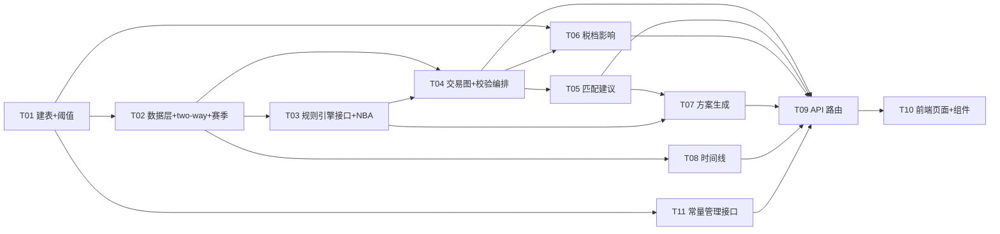

# NBACore Studio v8 — NBA 交易模拟器（v1）系统架构设计

> 文档类型：**架构设计 + 任务分解** ｜ 作者：高见远（Gao，架构师）｜ 团队：software-trade-sim
> 上游依据：[PRD](./prd.md) ｜ 数据库：PostgreSQL `localhost:5433/nba` ｜ 状态：待评审
> 配套图：[类图](./class-diagram.mermaid) ｜ [时序图](./sequence-diagram.mermaid)

---

## 〇、范围与已拍板的设计决策

本设计覆盖 PRD 的 6 项能力（合法性校验 / 匹配建议 / 税档影响 / 方案生成 / 薪资时间线 / 选项合同标注），并**落实用户已拍板的 4 项决策**：

| # | 决策 | 架构落地要点 |
|---|------|------------|
| ① | **多队交易（3+ 队）v1 即支持** | 建模为「交易图」`TradeGraph`：每队为独立 `TeamTradeLeg`，各自独立出/入资产、各自独立做合规校验；引擎对每一队分别计算薪资匹配与硬帽后再聚合。 |
| ② | **预留赛季切换** | UI 提供赛季选择器；数据层与 Engine 全程带 `season` 参数，不硬编码 2025-26；当前仅 2025-26 有数据，其他季显示空/禁用。 |
| ③ | **保障计法用 `guaranteed` 列** | 薪资匹配的差额与计入一律使用 `guaranteed`（保障额），而非 salary 全额；与选项/部分保障标注联动。 |
| ④ | **双向合同纳入 v1** | 设计识别/标记规则（见 §4 与 T02）；`is_two_way=true` 的球员**不参与薪资帽匹配**（按 $0 计），但时间线/卡片可展示。 |

---

## 一、实现方案 + 框架选型

### 1.1 核心技术挑战

1. **多队交易图的建模与逐队独立合规**（决策①，v1 核心复杂度）：N 队各自出/入资产，需保证「任意一队不合规则整笔交易不合规」，且每队匹配/硬帽独立计算。
2. **可插拔 per-league 规则引擎**：以 `league` 为分派键，NBA 为首实现，后续加联赛只补实现、不改核心编排。
3. **薪资匹配（guaranteed 口径）**：实现 2023 CBA 匹配档位（200%/$7.5M/125%、apron 100%）、BYC（送出 50%/接收 100%）、TPE、硬帽、聚合限制。
4. **赛季全程抽象**（决策②）：数据访问、规则加载、时间线全部按 `season` 入参，禁止常量写死。
5. **two-way 识别**（决策④）：现有 `player_contracts` 无显式标记，需设计识别 + 回填预处理。
6. **性能**：单笔 2 队校验 p95 ≤ 500ms（本地 PG），靠 `batch_query` 批量取数与纯内存计算保证。

### 1.2 框架与库选型

| 关注点 | 选型 | 理由 |
|--------|------|------|
| API 框架 | **FastAPI**（沿用 v8） | 路由仅做薄编排，引擎计算全在 `trade_engine`。 |
| Schema/校验 | **Pydantic**（沿用 v8） | `TradeProposal` / `MatchResult` 等请求响应建模。 |
| 数据访问 | **复用 v8 现有 DB 封装**（`batch_query` / 专用连接池，如 `metric_engine/batch_loader` 模式） | 读路径走 `batch_query`；写路径（建 `league_salary_rules`、回填 two-way）走**专用写连接池 + 参数化 SQL**，遵循 v8 §6 禁则（无 eval/exec、无动态 SQL、无每球员 DB 循环、无跨层泄漏）。 |
| 计算 | **纯 Python（无新重依赖）** | 匹配/税档为确定性整数运算，无需 numpy/pandas。 |
| 前端 | **原生 JS + echarts 5.5.0**（沿用 v8） | 交易构建器、面板、时间线组件；暗色极简主题。 |

> **结论**：无需新增第三方 Python 包（详见 §七 依赖包列表）。

### 1.3 架构模式与四层隔离

沿用 v8 **四层严格隔离**，与现有 `routers → <name>_engine` 一致：

```
Frontend (js/components/trade.js)
   │ 只渲染，零交易/税档/匹配计算
   ▼
API (backend/api/routers/trade.py)
   │ 仅参数校验 + 结果编排（薄层）
   ▼
Engine (backend/services/trade_engine/)
   │ 全部计算：匹配/BYC/TPE/硬帽/apron/税档/建议/方案/时间线
   ▼
Data (db.py → 只读 player_contracts / team_payroll / league_salary_rules，经 batch_query)
```

**硬性约束**：前端禁止任何薪资/税档/匹配计算；所有规则常量从 DB 读取而非硬编码。

### 1.4 可插拔规则引擎设计（接口 + 注册表）

- 定义抽象基类 / Protocol `SalaryRuleSet`（ABC），声明全部规则钩子：`check_match / check_byc / check_tpe / check_hard_cap / check_apron / check_aggregation / check_freeze`，并持有 `load_rules(season)`。
- `NBARuleSet` 为首实现（`league="NBA"`），实现 2023 CBA 全部已建模规则。
- 注册表 `RULE_REGISTRY: dict[str, type[SalaryRuleSet]]`，按 `league` 路由；`get_rule_set(league) -> SalaryRuleSet`。后续加 CBA/欧篮只需新增实现并注册，核心编排（`service.py` / `trade_graph.py`）不变。

### 1.5 多队交易图模型（决策①重点）

- `TradeProposal`（入参）→ `TradeGraph`：`legs_by_team: dict[team_abbr, TeamTradeLeg]`。
- `TeamTradeLeg`：每队独立的 `outgoing` / `incoming` 球员资产列表 + `cash_sent`；各自 `validate(rule_set, rules, as_of)` 产出独立 `MatchResult`。
- `TradeGraph.validate_all()`：对每队独立调用规则集 → 收集 `list[MatchResult]`；整笔交易合法 ⇔ **所有队的 `MatchResult.legal` 均为 true**。
- 此设计天然支持 2 队与 3+ 队，且每队薪资匹配/硬帽互不影响地独立计算。

### 1.6 与现有 v8 后端集成点

| 集成点 | 动作 |
|--------|------|
| `backend/app.py` | 新增 `app.include_router(trade.router)`（仿现有 Phase 注册）。 |
| 新建引擎目录 | `backend/services/trade_engine/`（沿用 `<name>_engine/` 模式）。 |
| 新建路由 | `backend/api/routers/trade.py`（薄编排，调用 `TradeService`）。 |
| 数据源 | 复用 `player_contracts` / `team_payroll`；新增 `league_salary_rules`。 |
| 前端 | `index.html` 增加「交易模拟器」入口；`js/app.js` 挂载；`js/components/trade.js` 实现组件。 |

---

## 二、文件列表（相对路径）

### 2.1 新建文件（设计交付，由工程师实现）

**建表 / 回填脚本（SQL）**
- `sql/001_create_league_salary_rules.sql` — DDL（按 `season` 存 cap/tax/apron/MLE/freeze_calendar）。
- `sql/002_seed_league_salary_rules_2025_26.sql` — 回填 2025-26 官方核实值（cap=154,647,000 / tax=187,895,000 / first_apron=195,945,000 / second_apron=207,824,000 等）。
- `sql/003_backfill_two_way_flag.sql` — 给 `player_contracts` 加 `is_two_way` 列并按识别规则回填（决策④）。

**交易引擎 `backend/services/trade_engine/`**
- `__init__.py`
- `schemas.py` — Pydantic 模型：`PlayerAsset` / `TeamTradeLeg` / `TradeProposal` / `MatchResult` / `ValidationIssue` / `CapImpact` / `Suggestion` / `LeagueSalaryRules`。
- `db.py` — 数据接入层（读 `player_contracts`/`team_payroll`/`league_salary_rules` by `season`；专用写连接池 + 参数化 SQL 用于规则表写入）。
- `constants.py` — `season` 常量与解析、two-way 识别规则函数、`LeagueSalaryRules` 加载器。
- `rules.py` — `SalaryRuleSet`(ABC) + `RULE_REGISTRY` 注册表 + `get_rule_set()`。
- `nba_rules.py` — `NBARuleSet` 实现（匹配档位/BYC/TPE/硬帽/apron/聚合/冻结期）。
- `trade_graph.py` — `TradeGraph` / `TeamTradeLeg.validate` 编排（多队独立校验）。
- `match_engine.py` — 逐队薪资匹配核心（guaranteed 口径、band 分档、deficit 计算）。
- `tax_engine.py` — `TaxEngine`：交易前后 cap/tax/apron 状态（`CapImpact`）。
- `suggester.py` — `MatchSuggester`（TRADE-02 建议）+ `ProposalGenerator`（TRADE-07 方案生成）。
- `timeline.py` — `TimelineService`：球员/球队 6 季时间线（TRADE-08/09）。
- `service.py` — `TradeService` 编排门面：`validate / suggest / generate / player_timeline / team_timeline / get_rules / upsert_rules`。

**API 路由**
- `backend/api/routers/trade.py` — 薄编排路由（见 §六 接口清单）。

**前端**
- `js/components/trade.js` — 交易模拟器组件包：`TradeBuilder` / `ValidationPanel` / `MatchSuggestion` / `CapImpactView` / `PlayerTimeline` / `TeamTimeline`（含 PO/TO/PART 徽标）。
- `css/style.css` — 交易模拟器样式（面板布局、选项徽标、税档色带）。

### 2.2 需修改的文件

| 文件 | 修改内容 |
|------|---------|
| `backend/app.py` | 注册 `trade.router`（`app.include_router(trade.router)`）。 |
| `index.html` | HEADER/导航增加「交易模拟器 v1」入口与赛季/联赛选择器。 |
| `js/app.js` | 挂载交易模拟器组件、路由/分页切换。 |

---

## 三、数据结构和接口（类图）

> 完整 Mermaid 见 [class-diagram.mermaid](./class-diagram.mermaid)，以下为关键类与方法签名摘要。

### 3.1 核心数据类

```python
# schemas.py (Pydantic)
class PlayerAsset(BaseModel):
    player_id: str
    player_name: str
    team_abbr: str
    season: str                       # '2025-26'
    salary: int                       # 当前季薪资（美元整数）
    guaranteed: int                   # 保障额（决策③：匹配用此值）
    is_partial: bool = False
    is_two_way: bool = False          # 决策④
    opt_type: Optional[Literal['team_option','player_option']]
    salary_by_season: dict[str,int]   # 6 季 salary_YYYY_YY
    guaranteed_by_season: dict[str,int]
    opt_by_season: dict[str,Optional[str]]
    def is_byc(self) -> bool: ...
    def matching_out_value(self) -> int:   # BYC→50%，two-way→0
    def matching_in_value(self) -> int:    # BYC→100%，two-way→0

class TeamTradeLeg(BaseModel):
    team_abbr: str
    season: str
    outgoing: list[PlayerAsset]
    incoming: list[PlayerAsset]
    cash_sent: int = 0
    def validate(self, rs: SalaryRuleSet, r: LeagueSalaryRules, as_of) -> MatchResult: ...

class TradeProposal(BaseModel):
    league: str = 'NBA'
    season: str
    as_of: datetime
    legs: list[TeamTradeLeg]
    def to_graph(self) -> TradeGraph: ...
    def is_balanced(self) -> bool: ...
```

### 3.2 规则引擎接口（可插拔核心）

```python
# rules.py
class SalaryRuleSet(ABC):
    league: str
    @abstractmethod
    def load_rules(self, season: str) -> LeagueSalaryRules: ...
    @abstractmethod
    def check_match(self, leg: TeamTradeLeg, r: LeagueSalaryRules) -> MatchResult: ...
    @abstractmethod
    def check_byc(self, leg, r) -> list[ValidationIssue]: ...
    @abstractmethod
    def check_tpe(self, leg, r) -> list[ValidationIssue]: ...
    @abstractmethod
    def check_hard_cap(self, leg, r) -> list[ValidationIssue]: ...
    @abstractmethod
    def check_apron(self, leg, r) -> list[ValidationIssue]: ...
    @abstractmethod
    def check_aggregation(self, leg, r) -> list[ValidationIssue]: ...
    @abstractmethod
    def check_freeze(self, leg, as_of, r) -> list[ValidationIssue]: ...

RULE_REGISTRY: dict[str, type[SalaryRuleSet]] = {'NBA': NBARuleSet}
def get_rule_set(league: str) -> SalaryRuleSet: ...
```

### 3.3 NBARuleSet 关键算法（匹配档位，决策③）

```
# nba_rules.py —— 交易后处于第一土豪线以下的匹配上限（guaranteed 口径）
_max_inbound(outbound, post_cap_status):
    if post_cap_status == 'ABOVE_SECOND_APRON':   return outbound            # 100%，禁聚合
    if post_cap_status == 'ABOVE_FIRST_APRON':     return outbound            # 100%，禁聚合
    if outbound <= 7_500_000:                       return 2*outbound + 250_000
    if outbound <= 29_000_000:                      return outbound + 7_500_000
    return 1.25*outbound + 250_000
# BYC：matching_out_value 取 50%，matching_in_value 取 100%
# 第二土豪线以上：禁现金送出、禁 S-TPE、硬帽锁死
```

### 3.4 结果类

```python
class ValidationIssue(BaseModel):
    rule_code: Literal['SALARY_MATCH','BYC','TPE','HARD_CAP','APRON','AGG','FREEZE']
    severity: Literal['error','warn']
    message: str
    amount_delta: int          # 差额（美元整数，正=缺口）

class MatchResult(BaseModel):
    team_abbr: str
    season: str
    legal: bool
    issues: list[ValidationIssue]
    outbound_guaranteed: int
    inbound_guaranteed: int
    max_inbound_allowed: int
    deficit: int
    tpe_generated: dict        # {player_id: amount}

class CapImpact(BaseModel):
    team_abbr: str
    payroll_before: int
    payroll_after: int
    tax_status_before: str     # 'BELOW_TAX'|'IN_TAX'
    tax_status_after: str
    apron_status_before: str   # 'BELOW_FIRST'|'FIRST'|'SECOND'
    apron_status_after: str
    within_second_apron: bool
```

---

## 四、程序调用流程（时序图）

> 完整 Mermaid 见 [sequence-diagram.mermaid](./sequence-diagram.mermaid)。

要点（用户在前端构建多队交易 → API 接收 → trade_engine 解析为 TradeGraph → 逐队调 NBARuleSet 校验 → 聚合 → 税档影响 → 返回面板）：

1. 前端 `TradeBuilder` 收集 `league/season/legs[]/as_of` → `POST /trade/validate`。
2. API 层仅做参数校验与组装（薄编排），转交 `TradeService.validate`。
3. `TradeService` 经 `db.py` 以 `season` 批量读取 `LeagueSalaryRules` 与各队 `PlayerAsset`（batch_query）。
4. `TradeGraph.build(proposal, assets)` → 逐队独立 `validate(rule_set, rules, as_of)`，依次 `check_match/byc/tpe/hard_cap/apron/aggregation/freeze`，产出 `MatchResult[]`。
5. `TaxEngine.compute_cap_impact(graph, rules)` 计算每队交易前后 cap/tax/apron（`CapImpact`）。
6. API 聚合返回，前端渲染校验面板 / 税档视图 / 建议区。

---

## 五、任务列表（有序、含依赖、按实现顺序）

> 覆盖 PRD 11 项能力与用户 4 项决策。依赖关系保证：硬前置先行、引擎先于 API、API 先于前端。
> 优先级：P0=必须有，P1=应有。

| 任务ID | 任务名称 | 来源文件 | 依赖 | 优先级 |
|--------|---------|---------|------|--------|
| **T01** | 建 `league_salary_rules` 表 + 回填 2025-26 阈值（硬前置） | `sql/001_create_league_salary_rules.sql`、`sql/002_seed_league_salary_rules_2025_26.sql` | — | P0 |
| **T02** | 数据接入层 + two-way 识别预处理 + 赛季抽象 | `backend/services/trade_engine/db.py`、`backend/services/trade_engine/constants.py`、`sql/003_backfill_two_way_flag.sql`、`backend/services/trade_engine/schemas.py`(数据类) | T01 | P0 |
| **T03** | 规则引擎接口 `SalaryRuleSet`(ABC) + `NBARuleSet` 实现 + 注册表 | `backend/services/trade_engine/rules.py`、`backend/services/trade_engine/nba_rules.py`、`backend/services/trade_engine/schemas.py`(结果类) | T02 | P0 |
| **T04** | 多队交易图 `TradeGraph` + 逐队校验编排 | `backend/services/trade_engine/trade_graph.py`、`backend/services/trade_engine/match_engine.py`、`backend/services/trade_engine/service.py`(validate 编排) | T03, T02 | P0 |
| **T05** | 薪资匹配建议算法（TRADE-02） | `backend/services/trade_engine/suggester.py`(MatchSuggester) | T04, T03, T02 | P1 |
| **T06** | 税档/工资帽影响计算（TRADE-03） | `backend/services/trade_engine/tax_engine.py` | T04, T01 | P0 |
| **T07** | 交易方案生成（TRADE-07） | `backend/services/trade_engine/suggester.py`(ProposalGenerator) | T05, T03 | P1 |
| **T08** | 球员/球队薪资时间线（TRADE-08/09） | `backend/services/trade_engine/timeline.py` | T02 | P1 |
| **T09** | 后端 API 路由 `trade.py`（薄编排 + 注册） | `backend/api/routers/trade.py`、`backend/app.py`(修改注册) | T04, T05, T06, T07, T08, T11 | P0 |
| **T10** | 前端页面 + 组件（构建器/校验/建议/税档/时间线/PO·TO 徽标） | `js/components/trade.js`、`css/style.css`、`index.html`(修改)、`js/app.js`(修改) | T09 | P0 |
| **T11** | 常量管理接口（TRADE-05/10，读写 `league_salary_rules`） | `backend/services/trade_engine/db.py`(写池)、`backend/api/routers/trade.py`(管理端点) | T01 | P1 |

### 5.1 实现顺序建议

```
T01 ─► T02 ─► T03 ─► T04 ─┬─► T05 ─► T07
                            ├─► T06
                            ├─► T08
                            └─► (T11 并行，依赖 T01)
T09 汇总全部引擎任务 ─► T10 前端
```

### 5.2 任务依赖图（Mermaid）



---

## 六、后端 API 接口清单（薄编排）

| 方法 | 路径 | 说明 | 调用引擎 |
|------|------|------|---------|
| POST | `/trade/validate` | 多队交易合法性校验（TRADE-01） | `TradeService.validate` |
| POST | `/trade/suggest` | 薪资匹配建议（TRADE-02） | `MatchSuggester.suggest` |
| POST | `/trade/generate` | 交易方案生成（TRADE-07） | `ProposalGenerator.generate` |
| GET | `/trade/timeline/player/{player_id}?season=` | 球员 6 季时间线（TRADE-08） | `TimelineService.player_timeline` |
| GET | `/trade/timeline/team/{team_abbr}?season=` | 球队 6 季时间线（TRADE-09） | `TimelineService.team_timeline` |
| GET | `/trade/rules/{season}` | 读取规则常量（TRADE-05） | `TradeService.get_rules` |
| PUT | `/trade/rules/{season}` | 受控更新规则常量（TRADE-10） | `TradeService.upsert_rules`（专用写池+参数化） |

请求示例（多队）：
```json
POST /trade/validate
{
  "league": "NBA", "season": "2025-26", "as_of": "2026-01-15T00:00:00",
  "legs": [
    {"team_abbr":"GSW","outgoing":[{"player_id":"<curry_id>"}],"incoming":[{"player_id":"<x_id>"}]},
    {"team_abbr":"BRK","outgoing":[{"player_id":"<x_id>"}],"incoming":[{"player_id":"<curry_id>"}]}
  ]
}
```

---

## 七、依赖包列表

**无需新增第三方 Python 包**（引擎为纯 Python 整数计算；前端沿用 echarts 5.5.0）：

```
- fastapi        # 沿用 v8，API 框架
- pydantic       # 沿用 v8，schema/校验
- psycopg2/asyncpg + 连接池  # 沿用 v8 现有 DB 封装（读 batch_query / 写专用池）
- echarts@5.5.0  # 沿用 v8 前端，时间线/税档可视化
```

> 若 freeze 日历解析需更便利，标准库 `datetime` 已足够，不引入新包。规则常量以 DB（`league_salary_rules`）为准，无需网络请求。

---

## 八、共享知识（跨文件约定）

| 约定项 | 取值/规则 |
|--------|----------|
| **金额单位** | 统一 **BIGINT 美元整数**（与 DB 一致：154647000 表示 $154,647,000）。引擎全整数运算，禁止浮点；API/前端展示层再做 `$XX.XM` 格式化。 |
| **season 格式** | 字符串 `'2025-26'`（两位起始年 + 连字符 + 两位结束年）。全链路入参，禁止硬编码。 |
| **team_abbr 标准** | NBA API 风格，全库已统一：`BRK`/`CHO`/`PHO` 等（注意 BRK 非 BKN）。 |
| **guaranteed 口径**（决策③） | 匹配差额/计入一律用 `guaranteed`；`guaranteed IS NULL` 视为 `0`（非保障）。 |
| **two-way 处理**（决策④） | `is_two_way=true` 的球员：匹配/税档按 **$0** 计入；时间线/卡片照常展示，附 PO/TO/PART 徽标。 |
| **NULL 处理** | `opt_*` 为 NULL＝无选项；`salary_*` 为 NULL＝该季无薪资；`guaranteed` 为 NULL＝0。 |
| **BYC** | 先签后换或薪资涨幅 >20% 短期交易球员；送出端计 50%、接收端计 100%，差额入 `ValidationIssue.amount_delta`。 |
| **响应格式** | API 统一 `{code, message, data}`；引擎内部 `ValidationIssue{rule_code, severity, message, amount_delta}`。 |
| **错误码** | HTTP 状态 + `{error_code, detail}`；业务违规走 `MatchResult.legal=false` + `issues`，不抛 5xx。 |
| **DB 写路径** | 建表/回填/规则更新走专用写连接池 + 参数化 SQL（`env -u http_proxy ...` 前缀执行）；禁 eval/exec/动态 SQL/每球员循环/跨层泄漏。 |

---

## 九、待明确事项（需用户/交付总监拍板）

1. **two-way 识别规则细节**（决策④）：建议识别优先级——`notes` JSONB 含 `two-way` 关键词 ＞ `salary_2025_26 ≤ ~$600k` 且该队合同数 > 15（两位数名额）。阈值与优先级是否采纳？
2. **方案生成搜索深度上限**（TRADE-07）：组合可能爆炸，建议限定「每队最多 2 名搭档 + 候选 top-N（按薪资相近度排序）+ 最大搜索分支 K」，具体上限待拍板。
3. **冻结期 v1 是否阻断**（PRD 列 P2/TRADE-14）：决策未明确。建议 `check_freeze` 留接口、v1 仅 `WARN` 不阻断，或按 2025-26 日历（moratorium 7/1–7/6、trade deadline 2026-02-05、12/15 锁）初始填充。
4. **BYC 数据可得性**：现有 DB 缺「先签后换/涨幅」标记，v1 仅对显式 BYC 标记或已知情形建模，还是暂时跳过 BYC 自动判定？
5. **硬工资帽触发源建模**（MLE/BAE/S-TPE/先签后换）：v1 是否全建模，或仅以「第二土豪线状态」推断硬帽？
6. **S-TPE / 先签后换完整链路**：是否 v1 实现（PRD 待确认 Q1）。
7. **历史/未来赛季**：仅 2025-26 有数据，其他季空/禁用（决策②已定）；是否需在 `league_salary_rules` 预置未来季投影行？
8. **聚合限制（anti-padding）7/1–12/15 仅含 1 名底薪**：「底薪」判定阈值（如 ≤ 旧版 v 最低薪资）待拍板。

---

## 十、附：关键 SQL 设计稿（交付物，由工程师执行）

```sql
-- sql/001_create_league_salary_rules.sql
CREATE TABLE IF NOT EXISTS league_salary_rules (
    id                 BIGSERIAL PRIMARY KEY,
    league             VARCHAR(16) NOT NULL DEFAULT 'NBA',
    season             VARCHAR(8)  NOT NULL,
    salary_cap         BIGINT,
    luxury_tax         BIGINT,
    first_apron        BIGINT,
    second_apron       BIGINT,
    minimum_team_salary BIGINT,
    mle_non_tax        BIGINT,
    mle_tax            BIGINT,
    mle_room           BIGINT,
    freeze_calendar    JSONB,
    source_url         TEXT,
    scraped_at         TIMESTAMPTZ DEFAULT now(),
    UNIQUE (league, season)
);

-- sql/002_seed_league_salary_rules_2025_26.sql
INSERT INTO league_salary_rules
  (league, season, salary_cap, luxury_tax, first_apron, second_apron,
   minimum_team_salary, mle_non_tax, mle_tax, mle_room, freeze_calendar, source_url)
VALUES
  ('NBA','2025-26',154647000,187895000,195945000,207824000,139182000,
   14104000,5685000,8781000,
   '{"moratorium":["2025-07-01","2025-07-06"],"trade_deadline":"2026-02-05","dec15_lock":true}'::jsonb,
   'https://www.nba.com/news/nba-salary-cap-set-2025-26-season')
ON CONFLICT (league, season) DO UPDATE SET
   salary_cap=EXCLUDED.salary_cap, luxury_tax=EXCLUDED.luxury_tax,
   first_apron=EXCLUDED.first_apron, second_apron=EXCLUDED.second_apron;

-- sql/003_backfill_two_way_flag.sql  (决策④识别/标记预处理)
ALTER TABLE player_contracts ADD COLUMN IF NOT EXISTS is_two_way BOOLEAN NOT NULL DEFAULT FALSE;
UPDATE player_contracts SET is_two_way = TRUE
WHERE season = '2025-26' AND is_two_way = FALSE
  AND (
    notes::text ILIKE '%two-way%' OR notes::text ILIKE '%two_way%'
    OR (salary_2025_26 IS NOT NULL AND salary_2025_26 <= 600000
        AND team_abbr IN (
          SELECT team_abbr FROM player_contracts
          WHERE season='2025-26' GROUP BY team_abbr HAVING count(*) > 15))
  );
```

> 执行上述 SQL 需加前缀：`env -u http_proxy -u https_proxy -u HTTP_PROXY -u HTTPS_PROXY psql -h localhost -p 5433 -d nba -f <file>.sql`
