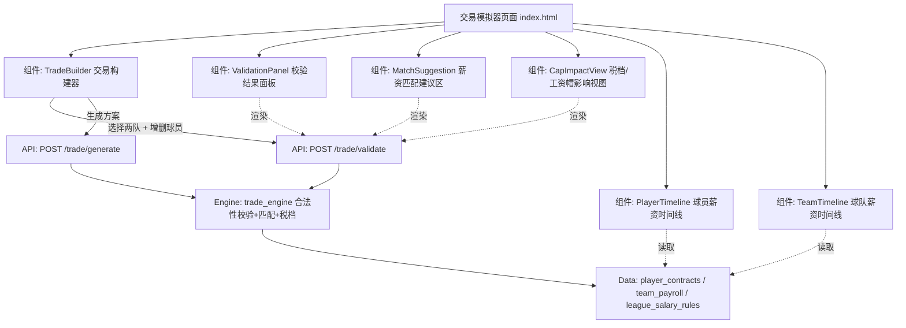

# NBACore Studio v8 — NBA 交易模拟器（v1）产品需求文档（PRD）

> 文档类型：**简单 PRD（默认档，不含竞品分析）** ｜ 语言：中文 ｜ 状态：待评审

---

## 一、项目信息

| 字段 | 值 |
|------|-----|
| **语言** | 中文 |
| **技术栈** | 后端：FastAPI（Python），4 层架构（Frontend → API → Engine → Data）；前端：原生 JS（`index.html` / `js/app.js` / `js/components/*.js` / `css/style.css`）+ echarts 5.5.0，暗色极简主题（沿用现有约定） |
| **数据库** | PostgreSQL :5433/nba |
| **版本** | NBACore Studio v8（本功能为「交易模拟器 v1」） |
| **项目代号** | nba_desktop_omega |
| **新引擎目录** | `backend/services/trade_engine/`（沿用 `<name>_engine/` 模式）；路由 `backend/api/routers/trade.py` |
| **原始需求** | 为 NBACore Studio v8 新增「NBA 交易模拟器 v1」，需覆盖用户已确认勾选的 6 项能力：① 合法性校验 ② 薪资匹配建议 ③ 税档/工资帽影响 ④ 交易方案生成 ⑤ 球员&球队薪资时间线 ⑥ 选项合同（team/player option）标注。数据来源为项目 DB 中已存在的 `player_contracts` / `team_payroll`（2025-26 赛季）；NBA 优先，但规则引擎做成可插拔的 per-league 规则引擎。 |

---

## 二、产品目标

**一句话定位**：让用户在后端引擎的严格规则约束下，可视化地构建、校验并比较一笔 NBA 交易（或多队交易）的合规性与薪资/税档影响，无需自行翻阅劳资协议（CBA）。

**成功标准（可度量）**：
- 用户构建一笔 2 队交易后，合法性校验平均响应 ≤ 500ms（p95），并 100% 命中规则基线中列出的违规项；
- 薪资匹配建议至少给出 1 条「最小改动」可行方案（增/减球员）使交易通过；
- 税档/工资帽影响视图对交易前后两队的 cap / tax / first apron / second apron 状态变化标注准确率 100%（以核实后的规则常量为准）；
- 全部 6 项用户勾选能力在 v1 交付可用，且计算 100% 发生在后端 Engine 层（前端零计算）。

---

## 三、薪资规则基线（引擎必须实现的规则集）

> 以下数值与规则经 WebSearch / WebFetch 核实，作为 `trade_engine` 的规则常量与匹配算法基线。**注意**：简报中第二土豪线估计值 $207.845M 与官方公布值有出入，以官方 **$207.824M** 为准（见下表）。

### 3.1 联盟级阈值（2025-26 已核实，来源 NBA.com，2025-06-30）

| 阈值项 | 2025-26 官方值 | 说明 |
|--------|---------------|------|
| Salary Cap（工资帽） | **$154,647,000** | 硬上限基准 |
| Luxury Tax Line（奢侈税线） | **$187,895,000** | 超过即触发奢侈税 |
| First Apron（第一土豪线） | **$195,945,000** | 跨线触发引援/特例限制 |
| Second Apron（第二土豪线） | **$207,824,000** | 跨线触发最严限制 + 硬工资帽 |
| Minimum Team Salary（最低球队薪资） | $139,182,000 | 球队薪资下限 |
| Non-Taxpayer MLE | $14,104,000 | 非税档中产特例 |
| Taxpayer MLE | $5,685,000 | 税档中产特例 |
| Room MLE | $8,781,000 | 有帽下空间的球队中产特例 |

- **来源 URL**：
  - NBA.com 官方公告：<https://www.nba.com/news/nba-salary-cap-set-2025-26-season>
  - 复核源（The Sports Cast）：<https://thesportscast.net/2025/07/01/nba-2025-26-salary-cap-luxury-tax-and-apron-thresholds-officially-announced/>

### 3.2 薪资匹配档位（2023 CBA，2024/25 起永久生效，适用于 2025-26）

球队**交易后**的球队薪资位置决定其可接收的进薪上限。匹配档位按**送出薪资**金额分档：

**A. 交易后处于「第一土豪线以下」的球队：**

| 送出薪资区间 | 可接收进薪上限 |
|-------------|---------------|
| ≤ $7,500,000 | 200% × 送出 + $250,000 |
| $7,500,001 ~ $29,000,000 | 送出 + $7,500,000（固定加成） |
| > $29,000,000 | 125% × 送出 + $250,000 |

**B. 交易后处于「第一土豪线及以上、第二土豪线以下」的球队：**
- 可接收进薪 ≤ **100% × 送出薪资**（无 $250k 加成，不能「多拿」）；
- 不能将多名球员打包聚合（above-first-apron 禁止聚合）。

**C. 交易后处于「第二土豪线及以上」的球队：**
- 可接收进薪 ≤ **100% × 送出薪资**（一换一，不能多拿）；
- **禁止聚合**两名及以上球员；
- 禁止在交易中送出现金；
- 禁止通过 sign-and-trade（先签后换）获得球员；
- 被硬工资帽锁死在第二土豪线。

**D. 拥有真实帽下空间的球队（cap room）：**
- 可吸收进薪 ≤ 可用帽下空间 + $100,000。

> ⚠️ **规则修正提示**：简报建议稿中「帽下球队 100%/110%/125%」为过渡/旧口径。**110% 是 2023/24 过渡值，2024/25 起已被 100% 替代**；帽下球队当前档位为 **200% / 固定 $7.5M / 125%**（见上表 A）。引擎须按当前（2025-26）口径实现。

- **来源 URL**：
  - Hoops Rumors（含分档与示例）：<https://www.hoopsrumors.com/2023/09/salary-matching-rules-for-trades-during-2023-24-season.html>
  - Sports Business Classroom（匹配公式与 apron 限制）：<https://sportsbusinessclassroom.com/understanding-trade-matching-in-the-new-collective-bargaining-agreement/>

### 3.3 关键交易机制（须建模）

| 机制 | 规则要点 |
|------|---------|
| **TPE（交易特例 / Traded Player Exception）** | 送出多于接收（非同时）时产生，额度 = min(送出−接收, 该球员薪资)；有效期 **1 年**；同时交易特例（S-TPE）成交即失效；第二土豪线以上球队**不可使用既有 TPE**。 |
| **BYC（基础年补偿 / Base Year Compensation）** | 先签后换球员、或薪资涨幅 >20% 后短期内被交易的球员视为 BYC：交易匹配时其**送出端按实际薪资的 50% 计**，接收端按 100% 计，产生「BYC 缺口」需补足。 |
| **硬工资帽触发（锁死第二土豪线）** | 球队若：① 使用完整非税档 MLE ② 使用 BAE（双年特例）③ 通过先签后换获得球员 ④ 使用非最小额 TPE —— 即被硬工资帽限制在第二土豪线。 |
| **聚合限制（anti-padding）** | 7/1–12/15：若送出人数 > 接收人数，聚合中**仅可含 1 名底薪球员**；第二土豪线以上**完全禁止聚合**。 |
| **交易冻结期 / 截止日（freeze）** | 7 月初 moratorium 限制交易；12/15 后新签球员可交易；交易截止日为赛季内最后交易日；常规赛最后一场后，第二土豪线以上球队不可用既有 TPE。具体日历作为**按赛季可配置的规则常量**。 |

> 上述冻结期具体日期（如 moratorium 区间、trade deadline）需在「待确认问题」中由用户拍板，v1 先以 2025-26 日历初始填充。

---

## 四、用户故事

> 覆盖用户已确认勾选的 6 项能力，每条遵循「作为…我希望…以便…」。

- **As a** 球队薪资分析师, **I want** 输入「A 队出 X 换 B 队 Y」后立刻得到合规/违规判定及违反的具体规则, **so that** 我能在谈判前快速识别一笔交易是否合法。
- **As a** 球队运营经理, **I want** 在校验不通过时自动获得「加/减哪些球员可让薪资匹配通过」的建议, **so that** 我不必手动反复试错就能凑出合规方案。
- **As a** 财务/薪资主管, **I want** 交易后看到两队薪资总额、奢侈税、第一/第二土豪线状态的对比变化, **so that** 我能评估交易对球队财务与引援灵活性的长期影响。
- **As a** 交易架构师, **I want** 给定目标球员后系统自动搜寻可行的交易搭档与匹配方案, **so that** 我能高效产出多套可执行的交易构想。
- **As a** 球探/分析师, **I want** 查看单名球员 6 个赛季（2025-26→2030-31）的薪资时间线, **so that** 我能判断其合同走势与未来占用。
- **As a** 球队管理层, **I want** 查看球队逐赛季的总薪资/保障总额/税档态势时间线, **so that** 我能做多年薪资规划。
- **As a** 阅读者, **I want** 球员薪资时间线与球员卡片上明确标注 team_option / player_option, **so that** 我能一眼识别含选项的合同及其不确定性。

---

## 五、技术规范

### 5.1 数据摸底结论（来自交付总监，直接采信）

| 对象 | 现状 | 对 v1 的影响 |
|------|------|-------------|
| `player_contracts` | 648 行，仅 `season='2025-26'`；字段含 `team_abbr, season, player_id, player_name, age, salary_2025_26…salary_2030_31`（6 季 BIGINT）、`opt_2025_26…opt_2030_31`（NULL / `team_option` / `player_option`）、`guaranteed`(BIGINT)、`is_partial`(BOOLEAN)、`notes`(JSONB) 等 | 球员薪资主源；30 队全覆盖（每队 18–31 人） |
| `opt_2025_26` 分布 | NULL 572 人、team_option 65 人、player_option 11 人 | 选项合同标注（能力⑥）数据齐备 |
| `team_payroll` | 30 行，仅 2025-26；含 `total_2025_26…total_2030_31`、`total_guaranteed`、`player_count`；`salary_cap` 多数为 NULL（仅 PHX 填 154,647,000） | 球队总薪资主源 |
| `league_salary_rules`（待建） | **当前不存在**；库内联盟级阈值基本 NULL | **关键缺口**：cap/tax/apron 必须建模为规则常量并落库（需求 TRADE-05） |
| `player_contracts_league` | 与 `player_contracts` 结构重复（疑似冗余副本） | 实现时统一以 `player_contracts` 为唯一源 |

> 样例真实薪资（校验用）：Curry 59.6M、Jokić 55.2M、Embiid 55.2M、Durant 54.7M；`total_2025_26`：NYK 207.45M、HOU 194.69M、PHX 186.29M、DET 185.91M、BRK 154.20M。

### 5.2 需求池（P0 / P1 / P2）

> 优先级：P0=必须有 ｜ P1=应该有 ｜ P2=锦上添花

#### P0（本迭代必须交付）

| 优先级 | 需求编号 | 需求描述 | 验收口径 |
|--------|---------|---------|---------|
| **P0** | TRADE-01 | **合法性校验**：用户提出 A 队出 X 换 B 队 Y，引擎判定合规，并列出违反的规则（薪资匹配档位、BYC、硬工资帽、apron 限制、TPE 限制等） | 返回 合法/非法 结论 + 违规规则清单（每条含：规则名、违反原因、差额金额）；覆盖 §3.2/§3.3 全部已建模规则 |
| **P0** | TRADE-02 | **薪资匹配建议**：在 TRADE-01 基础上，自动建议「加/减哪些球员」使薪资匹配通过 | 返回 ≥1 条最小改动建议（增/删球员列表 + 调整后是否通过 + 关键差额）；建议源自同队可交易球员池 |
| **P0** | TRADE-03 | **税档/工资帽影响**：交易后展示两队薪资总额、奢侈税、第一/第二 apron 状态变化 | 「交易前/后」对比两队的 total payroll、tax 状态、first/second apron 状态；变化用红/绿高亮；数值取自 `league_salary_rules` 常量 |
| **P0** | TRADE-04 | **选项合同标注**：球员时间线与卡片明确标注 team_option / player_option | `opt_*` 字段映射为 UI 徽标；team option 与 player option 视觉区分；覆盖 6 个赛季各自选项状态 |
| **P0** | TRADE-05 | **规则常量建模与存储**：联盟级阈值（cap/tax/first_apron/second_apron/minimum_team_salary/MLE 等）作为规则常量，来源核实并持久化 | 新建 `league_salary_rules` 表（按 `season` 存），初始填 2025-26 核实值（来源 NBA.com）；Engine 从 DB 读取而非硬编码；写入走参数化 SQL |
| **P0** | TRADE-06 | **可插拔 per-league 规则引擎**：NBA 优先，但规则实现可插拔（新增联赛只实现规则子程序） | `trade_engine` 以 `league` 为分派键，NBA 规则实现为默认插件；接口契约清晰，新联赛可注册而不改核心编排 |

#### P1（应有，可紧跟 P0 或下一迭代）

| 优先级 | 需求编号 | 需求描述 | 验收口径 |
|--------|---------|---------|---------|
| **P1** | TRADE-07 | **交易方案生成**：给定目标球员 + 发起队，自动搜寻可行搭档与匹配方案 | 返回候选方案（对方队 + 搭配球员组合 + 是否合规 + 匹配差额）；结果可一键载入交易构建器 |
| **P1** | TRADE-08 | **球员薪资时间线**：单球员 2025-26→2030-31 共 6 季薪资曲线 | 折线/柱状时间线，6 季薪资 + opt/guaranteed 标注；数据源 `player_contracts` |
| **P1** | TRADE-09 | **球队薪资时间线**：球队 6 季总薪资、保障总额、税档态势变化 | 球队 `total_*` / `total_guaranteed` 时间线 + 逐季 cap/tax/apron 状态；数据源 `team_payroll` + `league_salary_rules` |
| **P1** | TRADE-10 | **规则常量管理接口**：允许运维受控更新 `league_salary_rules` | 提供参数化写入端点/管理途径按赛季更新阈值；需遵循专用连接池与权限控制 |

#### P2（锦上添花 / 后续迭代）

| 优先级 | 需求编号 | 需求描述 | 验收口径 |
|--------|---------|---------|---------|
| **P2** | TRADE-11 | **多队交易（3+ 队）**：支持 3 队及以上交易结构与各自合规判定 | N 队交易图 + 每队独立合规校验 |
| **P2** | TRADE-12 | **历史赛季**：扩展至 2025-26 以外的赛季 | 可切换赛季查看（依赖 DB 补数据） |
| **P2** | TRADE-13 | **其他联赛脚手架**：实现 ≥1 个示范非 NBA 联赛规则插件（如 CBA/欧篮） | 第二联赛插件跑通最小交易校验，验证可插拔 |
| **P2** | TRADE-14 | **交易冻结期/截止日建模**：规则引擎纳入 freeze 窗口与 deadline 校验 | 在 freeze 期提交的交易被标记「窗口外」 |

### 5.3 非功能需求（架构硬约束）

- **四层严格隔离**：Frontend → API（仅编排）→ Engine（计算）→ Data（只读，经 `batch_query`）。**禁止前端做任何交易/税档/匹配计算**，所有逻辑在 `trade_engine`。
- **专用连接池 + 参数化 SQL**：本功能以读为主；若写入 `league_salary_rules` 须走专用连接池与参数化语句，禁止字符串拼接。
- **目录与路由**：新引擎置于 `backend/services/trade_engine/`，路由 `backend/api/routers/trade.py`（API 层只做参数校验与结果编排）。
- **数据源统一**：球员/球队薪资以 `player_contracts` / `team_payroll` 为准；忽略冗余的 `player_contracts_league`。
- **性能**：单笔 2 队校验 p95 ≤ 500ms（本地 PG :5433/nba）。
- **可扩展性**：规则常量、冻结期日历均按赛季配置，支持未来多联赛。

### 5.4 UI 设计稿

#### 5.4.1 页面总览（ASCII 布局）

```
┌──────────────────────────────────────────────────────────────────────────┐
│  HEADER  NBACore Studio · 交易模拟器 v1          [赛季: 2025-26 ▾] [联赛: NBA ▾]│
├──────────────────────────────┬───────────────────────────────────────────┤
│  LEFT · 交易构建器            │  RIGHT · 分析面板                            │
│  ┌────────────────────────┐  │  ┌─────────────────────────────────────────┐ │
│  │ 选择球队 A [____▾]  队B [____▾]│  │ 校验结果面板 (TRADE-01)                 │ │
│  │ ── A 队送出 ──          │  │ │ ✅/❌ 合规结论                            │ │
│  │ [+] 球员1 (59.6M) 🏀   │  │ │ 违规规则清单:                            │ │
│  │ [+] 球员2 (12.0M)      │  │ │  • 薪资匹配: 缺 3.2M → 见建议           │ │
│  │ ── B 队送出 ──          │  │ │  • 第一 apron: 超限 1.1M                │ │
│  │ [+] 球员3 (20.0M) ⚑TO  │  │ │  • BYC: 球员X 按50%计, 缺口 4.0M        │ │
│  │ [ 校验交易 ] [ 生成方案 ]│  │ └─────────────────────────────────────────┘ │
│  └────────────────────────┘  │  ┌─────────────────────────────────────────┐ │
│                              │  │ 薪资匹配建议区 (TRADE-02)                │ │
│                              │  │ 建议①: A队 +球员4(3.5M) → 通过 ✅       │ │
│                              │  │ 建议②: B队 -球员5(3.3M) → 通过 ✅       │ │
│                              │  └─────────────────────────────────────────┘ │
│                              │  ┌─────────────────────────────────────────┐ │
│                              │  │ 税档/工资帽影响视图 (TRADE-03)           │ │
│                              │  │        交易前 → 交易后                    │ │
│                              │  │ A队总额 196.2M → 199.4M  🟡tax          │ │
│                              │  │ A队apron  —     → 第一apron ❌           │ │
│                              │  │ B队总额 154.2M → 151.0M  🟢              │ │
│                              │  └─────────────────────────────────────────┘ │
├──────────────────────────────┴───────────────────────────────────────────┤
│  BOTTOM · 时间线区 (TRADE-08 / TRADE-09)                                   │
│  [球员薪资时间线] 球员X: 25-26 … 30-31 折线 + opt🏀/🏐 + guaranteed 标注   │
│  [球队薪资时间线] 队A: 25-26 … 30-31 total / guaranteed / 税档状态 色带    │
└──────────────────────────────────────────────────────────────────────────┘

图例: 🏀 = player_option(球员选项)   ⚑TO = team_option(球队选项)   🏐 = team_option
```

#### 5.4.2 组件结构（Mermaid）



#### 5.4.3 选项合同徽标样式规范（TRADE-04）

| 字段值 | 徽标文案 | 视觉 |
|--------|---------|------|
| `player_option` | **PO**（Player Option） | 蓝色圆角徽标，悬停提示「球员可选择执行/跳出」 |
| `team_option` | **TO**（Team Option） | 橙色圆角徽标，悬停提示「球队可选择执行/跳出」 |
| `NULL` | 无徽标 | — |
| 部分保障 `is_partial=true` | 角标 **PART** | 浅灰小角标，提示 `guaranteed` 低于总额 |

> 时间线（球员 & 球队）上的点/柱须在含选项的赛季上叠加 PO/TO 徽标，保障额与总额以不同色阶区分。

---

## 六、待确认问题（需用户拍板）

1. **v1 建模哪些具体 NBA 规则？**
   建议基线（已写入 §3，待确认是否全收/裁剪）：薪资匹配档位（200%/$7.5M/125% 及 100% apron 限制）、TPE、BYC、硬工资帽触发、聚合/min 合同限制、交易冻结期。是否纳入 S-TPE、先签后换完整链路、doubtful 合同等边缘规则？
2. **联盟级阈值如何存储？**
   建议新建 `league_salary_rules` 表，按 `season` 存 `cap / tax / first_apron / second_apron / minimum_team_salary / mle_*` 等，初始填 2025-26 核实值（来源 NBA.com）。是否还需存历史赛季与未来赛季投影？
3. **非保障 / 部分保障合同在匹配中如何计？**
   `is_partial` / `guaranteed`：交易匹配差额按**保障额**还是**合同总额**计算？建议默认按保障额（guaranteed），与选项/保障标注联动，待确认。
4. **双向合同（two-way）是否纳入 v1？**
   现有 `player_contracts` 未明确 two-way 标记；v1 是否纳入双向合同（通常不计入薪资帽）？建议 v1 先排除，待确认。
5. **多队交易（3+ 队）是否 v1 支持？**
   简报列为 P2。v1 是否仅支持 2 队、多队留待后续？建议 v1 锁 2 队，待确认。
6. **赛季范围：是否锁死 2025-26？**
   DB 仅含 2025-26 数据。v1 是否锁定当前赛季（赛季切换置灰），历史/未来赛季归 P2？建议 v1 锁 2025-26，待确认。

---

## 七、引用来源

- NBA.com 官方薪资帽公告（2025-26）：<https://www.nba.com/news/nba-salary-cap-set-2025-26-season>
- The Sports Cast 复核（2025-26 阈值）：<https://thesportscast.net/2025/07/01/nba-2025-26-salary-cap-luxury-tax-and-apron-thresholds-officially-announced/>
- Hoops Rumors 薪资匹配规则（2023 CBA 分档与示例）：<https://www.hoopsrumors.com/2023/09/salary-matching-rules-for-trades-during-2023-24-season.html>
- Sports Business Classroom 新 CBA 交易匹配与 apron 限制：<https://sportsbusinessclassroom.com/understanding-trade-matching-in-the-new-collective-bargaining-agreement/>
