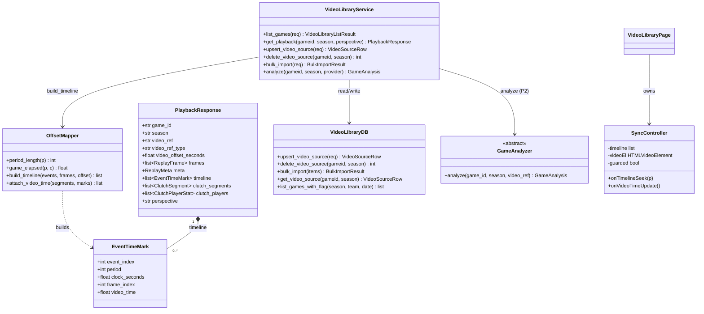
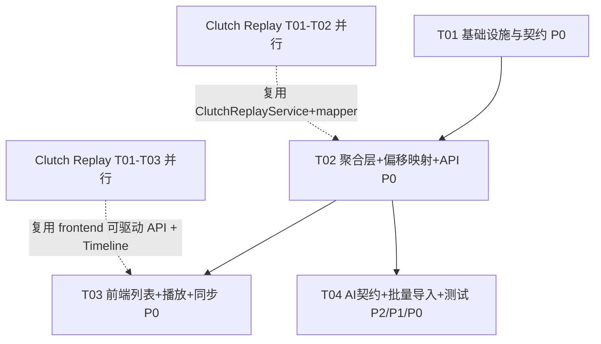

# NBACore Studio v8 — 录像库（Video Library）系统架构设计

> 作者：高见远（Gao / Bob）｜角色：架构师（Architect）｜项目：NBACore Studio v8（nba_desktop_omega）
> 版本：v1（架构设计稿）｜上游：PRD `docs/video-library/prd.md`（许清楚）、融合架构 `docs/clutch-replay/architecture.md`（同一作者，并行实现）、战术板架构 `docs/tactics-board/architecture.md`
> 编排者：齐活林（交付总监）｜日期：2026-07-10
> 范围：仅架构设计 + 任务分解，**不含实现代码**（可含接口签名 / 伪代码）。

---

## 0. 设计摘要（一页结论）

| 维度 | 决策 |
|------|------|
| 后端形态 | 新增**轻量聚合层** `backend/services/video_library_engine/`（编排 + 偏移映射 + 来源管理），新增薄路由 `backend/api/routers/video_library.py`；**复用** `clutch_replay_engine.ClutchReplayService`（拿 frames+segments+players）与 `tactics_engine.TacticsService`（帧生成） |
| 四层隔离 | Frontend(渲染 `<video>` + 复用 Tactics 可驱动播放器 + 复用 Clutch Timeline + 查表同步) → API(纯编排) → 聚合层(取数+偏移映射+塑形) → 复用 `clutch_replay_engine`/`tactics_engine`/`clutch_engine`。**坐标/插值/帧计算全留在 tactics_engine；clutch 计算留在 clutch_engine；偏移映射在 video_library 聚合层** |
| 核心映射 | `video_time(p,c) = video_offset_seconds + game_elapsed(p,c)`，其中 `game_elapsed(p,c)=Σ_{k<p}period_length(k)+(period_length(p)−c)`；**全部在后端 `OffsetMapper` 计算**，前端仅做「查表/二分查找」级定位（红线） |
| 复用而非重造（硬约束） | Video Library **必须复用** Clutch Replay 正在扩展的 `window.Tactics` 可驱动播放器 API（`setFrames/seekFrame/seekProgress/play/pause/onTick`）与 `clutch_replay.js` 的 Timeline 组件（高亮段 + 0–1000 滑动条）；**不新建** 帧序列/坐标/插值/时间线控件。本功能新增代码仅为「编排 + 偏移映射 + 来源管理 + `<video>` 同步桥」 |
| 前端融合 | 列表页（`renderList`）+ 播放页（`renderPlayback`）；播放页左/上为 HTML5 `<video>`，右/下复用 Tactics 半场 SVG + Clutch Timeline；新增 `SyncController` 桥接 `<video>` ↔ Timeline ↔ Tactics（双向同步，带防回环 guard） |
| 写库策略 | `game_videos` 写走**专用写池**（参照 `import_engine` 的 designated-writer 模式，`psycopg2` 仅此一处），全部参数化 SQL；读（`dim_games`/`play_by_play`/`game_videos` SELECT）走 `core.db.batch_query` |
| 本地视频服务 | 本地文件**不**用 `file://`；经新增端点 `GET /video-library/media/{id}` 由同源服务器流式提供（路径穿越防护），`video_ref_type` 区分 `url` / `local` |
| 新增依赖 | **无**（沿用 fastapi / psycopg2 / pydantic / core.db） |
| AI 接口（P2） | `GameAnalyzer` ABC + 注册表，v1 落地 `StaticAnalyzer`（占位）+ `LLMAnalyzer`（调用即 501）；与 `TacticGenerator` 插槽同构，零重构对接远期 Mac+Ollama |
| 双视角（P2 远期） | 仅**预留 seam**：`PlaybackRequest.perspective: 'viewer'|'coach'`（默认 viewer，v1 忽略 coach）；前端 `view_mode` 仅 viewer。不实现 coach 专属布局 |
| 默认口径 | Timeline=frame-based 0–1000；clutch 阈值沿用 clutch_engine（period=4 & clock≤300 & \|margin\|≤5）；赛季 2020–2026；速度档 1x/2x/4x 沿用 Tactics 控件 |

> ⚠️ **跨特性依赖（需团队协调）**：Video Library 复用 Clutch Replay 的前端可驱动 API（`tactics.js` 扩展）与 Timeline 组件（`clutch_replay.js`），以及后端 `ClutchReplayService.clutch_replay()` / `clutch_replay_engine.mapper.first_frame_for_event_index`。Clutch Replay 由 teammate `software-architect`（架构）+ `software-engineer`（实现，Task #8 并行）推进；Video Library 的 T02/T03 在其对应 T01–T03 合并后方可落地。详见 §6.1 与 §9。

---

## 1. 实现方案 + 框架选型

### 1.1 技术挑战与框架选择

| 难点 | 选型 / 方案 | 理由 |
|------|------------|------|
| 录像 ↔ PBP 时间线对齐 | 新增 `video_library_engine/offset_mapper.py`：纯 Python 计算 `video_time(p,c)`（后端 deterministic）；前端 `SyncController` 仅二分查找预计算 `timeline[]` | 偏移映射是确定性、无坐标/数学；全部计算留在后端满足四层隔离红线（PRD §7） |
| 复用帧序列 + clutch 高亮 | `get_playback` 直接调 `ClutchReplayService.clutch_replay(gameid, season)` 拿 `frames/meta/clutch_segments/clutch_players`，零重写 | 与「复用而非重造」硬约束一致；避免重复编排 tactics+clutch |
| 事件→帧锚定 | 复用 `clutch_replay_engine.mapper.first_frame_for_event_index(frames, ei)`（纯函数） | 同一确定性逻辑，跨特性复用，避免重复实现 |
| 来源登记写库 | 新增 `video_library_engine/db.py` 为**designated writer**：专用 `ThreadedConnectionPool` + 参数化 `INSERT ... ON CONFLICT DO UPDATE` | 严格对齐 v8 §6：`core.db.batch_query` 仅 SELECT，DML 必须专用写池（参照 `import_engine`） |
| 只读 PBP/比赛目录接入 | 复用 `core.db.batch_query`（`dim_games` LEFT JOIN `game_videos`、读 `play_by_play`） | 与现有 Engine 一致，禁动态 SQL |
| 本地视频安全服务 | 新增 `GET /video-library/media/{id}`：`FileResponse` 流式 + 根目录穿越防护；`video_ref_type` 区分 `url`/`local` | 规避浏览器 `file://` 限制（PRD §8.2），同源播放 |
| 前端渲染 / 时间线 | 原生 JS：复用 `window.Tactics` 可驱动 API 渲染半场 SVG；复用 `clutch_replay.js` 的 Timeline 组件画高亮；新增 `SyncController` 桥接 `<video>` | 与现有前端一致，无构建链；不重造时间线控件 |
| 后端框架 | FastAPI（沿用 `app.py`） | 四层架构已落地，挂新 router + 聚合层 |
| AI 重新分析（P2） | `GameAnalyzer` ABC + 注册表（同 `TacticGenerator` 范式） | 可插拔、零重构接入 LLM/Ollama |

**架构模式**：经典分层（Layered）+ 门面（Facade，`VideoLibraryService` 汇总编排，供 API 编排）+ 策略（`OffsetMapper` 映射策略）+ 模板方法（`GameAnalyzer` 可插拔）。无新运行时依赖。

### 1.2 聚合层模块划分 `backend/services/video_library_engine/`

```
video_library_engine/
├── __init__.py      # 导出 VideoLibraryService / schemas / REGISTRY
├── schemas.py       # Pydantic：List/Playback/Source/Upsert/Bulk/EventTimeMark/GameAnalysis
├── db.py            # DESIGNATED WRITER：专用写池 + upsert/delete/bulk + 读 game_videos（batch_query）
├── offset_mapper.py # 核心映射：period_length / game_elapsed / build_timeline / attach_video_time
├── analyzer.py      # P2：GameAnalyzer ABC + StaticAnalyzer + LLMAnalyzer(501) + REGISTRY
└── service.py       # VideoLibraryService：list_games / get_playback / upsert / delete / bulk_import / analyze
```

> 复用对象（务必直接引用，禁止重写）：
> - `backend.services.clutch_replay_engine.service.ClutchReplayService.clutch_replay(req)` → `{frames, meta, clutch_segments, clutch_players}`
> - `backend.services.clutch_replay_engine.mapper.first_frame_for_event_index(frames, ei)` → 事件→首帧下标
> - `backend.services.tactics_engine.service.TacticsService.replay(req)` → `{frames, meta}`（仅在 clutch_replay 未就绪时的降级路径）
> - `backend.services.tactics_engine.db.load_pbp_events(gameid, season)` → 同序 PbPEvent（含 `event_index/period/clock_seconds`），供 `OffsetMapper` 计算 `video_time`
> - `backend.core.db.batch_query` → 所有 SELECT（`dim_games`/`play_by_play`/`game_videos`）

### 1.3 调用关系（后端聚合层 `get_playback`）

```
VideoLibraryService.get_playback(gameid, season, perspective='viewer')
   ├─(1) VideoLibraryDB.get_video_source(gameid, season) ─► VideoSourceRow(video_url/local_path, offset)
   ├─(2) ClutchReplayService.clutch_replay(ReplayRequest) ─► frames[], meta, clutch_segments[], clutch_players[]
   ├─(3) tactics_engine.db.load_pbp_events(gameid, season) ─► events[] (event_index, period, clock_seconds)  [同序]
   └─(4) OffsetMapper:
            ├─ build_timeline(events, frames, offset)
            │      → timeline[] (每事件: event_index, period, clock_seconds, frame_index, video_time)
            │      （frame_index 用 first_frame_for_event_index 锚定）
            └─ attach_video_time(clutch_segments, timeline)
                   → 给每个 clutch_segment 补 video_time_start/end（按 event_index 查表）
   └─ 塑形 PlaybackResponse{ video_ref, video_ref_type, video_offset_seconds,
                             frames, meta, timeline, clutch_segments(+video_time), clutch_players, perspective }
```

> 列表 `list_games`：仅 `VideoLibraryDB.list_games_with_flag`（单个 `batch_query` SELECT `dim_games LEFT JOIN game_videos`），无需 tactics/clutch，零计算。

---

## 2. 文件列表（新建 / 修改）

### 新建文件（后端聚合层）

| 路径 | 职责 |
|------|------|
| `backend/services/video_library_engine/__init__.py` | 导出 `VideoLibraryService`、schemas、`REGISTRY` |
| `backend/services/video_library_engine/schemas.py` | Pydantic 契约：`VideoLibraryListRequest` / `VideoLibraryGameRow` / `VideoLibraryListResult` / `VideoSourceRow` / `UpsertVideoSourceRequest` / `BulkImportRequest` / `EventTimeMark` / `PlaybackResponse` / `GameAnalysis`（P2） |
| `backend/services/video_library_engine/db.py` | **DESIGNATED WRITER**：专用 `ThreadedConnectionPool`；`upsert_video_source` / `delete_video_source` / `bulk_import` / `get_video_source`（参数化写）；`list_games_with_flag`（batch_query 读） |
| `backend/services/video_library_engine/offset_mapper.py` | 映射核心（纯 Python，无 DB）：`period_length` / `game_elapsed` / `build_timeline` / `attach_video_time` |
| `backend/services/video_library_engine/analyzer.py` | P2：`GameAnalyzer` ABC + `StaticAnalyzer`（占位）+ `LLMAnalyzer`（501）+ `REGISTRY` |
| `backend/services/video_library_engine/service.py` | `VideoLibraryService`：编排 tactics+clutch+offset_mapper+db，塑形结果 |
| `backend/api/routers/video_library.py` | 薄编排路由（见 §5），含本地媒体流式端点 |

### 修改文件（后端复用 / 扩展，最小化）

| 路径 | 改动 |
|------|------|
| `backend/api/routers/__init__.py` | import 元组加入 `video_library` |
| `backend/app.py` | 挂载 `video_library` router（在 `tactics` 之后） |
| `sql/005_game_videos.sql` | **新建 DDL**：`game_videos` 表（录像来源登记表），专用写池 + 参数化（符 v8 §6） |

### 新建文件（前端录像库组件）

| 路径 | 职责 |
|------|------|
| `frontend/js/components/video_library.js` | 录像库组件（`window.VideoLibrary.renderList` / `renderPlayback`）：列表（徽标）+ `<video>` 播放页 + `SyncController`（双边同步桥） |

### 修改文件（前端复用 / 扩展）

| 路径 | 改动 |
|------|------|
| `frontend/js/components/clutch_replay.js` | **（与并行任务协调）** 暴露可复用 Timeline 组件 API：`window.ClutchReplay.Timeline.mount(container, {segments, frameCount, onSeek})` → 返回 `{setProgress(p), onSeek(cb)}` 句柄；Video Library 复用之（不重造时间线） |
| `frontend/index.html` | 侧栏新增 `nav-item data-page="video-library"`；新增 `<div id="page-video-library" class="page">` 容器 |
| `frontend/js/app.js` | `nav()` 增加 `if(page==='video-library') loadVideoLibraryPage()`；新增 `loadVideoLibraryPage()` 调 `window.VideoLibrary.renderList('videoLibraryRoot')` |
| `frontend/css/style.css` | 追加 `<video>` 播放器 + 同步布局 + 列表徽标样式类（复用现有 `.card/.page` 体系） |

> 注意：`tactics.js` 的可驱动播放器 API（`setFrames/seekFrame/seekProgress/play/pause/onTick`）由 Clutch Replay 并行任务扩展，本特性直接复用，不修改 `tactics.js`。

---

## 3. 数据结构与接口（类图 / Mermaid）

> 完整 Mermaid `classDiagram` 另存于 `class-diagram.mermaid`。



### 3.1 关键方法签名（接口契约，供 Engineer 实现）

```python
# ── video_library_engine/schemas.py ──
class VideoLibraryListRequest(BaseModel):
    season: str | None = None
    team: str | None = None
    date: str | None = None

class VideoLibraryGameRow(BaseModel):
    game_id: str
    season: str
    teams: list[str]
    date: str | None = None
    score: str | None = None
    has_video: bool = False
    source: str | None = None

class VideoLibraryListResult(BaseModel):
    season: str | None = None
    total: int = 0
    games: list[VideoLibraryGameRow]

class UpsertVideoSourceRequest(BaseModel):
    gameid: str
    season: str
    source: str                       # 'youtube'|'local_file'|'cloud_drive'|'other'
    video_url: str | None = None      # source 为外链时
    local_path: str | None = None     # source 为 local_file 时（经服务器虚拟路径）
    video_offset_seconds: float = 0.0 # 视频 t=0 距 Q1 0:00 的偏移秒数

class BulkImportRequest(BaseModel):
    items: list[UpsertVideoSourceRequest]

class EventTimeMark(BaseModel):
    event_index: int
    period: int
    clock_seconds: float
    frame_index: int
    video_time: float                 # = offset + game_elapsed(period, clock_seconds)

class PlaybackResponse(BaseModel):
    game_id: str
    season: str
    video_ref: str                    # URL 直连 或 /video-library/media/{id}
    video_ref_type: str               # 'url' | 'local'
    video_offset_seconds: float
    frames: list[dict]
    meta: dict
    timeline: list[EventTimeMark]
    clutch_segments: list[dict]       # 复用 ClutchSegment，附 video_time_start/end
    clutch_players: list[dict]
    perspective: str = "viewer"       # P2 双视角 seam（v1 恒 'viewer'）

# ── P2 AI 接口契约（analyzer.py）──
class GameAnalysis(BaseModel):
    game_id: str
    season: str
    summary: str = ""
    segments: list[AnalysisSegment] = []

class GameAnalyzer(ABC):
    @abstractmethod
    def analyze(self, game_id: str, season: str, video_ref: str) -> GameAnalysis: ...

# ── offset_mapper.py ──
def period_length(p: int) -> int:
    """p∈{1..4}→720；p≥5(OT)→300。"""
def game_elapsed(p: int, c: float) -> float:
    """Σ_{k<p} period_length(k) + (period_length(p) - c)。"""
def build_timeline(events: list[dict], frames: list[dict],
                   offset: float) -> list[EventTimeMark]:
    """对 events 每事件算 video_time；frame_index 由 first_frame_for_event_index 锚定。"""
def attach_video_time(segments: list[dict], marks: list[EventTimeMark]) -> list[dict]:
    """给每个 clutch_segment 补 video_time_start/end（按 start/end_event_index 查 marks）。"""

# ── service.py ──
class VideoLibraryService:
    def list_games(self, req: VideoLibraryListRequest) -> VideoLibraryListResult: ...
    def get_playback(self, gameid: str, season: str, perspective: str = "viewer") -> PlaybackResponse: ...
    def upsert_video_source(self, req: UpsertVideoSourceRequest) -> VideoSourceRow: ...
    def delete_video_source(self, gameid: str, season: str) -> int: ...
    def bulk_import(self, req: BulkImportRequest) -> BulkImportResult: ...
    def analyze(self, gameid: str, season: str, provider: str = "static") -> GameAnalysis: ...
```

### 3.2 前端可复用契约（来自并行 Clutch Replay 任务，本特性依赖）

```javascript
// clutch_replay.js（并行任务扩展，Video Library 复用，不修改）
window.ClutchReplay.Timeline.mount(containerEl, {
  segments,          // ClutchSegment[]（含 start_frame/end_frame）
  frameCount,        // meta.frame_count
  onSeek(p)          // 用户拖动/点击 → p∈[0,1000]
}) => TimelineHandle { setProgress(p), onSeek(cb) }

// tactics.js（并行任务扩展，Video Library 复用，不修改）
window.Tactics.setFrames(frames, meta)
window.Tactics.seekFrame(idx) / seekProgress(p) / play() / pause() / onTick(cb)
```

---

## 4. 程序调用流程（时序图 / Mermaid）

> 完整 Mermaid `sequenceDiagram` 另存于 `sequence-diagram.mermaid`（含 流程 A 列表 / B 播放对齐 / C 来源写库 / D P2 AI）。

核心同步桥（`SyncController`）伪逻辑（前端 zero-math，仅查表）：

```
onTimelineSeek(p):              # 时间线 → 录像 + 战术板（正向）
    guarded = true
    video.currentTime = videoTimeAt(p)      # 二分查找 timeline[].video_time（由 frame_index 投影 p）
    Tactics.seekProgress(p)
    guarded = false

onVideoTimeUpdate():            # 录像 → 时间线 + 战术板（反向）
    if guarded: return
    p = progressAt(video.currentTime)        # 二分查找 currentTime 落在哪个 event 区间 → 投影 0-1000
    Tactics.seekProgress(p)
    TimelineHandle.setProgress(p)
```

> ⚠️ `videoTimeAt` / `progressAt` 均为「预计算 `timeline[]` 的二分查找」，不含任何 `game_elapsed`/偏移算术（算术全在后端 `OffsetMapper`）。`guarded` 标志防止 正向/反向 相互触发的回环。

---

## 5. 后端 API 端点清单（router `video_library.py`）

前缀 `/video-library`，全部返回 `{code, data, message}` 信封（与 clutch / tactics / video-library 一致）。**纯编排，无 SQL / 无计算**。

| 方法 | 路径 | 入参 | 说明 | 调用引擎 | 优先级 |
|------|------|------|------|----------|--------|
| GET | `/video-library/games` | `?season=&team=&date=` | 录像库列表（dim_games LEFT JOIN game_videos，含 has_video 徽标） | `VideoLibraryService.list_games()` | P0 (VL-02/07) |
| GET | `/video-library/play/{gameid}` | `?season=` | 播放页数据：`video_ref` + `offset` + `frames` + `timeline` + `clutch_segments(+video_time)` + `clutch_players` | `get_playback()` | P0 (VL-03) |
| POST | `/video-library/source` | `UpsertVideoSourceRequest` body | 添加/编辑单场录像来源（UPSERT，专用写池 + 参数化） | `upsert_video_source()` | P0 (VL-01/04) |
| DELETE | `/video-library/source/{gameid}` | `?season=` | 删除录像来源 | `delete_video_source()` | P0 (VL-04) |
| POST | `/video-library/bulk` | `BulkImportRequest` body（或 CSV 上传） | 批量导入（CSV/JSON → 批量写）；非法 gameid 行拒绝并报告 | `bulk_import()` | P1 (VL-06) |
| GET | `/video-library/media/{id}` | path | 本地视频同源流式提供（路径穿越防护）；URL 源不由此端点 | `VideoLibraryDB.get_video_source()` → `FileResponse` | P0 (VL-04 §8.2) |
| POST | `/video-library/ai/analyze` | `{gameid, season, provider}` | **P2 预留**：v1 返回 `code=50100`（LLMAnalyzer 未启用）；`static` 返回占位 `GameAnalysis` | `analyze()` | P2 (VL-10) |

> `clutch` 高亮段在录像页的点击跳转为纯前端（`Timeline.onSeek` → `SyncController`），无需新增端点；速度档由 `window.Tactics` 控件统一作用于 `<video>` 与战术板（VL-09）。

### 5.1 返回信封示例（播放页 `get_playback`）

```jsonc
{
  "code": 0,
  "data": {
    "game_id": "20251225_LAL_BOS",
    "season": "2025",
    "video_ref": "/video-library/media/42",
    "video_ref_type": "local",
    "video_offset_seconds": 12.5,
    "frames": [ /* 复用 ClutchReplayService → TacticsService.replay() 的 ReplayFrame 序列 */ ],
    "meta": { "fps": 30, "frame_count": 12600, "teams": {"home":"LAL","away":"BOS"} },
    "timeline": [
      { "event_index": 0, "period": 1, "clock_seconds": 720.0, "frame_index": 0, "video_time": 12.5 },
      { "event_index": 1, "period": 1, "clock_seconds": 718.0, "frame_index": 60, "video_time": 14.5 }
    ],
    "clutch_segments": [
      { "start_event_index": 312, "end_event_index": 318, "start_frame": 9340, "end_frame": 9520,
        "period": 4, "clock_start": 292.0, "clock_end": 268.0, "margin": 3,
        "video_time_start": 2524.5, "video_time_end": 2548.5 }
    ],
    "clutch_players": [ /* 复用 clutch_replay 侧栏结构 */ ],
    "perspective": "viewer"
  },
  "message": "ok"
}
```

---

## 6. 任务列表（有序、含依赖、按实现顺序）

> 约束遵循：≤5 个任务；单任务 ≥3 文件；按功能/层次分组；T01 为基础设施/入口；后端纯聚合、前端零计算。**镜像 Clutch Replay 的 T01–T04 风格**。

| ID | 任务（对应 PRD 项） | Source Files | 依赖 | 优先级 |
|----|--------------------|--------------|------|--------|
| **T01** | 基础设施与契约：数据模型 + DDL + 入口 + 路由注册 | `backend/services/video_library_engine/schemas.py`、`sql/005_game_videos.sql`、`backend/api/routers/__init__.py`、`backend/app.py`、`frontend/index.html`、`frontend/js/app.js` | 无（但限 Clutch Replay T01/T02 合并前端 API 约定） | P0 |
| **T02** | 聚合层核心：来源管理（写池）+ 偏移映射 + API 编排（复用 clutch_replay/tactics） | `backend/services/video_library_engine/db.py`、`offset_mapper.py`、`service.py`、`backend/api/routers/video_library.py` | T01（Clutch Replay T02 合并后：`ClutchReplayService`/`mapper` 可用） | P0 |
| **T03** | 前端录像库：列表 + 播放页（复用 Tactics 可驱动 API + Clutch Timeline + `<video>` 同步桥） | `frontend/js/components/video_library.js`、`frontend/js/components/clutch_replay.js`（协调扩展 Timeline 复用 API）、`frontend/css/style.css` | T01, T02（Clutch Replay T03 合并 `window.Tactics` 可驱动 API + `ClutchReplay.Timeline`） | P0 |
| **T04** | AI 可插拔接口（P2 契约）+ 批量导入 + 回归测试 | `backend/services/video_library_engine/analyzer.py`、`backend/services/video_library_engine/tests/test_analyzer.py`、`backend/services/video_library_engine/tests/test_service.py` | T02 | P2（契约）/ P1（批量导入）/ P0（测试） |

### 6.1 依赖关系（含跨特性协调）

- **T01（契约+入口）**：仅定义 schemas、DDL、挂载 router/入口；不依赖并行特性即可完成。
- **T02（后端聚合）**：依赖 T01（schemas/router 已注册）；**且依赖 Clutch Replay 的 T01/T02 已合并**（需 `ClutchReplayService.clutch_replay()` 与 `clutch_replay_engine.mapper.first_frame_for_event_index` 可用）。若并行特性未就绪，T02 可暂以「直接调 `TacticsService.replay()` + `clutch_engine` 取数」的降级路径先实现，待其合并后切换复用（已在 §9 标注）。
- **T03（前端）**：依赖 T02（API 契约 `PlaybackResponse`）+ T01（入口已挂）；**且依赖 Clutch Replay 的 T03 已合并**（需 `window.Tactics.setFrames/seekProgress/seekFrame/play/pause/onTick` 与 `window.ClutchReplay.Timeline.mount`）。`video_library.js` 通过 `SyncController` 复用二者，不重造。
- **T04（AI 契约 + 测试）**：依赖 T02（service 接口稳定）；`analyzer.py` 实现 `GameAnalyzer` 契约（`StaticAnalyzer` 可跑、`LLMAnalyzer` 501），独立于前端；测试覆盖 offset 映射、批量导入、列表/播放契约。
- 依赖链：`T01 → T02 → {T03, T04}`，T03 亦依赖 T01。无循环依赖。

### 6.2 任务依赖图（Mermaid）



---

## 7. 依赖包列表

| 包 | 版本/说明 | 是否新增 |
|----|-----------|----------|
| fastapi | 沿用 v8 现有 | 否 |
| psycopg2 | 沿用 v8（专用写池位于 `video_library_engine/db.py`，同 `import_engine` 模式） | 否 |
| pydantic | 沿用 v8 现有（schemas） | 否 |
| core.db.batch_query | 沿用 v8 既有只读数据接入 | 否 |
| 无新增前端库 | 复用 `window.Tactics` 原生 SVG/DOM + `ClutchReplay.Timeline` 叠加；`<video>` 原生元素 | 否 |

**结论：v1 不引入任何新增 Python / 前端依赖。** 偏移映射为纯 Python；Timeline 高亮/拖动复用 Clutch Replay 组件；`<video>` 原生播放。

---

## 8. 共享知识（跨文件约定）

### 8.1 偏移映射公式（后端 `OffsetMapper`，前端零算术）

- `period_length(p)`：`p∈{1..4}` → `720`；`p≥5`（OT）→ `300`。
- `game_elapsed(p, c) = Σ_{k<p} period_length(k) + (period_length(p) − c)`，`c` 为该节**剩余秒数**（与 `ReplayMeta.clock=[720,0]` 口径一致）。
- `video_time(p, c) = video_offset_seconds + game_elapsed(p, c)` → 直接作为 `<video>.currentTime`。
- **全部计算在 `OffsetMapper`（后端）**；前端 `SyncController` 仅对预计算 `timeline[]`（`event_index/frame_index → video_time`）做二分查找定位，**禁止任何 offset/clock 数学**。

### 8.2 gameid / season / source 约定

- `game_id`/`season`：对齐 `dim_games.game_id`/`season`（4 位字符串，如 `"2025"`），与 `game_videos(gameid, season)` 形成 UNIQUE 绑定（一场一源）。
- `source` ∈ `{'youtube','local_file','cloud_drive','other'}`：`youtube/cloud_drive/other` 用 `video_url`；`local_file` 用 `local_path`（经服务器虚拟路径，非 `file://`）。
- `video_offset_seconds`：NUMERIC(10,3)，默认 0；v1 单偏移近似（全场合用，精度 ≤0.5s 目标；逐事件对齐归 P2 VL-11）。

### 8.3 Timeline frame-based 约定（0–1000，复用 Clutch Replay）

- 滑动条 `range` 0–1000 归一化映射 `frame_index ∈ [0, frame_count-1]`：`frame_index = round(p/1000 * (frame_count-1))`。
- `clutch_segments` 携带绝对 `start_frame/end_frame`；前端用 `meta.frame_count` 投影到 0–1000 画高亮；点击高亮段 → `Timeline.onSeek` → `SyncController` 同时驱动 `<video>.currentTime` 与 `Tactics.seekProgress(p)`。
- `timeline[]` 的 `video_time` 由后端预计算；前端 `videoTimeAt(p)` 通过 `frame_index` 投影 p → 二分查找最近 `video_time`，无插值公式。

### 8.4 写库红线（v8 §6，designated writer）

- `game_videos` 写**仅**在 `video_library_engine/db.py`（专用 `ThreadedConnectionPool`，`psycopg2` 不出现在 API/聚合其他处）。
- 全部参数化：`INSERT ... VALUES (%s,%s,...) ON CONFLICT (gameid,season) DO UPDATE`（无动态 SQL、无 eval/exec）。
- 读（`dim_games`/`play_by_play`/`game_videos` SELECT）走 `core.db.batch_query`（SELECT-only 校验）。
- 本地媒体端点 `GET /video-library/media/{id}`：解析 `local_path` 后校验其位于配置白名单根目录内（路径穿越防护），再以 `FileResponse` 同源流式返回。

### 8.5 错误码格式

统一信封 `{code, data, message}`：`code=0` 成功；非 0 错误。复用现有码，新增：

| code | 含义 |
|------|------|
| 0 | 成功 |
| 40001 | 比赛不存在 / season 非法 / gameid 与 season 不匹配 `dim_games` |
| 40002 | 该场无录像来源（`get_playback` 时 has_video=false） |
| 40003 | 批量导入部分行被拒（gameid 不在 `dim_games`）→ `data.rejected` 列出 |
| 40004 | 本地媒体越权/文件不存在（media 端点） |
| 50000 | 聚合层映射/编排异常 |
| 50100 | AI 重新分析接口（P2）未启用 |

### 8.6 AI 接口契约（P2，同 `TacticGenerator` 范式）

```text
GameAnalyzer (ABC):
    analyze(game_id: str, season: str, video_ref: str) -> GameAnalysis

REGISTRY = {
    "static": StaticAnalyzer,   # v1 默认：返回占位/模板化 GameAnalysis（可测、可运行）
    "llm":    LLMAnalyzer,      # P2 预留：对接 Ollama/LLM，调用即 NotImplementedError → 501
}
```

- v1 必须：定义 `GameAnalysis` + `GameAnalyzer` 签名 + `StaticAnalyzer` 默认实现，使后续 Provider 零重构接入。
- `GameAnalysis.segments[]` 按回合/事件组织（含 `event_index`/`period_clock`/`commentary`），与「录像页按事件对标 PBP」体验契合，为 P2 对齐预留结构化基础。

---

## 9. 待明确事项 / 假设（仍存疑点 + 本设计处理）

| # | 疑点 | 本设计处理 / 假设 |
|---|------|------------------|
| ① | **跨特性时序**：Clutch Replay（并行）的 `window.Tactics` 可驱动 API 与 `ClutchReplay.Timeline` 尚未合并 | Video Library T03 显式依赖其 T03；本架构以「复用」为前提设计。约定：`clutch_replay.js` 暴露 `window.ClutchReplay.Timeline.mount(container, {segments, frameCount, onSeek})` 句柄；`tactics.js` 暴露 `setFrames/seekFrame/seekProgress/play/pause/onTick`。**已通过 teammate 消息与 `software-architect` 对齐契约**（见 §0 跨特性依赖） |
| ② | **get_playback 复用 ClutchReplayService 的可用性** | 若并行特性未合并，T02 降级路径：直接调 `TacticsService.replay()` + `clutch_engine` 取数，自算 `clutch_segments` 投影；合并后切回复用 `ClutchReplayService.clutch_replay()`。两种路径对外契约 `PlaybackResponse` 不变 |
| ③ | **本地视频服务方式**（虚拟路径 vs 代理端点） | v1 采用 `GET /video-library/media/{id}` 同源流式端点（路径穿越防护），避免 `file://`；URL 源直连 `video_url`。`video_ref_type` 区分 |
| ④ | **无录像源 / 无 br_crawler 帧的降级** | `get_playback` 在无 `game_videos` 行时返回 `code=40002`（前端提示「添加录像」）；`clutch_segments` 为空时时间线无高亮仍可播整场（与 clutch 降级一致） |
| ⑤ | **单偏移精度（节间/广告漂移）** | v1 接受单偏移近似（PRD §9② 已拍板）；逐事件多偏移对齐归 P2 VL-11，数据结构已预留 `timeline[]` 粒度 |
| ⑥ | **批量导入格式字段** | 采用 PRD §9④：`gameid, season, source, video_url, local_path, video_offset_seconds`；CSV 表头齐上，JSON 为对象数组；非法 gameid 行拒绝入 `data.rejected` |
| ⑦ | **YouTube 嵌入播放** | v1 由 `<video src=video_url>` 直接播外链（是否启用 YouTube 嵌入按 PRD §9① 用户拍板；不影响架构，仅 `video_ref` 取值不同） |
| ⑧ | **双视角（viewer vs coach）** | 仅预留 seam：`PlaybackRequest.perspective` 默认 `'viewer'`，v1 忽略 `coach`；前端 `view_mode` 仅 viewer。coach 专属布局为 P2 远期，不实现（见 §10） |

---

## 10. 双视角（viewer vs coach）P2 远期 seam 设计

- **当前（v1）**：播放页只有「viewer」视角——`<video>` + PBP 战术板 + clutch 高亮，所有用户一致。
- **预留 seam**：
  1. 后端：`get_playback(gameid, season, perspective)` 已接受 `perspective` 参数，v1 恒返回 `viewer` 数据；未来 `coach` 可返回差异化 `timeline`/`clutch_segments`（如含战术标注、站位热力）。
  2. 前端：播放页 `view_mode` 变量默认 `'viewer'`；未来 `coach` 模式切换仅影响「是否叠加教练层」，复用同一 `<video>` + Tactics + Timeline 底座。
  3. 数据：`GameAnalysis.segments[]` 按 `event_index` 组织，天然可被 coach 视角消费。
- **不实现**：coach 专属 UI/交互/数据加工在 v1 不涉及，仅保留上述接入点，避免重构。

---

## 11. 四层隔离验收对照（红线重述）

| 检查项 | 合规点 |
|--------|--------|
| **前端零计算** | `video_library.js` 仅消费后端 `frames/offset/timeline(+video_time)/clutch_segments`；用 `<video>` 播放 + `SyncController` 二分查找 `timeline[]` 定位；**不出现 `game_elapsed`/`map_xy`/插值/偏移算术**；坐标/帧渲染全在 `window.Tactics`（tactics_engine 输出） |
| **API 纯编排** | `video_library.py` 只接收参数、调 `VideoLibraryService`、返回信封；无 `import psycopg2`、无 SQL、无计算（`media` 端点仅做路径校验 + `FileResponse`） |
| **聚合层仅编排+偏移映射** | `video_library_engine` 调 `ClutchReplayService`/`TacticsService` 取数 + `OffsetMapper` 偏移映射 + 塑形；**不重写坐标/插值/帧生成（在 tactics_engine）/clutch 窗口计算（在 clutch_engine）** |
| **计算留在原 Engine** | 坐标映射/插值/帧生成在 `tactics_engine`；clutch 窗口/统计在 `clutch_engine`；偏移映射在 `video_library` 聚合层（`OffsetMapper`） |
| **Data 只读 + 专用写池** | SELECT 全经 `core.db.batch_query`；`game_videos` 写**仅**在 `video_library_engine/db.py` 专用写池 + 参数化 SQL（符 v8 §6） |
| **无新增依赖** | 仅复用现有栈 |
| **复用不重造** | `frames`/`meta` 复用 `ClutchReplayService`；`clutch_segments`/`clutch_players` 复用；Timeline 控件复用 `ClutchReplay.Timeline`；可驱动播放复用 `window.Tactics` |
| **AI 可插拔** | `GameAnalyzer` 契约 + 注册表；v1 默认 `static`，`llm` 插槽预留，零重构接入（P2） |

> **红线一句话**：前端零 offset/clock 计算、API 纯编排、坐标/帧计算留 `tactics_engine`、clutch 计算留 `clutch_engine`、偏移映射在 `video_library` 聚合层、写库专用池 + 参数化。任何「前端算 video_time」或「聚合层重写坐标映射」均视为违规。

---

*文档结束。任务分解见 §6，Mermaid 图见 `class-diagram.mermaid` / `sequence-diagram.mermaid`。*
