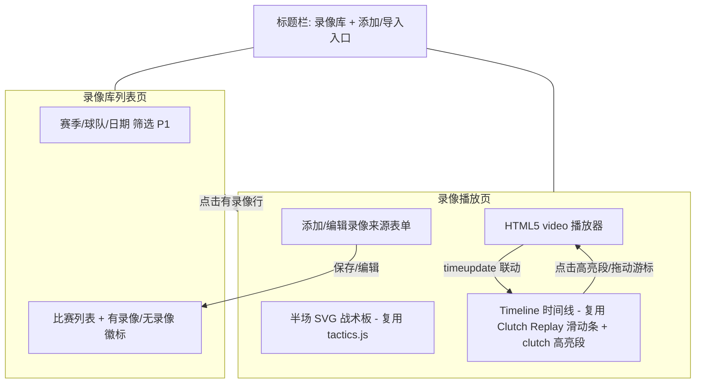

# NBACore Studio v8 — 录像库（Video Library）产品需求文档（PRD）

> 作者：许清楚（Xu）｜角色：产品经理｜项目：NBACore Studio v8（代号 nba_desktop_omega）｜版本：v1（Draft）｜日期：2026-07-10
> 适用范围：本文件仅定义产品需求（PRD），不含任何实现代码；实现由交付总监（齐活林）编排、研发团队落地。
> 设计依据（必读上游）：战术板 PRD/架构（`docs/tactics-board/prd.md`、`docs/tactics-board/architecture.md`）、战术板前端控制条（`frontend/js/components/tactics.js` 的 frame-based 0–1000 滑动条范式）、Clutch Replay 融合 PRD（`docs/clutch-replay/prd.md`）、数据模型 `dim_games`（视图，基表 `dim_games`，字段 `game_id/season/teams/date/score`）、`play_by_play`（PBP 事件，含 `period/clock_seconds/event_index`）。

---

## 0. 文档信息

| 字段 | 值 |
|------|-----|
| **语言** | 中文 |
| **技术栈** | 沿用现有四层架构：前端原生 JS + SVG/HTML5 `<video>`（`frontend/js/components/tactics.js` 同源渲染器与滑动条控件）；后端 FastAPI（Layer 3 编排）+ Engine（Layer 2）+ Data（Layer 1）。新增一个**轻量聚合 Engine 层**（非重型引擎）。 |
| **数据库** | PostgreSQL localhost:5433/nba。读：`dim_games`（比赛目录）、`play_by_play`（只读）；写：新增 `game_videos`（录像来源登记表，专用写池 + 参数化 SQL）。 |
| **模块代号** | `video_library` |
| **原始需求（用户原话）** | 「构建录像库功能，能够对应比赛数据找到对应比赛录像，如果以后个人 ai 强大了，还可以有一个重新分析比赛的渠道」 |
| **需求提炼** | ① 比赛↔录像绑定（每场 `dim_games` 关联其录像来源）；② 录像查找/浏览（按赛季/球队/日期筛选，显示「已有录像 / 无录像」）；③ 录像与 PBP 时间线对齐（核心体验，复用 `tactics_engine` 帧序列 + Clutch Replay 时间线，录像播放位置与 PBP 事件同步）；④ 不存视频本体（只存来源引用 URL/本地路径）；⑤ AI 重新分析渠道（P2 可插拔接口，与 `TacticGenerator` 思路一致，远期对接 Mac+Ollama）；⑥ 简洁一致（延续战术板 v1 / Clutch Replay 视觉与交互）。 |

---

## 1. 产品目标

**一句话目标**：为 NBACore Studio v8 提供「录像库」——把每场比赛与它的录像来源绑定起来，让用户能按赛季/球队/日期快速找到并观看比赛录像，并在播放时复用已有的 PBP/Clutch 回放时间线，使录像播放位置与 PBP 事件（进球/助攻/犯规…）精确同步；同时预留一个可插拔的「AI 重新分析比赛」接口，待本地个人 AI 成熟后无重构接入。

**成功标准（可度量）**：

| 指标 | 目标值 | 说明 |
|------|--------|------|
| 比赛↔录像绑定可达 | 新增 `game_videos` 表与录像库页；`dim_games` 中每场比赛可登记 0 或 1 个录像来源 | 用户可在比赛列表看到「有录像 / 无录像」徽标 |
| 录像可达 | 点开「有录像」的比赛即可在 HTML5 `<video>` 中播放（URL 或本地路径） | 桌面端 Chrome/Edge/Safari 最新版可播放；不下载视频本体 |
| 时间线对齐 | 拖动/点击 PBP 时间线（含 clutch 高亮段）时，录像跳转到对应片段，误差 ≤ 0.5s（v1 单偏移近似） | 映射由后端聚合层 deterministic 计算（见 §5.3） |
| 复用而非重造 | 不新建 PBP/坐标/插值/动画计算；100% 复用 `tactics_engine` 帧序列 + Clutch Replay 时间线组件 | 架构评审：新增代码仅为「编排 + 偏移映射 + 来源管理」 |
| 四层隔离合规 | 前端零时钟/坐标计算、API 纯编排、`game_videos` 写库走专用连接池 + 参数化 SQL | 见 §7 红线 |
| 视觉一致 | 半场、双色带号圆圈、篮球、✅/❌/AST/REB/PF 气泡、滑动条与战术板 v1 / Clutch Replay 一致 | 无新增特效；低配 ≥30fps |

---

## 2. 用户故事（覆盖 6 项能力）

- **US1（比赛↔录像绑定）**：As a **分析师/解说**, I want **为每场比赛（dim_games 的 gameid/赛季/球队/日期）关联一个录像来源（URL 或本地路径）** so that **我能从比赛数据直接定位到这场比赛的录像**。
- **US2（录像查找/浏览）**：As a **所有用户**, I want **按赛季 / 球队 / 日期筛选比赛，一眼看到哪些「已有录像 / 无录像」，点开即看** so that **我不必在杂乱文件中翻找就能快速回看某场球**。
- **US3（录像与 PBP 时间线对齐 · 核心）**：As a **内容创作者/分析师**, I want **播放录像时，复用已有的 PBP 回放时间线（战术板帧序列 + Clutch Replay 时间线），录像播放位置与 PBP 事件（进球/助攻/犯规…）同步——拖动时间线或点击某个 clutch 时刻，录像跳到对应片段** so that **我在看真实录像的同时能精确对照战术板复盘的每个事件**。
- **US4（不存视频本体 / 手动登记）**：As a **个人用户**, I want **只登记视频的来源引用（URL 或本地文件路径），由我手动添加/导入，系统不下载/存储视频文件本身** so that **不会因视频体积爆炸撑爆数据库，也能灵活对接我自己的本地录像或网盘/外链**。
- **US5（AI 重新分析渠道 · 规划）**：As a **高级用户**, I want **未来当本地个人 AI（如 Ollama）足够强时，能把「某场比赛的录像 + 其 PBP 数据」喂给模型，产出一份新的比赛分析** so that **我的比赛分析能力能随本地 AI 成长而扩展**（v1 仅预留接口，不实现）。
- **US6（简洁一致）**：As a **所有用户**, I want **视觉与交互延续战术板 v1 / Clutch Replay（半场、时间线滑动条、事件标注、clutch 高亮段），不华丽** so that **学习成本为零、低配设备也能流畅使用**。

---

## 3. 需求池（P0 / P1 / P2）

> 优先级定义：**P0** 必须有（v1 核心）、**P1** 应该有（v1 增强）、**P2** 规划项（v1 不实现，但预留可插拔接口与数据结构）。

### 3.1 P0 — 必须有（v1 核心）

| 优先级 | 编号 | 需求 | 做什么 | 验收口径 |
|--------|------|------|--------|----------|
| P0 | VL-01 | 比赛↔录像绑定（`game_videos` 表） | 新增 `game_videos` 表，每行 = (gameid, season, video_url 或 local_path, source 标记, video_offset_seconds, created_at)；与 `dim_games` 的 (gameid, season) 形成业务绑定 | 表可建；一行 = 一场比赛一个录像源；列表能按 (gameid,season) 查到对应录像引用 |
| P0 | VL-02 | 录像浏览/查找（已有/无录像标识） | 录像库列表页以 `dim_games` 为目录，逐行展示「🎬 有录像 / 无录像」徽标；点开「有录像」行进入播放页 | 列表正确显示徽标；点「有录像」行可进入播放页；点「无录像」行给出「添加录像」入口 |
| P0 | VL-03 | HTML5 播放器 + 复用 PBP 时间线对齐（offset 同步） | 播放页用 HTML5 `<video>` 播放录像；复用 Clutch Replay 的 frame-based 时间线（含 clutch 高亮段、事件标注气泡），录像播放位置按 `video_offset_seconds` 与 PBP 事件同步 | 拖动时间线 / 点击 clutch 段 → 录像跳到对应片段，误差 ≤0.5s；时间线随录像播放联动（双向同步） |
| P0 | VL-04 | 手动添加/导入视频来源 | 提供表单（填 video_url 或 local_path + source + video_offset_seconds）与保存/删除/编辑；写库走专用连接池 + 参数化 SQL | 添加后列表即时出现「有录像」徽标；可编辑/删除；写路径符合 v8 §6 禁则（无动态 SQL） |
| P0 | VL-05 | 四层隔离（非功能） | 视频来源表后端管理（专用写池 + 参数化 SQL）；前端只渲染 `<video>` + 消费后端给的「PBP 时间线 JSON」与「视频偏移」，不做坐标/时钟计算 | 架构评审通过：前端无 offset/clock 计算；API 纯编排；偏移映射在后端聚合层（见 §5、§7） |

### 3.2 P1 — 应该有（v1 增强）

| 优先级 | 编号 | 需求 | 做什么 | 验收口径 |
|--------|------|------|--------|----------|
| P1 | VL-06 | 批量导入（CSV/JSON） | 支持批量登记视频来源（CSV/JSON 上传 → 批量写入 `game_videos`），字段约定见 §9④ | 上传后批量出现「有录像」徽标；gameid 不存在的行被拒绝并报告 |
| P1 | VL-07 | 按球队/赛季筛选 | 列表提供赛季 / 球队 / 日期筛选器 | 筛选后列表正确收敛；与徽标状态一致 |
| P1 | VL-08 | clutch 高亮段在录像页可见 + 点击跳录像片段 | 复用 Clutch Replay 的 `clutch_segments` 在时间线上绘制高亮段；点击段 → 录像跳到该段起始片段 | 高亮段位置与录像片段一一对应（deterministic）；点击跳转误差 ≤0.5s |
| P1 | VL-09 | 播放速度档一致 | 速度档 1x/2x/4x 沿用战术板 `tactics.js` 控件，同时作用于 `<video>` 与时间线 | 速度切换即时生效；`<video>` 与时间线同步变速 |

### 3.3 P2 — 规划项（v1 不实现，预留可插拔接口）

| 优先级 | 编号 | 需求 | 做什么（规划） | 验收口径（接口级） |
|--------|------|------|----------------|--------------------|
| P2 | VL-10 | AI 重新分析接口（`GameAnalyzer` 可插拔，对接 Ollama/LLM） | 定义 `GameAnalyzer` 协议 + 注册表；v1 提供 `StaticAnalyzer`（占位/无操作）与 `LLMAnalyzer`（预留钩子，调用即 501） | 接口契约存在且可 import；Stub 可运行；`LLMAnalyzer` 调用返回 501；与 `TacticGenerator` 插槽思路一致 |
| P2 | VL-11 | 逐事件精确视频对齐 | 用逐事件（多偏移）对齐替代 v1 单偏移近似；数据结构预留 event-level offset | 接口/数据级预留结构化 event offset；v1 不要求实现 |
| P2 | VL-12 | 自动匹配视频（预留） | 预留自动爬取/匹配录像的接口与开关（版权 + 稳定性，v1 不做） | 仅预留接口/开关；调用即 no-op 或提示「未启用」 |

---

## 4. UI 设计稿

### 4.1 录像库列表页（Video Library Home）

```
+---------------------------------------------------------------------------+
| NBACore Studio v8 · 录像库 Video Library        [+ 添加单场录像] [批量导入]  |
+---------------------------------------------------------------------------+
| 筛选: [赛季 ▼ 2025]  [球队 ▼ 全部]  [日期 ▼ 全部]        (P1: VL-07)        |
+---------------------------------------------------------------------------+
| 比赛列表（来自 dim_games，逐行带「有录像/无录像」徽标）                      |
| ┌──────────────────────────────────┬───────┬─────────┬────────────────┐ |
| │ 比赛                               │ 赛季  │ 日期    │ 录像            │ |
| │ LAL vs BOS                         │ 2025  │ 2025-12-25 │ 🎬 有录像      │ |
| │ DEN vs MIN                         │ 2025  │ 2025-12-23 │ — 无录像      │ |
| │ GSW vs DAL                         │ 2025  │ 2025-12-20 │ 🎬 有录像      │ |
| └──────────────────────────────────┴───────┴─────────┴────────────────┘ |
| 点「🎬 有录像」行 → 进入录像播放页；点「无录像」行 → 弹出「添加录像」表单   |
+---------------------------------------------------------------------------+
```

### 4.2 录像播放页（Video Playback · 核心对齐体验）

复用 Clutch Replay 的「半场 SVG + Timeline 时间线」布局：上方/左侧为 HTML5 `<video>` 播放器，下方/右侧复用 PBP 时间线滑动条（含 clutch 高亮段 + 事件标注气泡）；录像与时间线双向同步。

```
+-----------------------------------------------------------------------------+
| NBACore Studio v8 · 录像库 · LAL vs BOS (2025-12-25)        [编辑录像来源]   |
+-----------------------------+-----------------------------------------------+
|  HTML5 <video> 播放器        |  半场 SVG 战术板（沿用 tactics.js，叠加事件） |
|  +-----------------------+   |  +---------------------------------------+   |
|  |                       |   |  | 半场底图 + 双色带号圆圈 + 篮球      |   |
|  |   [录像画面]          |   |  | + 事件气泡 ✅/❌/AST/REB/PF          |   |
|  |                       |   |  +---------------------------------------+   |
|  +-----------------------+   |                                               |
|  [⏮][▶/⏸][⏭] 速度[1x|2x|4x] |                                               |
+-----------------------------+-----------------------------------------------+
| Timeline 时间线（复用 Clutch Replay 滑动条 + 录像同步层）                    |
| [⏮][▶/⏸][⏭] 速度[1x|2x|4x]  [======▓▓▓▓(clutch 高亮段)====o(游标)===] [4:32]|
|        ▲ 红/金高亮段 = clutch 回合      ▲ 可拖动游标 = 任意 PBP 时刻           |
| 点击高亮段 → 录像跳到该 clutch 片段；拖动游标 → 录像跳到对应片段             |
+-----------------------------------------------------------------------------+
| 添加/编辑录像来源表单（侧栏或弹窗）                                           |
| 来源类型: [URL ▼ / 本地路径]   video_url / local_path: [____________]        |
| source 标记: [youtube/本地文件/网盘/其他 ▼]                                   |
| video_offset_seconds: [ 0 ]  [📍在录像中点击比赛开球时刻自动捕获]            |
| [保存] [删除]                                                                |
+-----------------------------------------------------------------------------+
```

### 4.3 布局与数据流（Mermaid）



```mermaid
sequenceDiagram
  autonumber
  actor U as 用户(前端)
  participant F as video_library.js (Layer4)
  participant API as /video-library router (Layer3)
  participant S as VideoLibraryService (Layer2 聚合)
  participant TE as tactics_engine
  participant CE as clutch_engine
  participant DB as Data 层 (dim_games / play_by_play / game_videos)
  U->>F: 选赛季+球队 → 打开录像库列表
  F->>API: GET /video-library/games?season=&team=
  API->>S: list_games(...)
  S->>DB: 读 dim_games + LEFT JOIN game_videos (参数化)
  DB-->>S: 比赛目录 + 是否有录像标记
  S-->>API: 列表(含徽标)
  API-->>F: 信封 JSON
  U->>F: 点击「有录像」行 → 播放
  F->>API: GET /video-library/play/{gameid}?season=
  API->>S: get_playback(gameid, season)
  S->>TE: replay() → 逐帧序列 frames (含 event_index)
  S->>DB: 取该场 game_videos.video_offset_seconds
  S->>S: 计算每事件 video_time = offset + game_elapsed (见 §5.3)
  S->>CE: 该场 clutch 窗口 (gameid 过滤)
  S-->>API: {video_url, video_offset_seconds, timeline:[{event_index,period,clock_seconds,video_time,...}], clutch_segments}
  API-->>F: 信封 JSON
  F->>F: 渲染 video + Timeline; 拖动/点击 → 设 video.currentTime = event.video_time
```

---

## 5. 后端/数据设计（初步）

### 5.1 `game_videos` 表结构（录像来源登记表）

> v1 不存视频文件本体，只存「来源引用」。`video_url` 与 `local_path` 二选一（由 `source` 标记决定用哪个）。

```sql
-- sql/005_game_videos.sql  (v1 新建; 须专用写池 + 参数化 SQL, 符合 v8 §6)
CREATE TABLE IF NOT EXISTS game_videos (
    id                  BIGSERIAL PRIMARY KEY,
    gameid              TEXT      NOT NULL,   -- 绑定 dim_games.game_id
    season              TEXT      NOT NULL,   -- 绑定 dim_games.season
    source              TEXT      NOT NULL,   -- 'youtube' | 'local_file' | 'cloud_drive' | 'other'
    video_url           TEXT,                  -- source 为外链时填写
    local_path          TEXT,                  -- source 为本地文件时填写 (经服务器虚拟路径服务, 非 file://)
    video_offset_seconds NUMERIC(10,3) NOT NULL DEFAULT 0,  -- 视频 t=0 对应比赛 Q1 0:00 的偏移(秒)
    created_at          TIMESTAMPTZ DEFAULT now(),
    UNIQUE (gameid, season)                    -- 一场比赛 v1 仅一个录像源
);
-- 写路径: INSERT ... VALUES (%s,%s,...) ON CONFLICT (gameid,season) DO UPDATE (参数化, 无动态 SQL)
```

| 字段 | 类型 | 含义 |
|------|------|------|
| `gameid` | TEXT | 比赛唯一键，对齐 `dim_games.game_id` |
| `season` | TEXT | 赛季（4 位，如 `"2025"`），与 `gameid` 共同唯一定位比赛 |
| `source` | TEXT | 来源标记：`youtube` / `local_file` / `cloud_drive` / `other` |
| `video_url` | TEXT | 外链 URL（source 为 youtube/cloud_drive/other 时使用） |
| `local_path` | TEXT | 本地文件路径（source 为 local_file 时；经服务器虚拟路径提供，避免 `file://` 安全限制，见 §8） |
| `video_offset_seconds` | NUMERIC(10,3) | 视频 t=0 距「比赛第 1 节 0:00」的偏移秒数（核心同步参数，见 §5.3） |
| `created_at` | TIMESTAMPTZ | 登记时间 |

### 5.2 后端 service（轻量聚合层，Layer 2）

新增 `backend/services/video_library_engine/`（或 `service.py` 门面 + 薄聚合层），职责 = **编排 + 偏移映射 + 来源管理**，复用既有 `tactics_engine`/`clutch_engine`，**不做坐标映射/插值/动画数学**（那些仍在 `tactics_engine`）。

- `list_games(season, team, date)`：读 `dim_games` `LEFT JOIN game_videos`，返回比赛目录 + 是否有录像标记（批量、参数化）。
- `get_playback(gameid, season)`：取 `game_videos.video_offset_seconds` → 调 `tactics_engine.replay()` 得帧序列 → 为每事件预计算 `video_time`（后端计算，前端零算术）→ 复用 `clutch_engine` 取 `clutch_segments` → 返回 `{video_url/local_path, video_offset_seconds, timeline, clutch_segments}`。
- `upsert_video_source(gameid, season, payload)` / `delete_video_source(gameid, season)`：写 `game_videos`，专用写池 + 参数化 SQL（VL-04）。
- `bulk_import(sources[])`：批量登记（VL-06，P1）。
- `GameAnalyzer.analyze(...)`：P2 可插拔接口（见 §6）。

### 5.3 「视频偏移 → PBP 时钟」映射公式（后端 deterministic 计算，核心）

**约定**：`play_by_play.clock_seconds` = 该节**剩余秒数**（与 `tactics_engine.ReplayMeta.clock=[720,0]` 口径一致）；一节标准 12 分钟 = 720s；加时（period≥5）5 分钟 = 300s。

**定义**：
- `period_length(p)`：`p ∈ {1..4}` → `720`；`p ≥ 5`（OT）→ `300`。
- `game_elapsed(p, c)` = `Σ_{k<p} period_length(k) + (period_length(p) − c)`，即「比赛自开球起已进行的秒数」。
- **视频时间映射**：`video_time(p, c) = video_offset_seconds + game_elapsed(p, c)` → 直接作为 `<video>.currentTime`。

**双向同步**：
- 正向（时间线 → 视频）：用户拖动/点击时间线到某 event → 取该 event 已由后端预计算的 `video_time` → 设 `<video>.currentTime = video_time`。
- 反向（视频 → 时间线）：监听 `<video>` 的 `timeupdate` → 在后端下发的「`video_time` 有序数组」中二分查找最近事件 → 更新时间线游标与当前 PBP 事件标注。
- ⚠️ **v1 单偏移近似**：假设录像以 1× 真实比赛速率播放、且整场共用一个 `video_offset_seconds`（不计入暂停/广告/节间休息造成的时钟漂移）。精度不足处归 P2（VL-11 逐事件精确对齐）。

> 四层隔离落实：上式 `game_elapsed` / `video_time` 的**全部计算在后端聚合层完成**；后端把「每事件 `video_time`」直接下发给前端；前端仅做「查表/二分查找」级别的定位，**不出现任何 offset/clock 数学**（红线见 §7）。

### 5.4 前端路由（不写代码，仅约定）

| 路由/入口 | 说明 |
|-----------|------|
| 录像库列表页 | `index.html` 新增 `nav-item data-page="video-library"`；新增 `<div id="page-video-library" class="page">`；引入 `js/components/video_library.js` |
| 录像播放页 | 列表页「有录像」行点击 → 在当前页或子视图渲染 `video_library.js`（含 `<video>` + 复用 `tactics.js` 时间线控件 + clutch 高亮 overlay） |
| 添加/导入入口 | 列表页顶栏「+ 添加单场录像」「批量导入」按钮 → 表单/上传弹窗 |

---

## 6. AI 重新分析路线图专章

### 6.1 能力定义

- **录像 + PBP → 新比赛分析**：用户选定一场「有录像」的比赛，把「该场录像来源（video_url/local_path）+ 其 PBP 数据」喂给本地个人 AI（如 Ollama），由模型产出一份新的比赛分析（战术解读、关键回合点评等）。这是用户对「如果以后个人 AI 强大了，可以有一个重新分析比赛的渠道」的直接落地。

### 6.2 可插拔接口预留（与 `TacticGenerator` 思路一致）

复用战术板 v1 的「抽象协议 + 注册表」可插拔范式（见 `docs/tactics-board/architecture.md` §1.5），使后续 Provider 可零重构接入：

```text
# 抽象协议（v1 必须落地契约，不要求真实 LLM）
GameAnalyzer (协议/抽象基类):
  analyze(game_id: str, season: str, video_ref: str) -> GameAnalysis

# 实现后端（P2 迭代）
- StaticAnalyzer  : v1 占位，返回空/模板化的分析占位，保证接口可测、可运行
- LLMAnalyzer     : 预留钩子，对接 Ollama/LLM（接收 video_ref + gameid 的 PBP），调用即 501 NotImplemented —— 远期目标插槽

REGISTRY = {
    "static": StaticAnalyzer,   # v1 默认
    "llm":    LLMAnalyzer,      # P2 预留：对接 Ollama/LLM（Mac 版远期目标）
}
```

- v1 必须：定义 `GameAnalysis` 数据结构与 `GameAnalyzer` 接口签名，并提供 `StaticAnalyzer`，使后续 Provider 可「插拔」接入而**无需改动 Frontend/API/Engine 调用链**。
- 数据结构预留：`GameAnalysis` 含 `game_id`、`season`、`segments`（按回合的分析段落）、`summary` 等字段，与「录像页按回合/事件对标 PBP」的体验天然契合。

### 6.3 为何放入 P2（v1 不实现）

1. **前置依赖**：v1 必须先夯实「录像↔比赛绑定 + 时间线对齐」基础（P0/P1），AI 重新分析才有可信的输入载体（录像 + PBP）。
2. **基础设施缺口**：本地个人 AI（Ollama）运行环境与「Mac 版接入 Ollama」平台目标尚未就绪，不在 v1 交付范围。
3. **风险隔离**：AI 分析属非 deterministic 能力，与 v8 合同「所有输出 deterministic、可验证」原则存在张力，宜作为独立规划项单独评审。
4. **版权/合规**：录像来源为用户手动登记的外链/本地文件，AI 处理涉及内容合规边界，需单独评估。

### 6.4 与 Mac + Ollama 远期目标的关系

- 项目远期目标包含「Mac 版接入 Ollama」实现本地离线 LLM。**`LLMAnalyzer` 插槽即为该目标在录像库模块的前向接口**；v1 仅预留契约与 `StaticAnalyzer` 默认实现，待 Mac 版与 Ollama 运行时到位后，可在不重构的前提下接入，实现离线、隐私友好的「录像 + PBP 重新分析」。

---

## 7. 非功能需求与架构约束（四层隔离）

```
flowchart LR
  F[Frontend 层<br/>渲染 video + rAF 推进帧 + Timeline 控件 + 查表定位] -->|调用 API| API[API 层<br/>纯编排, 禁 SQL/计算]
  API -->|调用聚合 Engine| AGG[video_library 聚合层<br/>编排: 取录像源 + 取帧 + 偏移映射]
  AGG -->|复用| TE[tactics_engine<br/>坐标映射+插值+帧生成]
  AGG -->|复用| CE[clutch_engine<br/>clutch 窗口/统计计算]
  AGG -->|参数化 SQL| DB[(Data 层<br/>dim_games/play_by_play 只读 + game_videos 写)]
```

- **Frontend（Layer 4）**：仅消费后端返回的 `video_url/local_path` + `video_offset_seconds` + 预计算的 `timeline[{event_index, video_time,...}]` + `clutch_segments`，渲染 `<video>` 并复用 `tactics.js` 时间线控件；双向同步仅做「查表/二分查找」级定位。**禁止任何 offset/clock 数学、禁止坐标映射/插值**。
- **API（Layer 3）**：仅编排——接收 `gameid`/`season` 等参数，调用聚合层，返回统一信封 `{code, data, message}`（与 `clutch.py`/`tactics.py` 一致）。**禁止 SQL、禁止计算、禁止业务逻辑**。
- **聚合层（Layer 2，新增轻量）**：`video_library` 引擎，职责 = 编排两个现有引擎 + 把「录像源」与「PBP 帧」绑定 + 计算每事件 `video_time`（偏移映射）。**不做坐标映射/插值/动画数学**（仍在 `tactics_engine`）；**不做 clutch 窗口重算**（仍在 `clutch_engine`）。本层只做「取数 + 偏移映射 + 塑形」。
- **Data（Layer 1）**：`dim_games`/`play_by_play` 只读（走 `core.db.batch_query`，参数化）；`game_videos` 写库走**专用连接池 + 参数化 SQL**（符合 v8 §6 禁则：no dynamic SQL、no eval/exec）。

> 红线：**前端零 offset/clock 计算、API 纯编排、坐标/帧计算留在 `tactics_engine`、clutch 计算留在 `clutch_engine`、偏移映射在 `video_library` 聚合层、写库专用池 + 参数化**。任何「前端算 video_time」或「在聚合层重写坐标映射」均视为违规。

---

## 8. 调研参考（UX + 工程，含引用）

> 调研目的：为「录像与 PBP 事件时间线同步」的交互寻找成熟 UX 范式；为「不存视频本体、只存来源引用」的工程做法寻找共识。下列为行业实践参考，非本项目的 API/数据依赖。

### 8.1 体育 App「录像 × 事件时间线」同步（UX 范式）

1. **NBA App / League Pass「smart rewind + key plays highlighted」（2024-25 赛季）**
   - 来源：NBA 官方公告经 Advanced Television（2024-10-16）、SportsPro（2024-10-16）、TVTechnology（2024-10-15）报道。
   - 要点：*"League Pass subscribers able to smart rewind games from any point, with key plays highlighted"*；并提供 *"interactive synced stats and analytics"*，以及 *"All Possessions / 10-Minute Condensed / Key Highlights"* 等多种回放模式。
   - 启发：① 时间线 scrubber 上直接标出「关键回合」高亮段，用户可「任意点回放 + 关键段一键跳转」——正是本功能 Timeline + clutch 高亮的核心范式；② 「synced stats」= 回放与统计同步联动；③ 「Key Highlights / All Possessions」回放模式 → 对应「仅看 clutch」过滤思路。

2. **YouTube Chapters / Key Moments**
   - 来源：Influencer Marketing Hub（2026-03-03）、Subscribr、Humble & Brag（2026-06-17）等。
   - 要点：章节标记（chapter markers）直接绘制在视频时间线上，点击即跳转到对应时间戳；支持手动或自动时间戳。
   - 启发：把 PBP 事件 / clutch 段作为「可点击的时间线章节标记」，点击即跳转——与 §4 Timeline 设计一致。

3. **video.js Markers（开源先例）**
   - 来源：video.js 生态的 markers 插件（blog.gitcode.com 2026-01-14、CSDN 实现示例）。
   - 要点：在视频进度条上叠加交互式标记（markers），点击标记 seek 到对应位置。
   - 启发：为本功能「在 Clutch Replay 时间线上叠加 PBP 事件标记 / clutch 高亮段并点击跳转」提供了成熟开源实现范式，降低自研风险。

4. **Second Spectrum（NBA 官方 AI 追踪）/ Synergy Sports（篮球视频分析）**
   - 来源：行业综述（youngju.dev 2026 AI in Sports Analytics；hashmeta.ai 2026 Generative AI Sports 指南）。
   - 要点：Second Spectrum 基于光学追踪做**回合级（possession-level）**语义标注；Synergy 以**回合/play-type 标签**组织比赛视频，支持按战术类型检索。
   - 启发：时间线高亮段本质是「回合级语义标记」的可视化落点；本功能 `clutch_segments` 按回合切分高亮，与该范式一致；也为 P2（VL-10 AI 重新分析）的「按回合产出分析」预留了结构化基础。

### 8.2 视频来源登记与「不存视频本体」工程常识

1. **不要在数据库里存文件/BLOB（业界共识）**
   - 来源：Joey D'Antoni, *The SQL Herald*（2024-10-17）《Storing Files in Your Databases – Why You Shouldn't, and What You Should Do Instead》。
   - 要点：在数据库存文件/BLOB 的五大问题——① 库体急剧膨胀（如 2GB→5TB），备份/还原/复制复杂；② 非 Filestream 的 `VARBINARY(MAX)` 撑爆缓冲池；③ Filestream 还原性能差；④ Filestream 大量删除涉及 tombstones/ghost cleanup，代价高；⑤ 无法迁移到云 PaaS（Azure SQL DB / Amazon RDS 不支持文件系统访问）。
   - 推荐替代：**对象存储（S3 / Azure Blob）/ 文件服务器 + 数据库只存元数据（FileName、FileUrl、UploadDate、FileSize、ContentType）**，应用层通过 URL 取文件。
   - 启发：**本功能 `game_videos` 只存来源引用（video_url / local_path + source + offset），绝不存储视频文件本体**——与业界共识一致，避免体积爆炸与云迁移障碍。

2. **HTML5 `<video>` 的来源语义**
   - 来源：MDN `<video>` 元素文档（2026-04-24）。
   - 要点：`<video>` 通过 `src` 属性持有指向媒体的**路径/URL**；可用 `<source>` 提供多源。
   - 启发：无论 URL 外链还是本地文件，前端统一用 `<video src=...>` 播放；本地文件须经服务器虚拟路径提供（见下）。

3. **本地文件路径的安全与服务方式**
   - 来源：CSDN《HTML 播放本地视频》（关于 `Not allowed to load local resource`）、geek-docs 的 `file://` 限制说明。
   - 要点：浏览器默认禁止 `file://` 直接加载页面外资源（安全限制）；本地文件应放在服务器实目录（如 `D:/video/`），通过**虚拟路径（如 `/video/1.mp4`）** 由同源服务器提供。
   - 启发：`game_videos.local_path` 存的是「经服务器虚拟路径服务的相对路径」，而非裸 `file://` 绝对路径；播放时由后端/静态服务暴露为同源 URL，规避浏览器安全限制。

### 8.3 调研结论（落地到设计）

- **「时间线 scrubber + 关键段高亮 + 点击跳转 + 同步统计」是体育回放的主流成熟范式**（NBA League Pass 已规模化验证），本功能采用该范式风险低、用户预期一致。
- **「数据库只存视频来源引用、不存视频本体」是明确的工程共识**（BLOB 膨胀/性能/云迁移问题），本功能 `game_videos` 表设计与之吻合。
- **复用 Clutch Replay 时间线组件 + 视频.js 式 marker 范式**，可在不重造的前提下实现「录像 ↔ PBP 事件」双向同步。
- 视觉保持战术板 v1 / Clutch Replay 的简洁风格即可，无需引入视频播放器的华丽特效（与 §1 成功标准、PRD ⑥一致）。

---

## 9. 待确认问题（供用户拍板）

| # | 待确认问题 | 建议 / 备注（已拍板口径的默认推荐） |
|---|-----------|--------------------------------------|
| ① | **视频来源默认仅手动登记，还是也支持嵌入（YouTube 等）？** | 建议 **两者都支持**：`source` 标记区分 `youtube`（嵌入/外链）/`local_file`（本地路径）/`cloud_drive`/`other`；v1 由用户手动登记，不做自动爬取（版权 + 稳定性）。请确认是否启用 YouTube 嵌入播放。 |
| ② | **单偏移同步精度是否 v1 可接受？** | 建议 **v1 接受单偏移近似**（整场共用 `video_offset_seconds`，假设 1× 速率）；节间/广告造成的漂移归 P2（VL-11 逐事件精确对齐）。请确认精度预期。 |
| ③ | **录像页是独立页，还是并入战术板 / Clutch Replay 页？** | 建议 **独立「录像库」页**（列表 + 播放），播放页内部复用 Clutch Replay 的 Timeline 组件与半场 SVG，但不与战术板/Clutch Replay 页合并，避免职责耦合。请拍板。 |
| ④ | **批量导入格式（CSV/JSON 字段约定）？** | 建议字段：`gameid, season, source, video_url, local_path, video_offset_seconds`；CSV 表头齐上，JSON 为对象数组。请确认是否需额外字段（如封面图、备注）。 |
| ⑤ | **是否 v1 就预留 AI 接口骨架？** | 建议 **v1 落地 `GameAnalyzer` 契约 + `StaticAnalyzer` 默认实现 + `LLMAnalyzer` 占位（调用即 501）**，与战术板 `TacticGenerator` 插槽思路一致，零重构对接远期 Mac+Ollama。请确认范围。 |

---

> 交付说明：本 PRD 由产品经理许清楚（Xu）产出，覆盖原始需求 6 项能力（比赛↔录像绑定、查找浏览、PBP 时间线对齐、不存视频本体、AI 重新分析渠道、简洁一致）；以既有 `tactics_engine` 与 `clutch_engine` 为复用基座，仅新增轻量 `video_library` 聚合层做「编排 + 偏移映射 + 来源管理」。不含任何实现代码。后续由交付总监编排研发，依据 §7 四层隔离红线、§5 偏移映射公式、§9 待确认问题推进。AI 相关能力（VL-10/11/12）仅预留接口与数据结构，v1 不实现。
