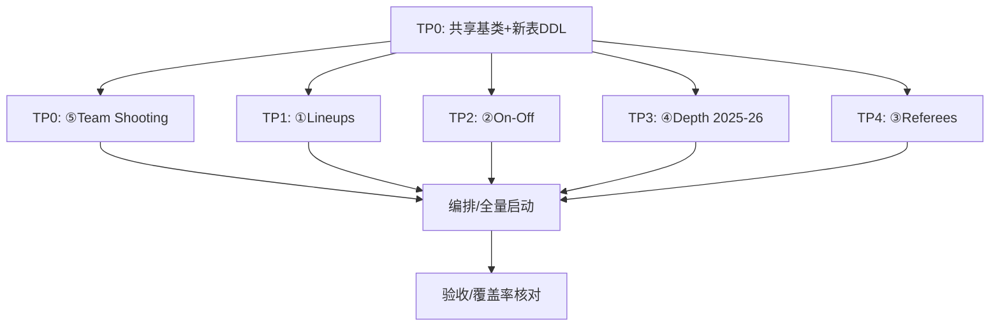

# 架构设计 + 任务分解：BR 球队页数据补全（br_gapfill）

> 文档作者：Bob（架构师）
> 上游输入：`external_crawler/prd_br_gapfill.md`（PRD）
> 目标库：postgres @127.0.0.1:5433 / dbname=nba / user=postgres / public 模式
> 落地次序（优先级 51243）：⑤ Team Shooting(P0) → ① Lineups(P1) → ② On-Off(P2) → ④ Depth Charts(P3, 仅 2025-26) → ③ Referees(P4)

---

## 0. 总体说明与既有约定对齐

### 0.1 目录约定（纠正 PRD 表述）
PRD 与任务书里写"复用 `common/browser.py` / `common/bridge_constants.py`"，但经磁盘核实，仓库中 `common/` 位于**仓库根目录**（与 `external_crawler/`、`backend/` 同级），并非 `external_crawler/common/`。因此本设计做如下落位，确保 `import common.*` 可解析（各爬虫已用 `sys.path.insert(0, parents[2])` 把仓库根加入 path）：

| 文件 | 实际相对路径 | 说明 |
|---|---|---|
| 共享基础模块（新增） | `common/br_team_page.py` | 与 `browser.py` / `bridge_constants.py` 同目录，便于直接 import |
| 5 个爬虫脚本（新增） | `external_crawler/crawler/crawl_br_team_*.py` | 与既有 `crawl_br_gamelog.py` 并列 |
| 5 个运行脚本（新增） | `run_br_team_*_fill.sh` | 与既有 `run_gamelog_old.sh` 并列（仓库根） |
| DDL（新增） | `external_crawler/sql/br_gapfill_tables.sql` | 与既有 `sql/` 目录并列 |
| 复用 | `common/browser.py`、`common/bridge_constants.py`、`common/cf_breaker.py` | CDP 驱动 / 队名归一 / CF 熔断均复用 |

### 0.2 直接复用既有约定（来自代码核实）
- **DB 连接**：`DB_CONFIG = dict(host='localhost'/'127.0.0.1', port=5433, dbname='nba', user='postgres', password=os.environ.get('DB_PASSWORD'))`，兜底读 `PGPASSWORD`（见 `backfill_gamelog_identity.py`）。密码从环境变量读，**禁止硬编码**。
- **CDP 抓取**：`common.browser.get_driver()`，进程级单例；`BROWSER_BACKEND=cdp` + `CHROME_CDP_URL=http://127.0.0.1:64656`；`unset` 所有代理（CDP 走 localhost 不能走项目代理）；`BR_COOKIE_FILE=/tmp/br_cf_cookies.json`。已内置 CF 挑战检测 + `cf_breaker` 熔断自恢复。
- **缓存 MERGE 语义**：`merge_gamelog_cache(season, new_players, cache_dir)` —— 读旧缓存 + 按 key 合并（新覆盖旧、不同则追加）+ 整体回写，容错损坏/半截 JSON。**本设计 5 类缓存全部沿用此语义**。
- **限速**：`time.sleep(3 + random.uniform(0,3))`（即 ~3-6s/请求，≈ ≤15 请求/分钟）。与 gamelog / headshots 一致。
- **(date, team) → id 映射**：`get_game_id_map` 思路（来自 `dim_games`）。本设计对"球队×赛季"枚举改用 `team_summaries` 作为权威覆盖源。
- **球员键桥接**：`player_id_bridge`（`player_name → nba_player_id` bigint + `br_player_id` varchar），同名歧义用 `HAVING COUNT(DISTINCT ...)=1` 处理（见 `backfill_gamelog_identity.py`）。`dim_players.player_id` 是 BR 字符串 slug（varchar），是 `player_gamelog.br_player_id` 的 FK。
- **单实例锁**：`pgrep -f "<script>"` 防并行撞 BR（见 `run_gamelog_old.sh`）。
- **失败登记**：`crawl_failures(game_id, task_type, created_at, resolved)` 已存在，本设计复用其结构登记球队页缺失。
- **player_gamelog 双写/返工**：`build_insert` 纯函数被 `run_pipeline` 与 `rework_season` 复用；本设计每类爬虫同样抽出纯函数 `build_rows()` + `upsert()`。

---

# Part A：系统设计

## 1. 实现方案 + 框架选型

| 技术点 | 选型 | 理由 |
|---|---|---|
| 语言 | python3（项目 `.venv`，与 gamelog/headshots 同运行时） | 与全仓库爬虫栈一致 |
| HTTP/渲染 | `common/browser.get_driver()`（CDP 直连用户已过的 Chrome，raw CDP，非 Playwright connect_over_cdp） | 复用已验证的 CF 绕过通道；headshots/gamelog 同款 |
| HTML 解析 | `beautifulsoup4`（按 `data-stat` 抽取，同 `parse_gamelog_html`） | 既有样板 |
| DB 驱动 | `psycopg2` + `psycopg2.extras`（execute_values 批量 upsert） | 既有栈 |
| 限速 | 串行 ~4.5s 间隔（复用 3-6s sleep）；多域**串行**（一个域跑完再下一个） | 避免触发反爬；配额不拆分 |
| 缓存 | 每域一个本地目录，`<cache>/<domain>_<season>.json`，**MERGE 语义** | 断点续跑 + 免重爬返工 |
| 单实例锁 | `pgrep -f` 每脚本独立锁名 | 禁止同脚本并行 |
| 失败登记 | 复用 `crawl_failures`，`game_id` 列存 `team_abbr\|season\|domain` 复合 token | 既有表结构 |
| 架构模式 | 共享基类 `BRTeamPageCrawler`（模板方法）+ 5 个薄爬虫子类 | 单一职责、消除重复 |

**关键难点与对策**
1. **早期赛季页面缺失**（1950s 等 Referees/On-Off/Lineups/Shooting BR 可能无页）→ 抓取前先 HTTP HEAD/轻量探测或解析后判定"无数据表"，跳过并写 `crawl_failures`，**不写 NULL 污染主表**。
2. **BR 投篮数据最早约 1996-97**（shot location/play-by-play 起）：更早赛季 Shooting/Lineups/On-Off 天然无页，按"缺失页"策略处理，覆盖率目标 99% 对"BR 实际有页的赛季"生效（见 §8 共享知识）。
3. **球员键对齐**：BR 页给的是展示名 + 链接 slug；落库时经 `player_id_bridge` 解析 `br_player_id`(varchar→dim_players) 与 `player_id`(bigint→nba_api)，歧义/缺桥则保留 `player_name` 且 `player_id` 留 NULL（同 gamelog 老季回填现状）。
4. **team_depth_chart 列不足**：现有表无 `position` / `player_id`，需 `ALTER`（PRD 已预见"不够则 ALTER"），见 §3 DDL。

## 2. 文件列表（相对路径）

**新增**
- `common/br_team_page.py` —— 共享基类：枚举球队季、CDP 抓取、缓存 MERGE、球员解析桥、失败登记、限速、赛季循环。
- `external_crawler/crawler/crawl_br_team_shooting.py` —— ⑤ Team Shooting 爬虫 + 建表/落库。
- `external_crawler/crawler/crawl_br_team_lineups.py` —— ① Lineups 爬虫。
- `external_crawler/crawler/crawl_br_team_onoff.py` —— ② On-Off 爬虫。
- `external_crawler/crawler/crawl_br_team_depth.py` —— ④ Depth Charts 2025-26 upsert。
- `external_crawler/crawler/crawl_br_team_referees.py` —— ③ Referees 爬虫。
- `run_br_team_shooting_fill.sh` / `run_br_team_lineups_fill.sh` / `run_br_team_onoff_fill.sh` / `run_br_team_depth_fill.sh` / `run_br_team_referees_fill.sh` —— 各域全量回填启动脚本（倒序赛季循环 + 单实例锁 + CDP 环境变量）。
- `external_crawler/sql/br_gapfill_tables.sql` —— 新表 DDL + `team_depth_chart` ALTER。

**复用（只读引用，不改动）**
- `common/browser.py`、`common/bridge_constants.py`、`common/cf_breaker.py`
- 表 `crawl_failures`、`dim_games`、`dim_players`、`player_id_bridge`、`team_summaries`、`team_mapping`（枚举与桥接源）
- 缓存目录约定：`gamelog_cache/` 同级的 `br_shooting_cache/`、`br_lineups_cache/`、`br_onoff_cache/`、`br_referees_cache/`（depth 复用既有 depth 缓存目录）

## 3. 数据结构和接口

### 3.1 类图（mermaid）

```mermaid
classDiagram
    class BRTeamPageCrawler {
        +str cache_dir
        +float rate_limit_s
        +str task_type
        +DB_CONFIG db_config
        +get_driver()
        +enumerate_team_seasons(domain) list
        +fetch_team_page(driver, url) str
        +merge_cache(season, team, payload) str
        +resolve_player(name) tuple
        +register_failure(token)
        +rate_limit()
        +season_loop()
        +run_pipeline(season, resume, dry_run, cache_dir)*
    }
    class TeamShootingCrawler {
        +parse(html) list
        +build_rows(team, season, vs_type, rows) tuple
        +upsert(conn, rows)
        +run_pipeline(season, resume, dry_run, cache_dir)
    }
    class LineupsCrawler {
        +parse(html) list
        +build_rows(team, season, rows) tuple
        +upsert(conn, rows)
    }
    class OnOffCrawler {
        +parse(html) list
        +build_rows(team, season, rows) tuple
        +upsert(conn, rows)
    }
    class DepthCrawler {
        +parse(html) list
        +upsert_2025_26(conn, rows)
    }
    class RefereesCrawler {
        +parse(html) list
        +build_rows(team, season, rows) tuple
        +upsert(conn, rows)
    }
    class PlayerBridge {
        +resolve(name) (br_pid, nba_pid)
    }
    class CrawlFailure {
        +id int
        +game_id varchar
        +task_type varchar
        +resolved bool
    }
    class TeamShooting {
        +id bigint
        +team_abbr text
        +season int
        +season_type varchar
        +vs_type text
        +zone text
        +fg int / fga int / fg_percent float
        +fg2 int / fga2 int / fg3 int / fga3 int
        +pct_of_fga float
        +avg_shot_dist float
    }
    class TeamLineups {
        +id bigint
        +team_abbr text / season int / season_type varchar
        +lineup_key text
        +br_player_id1..5 / player_id1..5 / player_name1..5
        +gp int / minutes int / won int / lost int
        +pts int / opp_pts int
        +off_rtg / def_rtg / net_rtg float
    }
    class TeamOnOff {
        +id bigint
        +team_abbr / season / season_type
        +br_player_id / player_id / player_name
        +on_mp / on_off_rtg / on_pace / on_efg_pct / on_tov_pct / on_orb_pct / on_drb_pct / on_trb_pct / on_stl_pct / on_blk_pct / on_ast_pct float   -- On Court 组(11)
        +opp_mp / opp_off_rtg / opp_pace / opp_efg_pct / opp_tov_pct / opp_orb_pct / opp_drb_pct / opp_trb_pct / opp_stl_pct / opp_blk_pct / opp_ast_pct float   -- Off Court 组(opp_ 前缀,11)
        +diff_mp / diff_off_rtg / diff_pace / diff_efg_pct / diff_tov_pct / diff_orb_pct / diff_drb_pct / diff_trb_pct / diff_stl_pct / diff_blk_pct / diff_ast_pct float   -- Difference 组(diff_ 前缀,11)
    }
    class GameReferees {
        +id bigint
        +game_id text
        +team_abbr text / season int
        +referee_name text
        +ref_order smallint
    }
    class TeamDepthChart {
        +id int
        +season int / team_abbr text
        +player_name text
        +start_count int / last_start date / depth_rank int
        +position text
        +player_id bigint
    }

    BRTeamPageCrawler <|-- TeamShootingCrawler
    BRTeamPageCrawler <|-- LineupsCrawler
    BRTeamPageCrawler <|-- OnOffCrawler
    BRTeamPageCrawler <|-- DepthCrawler
    BRTeamPageCrawler <|-- RefereesCrawler
    BRTeamPageCrawler ..> PlayerBridge : uses
    BRTeamPageCrawler ..> CrawlFailure : logs
    TeamShootingCrawler ..> TeamShooting : writes
    LineupsCrawler ..> TeamLineups : writes
    OnOffCrawler ..> TeamOnOff : writes
    DepthCrawler ..> TeamDepthChart : upserts
    RefereesCrawler ..> GameReferees : writes
    TeamShootingCrawler ..> PlayerBridge : resolve players
    LineupsCrawler ..> PlayerBridge : resolve players
    OnOffCrawler ..> PlayerBridge : resolve players
    GameReferees ..> DimGames : FK game_id
    TeamLineups ..> DimPlayers : FK br_player_id1..5
```



### 3.2 新表 DDL（建议，列名风格对齐现有表）

> 命名对齐原则：球队缩写一律 `team_abbr`（与 `starting_lineups`/`team_depth_chart` 一致）；赛季 `season` 为**结束年**整数（与 `team_summaries.season`/`dim_games.season`/`team_depth_chart.season` 口径一致：2026 = 2025-26 季）；百分比列沿用 `player_shooting` 的 `*_percent` 风格（如 `fg_percent`），而非 gamelog 的 `fg_pct` —— 因本表与 `player_shooting` 并存，按 PRD"对齐 player_shooting"要求。

#### 3.2.1 `team_shooting`（⑤，新建，长表：每 team×season×season_type×vs_type×zone 一行）

```sql
CREATE TABLE IF NOT EXISTS team_shooting (
    id              bigserial PRIMARY KEY,
    team_abbr       text    NOT NULL,
    season          integer NOT NULL,                       -- 结束年，如 2026=2025-26 季
    season_type     varchar(20) NOT NULL DEFAULT 'Regular', -- 'Regular' | 'Playoffs'
    vs_type         text    NOT NULL,                       -- 'self' 本队出手 | 'opp' 对对手出手
    zone            text    NOT NULL,                        -- 见 ZONE 受控词表
    fg              integer,
    fga             integer,
    fg_percent      double precision,
    fg2             integer,                                -- 2P 命中（2P zone=fg，3P zone=0）
    fga2            integer,
    fg3             integer,                                -- 3P 命中（3P zone=fg，2P zone=0）
    fga3            integer,
    pct_of_fga      double precision,                       -- 该 zone 占全队 FGA 比重（PRD fg_freq）
    avg_shot_dist   double precision,                       -- 该 zone 平均出手距离(ft)
    source          text    DEFAULT 'basketball-reference',
    created_at      timestamp without time zone DEFAULT CURRENT_TIMESTAMP,
    UNIQUE (team_abbr, season, season_type, vs_type, zone)
);
-- ZONE 受控词表（与 player_shooting 距离桶命名呼应）:
--   zone 视图(2P): restricted_area, in_paint_non_ra, mid_range
--   zone 视图(3P): left_corner_3, right_corner_3, above_break_3
--   距离桶(2P):    dist_0_3, dist_3_10, dist_10_16, dist_16_3p
--   距离桶(3P):    dist_3p_plus
```

#### 3.2.2 `team_lineups`（①，新建，长表：每 team×season×season_type×lineup 一行）

```sql
CREATE TABLE IF NOT EXISTS team_lineups (
    id              bigserial PRIMARY KEY,
    team_abbr       text    NOT NULL,
    season          integer NOT NULL,
    season_type     varchar(20) NOT NULL DEFAULT 'Regular',
    lineup_key      text    NOT NULL,                        -- 5 名 br_player_id 排序后 '|' 连接（无序去重）
    -- 5 个位置占位：BR slug(varchar,FK dim_players) + NBA 数字 id(bigint) + 展示名
    br_player_id1   varchar, br_player_id2 varchar, br_player_id3 varchar,
    br_player_id4   varchar, br_player_id5 varchar,
    player_id1      bigint,  player_id2  bigint,  player_id3  bigint,
    player_id4      bigint,  player_id5  bigint,
    player_name1    text,    player_name2 text,    player_name3 text,
    player_name4    text,    player_name5 text,
    gp              integer,
    minutes         integer,                                -- BR MIN（总分钟，整数）
    won             integer,
    lost            integer,
    pts             integer,                                -- 该阵容得分
    opp_pts         integer,                                -- 该阵容失分
    off_rtg         double precision,
    def_rtg         double precision,
    net_rtg         double precision,
    source          text    DEFAULT 'basketball-reference',
    created_at      timestamp without time zone DEFAULT CURRENT_TIMESTAMP,
    UNIQUE (team_abbr, season, season_type, lineup_key),
    FOREIGN KEY (br_player_id1) REFERENCES dim_players(player_id),
    FOREIGN KEY (br_player_id2) REFERENCES dim_players(player_id),
    FOREIGN KEY (br_player_id3) REFERENCES dim_players(player_id),
    FOREIGN KEY (br_player_id4) REFERENCES dim_players(player_id),
    FOREIGN KEY (br_player_id5) REFERENCES dim_players(player_id)
);
```
> 说明：`player_id1..5`(bigint) 取自 `player_id_bridge.nba_player_id`，缺桥留 NULL；`br_player_id1..5` 为 BR slug（JOIN `dim_players` 主键最稳）；`player_name1..5` 为 BR 页面展示名（兜底）。全存 BR 实际列出的组合，加 `minutes` 列；最小分钟阈值通过配置项 `min_minutes`（默认 0）在 parse 层过滤，不破坏"全存"语义（见 §8 决策 2）。

#### 3.2.3 `team_on_off`（②，新建，长表：每 team×season×season_type×player 一行，ON/OFF 同 row）

```sql
CREATE TABLE IF NOT EXISTS team_on_off (
    id              bigserial PRIMARY KEY,
    team_abbr       text    NOT NULL,
    season          integer NOT NULL,
    season_type     varchar(20) NOT NULL DEFAULT 'Regular',
    br_player_id    varchar,                                -- FK dim_players(player_id)，缺则 NULL
    player_id       bigint,                                 -- NBA 数字 id，缺桥 NULL
    player_name     text    NOT NULL,                       -- BR 页展示名（唯一键兜底）
    -- On Court 组（11 列，真实 BR #on_off data-stat，无幻影列）
    on_mp           integer,
    on_off_rtg      double precision,
    on_pace         double precision,
    on_efg_pct      double precision,
    on_tov_pct      double precision,
    on_orb_pct      double precision,
    on_drb_pct      double precision,
    on_trb_pct      double precision,
    on_stl_pct      double precision,
    on_blk_pct      double precision,
    on_ast_pct      double precision,
    -- Off Court 组（opp_ 前缀，11 列）
    opp_mp          integer,
    opp_off_rtg     double precision,
    opp_pace        double precision,
    opp_efg_pct     double precision,
    opp_tov_pct     double precision,
    opp_orb_pct     double precision,
    opp_drb_pct     double precision,
    opp_trb_pct     double precision,
    opp_stl_pct     double precision,
    opp_blk_pct     double precision,
    opp_ast_pct     double precision,
    -- Difference 组（diff_ 前缀，11 列）
    diff_mp         integer,
    diff_off_rtg    double precision,
    diff_pace       double precision,
    diff_efg_pct    double precision,
    diff_tov_pct    double precision,
    diff_orb_pct    double precision,
    diff_drb_pct    double precision,
    diff_trb_pct    double precision,
    diff_stl_pct    double precision,
    diff_blk_pct    double precision,
    diff_ast_pct    double precision,
    source          text    DEFAULT 'basketball-reference',
    created_at      timestamp without time zone DEFAULT CURRENT_TIMESTAMP,
    UNIQUE (team_abbr, season, season_type, player_name),
    FOREIGN KEY (br_player_id) REFERENCES dim_players(player_id)
);
```
> 注：真实 BR on/off 页（`#on_off`）列 = On Court / Off Court / Difference 三组，每组 11 列（`mp, off_rtg, pace, efg_pct, tov_pct, orb_pct, drb_pct, trb_pct, stl_pct, blk_pct, ast_pct`，Off 组 `opp_` 前缀、Diff 组 `diff_` 前缀），**无 `gp`、无独立 `def_rtg`/`net_rtg`**。原 `on_ortg/on_drtg/on_nrtg/off_ortg/off_drtg/off_nrtg/net_pts_diff` 等幻影列已在代码重写时移除（详见 git 历史），本 DDL 以真实列为准。

#### 3.2.4 `game_referees`（③，新建，长表：每 game×referee 一行）

```sql
CREATE TABLE IF NOT EXISTS game_referees (
    id              bigserial PRIMARY KEY,
    game_id         text    NOT NULL,                       -- FK dim_games.game_id（字母数字全 id）
    team_abbr       text,                                   -- 抓取来源球队页（冗余，便于核对）
    season          integer,                                -- 冗余，便于分区查询
    referee_name    text    NOT NULL,
    ref_order       smallint,                               -- 1..3（BR 列出顺序）
    source          text    DEFAULT 'basketball-reference',
    created_at      timestamp without time zone DEFAULT CURRENT_TIMESTAMP,
    UNIQUE (game_id, referee_name),
    FOREIGN KEY (game_id) REFERENCES dim_games(game_id)
);
```
> 说明：不建独立 `referees` 引用表（裁判无稳定唯一 id，姓名即可，PRD 决策 8）。同一场比赛从主客两队页各抓一次，按 `(game_id, referee_name)` 去重。注意 `dim_games.officials`(jsonb) 已存裁判，本表为 PRD 指定的独立事实表，二者可后续单向同步（不在本范围）。

#### 3.2.5 `team_depth_chart`（④，复用现有表，已 ALTER 执行）

现有 DDL（`\d` 核实）：`id, season(int,NN), team_abbr(text,NN), player_name(text,NN), start_count(int), last_start(date), depth_rank(int), created_at`。**缺 `position` 与 `player_id`**，按 PRD"不够则 ALTER"决策补全：

```sql
-- 新增列（历史行 position/player_id 留 NULL，不破坏既有数据）
ALTER TABLE team_depth_chart ADD COLUMN IF NOT EXISTS position  text;
ALTER TABLE team_depth_chart ADD COLUMN IF NOT EXISTS player_id bigint;  -- NBA 数字 id，FK 不强制
-- 新增 2025-26 upsert 唯一键（team+season+position+depth_rank）
-- 历史行 position=NULL，btree 唯一索引视 NULL 为互异，不会与既有 (season,team_abbr,player_name) 冲突
ALTER TABLE team_depth_chart
  DROP CONSTRAINT IF EXISTS team_depth_chart_season_team_abbr_player_name_key;
ALTER TABLE team_depth_chart
  ADD CONSTRAINT team_depth_chart_season_team_abbr_position_depth_rank_key
  UNIQUE (season, team_abbr, position, depth_rank);
```
> 为最大兼容，保留旧唯一约束亦可（两个约束并存，2025-26 行同时满足）。本设计选择替换为新键（历史行因 NULL position 自动互异，安全）。如工程师担心历史重跑，可保留旧键——已在 §8 共享知识注明。
>
> **DDL 执行状态（T0）**：上述 `team_depth_chart` ALTER 与 4 张新表 DDL 已应用于实时库 `nba`，**14/14 成功**（4 新表 + `team_depth_chart` ADD `position`/`player_id` + DROP 旧唯一键 `team_depth_chart_season_team_abbr_player_name_key` + 新建 `(season, team_abbr, position, depth_rank)` 唯一键）。代码 IS_PASS，本段仅文档定性，不再改 SQL。

### 3.3 接口（基类模板方法，供 5 个爬虫复用）

`common/br_team_page.py` 暴露：
- `enumerate_team_seasons(domain) -> List[(team_abbr, season, season_type)]`：从 `team_summaries`（`abbreviation`,`season`,`playoffs`）取覆盖；BR URL 年 = `season`（库内 `season` 即为结束年，不加 1，见 §8）。
- `fetch_team_page(driver, url) -> str`：包 `common.browser` 的 `get_driver().get/.page_source`，并检测"无数据表/挑战页"返回 `''`。
- `merge_cache(domain, season, team, payload) -> path`：MERGE 语义写 `<cache_dir>/<domain>_<season>.json`（参考 `merge_gamelog_cache`）。
- `resolve_player(name) -> (br_player_id:str|None, player_id:int|None)`：查 `player_id_bridge`（`HAVING COUNT(DISTINCT ...)=1`），再 `dim_players` 兜底 slug。
- `register_failure(task_type, token)`：写 `crawl_failures(game_id=token, task_type, resolved=False)`，`token=f"{team_abbr}|{season}|{domain}"`。
- `rate_limit()`：`time.sleep(3 + random.uniform(0,3))`。
- 子类实现 `parse(html) -> list[dict]` 与 `upsert(conn, rows)`（纯函数 `build_rows` 抽出，供 `--rework` 复用，同 gamelog `build_insert`）。

## 4. 程序调用流程（时序图，以 ⑤ Team Shooting 为例）

```mermaid
sequenceDiagram
    participant SH as run_br_team_shooting_fill.sh
    participant PY as crawl_br_team_shooting.py
    participant BASE as common/br_team_page.py
    participant BR as common/browser (CDP)
    participant PG as postgres(nba)
    participant CACHE as br_shooting_cache/

    SH->>SH: source .env; unset proxy; export BROWSER_BACKEND=cdp, CHROME_CDP_URL
    SH->>SH: pgrep 单实例锁 -> 倒序赛季循环 for S in 2026..最早
    SH->>PY: python crawl_br_team_shooting.py --season S --resume --cache-dir ...
    PY->>BASE: enumerate_team_seasons('shooting')
    BASE->>PG: SELECT abbreviation,season FROM team_summaries WHERE season=S
    PG-->>BASE: [(LAL,2026),(BOS,2026),...]  (URL 年=S，season 为结束年)
    loop 每 (team_abbr, season)
        PY->>BASE: fetch_team_page(driver, /teams/{ABBR}/{S}/shooting/)
        BASE->>BR: get_driver().get(url) + page_source
        BR-->>BASE: html (CF 自动处理/熔断)
        BASE-->>PY: html
        PY->>PY: parse(html) -> [(vs_type, zone, fg,fga,...), ...]
        alt 页面缺失/无表
            PY->>BASE: register_failure('br_team_shooting', f"{ABBR}|{S}|shooting")
            BASE->>PG: INSERT crawl_failures(...)
        else 解析成功
            PY->>BASE: merge_cache('shooting', S, ABBR, payload)
            BASE->>CACHE: 读旧 + 合并 + 回写 (MERGE 语义)
            PY->>PY: build_rows(team, season, vs_type, rows)
            PY->>PG: upsert team_shooting (INSERT ... ON CONFLICT DO UPDATE)
            PG-->>PY: 写入/更新
        end
        PY->>BASE: rate_limit()  (3-6s)
    end
    PY-->>SH: 赛季 S 完成日志
    SH->>SH: 下一季 / 全部完成
```

> ① Lineups / ② On-Off / ③ Referees 流程结构相同，仅 `parse`/`upsert`/URL 模式不同；④ Depth Charts 仅跑 `season=2026`（2025-26 季，结束年）单季 upsert，无倒序循环。

## 5. 待明确事项 / 后续与已知限制

**需用户拍板项：无**——8 项待确认问题均已按既有约定做出默认决策（见下一节）。

**DDL 执行状态（T0 已完成）**：`team_shooting`/`team_lineups`/`team_on_off`/`game_referees` 4 张新表 + `team_depth_chart` ALTER（加 `position`/`player_id`、替换唯一键）已应用于实时库 `nba`，**14/14 成功**，代码 IS_PASS。

**知会项 / 已知限制（实现后确认，记录于此）**：
1. **季后赛(PO) 抓取延期**：当前 5 爬虫 `SEASON_TYPES=('Regular',)`，因 BR 球队页静态 HTML 默认只供常规赛，PO 表在 JS 视图。各 `parse` 已预留 PO 探测（`{TABLE_ID}_po`）。**后续开启方式**：用静态片段确认 PO 表 `id` 后，将 `SEASON_TYPES` 改回 `('Regular','Playoffs')` 即可开启 PO 回填（无需改架构）。
2. **历史队 slug 缺口（已知限制）**：`team_mapping` 仅含 30 个当前 franchise，早期队（如 WAS/STL/SDC/KCQ 等）无法归一 → 原样作 slug；若 BR 无对应页则记 `crawl_failures`。符合"skip + register"策略，记录为已知覆盖缺口。
3. **MIN_SEASON 静默跳过**：各域设下限——shooting/lineups/on-off 下限 1997、referees 1947、depth 2026；**低于下限的赛季不登记 `crawl_failures`**（视为结构性无数据，非失败）。此行为已确认记录。
4. **`team_depth_chart` ALTER**：增加 `position`(text) 与 `player_id`(bigint) 两列并替换唯一键为 `(season, team_abbr, position, depth_rank)`（PRD 已预见"不够则 ALTER"，属预期内变更，非阻塞）。若坚持不动历史表结构可改新建独立表，但会破坏"复用同一表"的 PRD 要求，故默认选 ALTER（已执行）。

---

# 8 项待确认问题的默认决策（架构师）

> 原则：能用既有约定解决的，一律默认决策并记录理由，不回问用户。

| # | 问题 | 采用方案 | 理由（引用既有约定） |
|---|---|---|---|
| 1 | Team Shooting 单表 vs 两表 | **单表带 `vs_type`('self'/'opp')** | 与 `player_shooting` 单表风格一致；BR 同页用 vs_type 切换呈现；查询 `WHERE vs_type=` 即可，维护成本低 |
| 2 | Lineups 组合爆炸/最小分钟阈值 | **全存 BR 实际组合** + `minutes` 列 + 配置项 `min_minutes`(默认 0) 在 parse 层可选过滤 | BR 已按真实上场分钟排序呈现；`starting_lineups` 即"存实际组合"先例；阈值默认 0 即全存，不改变语义 |
| 3 | 早期赛季页面缺失 | **跳过 + 写 `crawl_failures`**，不写 NULL 污染主表 | `crawl_failures` 已存在且被复用；与"缺失页有记录"PRD 要求一致；NULL 污染会破坏 JOIN 完整性 |
| 4 | 爬虫组织 | **5 类各建独立脚本** + 共享 `common/br_team_page.py` 基类（CDP+缓存 MERGE+赛季循环+限速） | `crawl_br_gamelog.py`/`crawl_br_headshots.py` 均为独立脚本 + 复用 `common/browser`；单一职责，零干扰铁律（headshots 注释明确） |
| 5 | 限速/并发 | 复用 **≤15 请求/分钟（4.5s 间隔）**；多域**串行**（一域跑完再下一域），配额不拆分 | headshots/gamelog 用 3-6s sleep；`run_gamelog_old.sh` 单实例锁防并行撞 BR；串行避免过载触发封禁 |
| 6 | 命名 | 沿用 **snake_case + 实体描述，不加 `br_` 前缀** | 对齐 `starting_lineups`/`team_depth_chart`/`player_shooting`/`transactions`；与 PRD"命名风格参考现有表"一致 |
| 7 | ①② 球员键桥接 | 复用 `player_id_bridge`（`player_name→br_player_id`+`player_id`）；缺桥则 `player_name` 落名 + `player_id`(bigint) 留 NULL | 直接复用 `backfill_gamelog_identity.py` 的同名歧义处理（`HAVING COUNT(DISTINCT)=1`）；与老季 gamelog 回填现状一致 |
| 8 | 裁判实体化 | 存 `game_referees(game_id, referee_name, ref_order)` 姓名字符串；**不建**独立 `referees` 引用表 | 裁判无稳定唯一 id，姓名即可；如需跨队统计后续再扩展；PRD 决策 8 明确 |

---

# Part B：任务分解

## 6. 依赖包列表

```
python3                        # 运行时（项目 .venv）
psycopg2                       # postgres 驱动（既有）
psycopg2.extras                # execute_values 批量 upsert（既有）
beautifulsoup4                 # HTML 解析（既有，parse_gamelog_html 同款）
lxml                           # bs4 解析器后端（既有）
playwright                     # 由 common/browser 懒加载（CDP 模式实际走 raw websockets，playwright 为无头备案）
playwright_stealth             # CF 绕过注入（common/browser 懒加载）
websockets                     # raw CDP 通道（common/browser 已用）
python-dotenv                  # 加载 .env（bridge_constants 已用）
```
> 上述均为仓库既有依赖（`requirements.txt` / `.venv` 已含），**无新增第三方包**。

## 7. 任务列表（按 51243 实现顺序，T0→T7）

> 说明：本任务跨 5 个独立爬虫 + 共享基模块 + 运行脚本，团队负责人明确指定 T0..T7 结构（覆盖基础→5 域→编排），故未套用"≤5 任务"的前端示例上限，按负责人显式编号交付。

| Task | 域 | 动作 | 文件名（新增/复用） | 依赖 | 优先级 |
|---|---|---|---|---|---|
| **T0** | 基础设施（已完成） | 建共享基类 + 全部新表 DDL（**DDL 已执行 14/14**） | `common/br_team_page.py`（新增）；`external_crawler/sql/br_gapfill_tables.sql`（建 `team_shooting`/`team_lineups`/`team_on_off`/`game_referees` + ALTER `team_depth_chart`） | 无 | P0（前置，已完成） |
| **T1** | ⑤ Team Shooting (P0) | 爬虫 + 建表 + 全历史回填 | `external_crawler/crawler/crawl_br_team_shooting.py`；`run_br_team_shooting_fill.sh` | T0 | P0 |
| **T2** | ① Lineups (P1) | 爬虫 + 建表 + 全历史回填 | `external_crawler/crawler/crawl_br_team_lineups.py`；`run_br_team_lineups_fill.sh` | T0 | P1 |
| **T3** | ② On-Off (P2) | 爬虫 + 建表 + 全历史回填 | `external_crawler/crawler/crawl_br_team_onoff.py`；`run_br_team_onoff_fill.sh` | T0 | P2 |
| **T4** | ④ Depth Charts (P3) | 2025-26 单季 upsert（ALTER 后） | `external_crawler/crawler/crawl_br_team_depth.py`；`run_br_team_depth_fill.sh` | T0（依赖 ALTER 生效） | P3 |
| **T5** | ③ Referees (P4) | 爬虫 + 建表 + 全历史回填 | `external_crawler/crawler/crawl_br_team_referees.py`；`run_br_team_referees_fill.sh` | T0 | P4 |
| **T6** | 编排/全量启动 | 串联 5 域回填脚本 + 单实例锁 + 倒序赛季循环；dry-run 自检 | 5 个 `run_br_team_*_fill.sh`（T1-T5 已含，本任务统一校验与串行调度说明） | T1,T2,T3,T4,T5 | P0（编排） |
| **T7** | 验收/登记 | 覆盖率核对（对齐 `team_summaries`）、`crawl_failures` 复核、补抓缺失页 | 复用 `analyze_data_gaps.py` 思路（SQL 核对，非必需新建） | T1-T6 | P1 |

> 依赖关系：T1-T5 均只依赖 T0（共享基类+表已就绪）；T6 依赖 T1-T5 脚本就位；T7 依赖 T6 跑完。各域爬虫彼此独立，可并行开发。

## 8. 共享知识（跨文件约定）

- **CDP 环境变量**：`BROWSER_BACKEND=cdp`、`CHROME_CDP_URL=http://127.0.0.1:64656`、`BR_COOKIE_FILE=/tmp/br_cf_cookies.json`；运行前 `unset http_proxy https_proxy all_proxy HTTP_PROXY HTTPS_PROXY ALL_PROXY`（CDP 走 localhost，禁走项目代理）。
- **缓存 MERGE 语义**：`<cache_dir>/<domain>_<season>.json`，读旧→按 (team,season[,extra]) 合并（新覆盖旧、差异追加）→整体回写；容错损坏/半截 JSON（参考 `merge_gamelog_cache`）。
- **限速常量**：`RATE_LIMIT_S = 3 + random.uniform(0,3)`（≈ ≤15 req/min）；多域**串行**，不拆分配额。
- **球队季枚举**：权威源 `team_summaries(abbreviation, season, playoffs)`；库内 `season` 为**结束年**（2026 = 2025-26 季），故 **BR URL 年 = `season`（不加 1）**，如 2025-26 季→`/teams/LAL/2026/`；`season_type` 区分 `'Regular'`/`'Playoffs'`（见下方 PO 抓取说明）。
- **BR 球队 slug**：经 `team_mapping.current_code`/规范化得到 BR franchise slug。`team_mapping` 仅含 30 个当前 franchise，早期队（WAS/STL/SDC/KCQ 等）无法归一→**原样作 slug**；若 BR 无对应页则记 `crawl_failures`（符合 skip+register）。此为已知覆盖限制。
- **球员键桥接**：`resolve_player(name)` → 查 `player_id_bridge`（`HAVING COUNT(DISTINCT nba_player_id)=1` 才取 `player_id` bigint；`br_player_id` 取 `dim_players` slug），歧义/缺桥保留 `player_name` 且 `player_id` 留 NULL。
- **失败登记**：`crawl_failures(game_id=f"{team_abbr}|{season}|{domain}", task_type='br_team_<domain>', resolved=False)`；`task_type` 取值：`br_team_shooting`/`br_team_lineups`/`br_team_onoff`/`br_team_depth`/`br_team_referees`。
- **各域最低赛季(MIN_SEASON) 与缺失处理**：shooting/lineups/on-off 下限 **1997**、referees 下限 **1947**、depth 仅 **2026**（2025-26）。**低于下限的赛季静默跳过、不登记 `crawl_failures`**（结构性无数据，非失败）；下限以上但 BR 无页的赛季才登记 `crawl_failures`。"覆盖率 ≥99%" 对"BR 实际有页的赛季"生效（BR 投篮/阵容/On-Off 数据最早约 1996-97）。
- **季后赛(PO) 抓取延期（后续开启）**：当前 5 爬虫 `SEASON_TYPES=('Regular',)`，因 BR 球队页静态 HTML 默认只供常规赛，PO 表在 JS 视图；各 `parse` 已预留 PO 探测（`{TABLE_ID}_po`）。确认 PO 表 `id` 后，将 `SEASON_TYPES` 改回 `('Regular','Playoffs')` 即开启 PO 回填，无需改架构。
- **team_depth_chart 兼容**：ALTER 后保留旧唯一约束或替换为新键均可；2025-26（season=2026）upsert 用 `(season, team_abbr, position, depth_rank)` 键；历史行 `position`/`player_id` 为 NULL 不影响既有查询。
- **DB 连接**：`DB_CONFIG` 读 `DB_PASSWORD`/`PGPASSWORD`，端口 5433，库 `nba`，用户 `postgres`；禁止硬编码口令。
- **单实例锁**：每脚本 `pgrep -f "<script>"` 防同脚本并行；5 域脚本锁名互异，可分别单独跑（但同一时刻建议只跑一个域以保守限速）。
- **dry-run / resume**：每爬虫支持 `--dry-run`（rollback 不写库）、`--resume`（跳过已落库 team×season）、`--cache-dir`（MERGE 缓存供 `--rework`）；`--rework <season>` 从缓存重放免重爬。

## 9. 任务依赖图（mermaid）



---

## 附：与现有表风格一致性核对（已 `\d` 核实）

| 现有表 | 关键命名 | 本设计对应 |
|---|---|---|
| `starting_lineups` | `season int NN`, `team_abbr text NN`, `player1..5 text`, `minutes real`, `source`, `created_at` | `team_lineups` 沿用 `team_abbr`/`season`/`minutes`/`source`/`created_at`；球员槽位改为 `br_player_id*`+`player_id*`+`player_name*`（因需桥接，比纯 text 更稳） |
| `team_depth_chart` | `season int NN`, `team_abbr text NN`, `player_name text NN`, `depth_rank int`, `created_at` | ④ 直接复用并 ALTER 加 `position`/`player_id` |
| `player_shooting` | `fg_percent`, `percent_fga_from_x*_range`, `fg_percent_from_x*_range`, `avg_dist_fga`, `season_type`, `team` | `team_shooting` 沿用 `*_percent` 风格、`season_type`、`zone` 距离桶命名呼应 `x*_range` |
| `transactions` | `team_abbr`, `source`, `created_at`, `crawl_date` | 各新表沿用 `team_abbr`/`source`/`created_at` |
| `player_gamelog` | `br_player_id`(FK dim_players)、`player_id`(bigint)、`player_name` | `team_lineups`/`team_on_off` 同款三键桥接 |
| `dim_games` | `game_id text PK`, `nba_api_id bigint` | `game_referees.game_id` FK → `dim_games.game_id` |
| `dim_players` | `player_id varchar PK` | `team_lineups.br_player_id*` / `team_on_off.br_player_id` FK → `dim_players.player_id` |
| `crawl_failures` | `game_id varchar NN`, `task_type varchar NN`, `resolved bool` | 复用，`game_id` 存复合 token |
