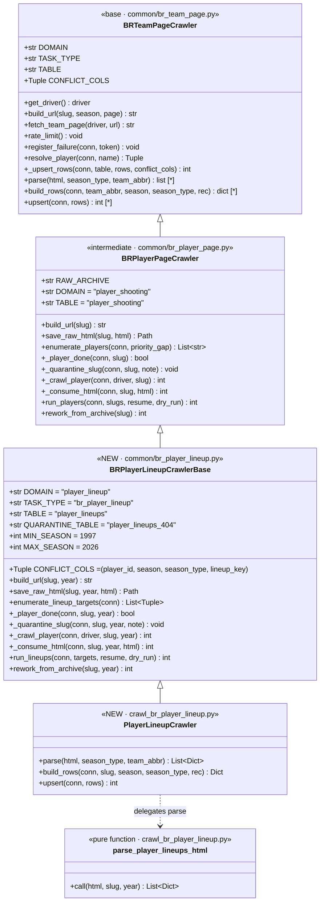
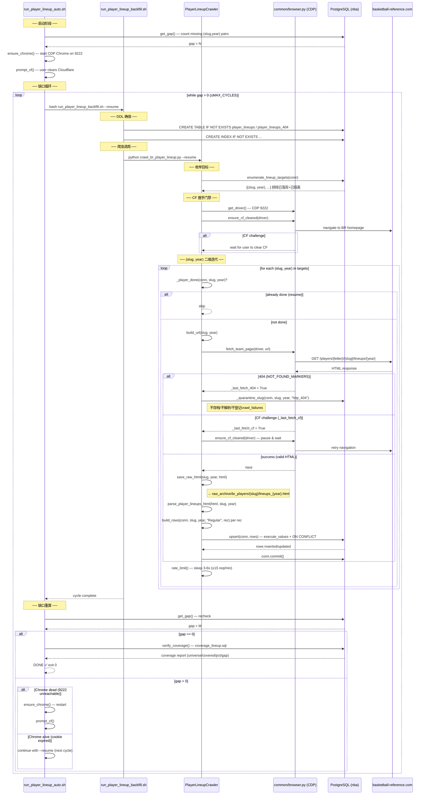
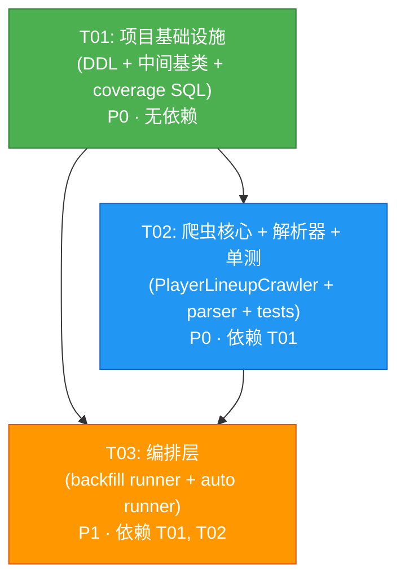

# 系统设计 — BR 球员 lineup 全量爬取 (br_player_lineup)

> 架构师：高见远 (Bob)　|　基于 PRD `external_crawler/prd_lineup.md`　|　Python 后端项目（无前端）
>
> 设计原则：最大化复用现有 `BRPlayerPageCrawler` 模式，最小爆炸半径——不修改 `common/` 既有文件，仅新增文件 + 继承覆盖。

---

## Part A: System Design

### 1. Implementation Approach

#### 1.1 核心技术挑战

| # | 挑战 | 解决方案 |
|---|------|----------|
| C1 | **URL/迭代模型不同**：基类 `BRPlayerPageCrawler` 是「一页全赛季、按 slug 一维迭代」；lineup 是 per-player per-year `/players/{letter}/{slug}/lineups/{year}`，需 `(slug, year)` 二维迭代 | 新建中间基类 `BRPlayerLineupCrawlerBase`（继承 `BRPlayerPageCrawler`），重写 `build_url(slug, year)` / `_crawl_player(slug, year)` / `run_lineups(targets)` / `save_raw_html(slug, year, html)` / `_player_done(slug, year)` / `rework_from_archive(slug, year)` |
| C2 | **断点续跑键不同**：shooting 断点 = slug（一页全赛季）；lineup 断点 = `(slug, year)` 对 | `_player_done(conn, slug, year)` 查 `player_lineups WHERE player_id=slug AND season=year`；404 隔离表 `player_lineups_404` 以 `(slug, year)` 为复合主键（非 slug 单列） |
| C3 | **slug 宇宙源不同**：禁用 `player_gamelog.br_player_id`（corrupt），改用 `player_shooting.player_id`（2861 可靠 slug） | 新增 `enumerate_lineup_targets(conn)` 方法：从 `player_shooting` 取 `DISTINCT (player_id, season) WHERE season_type='Regular' AND season>=1997`，排除已落库 + 已隔离 |
| C4 | **解析器硬前置**：球员级 lineup 页表结构——**已用 antetgi01/2014 真实样本确认（2026-07-24 定稿）**：表 id=`lineups-5-man`（Regular）/`lineups-5-man_po`（Playoffs 探测+跳过）；列=`ranker`/`team_id`/`mp`(M:SS)+22 个 `diff_*` 净差列（无 gp/won/lost/pts/off_rtg 等） | 解析接口 `parse_player_lineups_html(html, slug, year) -> list[dict]`；表 id / data-stat 列名映射已据真实样本落定（不再标"待样例确认"） |
| C5 | **CF 反爬 + 限速 + 长跑 resume**：15k-25k 页、≤15 req/min、1-3 天长跑 | 完全复用 `BRPlayerPageCrawler` 的 CF 握手门禁 (`ensure_cf_cleared`) / 限速 (`rate_limit` 3-6s) / 断点续跑 / 404 隔离 / 归档；auto runner 复用 `run_player_shooting_auto.sh` 的 Chrome 自启 + 缺口循环 + verify_coverage 模板 |

#### 1.2 框架与库选型

| 选型 | 理由 |
|------|------|
| **Python + psycopg2 + BeautifulSoup4** | 与现有爬虫框架完全一致，零新依赖 |
| **继承 `BRPlayerPageCrawler`**（非 `BRTeamPageCrawler`） | 球员级爬虫的 CF/限速/隔离/归档/断点续跑机制已在 `BRPlayerPageCrawler` 中固化；lineup 仅需在其上增加 year 维度 |
| **CDP Chrome (9222)** | 沙箱过不了 CF，真实爬取在用户 Mac 上通过 `BROWSER_BACKEND=cdp` 驱动已过 CF 的 Chrome |
| **execute_values + ON CONFLICT** | 批量幂等 upsert，与 shooting/team_lineups 一致 |
| **Bash auto runner** | 复用 `run_player_shooting_auto.sh` 模板：ensure_chrome → prompt_cf → 缺口循环 → verify_coverage |

#### 1.3 架构模式

**模板方法 (Template Method) + 策略 (Strategy)**：

```
BRTeamPageCrawler (base, common/br_team_page.py)
  └── BRPlayerPageCrawler (intermediate, common/br_player_page.py)
        └── BRPlayerLineupCrawlerBase (NEW, common/br_player_lineup.py)  ← 2D 迭代模型
              └── PlayerLineupCrawler (NEW, crawl_br_player_lineup.py)  ← parse/build_rows/upsert 钩子
```

- `BRPlayerLineupCrawlerBase`：固化「取浏览器 → CF 握手 → (slug,year) 二维迭代 → 抓页 → 归档 → 解析 → 入库 → 断点续跑」主流程
- `PlayerLineupCrawler`：仅实现 3 个钩子 `parse()` / `build_rows()` / `upsert()` + 纯函数 `parse_player_lineups_html()`
- **不修改任何 `common/` 既有文件**（最小爆炸半径）

---

### 2. File List

| # | 文件路径 | 类型 | 说明 |
|---|----------|------|------|
| 1 | `docs/ddl_player_lineups.sql` | 新建 | `player_lineups` 表 DDL + `player_lineups_404` 隔离表 DDL + 索引 + FK |
| 2 | `common/br_player_lineup.py` | 新建 | `BRPlayerLineupCrawlerBase` 中间基类：2D 迭代、`(slug,year)` 断点续跑、归档、404 隔离 |
| 3 | `external_crawler/crawler/crawl_br_player_lineup.py` | 新建 | `PlayerLineupCrawler`（3 钩子）+ 纯函数 `parse_player_lineups_html()` + CLI 入口 |
| 4 | `external_crawler/runner/run_player_lineup_backfill.sh` | 新建 | backfill runner：DDL 确保 + gap 测量 + crawler 调用 |
| 5 | `external_crawler/runner/run_player_lineup_auto.sh` | 新建 | auto 编排层：ensure_chrome + prompt_cf + 缺口循环 + verify_coverage |
| 6 | `docs/coverage_lineup.sql` | 新建 | lineup 覆盖率/gap SQL（auto runner 的 verify_coverage 守门用） |
| 7 | `tests/test_parse_player_lineups.py` | 新建 | 解析器单测（基于样例 HTML fixture） |
| 8 | `tests/fixtures/lineups_2014_sample.html` | 新建(已用真实样本替换) | 样例 HTML fixture（antetgi01/2014 真实 lineup 页，lineups-5-man 表 + 22 个 diff_* 列；2026-07-24 定稿） |
| 9 | `external_crawler/design_lineup.md` | 新建 | 本设计文档 |
| 10 | `docs/class-diagram.mermaid` | 新建 | 提取的类图 |
| 11 | `docs/sequence-diagram.mermaid` | 新建 | 提取的时序图 |

---

### 3. Data Structures and Interfaces

#### 3.1 类图

> 完整 Mermaid 源码见 `docs/class-diagram.mermaid`



#### 3.2 `player_lineups` 表 DDL

> 对齐 `team_lineups` 字段约定；粒度 = 每球员 × 每赛季 × 每 5 人组一行。

```sql
-- ============================================================
-- docs/ddl_player_lineups.sql
-- Player-level lineup table: per (player_id, season, season_type, lineup_key)
-- ============================================================

CREATE TABLE IF NOT EXISTS player_lineups (
    id              BIGSERIAL    PRIMARY KEY,
    -- 维度键
    player_id       TEXT         NOT NULL,              -- BR slug（主球员，即 lineup 页所属球员）
    season          INTEGER      NOT NULL,              -- 赛季结束年（2014 = 2013-14 赛季）
    season_type     VARCHAR(20)  NOT NULL DEFAULT 'Regular',
    lineup_key      TEXT         NOT NULL,              -- 5 个 br_player_id 排序后 '|' 连接（对齐 team_lineups 约定）

    -- 5 人组合（与 team_lineups 结构对齐）
    br_player_id1   VARCHAR,                            -- FK → dim_players.player_id
    br_player_id2   VARCHAR,
    br_player_id3   VARCHAR,
    br_player_id4   VARCHAR,
    br_player_id5   VARCHAR,
    player_name1    TEXT,
    player_name2    TEXT,
    player_name3    TEXT,
    player_name4    TEXT,
    player_name5    TEXT,

    -- 阵容元数据 + 每 100 回合净差值（已用 antetgi01/2014 真实样本定稿 2026-07-24）
    -- 真实页 = ranker / team_id / mp(M:SS) + 22 个 diff_* 净差列；无 gp/won/lost/pts/off_rtg 等
    ranker          INTEGER,                              -- 行序（Rk）
    team_id         TEXT,                                -- 该阵容所属球队（Tm，如 MIL）
    minutes         INTEGER,                              -- 出场时间（秒；原始 M:SS 已解析为总秒）

    -- 每 100 回合净差值（diff_*，带 +/- 符号；无原始计数统计）
    diff_fg         DOUBLE PRECISION,
    diff_fga        DOUBLE PRECISION,
    diff_fg_pct    DOUBLE PRECISION,
    diff_fg3        DOUBLE PRECISION,
    diff_fg3a       DOUBLE PRECISION,
    diff_fg3_pct   DOUBLE PRECISION,
    diff_efg_pct   DOUBLE PRECISION,
    diff_ft         DOUBLE PRECISION,
    diff_fta        DOUBLE PRECISION,
    diff_ft_pct    DOUBLE PRECISION,
    diff_pts        DOUBLE PRECISION,
    diff_orb        DOUBLE PRECISION,
    diff_orb_pct   DOUBLE PRECISION,
    diff_drb        DOUBLE PRECISION,
    diff_drb_pct   DOUBLE PRECISION,
    diff_trb        DOUBLE PRECISION,
    diff_trb_pct   DOUBLE PRECISION,
    diff_ast        DOUBLE PRECISION,
    diff_stl        DOUBLE PRECISION,
    diff_blk        DOUBLE PRECISION,
    diff_tov        DOUBLE PRECISION,
    diff_pf         DOUBLE PRECISION,

    -- 溯源
    source          TEXT         DEFAULT 'basketball-reference',
    created_at      TIMESTAMP    DEFAULT CURRENT_TIMESTAMP,

    -- 幂等 upsert 键
    CONSTRAINT player_lineups_uq UNIQUE (player_id, season, season_type, lineup_key)
);

-- FK 约束（5× br_player_id → dim_players.player_id）
ALTER TABLE player_lineups
    DROP CONSTRAINT IF EXISTS player_lineups_br_pid1_fkey;
ALTER TABLE player_lineups
    ADD  CONSTRAINT player_lineups_br_pid1_fkey
        FOREIGN KEY (br_player_id1) REFERENCES dim_players(player_id);

ALTER TABLE player_lineups
    DROP CONSTRAINT IF EXISTS player_lineups_br_pid2_fkey;
ALTER TABLE player_lineups
    ADD  CONSTRAINT player_lineups_br_pid2_fkey
        FOREIGN KEY (br_player_id2) REFERENCES dim_players(player_id);

ALTER TABLE player_lineups
    DROP CONSTRAINT IF EXISTS player_lineups_br_pid3_fkey;
ALTER TABLE player_lineups
    ADD  CONSTRAINT player_lineups_br_pid3_fkey
        FOREIGN KEY (br_player_id3) REFERENCES dim_players(player_id);

ALTER TABLE player_lineups
    DROP CONSTRAINT IF EXISTS player_lineups_br_pid4_fkey;
ALTER TABLE player_lineups
    ADD  CONSTRAINT player_lineups_br_pid4_fkey
        FOREIGN KEY (br_player_id4) REFERENCES dim_players(player_id);

ALTER TABLE player_lineups
    DROP CONSTRAINT IF EXISTS player_lineups_br_pid5_fkey;
ALTER TABLE player_lineups
    ADD  CONSTRAINT player_lineups_br_pid5_fkey
        FOREIGN KEY (br_player_id5) REFERENCES dim_players(player_id);

-- 索引
CREATE INDEX IF NOT EXISTS idx_player_lineups_pid_season
    ON player_lineups (player_id, season);
CREATE INDEX IF NOT EXISTS idx_player_lineups_season
    ON player_lineups (season);
CREATE INDEX IF NOT EXISTS idx_player_lineups_lineup_key
    ON player_lineups (lineup_key);

-- ============================================================
-- 404 隔离表：per (slug, year) 复合主键
-- （shooting 的 player_shooting_404 是 slug 单列 PK，因为一页全赛季；
--  lineup 是 per-year，404 可能只影响某年，故用复合 PK）
-- ============================================================
CREATE TABLE IF NOT EXISTS player_lineups_404 (
    slug        TEXT        NOT NULL,
    year        INTEGER     NOT NULL,
    first_seen  TIMESTAMPTZ NOT NULL DEFAULT now(),
    note        TEXT,
    PRIMARY KEY (slug, year)
);
CREATE INDEX IF NOT EXISTS idx_pl404_first_seen
    ON player_lineups_404 (first_seen);
```

#### 3.3 关联关系

```
player_lineups.player_id ──(text, BR slug)──→ player_shooting.player_id  (同源 slug 宇宙)
player_lineups.br_player_id1..5 ──(FK)──→ dim_players.player_id  (5× 外键)
player_lineups.lineup_key ═══ 对齐 team_lineups.lineup_key 约定（5 slug 排序 '|' 连接）
player_lineups_404.(slug, year) ── 排除已隔离的 (slug, year) 对
crawl_failures.task_type='br_player_lineup' ── 复用失败登记
```

#### 3.4 解析器输出契约

```python
def parse_player_lineups_html(html: str, slug: str, year: int) -> List[Dict]:
    """纯函数：解析 BR 球员 lineup 页 HTML → 记录列表。

    输出每条记录的契约（不含 player_id/season 维度，由 build_rows 注入）：
    {
        "players": [(br_slug, display_name), ...],  # 长度须为 5
        "ranker": Optional[int],                     # 行序（Rk）
        "team_id": Optional[str],                   # 阵容所属球队（Tm）
        "minutes": Optional[int],                   # 出场时间（秒；原始 M:SS 已解析）
        # 22 个 diff_* 每 100 回合净差值（带 +/- 符号）；无原始计数统计
        "diff_fg": Optional[float], "diff_fga": Optional[float],
        "diff_fg_pct": Optional[float], "diff_fg3": Optional[float],
        "diff_fg3a": Optional[float], "diff_fg3_pct": Optional[float],
        "diff_efg_pct": Optional[float], "diff_ft": Optional[float],
        "diff_fta": Optional[float], "diff_ft_pct": Optional[float],
        "diff_pts": Optional[float], "diff_orb": Optional[float],
        "diff_orb_pct": Optional[float], "diff_drb": Optional[float],
        "diff_drb_pct": Optional[float], "diff_trb": Optional[float],
        "diff_trb_pct": Optional[float], "diff_ast": Optional[float],
        "diff_stl": Optional[float], "diff_blk": Optional[float],
        "diff_tov": Optional[float], "diff_pf": Optional[float],
    }

    ✅ 表 id / data-stat 列名映射已用 antetgi01/2014 真实样本落定（2026-07-24 定稿）：
       * Regular 表 id = "lineups-5-man"；Playoffs 表 id = "lineups-5-man_po"（若存在则探测解析）
       * 真实页列 = ranker / lineup / team_id / mp(M:SS) + 22 个 diff_*；**无** gp/won/lost/pts/off_rtg
       * 5 人组合在 data-stat="lineup" 单元格内，5 个 /players/{l}/{slug}.html 链接
       * lineup_key 权威值由单元格 csk 属性给出（':' 分隔、已排序）
    """
```

#### 3.5 关键接口签名

```python
class BRPlayerLineupCrawlerBase(BRPlayerPageCrawler):
    """球员 lineup 爬虫中间基类（2D 迭代模型）。"""

    DOMAIN = "player_lineup"
    TASK_TYPE = "br_player_lineup"
    TABLE = "player_lineups"
    QUARANTINE_TABLE = "player_lineups_404"
    CONFLICT_COLS = ("player_id", "season", "season_type", "lineup_key")
    MIN_SEASON = 1997
    MAX_SEASON = 2026
    RAW_ARCHIVE = "raw_archive/br_players"  # 复用 shooting 归档根

    def build_url(self, slug: str, year: int) -> str:
        """构造 URL: /players/{letter}/{slug}/lineups/{year}"""

    def save_raw_html(self, slug: str, year: int, html: str) -> Path:
        """归档: raw_archive/br_players/{slug}/lineups_{year}.html"""

    def enumerate_lineup_targets(self, conn) -> List[Tuple[str, int]]:
        """枚举待抓 (slug, year) 对。
        宇宙源: player_shooting (player_id, season) WHERE Regular AND >=1997
        排除:   已落库 player_lineups + 已隔离 player_lineups_404
        """

    def _player_done(self, conn, slug: str, year: int) -> bool:
        """断点续跑: player_lineups 是否已有 (player_id=slug, season=year) 行"""

    def _quarantine_slug(self, conn, slug: str, year: int,
                         note: str = "http_404") -> None:
        """404 隔离: INSERT INTO player_lineups_404 (slug, year, note)
        ON CONFLICT (slug, year) DO UPDATE SET note=EXCLUDED.note,
        first_seen=LEAST(player_lineups_404.first_seen, now())"""

    def _crawl_player(self, conn, driver, slug: str, year: int) -> int:
        """抓一个 (slug, year) 页: 导航→404隔离/CF处理→归档→解析→入库"""

    def _consume_html(self, conn, slug: str, year: int, html: str) -> int:
        """解析+入库一页 HTML（供 _crawl_player 与 rework_from_archive 复用）"""

    def run_lineups(self, conn, targets: List[Tuple[str, int]],
                    resume: bool = False, dry_run: bool = False) -> int:
        """(slug, year) 二维迭代主循环: CF握手→遍历→抓取→限速→断点续跑"""

    def rework_from_archive(self, slug: str, year: int) -> int:
        """从归档 HTML 重解析落库（免爬）: lineups_{year}.html"""
```

---

### 4. Program Call Flow

#### 4.1 时序图

> 完整 Mermaid 源码见 `docs/sequence-diagram.mermaid`



#### 4.2 P0 小子集验证流程

```
用户操作:
  1. 存样例 HTML → raw_archive/br_players/antetgi01/lineups_2014.html
  2. 运行单测: pytest tests/test_parse_player_lineups.py
  3. 在 Mac 上运行:
     export PGPASSWORD='...'
     ./run_player_lineup_auto.sh --slugs antetgi01 --years 2014 --limit 1

验证点:
  ✓ 解析器对样例页字段零误差（单测断言）
  ✓ 落库行数与 BR 页面阵容数一致
  ✓ player_lineups.player_id 可 JOIN player_shooting.player_id
  ✓ player_lineups.br_player_id1..5 可 JOIN dim_players.player_id
  ✓ CF/限速/断点续跑/404隔离机制在子集上验证可用
```

---

### 5. Anything UNCLEAR

| # | 待明确事项 | 影响 | 假设/处理 |
|---|-----------|------|----------|
| U1 | **样例 HTML 表结构**：球员级 lineup 页的实际表 id / data-stat 列名是否与队级 `lineups`/`lineups_po` 一致？ | 解析器实现 | **✅ 已确认（2026-07-24 定稿）**：用户已存 `raw_archive/br_players/antetgi01/lineups_2014.html`（真实样本）。实测表 id = `lineups-5-man`（Regular）；**非**队级 `lineups`/`lineups_po`。真实列 = `ranker`/`lineup`/`team_id`/`mp`(M:SS) + 22 个 `diff_*` 净差列；**无** gp/won/lost/pts/off_rtg 等。 |
| U2 | **字段集最终确认**：BR 球员级 lineup 页是否含四因子（pace / efg% / tov% / orb% / ft_rate）等扩展列？ | DDL 字段集 | **✅ 已确认（2026-07-24 定稿）**：真实页**仅**含 ranker/team_id/mp + 22 个 `diff_*`（每 100 回合净差值，带 +/-），**无**任何原始计数或效率评级列。DDL 已定稿为 `ranker`/`team_id`/`minutes`(秒) + 22 `diff_*`；旧的 `gp/minutes/won/lost/pts/opp_pts/off_rtg/def_rtg/net_rtg` 9 列提案已废弃。 |
| U3 | **是否含 Playoffs 表**：BR 球员 lineup 页是否同时提供 Regular + Playoffs 两表？ | P2 可行性 / `season_type` 设计 | DDL 已预留 `season_type` 列；解析器接口设计为可探测 `{TABLE_ID}_po` 表（类比 shooting 的 `#shooting_playoffs`）。P0/P1 默认只抓 Regular。 |
| U4 | **slug 宇宙并集策略**：player_shooting 的 2861 slug 是否作为唯一主宇宙？联盟页名单是否需要？ | 枚举范围 | P0/P1 以 `player_shooting` 为主宇宙（14,569 个 `(slug, season)` Regular 组合，已覆盖 1997-2026）。联盟页名单作为 P1+ 补充源，`enumerate_lineup_targets()` 设计为可扩展（增加 union 分支即可）。 |
| U5 | **早期赛季页面可用性**：BR 球员 lineup 页对 1997-2000s 赛季是否都存在？ | 缺失页比例 | 设计 404 隔离机制：缺失页记入 `player_lineups_404`，不污染 `crawl_failures`，不影响断点续跑。缺口 SQL 扣除已隔离的对，使覆盖率口径诚实。 |
| U6 | **最小分钟阈值**：是否只存 BR 实际列出的组合？是否需要按最小上场分钟过滤？ | 数据量 / 存储 | 默认 `min_minutes=0`（全存 BR 实际组合，与 `team_lineups` 一致）。解析器接口预留 `min_minutes` 参数，可在 CLI 加 `--min-minutes` 控制。 |
| U7 | **全量规模与时长**：~15k-25k 页、1-3 天长跑是否可接受？ | P1 执行计划 | auto runner 设计为可中断恢复（`--resume`）；安全上限 `PLA_MAX_CYCLES` / `PLA_TOTAL_TIMEOUT` 防死循环。单 Chrome 实例 ≤15 req/min，不支持多实例并行（总配额约束）。 |

---

## Part B: Task Decomposition

### 6. Required Packages

```
# 全部已有依赖，零新增第三方包
- psycopg2-binary>=2.9: PostgreSQL 驱动（execute_values 批量 upsert）
- beautifulsoup4>=4.12: HTML 解析
- websockets>=12.0: CDP Chrome 远程调试通信
- playwright>=1.40: 浏览器自动化（CDP 后端复用，非新装）
```

> 所有依赖均已在项目 `.venv` 中安装（shooting/team_lineups 爬虫共用），无需 `pip install`。

---

### 7. Task List (ordered by dependency)

#### T01: 项目基础设施（DDL + 中间基类 + 设计产物）

| 字段 | 值 |
|------|-----|
| **Task ID** | T01 |
| **Task Name** | 项目基础设施：DDL + 2D 迭代中间基类 + 设计产物 |
| **Source Files** | `docs/ddl_player_lineups.sql`（新建）、`common/br_player_lineup.py`（新建）、`docs/coverage_lineup.sql`（新建） |
| **Dependencies** | 无 |
| **Priority** | P0 |

**工作内容**：
1. `docs/ddl_player_lineups.sql`：创建 `player_lineups` 表（字段/FK/索引/唯一约束）+ `player_lineups_404` 隔离表。幂等 `CREATE TABLE IF NOT EXISTS` + `ALTER TABLE DROP CONSTRAINT IF EXISTS` + `ADD CONSTRAINT`。
2. `common/br_player_lineup.py`：新建 `BRPlayerLineupCrawlerBase(BRPlayerPageCrawler)`。重写 7 个方法适配 `(slug, year)` 二维模型：
   - `build_url(slug, year)` → `/players/{letter}/{slug}/lineups/{year}`
   - `save_raw_html(slug, year, html)` → `raw_archive/br_players/{slug}/lineups_{year}.html`
   - `enumerate_lineup_targets(conn)` → 从 `player_shooting` 取 `(player_id, season)` 排除已落库+已隔离
   - `_player_done(conn, slug, year)` → 查 `player_lineups WHERE player_id=slug AND season=year`
   - `_quarantine_slug(conn, slug, year, note)` → 写 `player_lineups_404`（复合 PK `(slug, year)`）
   - `_crawl_player(conn, driver, slug, year)` → 导航→404隔离/CF处理→归档→`_consume_html`
   - `_consume_html(conn, slug, year, html)` → parse→build_rows→upsert→commit
   - `run_lineups(conn, targets, resume, dry_run)` → CF握手→遍历`(slug,year)`→抓取→限速→断点续跑
   - `rework_from_archive(slug, year)` → 读 `lineups_{year}.html` 重解析落库
   - 类常量：`DOMAIN="player_lineup"`, `TASK_TYPE="br_player_lineup"`, `TABLE="player_lineups"`, `QUARANTINE_TABLE="player_lineups_404"`, `CONFLICT_COLS=("player_id","season","season_type","lineup_key")`, `MIN_SEASON=1997`, `MAX_SEASON=2026`
3. `docs/coverage_lineup.sql`：lineup 覆盖率/gap SQL——输出 `universe | covered | coverage_pct | gap` 四列，供 auto runner 的 `verify_coverage()` 守门解析。gap = `player_shooting` 宇宙 − `player_lineups` 已覆盖 − `player_lineups_404` 已隔离。

**验收标准**：
- DDL 在 DB 上幂等执行无报错，表结构 `\d player_lineups` 与设计一致
- `BRPlayerLineupCrawlerBase` 可被 `import` 无异常，`build_url("antetgi01", 2014)` 返回正确 URL
- `coverage_lineup.sql` 在空表状态下返回 `universe=14569, covered=0, pct=0, gap=14569`

---

#### T02: 爬虫核心 + 解析器 + 单测

| 字段 | 值 |
|------|-----|
| **Task ID** | T02 |
| **Task Name** | 爬虫核心：PlayerLineupCrawler + parse_player_lineups_html + 单测 |
| **Source Files** | `external_crawler/crawler/crawl_br_player_lineup.py`（新建）、`tests/test_parse_player_lineups.py`（新建）、`tests/fixtures/lineups_2014_sample.html`（已用 antetgi01/2014 真实样本替换，非占位） |
| **Dependencies** | T01 |
| **Priority** | P0 |

**工作内容**：
1. `external_crawler/crawler/crawl_br_player_lineup.py`：
   - 纯函数 `parse_player_lineups_html(html, slug, year) -> List[Dict]`：用 BeautifulSoup 解析，复用 `extract_player_links` / `safe_int` / `safe_float`（from `common.br_team_page`）。**已用 antetgi01/2014 真实样本定稿（2026-07-24）**：Regular 表 id = `lineups-5-man`；Playoffs = `lineups-5-man_po`（探测+跳过）；列 = `ranker`/`team_id`/`mp`(M:SS)+22 `diff_*`，**无** gp/won/lost/pts/off_rtg。
   - 类 `PlayerLineupCrawler(BRPlayerLineupCrawlerBase)`：实现 3 钩子：
     - `parse(html, season_type, team_abbr)` → 委托 `parse_player_lineups_html`
     - `build_rows(conn, slug, season, season_type, rec)` → 注入 `player_id=slug` / `season` / `season_type`，计算 `lineup_key`（5 slug 排序 `|` 连接），展开 5×`br_player_id`/`player_name`
     - `upsert(conn, rows)` → `self._upsert_rows(conn, self.TABLE, rows, self.CONFLICT_COLS)`
   - CLI 入口 `main()`：支持 `--slugs` / `--years` / `--limit` / `--resume` / `--dry-run` / `--rework slug,year`
2. `tests/test_parse_player_lineups.py`：
   - 测试 `parse_player_lineups_html` 对 fixture HTML 的解析正确性
   - 断言：返回行数 = BR 页面阵容数；每行 `players` 长度 = 5；数值字段正确解析
   - 测试 `build_rows`：`lineup_key` 排序正确；`player_id` 注入正确
   - 测试 `build_url`：URL 格式正确
   - **依赖样例 HTML**：若 `tests/fixtures/lineups_2014_sample.html` 未就绪，测试 `skip` 并打印提示
3. `tests/fixtures/lineups_2014_sample.html`：**已用 antetgi01/2014 真实 lineup 页 HTML 替换**（非占位），作为回归 fixture 长期保留。

**验收标准**：
- 单测通过（或 skip 并提示样例未就绪）
- `parse_player_lineups_html` 输出符合 §3.4 契约
- `PlayerLineupCrawler` 可 `import` 且 3 钩子可调用

---

#### T03: 编排层 + 覆盖率守门

| 字段 | 值 |
|------|-----|
| **Task ID** | T03 |
| **Task Name** | 编排层：backfill runner + auto runner |
| **Source Files** | `external_crawler/runner/run_player_lineup_backfill.sh`（新建）、`external_crawler/runner/run_player_lineup_auto.sh`（新建） |
| **Dependencies** | T01, T02 |
| **Priority** | P1 |

**工作内容**：
1. `external_crawler/runner/run_player_lineup_backfill.sh`（模板：`run_player_shooting_backfill.sh`）：
   - 口令检查 `PGPASSWORD`
   - DDL 确保（执行 `docs/ddl_player_lineups.sql`）
   - 调用 `python crawl_br_player_lineup.py --resume "$@"`
   - gap 测量（inline Python，用 `player_shooting` 宇宙 − `player_lineups` 已覆盖 − `player_lineups_404` 已隔离）
   - 透传 `--slugs` / `--years` / `--limit` / `--dry-run` 参数
2. `external_crawler/runner/run_player_lineup_auto.sh`（模板：`run_player_shooting_auto.sh`）：
   - 口令检查 + 路径设置 + 日志
   - `get_gap()`：重算 lineup 缺口（Python inline）
   - `ensure_chrome()`：CDP 9222 可达性探测 + 自动启动独立 Chrome 实例
   - `prompt_cf()`：醒目提示用户在 CDP Chrome 窗口手动过 CF
   - `verify_coverage()`：执行 `docs/coverage_lineup.sql`，解析 `universe|covered|pct|gap`，gap=0 或 pct≥99% 则通过
   - 主循环：`while gap > 0`（≤`PLA_MAX_CYCLES`）→ 跑 backfill → 重算 gap → 0 则 verify_coverage → 非零则 Chrome 重启或 `--resume` 续跑
   - 安全上限：`PLA_MAX_CYCLES`（默认 500，全量 15k-25k 页）、`PLA_TOTAL_TIMEOUT`（默认 0=无限）
   - 环境变量：`BROWSER_BACKEND=cdp`、`NO_PROXY=127.0.0.1,localhost`

**验收标准**：
- `run_player_lineup_backfill.sh --dry-run` 可执行并输出计划
- `run_player_lineup_auto.sh --dry-run` 可执行并输出缺口数
- `verify_coverage()` 能正确解析 `coverage_lineup.sql` 输出
- Chrome 挂了能自动重启；cookie 过期能 `--resume` 续跑

---

### 8. Shared Knowledge

```
# ── slug 宇宙源（铁律） ──
- 禁用 player_gamelog.br_player_id（corrupt，含 phantom slug）
- 主宇宙：player_shooting.player_id（text，BR slug，2861 个可靠 slug，覆盖 1997-2026）
- 补充源（P1+）：联盟页 /leagues/NBA_{season}_per_game.html 名单
- enumerate_lineup_targets() 从 player_shooting 取 DISTINCT (player_id, season) WHERE Regular AND >=1997

# ── lineup_key 约定 ──
- lineup_key = 5 个 br_player_id 排序后 '|' 连接（无序去重）
- 对齐 team_lineups.lineup_key 约定
- 无 slug 时退回按 player_name 排序（降级方案，与 team_lineups 一致）

# ── season_type ──
- 'Regular'（默认）/ 'Playoffs'（P2）
- season = 赛季结束年（2014 = 2013-14 赛季），与 player_shooting / team_summaries 口径一致
- URL 中的 year = season（结束年）

# ── 断点续跑键 ──
- 续跑键 = (slug, year) 对（非 slug 单列，因为 per-year 迭代）
- _player_done(conn, slug, year): 查 player_lineups WHERE player_id=slug AND season=year LIMIT 1
- 404 隔离键 = (slug, year) 复合 PK（player_lineups_404 表）
  注：shooting 的 player_shooting_404 是 slug 单列 PK（一页全赛季）；
       lineup 是 per-year，404 可能只影响某年，故用复合 PK

# ── 限速 ──
- ≤15 请求/分钟（3-6s 间隔，复用 RATE_LIMIT_BASE_S=3.0 + RATE_LIMIT_JITTER_S=3.0）
- 限速在 (slug, year) 对之间执行（run_lineups 主循环末尾）

# ── CF 处理 ──
- 爬取前 ensure_cf_cleared(driver)：在爬虫驱动的标签页先过 CF
- 运行时命中 CF 挑战页 → _last_fetch_cf=True → 暂停等用户清 CF → 重试一次
- 运行时命中 404 → _last_fetch_404=True → 隔离到 player_lineups_404（不存档/不解析/不登记 crawl_failures）
- auto runner: Chrome 挂了(9222不可达)自动重启；cookie 过期自动 --resume 续跑

# ── 归档路径 ──
- raw_archive/br_players/{slug}/lineups_{year}.html
- （shooting 归档在 raw_archive/br_players/{slug}/shooting.html，不冲突）

# ── DB 连接 ──
- host=127.0.0.1 port=5433 dbname=nba user=postgres
- 口令走 PGPASSWORD 环境变量（禁止硬编码）
- psql: /opt/homebrew/bin/psql

# ── upsert 约定 ──
- execute_values + ON CONFLICT (player_id, season, season_type, lineup_key) DO UPDATE
- 冲突键外列刷新为 EXCLUDED 值
- created_at 由 DB 默认值填充（不入 rows）

# ── 失败登记 ──
- crawl_failures(task_type='br_player_lineup', game_id='{slug}|{year}|player_lineup', resolved=False)
- 仅 CF 挑战页 / 空页 / 解析失败登记；404 不登记（隔离即可）
```

---

### 9. Task Dependency Graph



**依赖说明**：
- T01 → T02：爬虫核心依赖中间基类 `BRPlayerLineupCrawlerBase` 和 DDL 表结构
- T01 → T03：编排层的 gap SQL 和 verify_coverage 依赖 `coverage_lineup.sql` + DDL 表
- T02 → T03：编排层调用 `crawl_br_player_lineup.py`，须先有爬虫模块
- T01 和 T02 可部分并行（T02 的解析器纯函数不依赖基类，但 `PlayerLineupCrawler` 类继承需要 T01 完成）

---

## 附录：与现有系统的对齐检查

| 维度 | shooting (现有) | team_lineups (现有) | player_lineups (本项目) |
|------|----------------|--------------------|-----------------------|
| URL 模型 | `/players/{letter}/{slug}/shooting/`（一页全赛季） | `/teams/{slug}/{year}/lineups/`（per-team per-year） | `/players/{letter}/{slug}/lineups/{year}`（per-player per-year） |
| 迭代维度 | slug 一维 | (team, season) 二维 | (slug, year) 二维 |
| 断点续跑键 | slug | (team_abbr, season, season_type) | (slug, year) |
| 404 隔离表 | player_shooting_404 (slug PK) | 无（register_failure） | player_lineups_404 ((slug, year) 复合 PK) |
| slug 宇宙源 | player_gamelog ∪ dim_players（含 corrupt） | team_summaries | **player_shooting**（可靠，禁用 gamelog） |
| 表唯一约束 | (player_id, season, season_type, team) | (team_abbr, season, season_type, lineup_key) | (player_id, season, season_type, lineup_key) |
| lineup_key | N/A | 5 br_player_id 排序 `\|` 连接 | 5 br_player_id 排序 `\|` 连接（对齐） |
| FK 目标 | N/A | dim_players.player_id (5×) | dim_players.player_id (5×)（对齐） |
| 归档路径 | `raw_archive/br_players/{slug}/shooting.html` | N/A（缓存 JSON） | `raw_archive/br_players/{slug}/lineups_{year}.html` |
| 基类 | BRPlayerPageCrawler | BRTeamPageCrawler | **BRPlayerLineupCrawlerBase** (新，继承 BRPlayerPageCrawler) |
